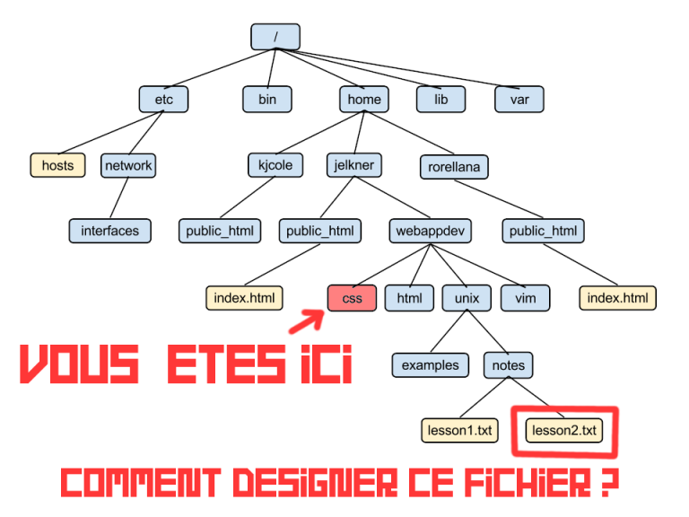
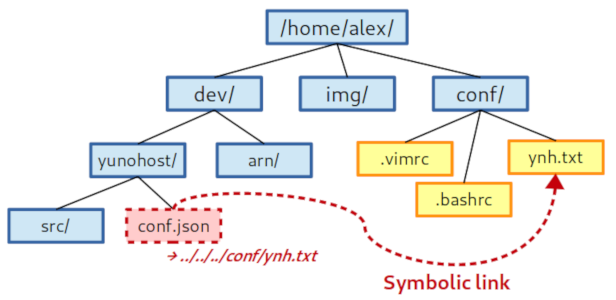
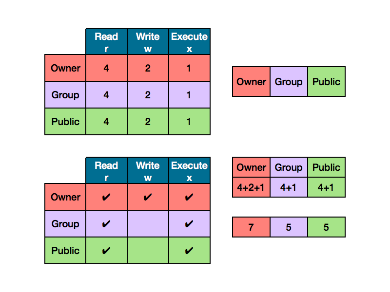

title: Introduction à Linux
class: animation-fade
layout: true

---

class: impact

# Introduction à Linux

*Become a Command Line Padawan in five days!*

---

class: impact

# Hello, world!

---

# À propos de moi

.col-4[
.center[

]
]

.col-8[.center[
<br>
<br>
`https://github.com/alexAubin`
<br>
<br>
`alex.aubin@mailoo.org`
<br>
<br>
]]


.col-4[.center[
Ingénieur/Physicien


</br>

]]

.col-4[.center[
Dev / adminsys / ...


]]

.col-4[.center[
Formateur


]]

---

# À propos de vous

---

# Horaires

- 9h00 -> 12h30 <small>(pause de 10 min autour de 10h30)</small>
- Repas
- 13h30 -> 17h00 <small>(pause de 10 min autour de 15h30)</small>

.center[
(soit 7h00 de formation / jour !)
]

# Signatures de présence

# Situation sanitaire

# Évaluations (?)


---

# Plan du cursus

# Autres formateurs / référents 

---

# Plan de la formation

**Jour 1 ?** / Bases de Linux

- 1 - Historique, introduction, rappels, setup initial
- 2, 3 - Prise en main du terminal et de la ligne de commande
- 4 - Le système de fichiers

**Jour 2 ?** / Bases de Linux

- 5, 6 - Utilisateurs, groupes et permissions
- 7 -  Les processus

**Jour 3 ?** / Bases de Linux

- 8 - Personnaliser son environnement
- 9 - Commandes avancées (redirections, enchainements, pipes, ..)

---

**Jour 4 ?** / Administrer Linux

- 11 - Installer Linux
   - (choisir une distro, boot sequence, live CD, partitionnement)
- 12 - Le gestionnaire de paquet, les outils d'archivage

**Jour 5 ?** / Reseau

- 13 - Notions de réseaux
- 14 - Notions de cryptographie et sécurité

**Jour 6 ?** / Administrer Linux + réseau

- 15 - Mettre en place un serveur, utiliser SSH
- 16 - Services, systemd, sécurité basique d'un serveur (firewall, fail2ban)

---

**Jour 7 ?** / Administrer Linux + réseau

- 17 - Configurer un serveur web : nginx
- 18 - Déployer une "vraie" application PHP/Mysql : Nextcloud
- Créer un service systemd ?

**Jour 8 ?** / Administrer Linux + réseau

- Savoir débugger un système cassé ?
- LXC ?
- HTTPS ?
- Etude d'un serveur "complet" ?

---

**Jour 9 ?** / Scripting bash, automatisation

- Scripting bash
   - variables
   - interactivité
   - conditions

**Jour 10 ?** / Scripting bash, automatisation

- Scripting bash
   - fonctions
   - boucles

**Jour 11 ?** / Scripting bash, automatisation

- Cron jobs
- Regex ?
- TP d'application


---

# Méthode de travail

- Alternance théorie / pratique
- Publication du contenu au fur et à mesure 
    - sur **https://dismorphia.info/documents/formationLinux**
- Travail dans une machine virtuelle
- Setup avec Guacamole pour les stagiaires à distance

# Objectifs

- Vous fournir des bases solides
- Vous transmettre une forme d'enthousiasme

---

# Disclaimers

- L'informatique technique, c'est compliqué
    - ignorez les turboonerds qui prétendent que c'est intuitif et trivial
    - (et désolé si moi-même je pars trop loin!)
- Le brute force ne marche pas, il faut être précis / rigoureux...
- Soyez **patient, méthodique, attentifs** !
- **Ne laissez pas l'écran vous aspirer** !

## On est là pour apprendre

- Réussir les exo importe peu, il faut **comprendre ce que vous faites** !
- Apprendre plus que de la théorie (posture, savoir se dépatouiller...)
- Prenez le temps de vous tromper (et de comprendre pourquoi)
- Interagissez, posez des questions !

---

class: impact

# 1. Les origines de (GNU/)Linux 

## (ou plus largement de l'informatique contemporaine)

---

# 1. Les origines de Linux

## La préhistoire de l'informatique

- ~1940 : Ordinateurs electromecaniques, premiers ordinateurs programmables
- ~1950 : Transistors
- ~1960 : Circuits intégrés

.center[
...Expansion de l'informatique...
]

---

# 1. Les origines de Linux

## 1970 : PDP-7

.center[

]


---

# 1. Les origines de Linux

## 1970 : (old computer?)

.center[

]


---

# 1. Les origines de Linux

## 1970 : UNIX

- Définition d'un 'standard' pour les OS 
- Un multi-utilisateur, multi-tâche
- Design modulaire, simple, élégant, efficace
- Adopté par les universités américaines
- Ouvert (évidemment)
- (Écrit en assembleur)

.center[

]

---

# 1. Les origines de Linux

## 1970 : UNIX

.center[

]

---

# 1. Les origines de Linux

## 1975 : Le langage C

- D. Ritchie et K. Thompson définissent un nouveau langage : le C ;
- Le C rends portable les programmes ;
- Ils réécrivent une version d'UNIX en C, ce qui rends UNIX portable ;

.center[

]

---

# 1. Les origines de Linux

## 1970~1985 : Les débuts d'Internet

- Définition des protocoles IP et TCP
    - Faire communiquer les machines entre elles
    - Distribué / décentralisé : peut survivre à des attaques nucléaires
- ARPANET ...

---

# 1. Les origines de Linux

## 1970~1985 : Les débuts d'Internet

.center[

]


---

# 1. Les origines de Linux

## 1970~1985 : Les débuts d'Internet

- Définition des protocoles IP et TCP
    - Faire communiquer les machines entre elles
    - Distribué / décentralisé : peut survivre à des attaques nucléaires
- ARPANET ...
- ... puis le "vrai" Internet
- Terminaux dans les grandes universités
- Appartition des newsgroup, ...

---

# 1. Les origines de Linux

## 1980 : Culture hacker, logiciel libre

- Le logiciel devient un enjeu commercial avec des licences propriétaires
- L'informatique devient un enjeu politique
- La culture hacker se développe dans les universités
    - Partage des connaisances
    - Transparence, détournement techniques
    - Contre les autorités centrales et la bureaucratie
    - Un mouvement technique, artistique et politique

---

# 1. Les origines de Linux

## 1980 : Culture hacker, logiciel libre

- R. Stallman fonde le mouvement du logiciel libre et la FSF <small>(Free Software Foundation)</small>
    0. Liberté d'utiliser du programme
    1. Liberté d'étudier le fonctionnement du programme
    2. Liberté de modifier le programme
    3. Liberte de redistribuer les modificiations
- ... et le projet GNU : un ensemble de programmes libres

.center[


]

---

# 1. Les origines de Linux

## 1990 : Création de Linux

- Linus Torvalds écrit Linux dans son garage

.center[


]

---

# 1. Les origines de Linux

## 1990 : Création de Linux

*I'm doing a (free) operating system (**just a hobby, won't be big and professional like gnu**) for 386(486) AT clones. This has been brewing since april, and is starting to get ready. I'd like any feedback on things people like/dislike in minix, as my OS resembles it somewhat (same physical layout of the file-system (due to practical reasons) among other things).*

*I've currently ported bash(1.08) and gcc(1.40), and things seem to work. This implies that I'll get something practical within a few months, and I'd like to know what features most people would want. Any suggestions are welcome, but I won't promise I'll implement them :-)*

*Linus (torvalds@kruuna.helsinki.fi)*

*PS. [...] It is NOT portable [...] and it probably never will support anything other than AT-harddisks, as that's all I have :-(.
— Linus Torvalds*

---

# 1. Les origines de Linux

## 1990 : Et en fait, Linux se développe...

- Linus Torvalds met Linux sous licence GPL
- Support des processeurs Intel
- Système (kernel + programmes) libre et ouvert
- Compatibles avec de nombreux standard (POSIX, SystemV, BSD)
- Intègre des outils de développement (e.g. compilateurs C)
- Excellent support de TCP/IP
- Création de Debian en 1993

---

# 1. Les origines de Linux

.center[
... L'informatique et Internet se démocratisent ...
]

En très résumé :
- Linux remporte le marché de l'infrastructure (routeur, serveurs, ..)
- Windows remporte le marché des machines de bureau / gaming
- Google remporte le marché des smartphones

---

# 1. Les origines de Linux

## L'informatique contemporaine

.center[

]

.center[


]

---

# 1. Les origines de Linux

## Architecture d'un ordinateur

.center[

]


---

# 1. Les origines de Linux

## Le rôle d'un système d'exploitation

.center[

]

---

# 1. Les origines de Linux

## Le rôle d'un système d'exploitation

- permet aux users d'exploiter les ressources
- sais communiquer avec le hardware
- créer des abstractions pour les programmes (e.g. fichiers)
- partage le temps de calcul entre les programmes
- s'assure que les opérations demandées sont légales

---

# 1. Les origines de Linux

## Linux aujourd'hui

- Très présent dans les routeurs, les serveurs et les smartphones
- Indépendant de tout constructeur
- Evolutif mais très stable
- Le système est fait pour être versatile et personnalisable selon son besoin
- Pratiques de sécurités beaucoup plus saines et claires que Microsoft

---

# 1. Les origines de Linux

## Les distributions

Un ensemble de programmes "packagés", préconfigurés, intégré pour un usage ~précis ou suivant une philosophie particulière

- Un noyau (Linux)
- Des programmes (GNU, ...)
- Des pré-configurations
- Un gestionnaire de paquet
- Un (ou des) environnements graphiques (Gnome, KDE, Cinnamon, Mate, ...)
- Une suite de logiciel intégrée avec l'environnement graphique
- Des objectifs / une philosophie


---

# 1. Les origines de Linux

## Les distributions


- **Debian** : réputé très stable, typiquement utilisé pour les serveurs
- **Ubuntu, Mint** : grand public
- **CentOS**, RedHat : pour les besoins des entreprises
- **Archlinux** : un peu plus technicienne, très à jour avec les dernières version des logiciels
- **Kali Linux** : orientée sécurité et pentesting
- **Android** : pour l'embarqué (téléphone, tablette)
- **YunoHost** : auto-hébergement grand-public
- **Kubernetes** / k8s : devops, déploiement et orchestration de flotte de conteneur

---

# 1. Les origines de Linux

## Les distributions

Et bien d'autres : Gentoo, LinuxFromScratch, Fedora, OpenSuse, Slackware, Alpine, Devuan, elementaryOS, ...


---

# 1. Les origines de Linux

## Linux, les environnement

- Gnome
- Cinnamon, Mate
- KDE
- XFCE, LXDE
- Tiling managers (awesome, i3w, ...)

---

# 1. Les origines de Linux

## Linux, les environnements (Gnome)

.center[

]

---

# 1. Les origines de Linux

## Linux, les environnements (KDE)

.center[

]

---

# 1. Les origines de Linux

## Linux, les environnements (Cinnamon)

.center[

]

---

# 1. Les origines de Linux

## Linux, les environnements (XFCE)

.center[

]

---

# 1. Les origines de Linux

## Linux, les environnements (Awesome)

.center[

]

---

# 1. Les origines de Linux

## Environnement de travail : Linux Mint

- (Choix arbitraire du formateur)
- Distribution simple, sobre, pas spécialement controversée (?)
- Profite de la stabilité de Debian et de l'accessibilité d'Ubuntu 

---

class: impact

# 2. Premier contact avec le terminal

---

# 2. Premier contact avec le terminal

## Installer une machine virtuelle

- Un ordinateur "simulé" dans un ordinateur
    - VirtualBox est un logiciel permettant ce genre de chose
- Une machine virtuelle possède tous les élément d'une vraie machine, mais en virtuelle :
    - un clavier et une souris virtuelles
    - un écran virtuel
    - un disque dur virtuel
    - de la RAM virtuel
    - un processeur virtuel
    - un lecteur CD virtuel
    - ...
- Parti pris pour l'OS : Linux Mint avec Cinnamon, et pré-installé


---

# 2. Premier contact avec le terminal

## Installer une machine virtuelle

.center[

]

---

# 2. Premier contact avec le terminal

## Installer une machine virtuelle

.center[

]

---

# 2. Premier contact avec le terminal

## Installer une machine virtuelle

OSBoxes : un site qui fourni des images Linux pré-installées

.center[

]

---

# 2. Premier contact avec le terminal

## Installer une machine virtuelle

Télécharger une Linux Mint préinstallée sur OSboxes.org

.center[

]

---

# 2. Premier contact avec le terminal

## Installer une machine virtuelle

- Installer Virtualbox
- Créer une nouvelle machine virtuelle
    - De type Linux / Other-linux (64 bit)
    - 2048 Mo de RAM devraient suffir
    - Au moment de choisir le disque dur : fournir le fichier VDI de OSboxes / Linux Mint
- Démarrer la machine et observer les étapes de démarrage
- Mot de passe : `ilovelinux`

---

# 2. Premier contact avec le terminal

## Se connecter

Pour cette première connexion, nous allons passer par un tty plutôt que par le login graphique.

Pour ce faire, appuyer sur Ctrl+Alt+F2 (ou F3, F4, ...)

```
Debian Stretch <nom_de_machine> tty0

<nom_de_machine> login: █
```

---

# 2. Premier contact avec le terminal

## Se connecter

Pour cette première connexion, nous allons passer par un tty plutôt que par le login graphique.

Pour ce faire, appuyer sur Ctrl+Alt+F2 (ou F3, F4, ...)


```
Debian Stretch <nom_de_machine> tty0

<nom_de_machine> login: votre_login
Password: █        # <<<< le mot de passe ne s'affiche pas du tout quand on le tape !
```

---

# 2. Premier contact avec le terminal

## Se connecter

Pour cette première connexion, nous allons passer par un tty plutôt que par le login graphique.

Pour ce faire, appuyer sur Ctrl+Alt+F2 (ou F3, F4, ...)


```
Debian Stretch <nom_de_machine> tty0

<nom_de_machine> login: votre_login
Password: 
Last login: Wed 19 Sep 16:23:42 on tty2
votre_login@machine:~$ █
```

---

# 2. Premier contact avec le terminal

## Premières commandes

Changez votre mot de passe : 
- Taper `passwd` puis *Entrée* puis suivez les instructions

```
votre_login@machine:~$ passwd
Changing password for votre_login.
(current) UNIX password:
Enter new UNIX password:
Retype new UNIX password:
passwd: password updated successfully
votre_login@machine:~$ █
```

---

.center[

]

---

# 2. Premier contact avec le terminal

## Premières commandes

- Taper `pwd` puis *Entrée* et observer
- Taper `ls` puis *Entrée* et observer
- Taper `cd /var` puis *Entrée* et observer
- Taper `pwd` puis *Entrée* et observer
- Taper `ls` puis *Entrée* et observer
- Taper `ls -l` puis *Entrée* et observer
- Taper `echo 'Je suis dans la matrice'` puis *Entrée* et observer

---

# 2. Premier contact avec le terminal

## Discussion

- Nous nous sommes connecté à une machine
- Nous avons eu accès à un terminal
- Le terminal permet de taper des commandes pour interagir "directement" avec l'OS
- Des commandes comme dans "passer commande"
- Certaines affichent des choses, d'autres changent des états
- Vous pouvez ouvrir d'autres TTy / consoles avec Ctrl+Alt+F1, F2, F3, ..

---

# 2. Premier contact avec le terminal

## Origine historique : le tty (teletype)

.center[


]

---

class: impact

# 3. La ligne de commande

---

# 3. La ligne de commande

## Structure d'une commande

```
  evince  --fullscreen     presentation.pdf
   |     '------------'    '------------'
   |           |                      |
   v           v                      v
  nom      argument 1            argument 2
           (une option)
```

---


# 3. La ligne de commande

## Structure d'une commande

- Des **options longues** (classiquement avec `--`) comme `--fullscreen`

- Des **options courtes** correspondantes (classiquement avec `-`) comme `-f`

*(des fois, il y a seulement l'option courte ou seulement l'option longue)*

---

# 3. La ligne de commande

## Structure d'une commande

Une commande peut être simple :

```
cd
```

ou assez complexe :

```
dnsmasq -x /run/dnsmasq/dnsmasq.pid -u dnsmasq -7 /etc/dnsmasq.d,.dpkg-dist,.dpkg-old,.dpkg-new --local-service
```

---

# 3. La ligne de commande

## Effet d'une commande

Certaines commandes affichent des choses : 

```
alex@shadow~$ ls -l /var/
total 36
drwxr-xr-x  2 root root  4096 Jul 11 12:58 backups
drwxr-xr-x 13 root root  4096 Jul  8 00:28 cache
drwxr-xr-x 51 root root  4096 Jul  8 00:28 lib
```

D'autres font des choses sans rien afficher (generalement veut dire que ça a marché) :

```
alex@shadow:~$ mkdir /var/toto
alex@shadow:~$
```

Eventuellement, je valide en réutilisant `ls` pour voir que le dossier a bien été créé

---

# 3. La ligne de commande

## Mais monsieur, les commandes il faut toute les apprendre par coeur ...?

- Il y en a des milliers (et on peut créer les siennes)
- Chacune peut avoir des dizaines d'options combinables entre elles
- Il ne s'agit pas de connaitre les commandes par coeur mais plutôt
    - d'avoir une vue d'ensemble des possibilités
    - de savoir aller chercher et apprendre de nouvelles commandes si besoin
    - savoir être méthodique et débugger les erreurs du quotidien (typo, ...)

---

# 3. La ligne de commande

## Méthode de travail : le Tai Chi du terminal

- Je recule la tête de mon écran et réfléchi à ce que je veux faire

---

# 3. La ligne de commande

## Méthode de travail : le Tai Chi du terminal

- Je recule la tête de mon écran et réfléchi à ce que je veux faire
- Je regarde où j'en suis

---


# 3. La ligne de commande

## Méthode de travail : le Tai Chi du terminal


- Je recule la tête de mon écran et réfléchi à ce que je veux faire
- Je regarde où j'en suis
- J'écris ma commande

---


# 3. La ligne de commande

## Méthode de travail : le Tai Chi du terminal


- Je recule la tête de mon écran et réfléchi à ce que je veux faire
- Je regarde où j'en suis
- J'écris ma commande
- Je **relis attentivement ce que je viens de taper**

---


# 3. La ligne de commande

## Méthode de travail : le Tai Chi du terminal


- Je recule la tête de mon écran et réfléchi à ce que je veux faire
- Je regarde où j'en suis
- J'écris ma commande
- Je **relis attentivement ce que je viens de taper**
- J'appuie sur entrée

---

# 3. La ligne de commande

## Méthode de travail : le Tai Chi du terminal

- Je recule la tête de mon écran et réfléchi à ce que je veux faire
- Je regarde où j'en suis
- J'écris ma commande
- Je **relis attentivement ce que je viens de taper**
- J'appuie sur entrée
- J'enlève les mains du clavier pour regarder l'effet produit

---

# 3. La ligne de commande

## Méthode de travail : le Tai Chi du terminal

- Je recule la tête de mon écran et réfléchi à ce que je veux faire
- Je regarde où j'en suis
- J'écris ma commande
- Je **relis attentivement ce que je viens de taper**
- J'appuie sur entrée
- J'enlève les mains du clavier pour regarder l'effet produit
- Je **LIS ATTENTIVEMENT et analyse la réponse de la machine** pour valider que c'est ce à quoi je m'attendais

---

# 3. La ligne de commande

## Méthode de travail : le Tai Chi du terminal

- Je recule la tête de mon écran et réfléchi à ce que je veux faire
- Je regarde où j'en suis
- J'écris ma commande
- Je **relis attentivement ce que je viens de taper**
- J'appuie sur entrée
- J'enlève les mains du clavier pour regarder l'effet produit
- Je **LIS ATTENTIVEMENT et analyse la réponse de la machine** pour valider que c'est ce à quoi je m'attendais
   - Je ne culpabilise pas ni ne désespère si il y a un message d'erreur - c'est normal et arrive à tout le monde tout le temps !

---

# 3. La ligne de commande

## Méthode de travail : le Tai Chi du terminal

- Je recule la tête de mon écran et réfléchi à ce que je veux faire
- Je regarde où j'en suis
- J'écris ma commande
- Je **relis attentivement ce que je viens de taper**
- J'appuie sur entrée
- J'enlève les mains du clavier pour regarder l'effet produit
- Je **LIS ATTENTIVEMENT et analyse la réponse de la machine** pour valider que c'est ce à quoi je m'attendais
   - Je ne culpabilise pas ni ne désespère si il y a un message d'erreur - c'est normal et arrive à tout le monde tout le temps !
   - Si je pense que ça a marché, je valide via une autre commande (e.g. verifier avec `ls` que le dossier à bien été créé)

---

# 3. La ligne de commande

.center[

]


---

# 3. La ligne de commande

## `passwd` - Changer son password

---

# 3. La ligne de commande

## `pwd` - Afficher le dossier courant

*Print current working directory*

---

# 3. La ligne de commande

## `cd` - Naviguer dans les dossiers

```
cd  /un/dossier   # Change de dossier courant
cd                # Revient dans le home
cd ..             # Remonte d'un dossier (par exemple /home si on était dans /home/alex)
cd -              # Retourne dans le dossier où on était juste avant
```

N.B : On ne peut pas faire `cd /un/fichier` ! Ça n'a pas de sens !

---

# 3. La ligne de commande

## `ls` - Liste les fichiers d'un dossier

```
ls            # Liste les fichiers du repertoire courant
ls  /usr/bin  # Liste les fichiers du repertoire /usr/bin
ls  -a        # (ou --all) Liste les fichiers (y compris cachés)
ls  -l        # Avec des détails (type, permissions, proprio, date de modif)
ls  -t        # Trie par date de modification
ls  -h        # (ou --human-readable) Tailles lisibles comme '24K' ou '3G'
```

(on peut combiner les options et arguments)

---

# 3. La ligne de commande

- Utiliser `ls` et `cd`, c'est comme naviguer avec un explorateur de fichier graphique !

---

# 3. La ligne de commande

## Les caractères spéciaux

```
ls *.py        # Liste tous les fichiers du repertoire courant finissant par .py
ls *.py *.png} # Liste tous les fichiers du repertoire courant finissant par .py ou *.png
ls *.{py,png}  # Liste tous les fichiers du repertoire courant finissant par .py ou *.png
```

- `*` corresponds à un "joker" / wildcard, et est interprété comme "n'importe quelle suite de caractère" 
- utile pour spécifier "tous les fichiers qui suivent un même format"
- **l'expansion survient *avant* que la commande soit éxécutée et se fait par rapport aux fichiers du dossier courant**
- Par ex: 
    - Si le dossier contient les fichiers `foo.py` et `bar.py`
    - ... alors taper `ls *.py` équivaut à taper `ls foo.py bar.py`
    - ... et taper juste `*` équivant à taper `foo.py bar.py`
    - ... et on peut écrire `ls '*.py'` pour parler d'un fichier qui s'apelle littéralement `*.py`

---

# 3. La ligne de commande

## Nettoyer son terminal

- `clean` efface tout ce qui est affiché dans le terminal
- `reset` permet de réinitialiser le terminal (utile pour certaines situation où le terminal est "cassé")
- `exit` permet de fermer un terminal
- (`logout` est similaire à `exit`)

---

# 3. La ligne de commande

## Obtenir de l'aide sur des commandes

```
man nom_de_commande
```
(mode paginateur: navigation avec les fleches, `/mot` pour chercher un mot, `q` pour quitter)


Ou avec `--help` ou `-h` :
```
nom_de_comande --help
```

---

# 3. La ligne de commande

## Annuler / arrêter une commande en cours d'execution

- Si une commande prends trop longtemps, il est possible de l'annuler avec [Ctrl]+C

```
alex@shadow:~$ sleep 30
[...]
[Ctrl]+C
alex@shadow:~$
```

- [Ctrl]+C est à utiliser avec parcimonie ! Interrompre certaines commande peut causer des problèmes...
- (N.B. : [Ctrl]+C / [Ctrl]+V ne fais pas copier/coller dans la console !)


---

# 3. La ligne de commande

## Copier-coller dans le terminal

(Dans tous les cas, on commence par selectionner le texte avec la souris)

- Méthode 1. Clic droit "copier", clic droit "coller"
- Méthode 2. Ctrl + Insert, Shift + Insert
- Méthode 3. Clic du milieu

---

# 3. La ligne de commande

## Raccourcis et astuces de ninja

### [Tab]

- [Tab] x1 permet d'autocompléter les noms de commande et les noms de fichier (si pas d'ambiguité)
- [Tab] x2 permet de suggérer les différentes possibilités
- Double-effect kisscool : utiliser [Tab] vous permet de valider au fur à mesure que la commande et le fichier existe !

### Historique

- Vous pouvez utiliser ↑ pour retrouver les commandes précédentes
- Ou aussi : `history`

---

class: impact

### Utilisez [Tab] !

---

class: impact

## Utilisez [Tab] !

---

class: impact

# Utilisez [Tab] !

---

class: impact

# Utilisez [Tab] !

# Utilisez [Tab] !

---

class: impact

# Utilisez [Tab] !

# Utilisez [Tab] !

# Utilisez [Tab] !


---

class: impact

# et LISEZ ATTENTIVEMENT ce que la machine vous raconte !

---

class: impact

# 4. Le système de fichier 

---

# 4. Le système de fichier

## Généralités

- (En anglais : *filesystem*, abrégé *fs*)
- La façon dont sont organisés et référencé les fichiers
- Une abstraction de la mémoire
- Analogie : une bibliothèque avec seulement les pages des livres dans les étagères
- Le *fs* connait le nom, la taille, l'emplacemenent des différents morceaux, la date de création, ...

---

# 4. Le système de fichier

##  Partitionnement d'un disque

- Un disque peut être segmenté en "partitions"
- Chaque partition héberge des données indépendantes des autres et sous un format / filesystem différent

.center[

]

---

# 4. Le système de fichier

## Quelques systèmes de fichier classiques

- *FAT16*, *FAT32* : disquettes, Windows 9x (~obsolète)
- *NTFS* : système actuellement utilisé par Windows
- **EXT3**, **EXT4** : système typiquement utilisé par Linux (Ubuntu, Mint, ...)
- *HFS+* : système utilisé par MacOS
- *TMPFS* : système de fichier pour gérer des fichiers temporaires (`/tmp/`)

---

# 4. Le système de fichier

## Quelques systèmes de fichier "avancés"

- **ZFS**
    - snapshots
    - haute dispo
    - gestion RAID, auto-réparation, diverses optimisations
- **BTRFS** / "better FS"
    - similaire à zfs, mais la peinture est encore fraiche
- **LVM** (gestionnaire de volumes logiques)
    - snapshots
    - gestion flexible des partitions "à chaud"
    - fusion de plusieurs disques
- **RAID *n* **
    - un ensemble de schema d'architecture de disque pour créer de la redondance en cas de perte de disque
    - données copiées sur plusieurs disques (grappe)

---

# 4. Le système de fichier

## Quelques systèmes de fichier exotiques(?) / autre

- *Tahoe-LAFS*
- *FUSE*
- *IPFS*

---

# 4. Le système de fichier

## Sous UNIX / Linux : "Tout est fichier"


- **fichiers ordinaires** (`-`) : données, configuration, ... texte ou binaire
- **répertoires** (directory, `d`) : gérer l'aborescence, ... 
- **spéciaux** : 
    - `block` et `char` (`b`, `c`) (clavier, souris, disque, ...)
    - sockets (`s`), named pipe (`p`) (communication entre programmes)
    - links (`l`) ('alias' de fichiers, ~comme les raccourcis sous Windows)


---

# 4. Le système de fichier

## Un fichier

- Un inode (numéro unique représentant le fichier)
- *Des* noms (chemins d'accès)
    - Un même fichier peut être à plusieurs endroits en meme temps (hard link)
- Des propriétés
    - Taille
    - Permissions
    - Date de création, modification

---

# 4. Le système de fichier

## Nommage des fichiers

- Noms sensibles à la casse
- (Eviter d'utiliser des espaces)
- Un fichier commençant par `.` est "caché"
- Les extensions de fichier sont purement indicatives : un vrai mp3 peut s'apeller musique.jpg et vice-versa
- Lorsqu'on parle d'un dossier, on l'ecrit plutôt avec un `/` à la fin pour expliciter sa nature

---

# 4. Le système de fichier

## Arborescence de fichier

```
coursLinux/
├── dist/
│   ├── exo.html
│   └── presentation.html
├── exo.md
├── img/
│   ├── sorcery.jpg
│   └── tartiflette.png
├── presentation.md
└── template/
    ├── index.html
    ├── remark.min.js
    └── style.scss
```

---

# 4. Le système de fichier

## Filesystem Hierarchy Standard

.center[

]

---

# 4. Le système de fichier

## Filesystem Hierarchy Standard

- `/` : racine de toute la hierarchie
- `/bin/`, `/sbin/` : programmes essentiels (e.g. `ls`)
- `/boot/` : noyau et fichiers pour amorcer le système
- `/dev/`, `/sys` : périphériques, drivers 
- `/etc/` : **fichiers de configuration**
- `/home/` : **répertoires personnels des utilisateurs**
- `/lib/` : librairies essentielles
- `/proc/`, `/run` : fichiers du kernel et processus en cours
- `/root/` : répertoire personnel de `root`
- `/tmp/` : fichiers temporaires
- `/usr/` : progr. et librairies "non-essentielles", doc, données partagées
- `/var/` : **fichiers / données variables** (e.g. cache, logs, boîtes mails)

---

# 4. Le système de fichier

## Répertoires personnels

- Tous les utilisateurs ont un répertoire personnel
- Classiquement `/home/<user>/` pour les utilisateurs "normaux"
- Le home de root est `/root/`
- D'autres utilisateurs ont des home particulier (`/var/mail/`, ...)

---

# 4. Le système de fichier

## Designation des fichiers

"Rappel" :
- `.` : désigne le dossier actuel
- `..` : désigne le dossier parent
- `~` : désigne votre home

Un chemin peut être :
- Absolu : `/home/alex/dev/yunohost/script.sh`
- Relatif : `../yunohost/script.sh` (depuis `/home/alex/dev/apps/`)

Un chemin relatif n'a de sens que par rapport à un dossier donné... mais est souvent moins long à écrire

---

# 4. Le système de fichier

## Designation des fichiers

- Pour parler d'un dossier ou fichier `toto` **dans le répertoire courant**

```bash
ls toto
# ou bien
ls ./toto
```

- Pour parler d'un dossier ou fichier `toto` **à la racine**

```bash
ls /toto
```


---

.center[

]

---

.center[

]

---

.center[

]

---

.center[

]

---

.center[

]

---

.center[

]

---

.center[

]

---

.center[

]


---

.center[

]


---

.center[

]

---

.center[

]

---

.center[

]

---

# 4. Le système de fichier

## Chemins relatifs

+ d'exemples, tous équivalents (depuis `/home/alex/dev/apps/`)

- `/home/alex/dev/yunohost/script.sh`
- `~/dev/yunohost/script.sh`
- `../yunohost/script.sh`
- `./../yunohost/script.sh`
- `./wordpress/../../yunohost/script.sh`
- `../.././music/.././../barbara/.././alex/dev/ynh-dev/yunohost/script.sh`

---

# 4. Le système de fichier

## Manipuler des fichiers (1/4)

- `ls` : lister les fichiers
- `cat <fichier>` : affiche le contenu d'un fichier dans la console
- `wc -l <fichier>` : compte le nombre de lignes dans un fichier

Exemples :

```bash
ls /usr/share/doc/                       # Liste les fichiers de /usr/share/doc
wc -l /usr/share/doc/nano/nano.html      # 2005 lignes !
```

---

# 4. Le système de fichier

## Manipuler des fichiers (2/4)

- `head <fichier>`, `tail <fichier>` : affiche les quelques premières ou dernières ligne du fichier
- `less <fichier>` : regarder le contenu d'un fichier de manière "interactive"
   - ↑, ↓, ⇑, ⇓ pour se déplacer
   - `/mot` pour chercher un mot
   - `q` pour quitter

```bash
tail -n 30 /usr/share/doc/nano/nano.html # Affiche les 30 dernieres lignes du fichier
less /usr/share/doc/nano/nano.html       # Regarder interactivement le fichier
```

---

# 4. Le système de fichier

## Manipuler des fichiers : `cat`, `head`, `tail`

.center[

]

---

# 4. Le système de fichier

## Manipuler des fichiers (3/4)

- `touch <fichier>` : créer un nouveau fichier, et/ou modifie sa date de modification
- `nano <fichier>` : éditer un fichier dans la console
    - (`nano` créera le fichier si besoin)
    - [Ctrl]+X pour enregistrer+quitter
    - [Ctrl]+W pour chercher
    - [Alt]+Y pour activer la coloration syntaxique 
- `vi` ou `vim <fichier>` : alternative à nano
    - plus puissant (mais plus complexe)

---

# 4. Le système de fichier

## Manipuler des fichiers (4/4)

- `cp <source> <destination>` : copier un fichier
- `rm <fichier>` : supprimer un fichier
- `mv <fichier> <destination>` : déplace (ou renomme) un fichier

Exemple

```bash
cp cours.html coursLinux.html  # Créée une copie avec un nom différent
cp cours.html ~/bkp/linux.bkp  # Créée une copie de cours.html dans /home/alex/bkp/
rm cours.html                  # Supprime cours.html
mv coursLinux.html linux.html  # Renomme coursLinux.html en linux.html
mv linux.html ~/archives/      # Déplace linux.html dans ~/archives/
```

---

# 4. Le système de fichier

## Manipuler des dossiers (1/3)

- `pwd` : connaître le dossier de travail actuel
- `cd <dossier>` : se déplacer vers un autre dossier

---

# 4. Le système de fichier

## Manipuler des dossiers (2/3)

- `mkdir <dossier>` : créer un nouveau dossier
- `cp -r <source> <destination>` : copier un dossier et l'intégralité de son contenu

Exemples :

```bash
mkdir ~/dev           # Créé un dossier dev dans /home/alex
cp -r ~/dev ~/dev.bkp # Créé une copie du dossier dev/ qui s'apelle dev.bkp/
cp -r ~/dev /tmp/     # Créé une copie de dev/ et son contenu dans /tmp/
```

---

# 4. Le système de fichier

## Manipuler des dossiers (3/3)

- `mv <dossier> <destination>` : déplace (ou renomme) un dossier
- `rmdir <dossier>` : supprimer un dossier vide
- `rm -r <dossier>` : supprimer un dossier et tout son contenu récursivement

Exemples :

```bash
mv dev.bkp  dev.bkp2   # Renomme le dossier dev.bkp en dev.bkp2
mv dev.bkp2 ~/trash/   # Déplace dev.bkp2 dans le dossier ~/trash/
rm -r ~/trash          # Supprime tout le dossier ~/trash et son contenu
```

---

# 4. Le système de fichier

## Les liens durs (hard link)

.center[

]

- `ln <source> <destination>`
- Le même fichier ... à plusieurs endroits !
- Supprimer une instance de ce fichier ne supprime pas les autres

---

# 4. Le système de fichier

## Les liens symbolic (symlink)

.center[

]

- `ln -s <cible> <nom_du_lien>`
- Similaire à un "raccourci", le fichier n'est pas vraiment là .. mais comme si
- Supprimer le fichier pointé par le symlink "casse" le lien

---

# 4. Le système de fichier

## Les liens symbolic (symlink)

.center[

]

- Dans ce exemple, le lien a été créé avec 
    - `ln -s ../../../conf/ynh.txt conf.json`
- `conf.json` est "le raccourci" : on peut le supprimer sans problème
- `ynh.txt` est la cible : le supprimer rendra inopérationnel le raccourci


---

# 4. Le système de fichier

## symlink vs. hardlink

- On croise plus souvent des symlinks que des hardlinks (les symlinks sont + intuitifs)
- On peut avoir des symlinks de répertoires (à la différence des hardlinks)
    - Attention tout de même à certains comportements étrange (`..` en étant à l'intérieur d'un symlink)
- On peut avoir des symlinks entre des filesystem différents ! (à la différence des hardlinks)

---

class: impact

# 5. Utilisateurs et groupes

---

# 5. Utilisateurs et groupes

## Généralités

- une entité / identité (!= être humain) qui demande des choses au système
- possède des fichiers, peut en créer, modifier, naviguer, ...
- peut lancer des commandes / des processus

---

# 5. Utilisateurs et groupes

## Répertoire des utilisateurs

Classiquement, les utilisateurs sont répertoriés dans `/etc/passwd`

```
alex:x:1000:1000:Zee Aleks:/home/alex:/bin/bash
```

- identifiant / login
- `x` (historique)
- uid (id utilisateur)
- gid (id de groupe)
- commentaire
- répertoire home
- shell de démarrage

---

# 5. Utilisateurs et groupes

## root

- Dieu sur la machine, `uid=0`, `gid=0`
- **With great power comes great responsabilities**
    - Si un attaquant devient root, l'OS est entièrement compromis (à jamais)

.center[


]

---

# 5. Utilisateurs et groupes

## Passer root (ou changer d'utilisateur)

```bash
su                  # Demande à ouvrir un shell en tant que root
su barbara          # Demande à ouvrir un shell en tant que barbara
su -c "ls /root/"   # Executer 'ls /root/' en tant que root (de manière ephemere)
exit                # Quitter un shell
```

---

# 5. Utilisateurs et groupes

## Sudo

- On peut autoriser les utilisateurs à faire des choses en root en leur donnant les droits 'sudo'

```bash
su -c "ls /root/"   # Executer 'ls /root/' en tant que root (de manière ephemere)
sudo ls /root/      # Meme chose mais avec sudo
sudo whoami         # Renvoie "root"
sudo su             # Ouvrir un shell root via sudo...
```

- Suivant la commande demandée, le mot de passe n'est pas le même...
   - `su` : mot de passe root
   - `sudo` : mot de passe utilisateur

---

# 5. Utilisateurs et groupes

## `su` vs `sudo`

- Generalement, on essaye de ne pas rester en root constamment.
   - `sudo` permet de faire juste une commande en root, ponctuellement
- On peut avoir plusieurs personnes partageant des droits d'administrateur
   - avec `sudo`, pas besoin de se mettre d'accord sur un mot de passe commun
- `sudo` permet aussi de garder une historique "par utilisateur / être humain" de qui à fait quoi sur la machine
   - chaque commande effectuée avec `sudo` est logguée dans `/var/log/auth.log`
   - utile pour les audits de sécurité

---

# 5. Utilisateurs et groupes

## Les groupes

- Chaque user à un groupe associé qui possède le même nom
- Des groupes supplémentaires peuvent être créés
- Ils permettent ensuite de gérer d'accorder des permissions spécifiques
- Ils sont indexés dans le fichier `/etc/group` (similaire à `/etc/passwd`)

Exemples de groupes qui pourraient exister:
- `students`
- `usb`
- `power`

N.B : lorsqu'on ajoute un utilisateur à un groupe, il doit se reloguer pour que le changement soit propagé...

---

# 5. Utilisateurs et groupes

## Mot de passe

- Autrefois dans `/etc/passwd` (accessibles à tous mais hashés)
- Maintenant dans `/etc/shadow` (accessibles uniquement via root)

```
alex:$6$kncRwIMqSb/2PLv3$x10HgX4iP7ZImBtWRChTyufsG9XSKExHyg7V26sFiPx7htq0VC0VLdUOdGQJBJmN1Rn34LRVAWBdSzvEXdkHY.:0:0:99999:7:::
```

---

# (Parenthèse sur le hashing)

```
$ md5sum coursLinux.html
458aca9098c96dc753c41ab1f145845a
```

...Je change un caractère...

```
$ md5sum coursLinux.html
d1bb5db7736dac454c878976994d6480
```
---

# (Parenthèse sur le hashing)

Hasher un fichier (ou une donnée) c'est la transformer en une chaîne :
- de taille fixe
- qui semble "aléatoire" et chaotique (mais déterministe !)
- qui ne contient plus l'information initiale

Bref : une empreinte caractérisant une information de manière très précise

---

# 5. Utilisateurs et groupes

## Commandes utiles

```bash
whoami                  # Demander qui on est...!
groups                  # Demander dans quel groupe on est
id                      # Lister des infos sur qui on est (uid, gid, ..) 
passwd <user>           # Changer son password (ou celui de quelqu'un si on est root)
who                     # Lister les utilisateurs connectés
useradd <user>          # Créé un utilisateur
userdel <user>          # Supprimer un utilisateur
groupadd <group>        # Ajouter un groupe
usermod -a -G <group> <user>  # Ajouter un utilisateur à un groupe
```

---

class: impact

# 6. Permissions

---

# 6. Permissions

## Généralités

- Chaque fichier a :
    - un utilisateur proprietaire
    - un groupe proprietaire
    - des permissions associés
- (`root` peut tout faire quoi qu'il arrive)
- Système relativement minimaliste mais suffisant pour pas mal de chose
    - (voir SELinux pour des mécanismes avancés)

```
$ ls -l coursLinux.html
-rw-r--r-- 1 alex alex 21460 Sep 28 01:15 coursLinux.html

    ^         ^     ^
    |         |     '- groupe proprio
    |          '- user proprio
    les permissions !
```

---

# 6. Permissions

.center[

]

---

# 6. Permissions

.center[

]


---

# 6. Permissions

## Permissions des **fichiers**

- `r` : lire le fichier
- `w` : écrire dans le fichier
- `x` : executer le fichier

---

# 6. Permissions

## Permissions des **dossiers**

- `r` : lire le contenu du dossier
- `w` : créer / supprimer des fichiers
- `x` : traverser le répertoire

(On peut imager que les permissions d'un dossier soient `r--` ou `--x`)

---

# 6. Permissions

## Gérer les propriétaires

**(Seul root peut faire ces opérations !!)**

```bash
chown <user> <cible>          # Change l'user proprio d'un fichier
chown <user>:<group> <cible>  # Change l'user et groupe proprio d'un fichier
chgrp <group> <cible>         # Change juste le groupe d'un fichier
```

Exemples :

```bash
chown barbara:students coursLinux.md  # "Donne" coursLinux.md à barbara et au groupe students
chown -R barbara /home/alex/dev/      # Change le proprio récursivement !
```

(ACHTUNG: si l'on fait un malencontreux `chown -R`, il peut être difficile de revenir en arrière)

---

# 6. Permissions

## Gérer les permissions

```bash
chmod <changement> <cible>   # Change les permissions d'un fichier
```

Exemples
```bash
chmod u+w   coursLinux.html  # Donne le droit d'ecriture au proprio
chmod g=r   coursLinux.html  # Remplace les permissions du groupe par "juste lecture"
chmod o-rwx coursLinux.html  # Enlève toutes les permissions aux "others"
chmod -R +x ./bin/           # Active le droit d'execution pour tout le monde et pour tous les fichiers dans ./bin/
```

(ACHTUNG: si l'on fait un malencontreux `chmod -R`, il peut être difficile de revenir en arrière)

---

# 6. Permissions

## Représentation octale

.center[

]

---

# 6. Permissions

.center[

]

---

# 6. Permissions

## Gérer les permissions .. en octal !

```bash
chmod <permissions> <cible>
```

Exemples
```bash
chmod 700 coursLinux.html  # Fixe les permissions à rwx------
chmod 644 coursLinux.html  # Fixe les permissions à rw-r--r--
chmod 444 coursLinux.html  # Fixe les permissions à r--r--r--
```


---

# 6. Permissions

## Chown vs. chmod

.center[

]

---

# 6. Permissions

Lorsque l'on fait :
```bash
$ /etc/passwd
```

On tente d'executer le fichier !

Obtenir comme réponse

```bash
-bash: /etc/passwd: Permission denied
```

ne signifie pas qu'on a pas les droits de lecture sur le fichier, mais bien que l'on a "juste" pas le droit de l'executer <small>(car ça n'a en fait pas de sens de chercher à l'executer)</small>


---

# 6. Permissions

## Permissions "théoriques" vs permissions réelles

Pour pouvoir accéder à `/home/alex/img/pikachu.jpg` j'ai besoin de : 

- Pouvoir entrer (`x`) dans le dossier `/`
- Pouvoir entrer (`x`) dans le dossier `/home/`
- Pouvoir entrer (`x`) dans le dossier `/home/alex/`
- Pouvoir entrer (`x`) dans le dossier `/home/alex/img/`
- Pouvoir lire (`r`) le fichier `/home/alex/img/pikachu`

---

# 6. Permissions

## Permissions "théoriques" vs permissions réelles

Une commande pour lister toutes les permissions sur un chemin: `namei -l`

```shell
$ namei -l ~/img/pikachu.jpg
f: /home/alex/img/pikachu.jpg
drwxr-xr-x root root /
drwxr-xr-x root root home
drwxr-x--- alex alex alex
drwxr-xr-x alex alex img
-rw-r--r-- alex alex pikachu.jpg
```

---

# 6. Permissions

On peut un peu casser son système si on fait `chmod -x /`

(plus personne n'a le droit de rentrer dans la racine !)

---

# 6. Permissions

## Permissions avancées : les ACL

---

class: impact

# 7. Processus

---

# 7. Processus

## Généralités

- Un processus est *une instance* d'un programme en cours d'éxécution
- (Un même programme peut tourner plusieurs fois sous la forme de plusieurs processus)

- Un processus utilise des ressources :
    - code qui s'execute dans le CPU, ou en attente en cache/RAM
    - données du processus en cache/RAM
    - autres ressources (port, fichiers ouverts, ...)

- Un processus a des attributs (iidentifiant, proprio, priorité, ...)

---

# 7. Processus

## Execution (1/2)

La machine comprends seulement du code machine ("binaire"). 

Un programme est donc soit :
- compilé (par ex. un programme en C)
- interprété par un autre programme, qui lui est compilé (par ex. un programme en python, interprété par l'interpreteur python)

Rappel : UNIX est multi-tâche, multi-utilisateur
- partage de temps, execution parallèle
- coordonnées par le kernel

---

# 7. Processus

## Execution (2/2)

Un processus est lancé soit : 

- en interactif (depuis un shell / la ligne de commande)
- de manière automatique (tâche programmées, c.f. `at` et jobs cron)
- en tant que daemon/service

En mode interactif, on peut interragir directement avec le processus pendant qu'il s'execute

---

# 7. Processus

## Attributs

- Propriétaire
- PID (processus ID)
- PPID (processus ID du parent !)
- Priorité d'execution
- Commande / programme lancé
- Entrée, sortie

---

# 7. Processus

## Lister les processus et leurs attributs (1/2)

```bash
ps aux            # Liste tous les processus
ps ux -U alex     # Liste tous les processus de l'utilisateur alex
ps -ef --forest   # Liste tous les processus, avec des "arbres de parenté"
pstree            # Affiche un arbre de parenté entre les processus
```

Exemple de `ps -ef --forest`

```
  935   927  0 Sep25 ?      00:00:52  \_ urxvtd
 3839   935  0 Sep26 pts/1  00:00:00      \_ -bash
16076  3839  0 00:49 pts/1  00:00:49      |   \_ vim coursLinux.html
20796   935  0 Sep27 pts/2  00:00:00      \_ -bash
 2203 20796  0 03:10 pts/2  00:00:00      |   \_ ps -ef --forest
13070   935  0 00:27 pts/0  00:00:00      \_ -bash
13081 13070  0 00:27 pts/0  00:00:00          \_ ssh dismorphia -t source getIrc.sh
```

---

# 7. Processus

## Lister les processus et leurs attributs (2/2)

Et aussi :
```bash
top               # Liste les processus actif interactivement
  -> [shift]+M    #    trie en fonction de l'utilisation RAM
  -> [shift]+P    #    trie en fonction de l'utilisation CPU
  -> q            # Quitte
```

---

# 7. Processus

## Gérer les processus interactif

```bash
<commande>            # Lancer une commande de façon classique
<commande> &          # Lancer une commande en arrière plan
[Ctrl]+Z  puis 'bg'   # Passer la commande en cours en arrière-plan
fg                    # Repasser une commande en arrière-plan en avant-plan
jobs                  # Lister les commandes en cours d'execution
```

---

# 7. Processus

## Tuer des processus

```bash
kill <PID>     # Demande gentillement à un processus de finir ce qu'il est en train de faire
kill -9 <PID>  # Tue un processus avec un fusil à pompe
pkill <nom>    # (pareil mais via un nom de programme)
pkill -9 <nom> # (pareil mais via un nom de programme)
```

Exemples

```bash
kill 2831
kill -9 2831
pkill java
pkill -9 java
```

---

# 7. Processus

.center[

]

---

# 7. Processus

## `screen`

`screen` permet de lancer une commande dans un terminal que l'on peut récupérer plus tard

1. On ouvre une session avec `screen`
2. On lance ce que l'on veut dedans
3. On peut sortir de la session avec `<Ctrl>+A` puis `D`.
4. La commande lancée continue à s'executer
5. On peut revenir dans la session plus tard avec `screen -r`

---

# 7. Processus

## Priorité des processus (1/2)

- Il est possible de régler la priorité d'execution d'un processus
- "Gentillesse" (*niceness*) entre -20 et 19
    - -20 : priorité la plus élevée
    - 19 : priorité la plus basse
- Seul les process du kernel peuvent être "méchant" 
    - niceness négative, et donc les + prioritaires

---

# 7. Processus

## Priorité des processus (2/2)

```bash
nice -n <niceness> <commande> # Lancer une commande avec une certaine priorité
renice <modif> <PID>       # Modifier la priorité d'un process
```

Exemples :
```bash
# Lancer une création d'archive avec une priorité faible
nice -n 5 tar -cvzf archive.tar.gz /home/
# Redéfinir la priorité du processus 9182
renice +10 9182
```

---

class: impact

# 8. Personnaliser son environnement

---

# 8. Personnaliser son environnement

## Variables d'envionnement

Lorsque vous êtes dans un shell, il existe des *variables d'environnement* qui définissent certains comportements.

Par exemple, la variable 'HOME' contient `/home/padawan` et corresponds à l'endroit où `cd` retourne par défaut (si pas de dossier donné en argument)

Autre exemples :

```
SHELL : /bin/bash (généralement)
LANG, LC_ALL, ... : langue utilisée par les messages
USER, USERNAME : nom d'utilisateur
```

---

# 8. Personnaliser son environnement

## Changer une variable d'envionnement

Exemple :

```
HOME=/usr/cache/ 
```

## Afficher une variable

```
$ echo $HOME
/usr/cache/
```

---

# 8. Personnaliser son environnement

## Lister les variables d'envionnement

`env` permet de lister les variables d'environnement

```
$ env
LC_ALL=en_US.UTF-8
HOME=/home/alex
LC_MONETARY=fr_FR.UTF-8
TERM=rxvt-unicode-256color
[...]
```

---

# 8. Personnaliser son environnement

## Personnaliser l'invite de commande

- La variable `PS1` décrit l'apparence de l'invite de commande !
- Généralement, `PS1` vaut : `\u@\h:\w$`
- `\u` corresponds au nom d'utilisateur
- `\h` corresponds au nom de la machine (host)
- `\w` corresponds au repertoire de travail (working directory)
- `\n` corresponds ... à un retour à la ligne !

`PS2` corresponds à l'invite de commande de deuxième niveau !

---

# 8. Personnaliser son environnement

## Ecrire du texte en couleur

(Syntaxe absolument abominable :'( !)

```
echo -e "\033[31mCeci est en rouge\033[0m"
echo -e "\033[32mCeci est en vert\033[0m"
echo -e "\033[33mCeci est en jaune\033[0m"
echo -e "\033[7mCeci est surligné\033[0m"
echo -e "\033[31;1;7;6mCeci est surligné rouge gras surligné clignotant\033[0m"
```

Couleurs : 30 à 38
Effets : 0 à 7

---

# 8. Personnaliser son environnement

## PS1 en couleur ...

```
PS1="\[\033[31;1;7;6m\]\u\[\033[0m\]@\h:\w$ "
```

N.B. : pour les couleurs dans le PS1, ne pas oublier d'ajouter des `\[` et `\]` autour des machines pour les couleurs ... sinon le terminal buggera à moitié...

---

# 8. Personnaliser son environnement

## Définir des aliases

Un alias est un nom "custom" pour une commande et des options

```
alias ll='ls -l'
alias rm='rm -i'
alias ls='ls --color=auto'
```

On peut connaître les alias existants avec juste `alias`

(Mauvaise blague : définir `alias cd='rm -r'` !)

---

# 8. Personnaliser son environnement

## Les fichiers de profil

- Le fichier `~/.bashrc` est lu à chaque lancement de shell
- Il permet de définir des commandes à lancer à ce moment
- Par exemple, des alias à définir ou des variables à changer...
- Pour appliquer les modifications, il faut faire `source ~/.bashrc`

Autres fichiers de profils : `~/.profile` et `/etc/bash_profile`


---

class: impact

# 9. Commandes avancées

## 9.1 - Redirections, assemblages

---

# 9.1 - Redirections, assemblages

## Schema fonctionnel d'une commande

- Une commande est une boîte avec des entrées / sorties
- et un code de retour (`$?`)
   - 0 : tout s'est bien passé
   - 1 (ou toute valeur différente de 0) : problème !

.center[

]

---

# 9.1 - Redirections, assemblages

## Entrées / sorties

.center[

]

- **arguments** : donnés lors du lancement de la commande (ex: `/usr/` dans `ls /usr/`)
- **stdin** : flux d'entrée (typ. viens du clavier)
- **stdout** : flux de sortie (typ. vers le terminal)
- **stderr** : flux d'erreur (typ. vers le terminal aussi !)

---

# 9.1 - Redirections, assemblages

## Code de retour

```bash
$ ls /toto
ls: cannot access '/toto': No such file or directory
$ echo $?
2
```

---

# 9.1 - Redirections, assemblages

## Rediriger les entrées/sorties (1/3)

- `cmd > fichier` : renvoie stdout vers un fichier (le fichier sera d'abord écrasé !)
- `cmd >> fichier ` : ajoute stdout à la suite du fichier
- `cmd < fichier` : utiliser 'fichier' comme stdin pour la commande
- `cmd <<< "chaine"` : utiliser 'chaine" comme stdin pour la commande

Exemples

```bash
ls -la ~/ > tous_mes_fichiers.txt  # Sauvegarde la liste de tous les fichiers dans le home
echo "manger" >> todo.txt          # Ajoute "manger" a la liste des choses à faire
wc <<< "une grande phrase"           # Compte le nomde de mot d'une chaine
```

---

# 9.1 - Redirections, assemblages

## Rediriger les entrées/sorties (2/3)

- `commande 2> fichier` : renvoie stderr vers un fichier (le fichier sera d'abord écrasé !)
- `commande 2>&1` : renvoie stderr vers stdout !
- `commande &> fichier` : renvoie stderr *et* stdout vers un fichier (le fichier sera d'abord écrasé !)

Exemples :

```bash
ls /* 2> errors  # Sauvegarde les erreurs dans 'errors'
ls /* 2>&1 > log # Redirige les erreurs vers stdout (la console) et stdout vers 'log'
ls /* > log 2>&1 # Redirige tout vers 'log' !
ls /* &> log     # Redirige tout vers 'log' !
```

---

# 9.1 - Redirections, assemblages

## Rediriger les entrées/sorties (3/3)

Fichiers speciaux :
- `/dev/null` : puit sans fond (trou noir)
- `/dev/urandom` : generateur aleatoire (trou blanc)

.center[

]

---

# 9.1 - Redirections, assemblages

## Rediriger les entrées/sorties (3/3)

Fichiers speciaux :
- `/dev/null` : puit sans fond (trou noir)
- `/dev/urandom` : generateur aleatoire (trou blanc)

```bash
ls /* 2> /dev/null           # Ignore stderr
mv ./todo.txt /dev/null      # Façon originale de supprimer un fichier ! 
head -c 5 < /dev/urandom     # Affiche 5 caractères de /dev/urandom
cat /dev/urandom > /dev/null # Injecte de l'aleatoire dans le puit sans fond
```

---

# 9.1 - Redirections, assemblages

## Assembler des commandes

Executer plusieurs commandes à la suite : 

- `cmd1; cmd2` : execute `cmd1` puis `cmd2`
- `cmd1 && cmd2` : execute `cmd1` puis `cmd2` mais seulement si `cmd1` reussie !
- `cmd1 || cmd2` : execute `cmd1` puis `cmd2` mais seulement si `cmd1` a échoué
- `cmd1 && { cmd2; cmd3; }` : "groupe" `cmd2` et `cmd3` ensemble (attention à la syntaxe !!)

Que fait `cmd1 && cmd2 || cmd3` ?

---

class: impact

# 9. Commandes avancées

## 9.2 - Pipes et boîte à outils

---

# 9.2 Pipes et boîte à outils

## Pipes ! (1/3)

- `cmd1 | cmd2` permet d'assembler des commandes de sorte à ce que le `stdout` de `cmd1` devienne le `stdin` de `cmd2` !

Exemple : `cat /etc/login.defs | head -n 3`

.center[

]

- (Attention, par défaut `stderr` n'est pas affecté par les pipes !)

---

# 9.2 Pipes et boîte à outils

## Pipes ! (2/3)

Lorsqu'on utilise des pipes, c'est generalement pour enchaîner des opérations comme :
- générer ou récupérer des données
- filtrer ces données
- modifier ces données à la volée

---

# 9.2 Pipes et boîte à outils

## Pipes ! (3/3)

Precisions techniques
- La transmission d'une commande à l'autre se fait "en temps réel". La première commande n'a pas besoin d'être terminée pour que la deuxieme commence à travailler.
- Si la deuxieme commande a terminée, la première *peut* être terminée prématurément (SIGPIPE).
    - C'est le cas par exemple pour `cat tres_gros_fichier | head -n 3`

---

# 9.2 Pipes et boîte à outils

## Boîte à outils : tee

`tee` permet de rediriger `stdout` vers un fichier tout en l'affichant quand meme dans la console

```bash
tree ~/documents | tee arbo_docs.txt  # Affiche et enregistre l'arborescence de ~/documents
openssl speed | tee -a tests.log      # Affiche et ajoute la sortie de openssl à la suite de tests.log
```

---

# 9.2 Pipes et boîte à outils

## Boîte à outils : grep (1/3)

`grep` permet de trouver des lignes qui contiennent un mot clef (ou plus generalement, une expression)

```bash
$ ls -l | grep r2d2
-rw-r--r--  1 alex alex        0 Oct  2 20:31 r2d2.conf
-rw-r--r--  1 r2d2 alex     1219 Jan  6  2018 zblorf.scd
```

```bash
$ cat /etc/login.defs | grep TIMEOUT
LOGIN_TIMEOUT		60
```

(on aurait aussi pu simplement faire : `grep TIMEOUT /etc/login.defs`)

---

# 9.2 Pipes et boîte à outils

## Boîte à outils : grep (2/3)

Une option utile (parmis d'autres) : `-v` permet d'inverser le filtre

```bash
$ ls -l | grep -v "alex alex"
total 158376
d---rwxr-x  2 alex droid    4096 Oct  2 15:48 droidplace
-rw-r--r--  1 r2d2 alex     1219 Jan  6  2018 zblorf.scd
```

On peut créer un "ou" avec : `r2d2\|c3p0`

```bash
$ ps -ef | grep "alex\|r2d2"
# Affiche seulement les lignes contenant alex ou r2d2
```

---

# 9.2 Pipes et boîte à outils

## Boîte à outils : grep (3/3)

On peut faire référence à des débuts ou fin de ligne avec `^` et `$` :

```bash
$ cat /etc/os-release | grep "^ID"
ID=manjaro

$ ps -ef | grep "bash$"
alex      5411   956  0 Oct02 pts/13   00:00:00 -bash
alex      5794   956  0 Oct02 pts/14   00:00:00 -bash
alex      6164   956  0 Oct02 pts/15   00:00:00 -bash
root      6222  6218  0 Oct02 pts/15   00:00:00 bash
```

---

# 9.2 Pipes et boîte à outils

## Boîte à outils : tr

`tr` ('translate') traduit des caractères d'un ensemble par des caractère d'un autre ensemble ...

```bash
$ cat /etc/os-release \
   | grep "^ID" \
   | tr '=' ' '
ID manjaro

$ echo "coucou" | tr 'a-q' 'A-Q'
COuCOu
```

---

# 9.2 Pipes et boîte à outils

## Boîte à outils : awk

`awk` est un processeur de texte assez puissant ...
- En pratique, il est souvent utilisé pour "récupérer seulement une ou plusieurs colonnes"
- Attention à la syntaxe un peu compliquée !

```bash
$ cat /etc/os-release  \
    | grep "^ID"       \
    | tr '=' ' '       \
    | awk '{print $2}' \
manjaro

$ who | awk '{print $1 " " $4}'
alex 22:10
r2d2 11:27
```

---

# 9.2 Pipes et boîte à outils

## Boîte à outils : awk

- L'option `-F` permet de specifier un autre délimiteur

```bash
cat /etc/passwd | awk -F: '{print $3}'  # Affiche les UID des utilisateurs
```

(Equivalent à `cat /etc/passwd | cut -d: -f 3`)

---

# 9.2 Pipes et boîte à outils

## Boîte à outils : sort

`sort` est un outil de tri :
- `-k` permet de spécifier quel colonne utiliser pour trier (par défaut : la 1ère)
- `-n` permet de trier par ordre numérique (par défaut : ordre alphabetique)

```bash
ps -ef | sort         # Trie les processus par proprietaire (1ere col)
ps -ef | sort -k2 -n  # Trie les processus par PID (2eme col., chiffres)
```

---

# 9.2 Pipes et boîte à outils

## Boîte à outils : uniq

`uniq` permet de ne garder que des occurences uniques ... ou de compter un nombre d'occurence (avec `-c`)

`uniq` s'utilise 90% du temps sur des données **déjà triées** par sort

```bash
who | awk '{print $1}' | sort | uniq                   # Affiche la liste des users loggués
who | awk '{print $1}' | sort | uniq -c                # Compte le nombre de shell par user loggué
```

---

# 9.2 Pipes et boîte à outils

## Boîte à outils : sed

`sed` est un outil de manipulation de texte très puissant ... mais sa syntaxe est complexe.

Comme premier contact : utilisation pour chercher et remplacer : `s/motif/remplacement/g`

Exemple :
```bash
ls -l | sed 's/alex/padawan/g' # Remplace toutes les occurences de alex par padawan
```

---

# 9.2 Pipes et boîte à outils

## Boîte à outils : find

`find` permet de trouver (recursivement) des fichiers répondant à des critères sur le nom, la date de modif, la taille, ...

Exemples:
```bash
# Lister tous les fichiers en .service dans /etc
find /etc -name "*.service"

# Lister tous les fichiers dans /var/log modifiés il y a moins de 5 minutes
find /var/log -mmin 5
```
