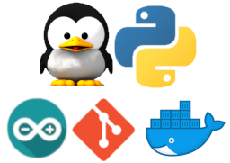
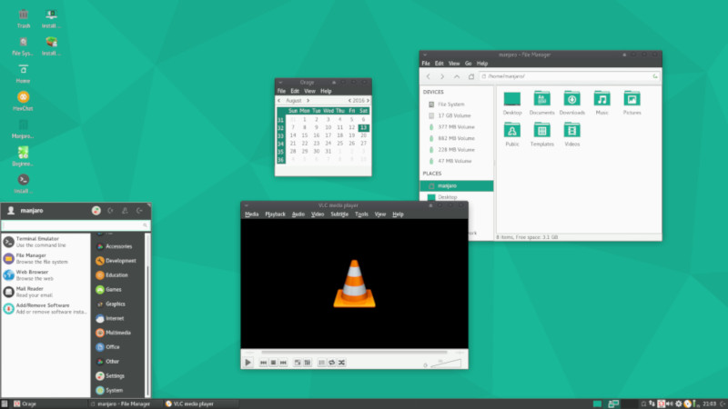
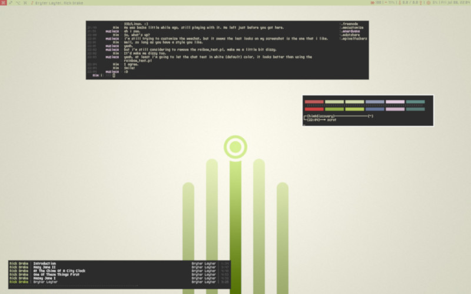
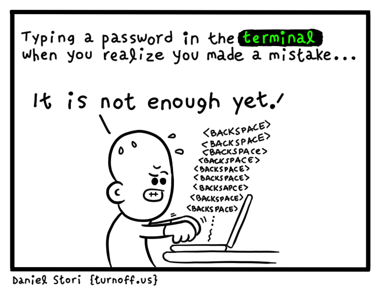
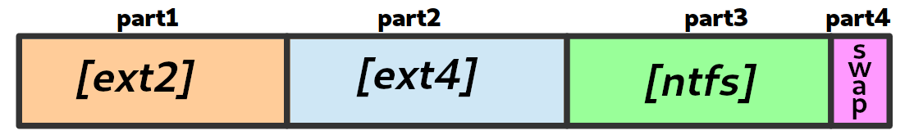
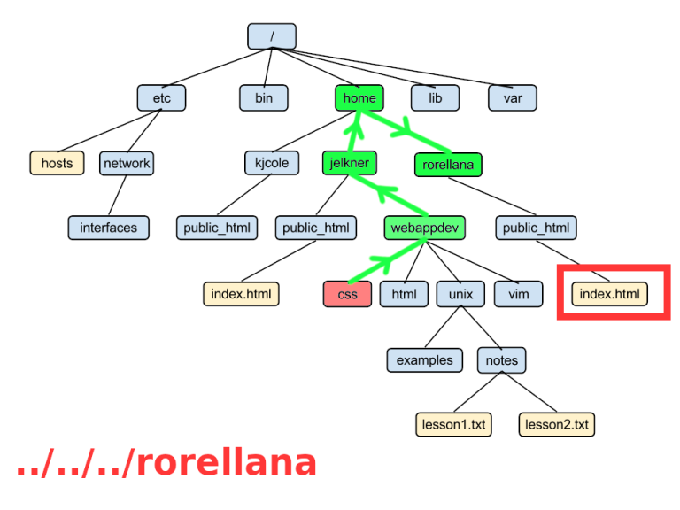
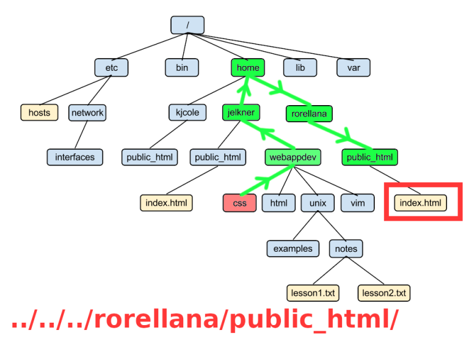
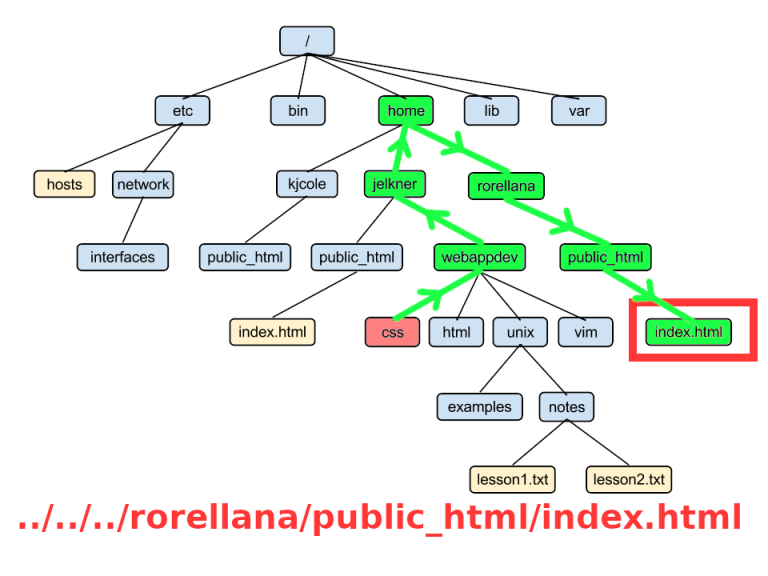
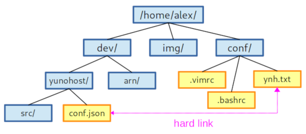

title: Introduction to Linux
class: animation-fade
layout: true

---

class: impact

# Introduction to Linux
*Become a Command Line Padawan in three days!*

---

class: impact

# Hello, world!

---

# About me

.col-4[
.center[

]
]

.col-8[.center[
<br>
<br>
`https://github.com/alexAubin`
<br>
<br>
`alex.aubin@mailoo.org`
<br>
<br>
]]


.col-4[.center[
Engineer/Physicist
</br>
</br>

]]

.col-4[.center[
Dev / hacktivist?


]]

.col-4[.center[
IT trainer


]]

---

# About you

---

# Overview

**Day 1 ?**

- 0, 1 - Historical aspects, introduction, reminders
- 2, 3 - Getting started with terminal and command line
- 4 - Files and filesystem

**Day 2 ?**

- 5, 6 - Users, groups and permissions
- 7 -  Processes

**Day 3 ?**

- 8 - Personalizing the environment
- 9 - Advanced commands
- 10 - Bash/Shell scripts

---

# Logistic et al.

## Schedule

- 9am to 12am (+ break in the middle)
- 1pm to 5pm (+ break in the middle)


---

# Disclaimers

- Technical IT is complicated
- Be patient, methodical, watchful !

We're here to learn :

- Do mistakes !
- Try stuff !
- Break things !
- Interact, ask questions

---

class: impact

# 0. The origins of (GNU/)Linux 

## (or contemporary IT in general)

---

# 0. The origins of Linux

## The prehistory of IT

- ~1940 : Electromechanical computers, first programs
- ~1950 : Transistors
- ~1960 : Integrated circuits

.center[
...Expansion of computing and IT...
]

---

# 0. The origins of Linux

## 1970 : PDP-7

.center[

]

---

# 0. The origins of Linux

## 1970 : UNIX

- Definition of a 'standard' for operating system
- Multi-user and multi-tasks
- Modular design, simple, elegant and efficient
- Adopted by amercian universities
- Open ("obviously")
- (Written in assembly)

.center[

]

---

# 0. The origins of Linux

## 1970 : UNIX

.center[

]

---

# 0. The origins of Linux

## 1975 : The programming language C

- D. Ritchie and K. Thompson define a new programming language and call it 'C' ;
- C makes programs portable ;
- They rewrite UNIX in C, making UNIX portable ;

.center[

]

---

# 0. The origins of Linux

## 1970~1985 : The birth of the Internet

- Definition of the IP and TCP protocols
    - Allow the machines to talk to each other
    - Distributed and decentralized : robust against nuclear attacks
- ARPANET ...

---

# 0. The origins of Linux

## 1970~1985 : The birth of the Internet

.center[

]


---

# 0. The origins of Linux

## 1970~1985 : The birth of the Internet

- Definition of the IP and TCP protocols
    - Allow the machines to talk to each other
    - Distributed and decentralized : robust against nuclear attacks
- ARPANET ...
- ... then the "true" Internet
- Terminals in major universities
- The birth of newsgroup, ...

---

# 0. The origins of Linux

## 1980 : The hacker and free software culture

- Software becomes a market with proprietary licenses
- IT becomes a societal issue
- The hacker culture develops in universities
    - Promotes knowledge sharing
    - Transparency, technical diversion
    - Against central authorities and bureaucracies
    - A technical, artistic and political movement

---

# 0. The origins of Linux

## 1980 : The hacker and free software culture

- R. Stallman creates the free software movement and the FSF <small>(Free Software Foundation)</small>
    0. Freedom to use the software
    1. Freedom to study the software
    2. Freedom to edit the software
    3. Freedom to redistribute modified version of the software
- ... and the GNU project : to create an ecosystem of free <small>(as in freedom)</small> softwares

.center[


]

---

# 0. The origins of Linux

## 1990 : Creation of Linux

- Linus Torvalds write the first version of Linux in his garage

.center[


]

---

# 0. The origins of Linux

## 1990 : Creation of Linux

*I'm doing a (free) operating system (**just a hobby, won't be big and professional like gnu**) for 386(486) AT clones. This has been brewing since april, and is starting to get ready. I'd like any feedback on things people like/dislike in minix, as my OS resembles it somewhat (same physical layout of the file-system (due to practical reasons) among other things).*

*I've currently ported bash(1.08) and gcc(1.40), and things seem to work. This implies that I'll get something practical within a few months, and I'd like to know what features most people would want. Any suggestions are welcome, but I won't promise I'll implement them :-)*

*Linus (torvalds@kruuna.helsinki.fi)*

*PS. [...] It is NOT portable [...] and it probably never will support anything other than AT-harddisks, as that's all I have :-(.
— Linus Torvalds*

---

# 0. The origins of Linux

## 1990 : Turns out, Linux grows....

- Linus Torvalds choose to put his code under GPL
- Support Intel processors
- System (kernel+programs) free and open
- Compatible with many standard (POSIX, SystemV, BSD)
- Integrate development tools (e.g. C compilers)
- Excellent support of TCP/IP
- Creation of Debian in 1993

---

# 0. The origins of Linux

.center[
... IT and the Internet is democratized ...
]

A *very* rough summary :
- Linux wins the market of infrastructure (routers, servers, ...)
- Windows wins the market of desktop computers
- Google wins the market of smartphones

---

# 0. The origins of Linux

## Contemporary IT

.center[

]

.center[


]

---

# 0. The origins of Linux

## Linux today

- Very much present in routers, servers and smartphones
- Independant of constructors
- Evolve, yet is very stable
- Versatile and personalizable system
- Security practices much healthier and transparent then Microsoft

---

# 0. The origins of Linux

## Linux distributions

A set of programs "packaged", preconfigured, integrated and ready to use, for a specific usecase and/or following a specific philosophy

- The kernel (Linux)
- Programs (GNU, ...)
- Pre-configurations
- A package manager
- Possibly one (or several) graphical environment (Gnome, KDE, Cinnamon, Mate, ...)
- A suite of softwares integrated with graphical environment
- Goals / philosophie Des objectifs / une philosophie

---

# 0. The origins of Linux

## Linux distributions


- **Debian** : well-known and stable, typically used for servers
- **Ubuntu, Mint** : user-friendly, for the general public
- **CentOS**, RedHat : suited for enterprises needs
- **Archlinux** : bit more technical, rolling release (~always up to date)
- **Kali Linux** : for security and pentesting purposes
- **Android** : onboard system (phones, tablets, ...)
- **YunoHost** : self-hosting for the general public

---

# 0. The origins of Linux

## Linux distributions

And many others : Gentoo, LinuxFromScratch, Fedora, OpenSuse, Slackware, Alpine, Devuan, elementaryOS, ...

---

# 0. The origins of Linux

## Desktop environments

- Gnome
- Cinnamon, Mate
- KDE
- XFCE, LXDE
- Tiling managers (awesome, i3w, ...)

---

# 0. The origins of Linux

## Desktop environments (Gnome)

.center[

]

---

# 0. The origins of Linux

## Desktop environments (KDE)

.center[

]

---

# 0. The origins of Linux

## Desktop environments (Cinnamon)

.center[

]

---

# 0. The origins of Linux

## Desktop environments (XFCE)

.center[

]

---

# 0. The origins of Linux

## Desktop environments (Awesome)

.center[

]

---

# 0. The origins of Linux

## Linux Mint

- (Arbitrary choice from myself ;))
- Simple, sover distribution, not really controversial (?)
- Built on the stability of Debian, and the accessibilit of Ubuntu

---

class: impact

# 1. Reminders about computers and IT

---

class: impact

# « Information technology »

---

class: impact

# Computers as a universal tool

Your laptop should be for you what the lightsaber is for the Jedi

---

# 1. Reminders about computers and IT

## Computer architecture

.center[

]

---

# 1. Reminders about computers and IT

## The role of the operating system

User
Programs
Operating System
Hardware

The OS :
- knows how to communicate with the hardware to harness and exploit its resources
- creates abstractions for programs (e.g. files)
- share computing time between programs
- make sure requested operations are legit

---

# 1. Reminders about computers and IT

## Architecture of the Internet

- Decentralized / distributed / "organic"
- The important bits are on the edge of the network

.center[

]

---

# 1. Reminders about computers and IT

## Architecture of the Internet

- IP : "best-effort" routing of the packets
- TCP : reliable communication channel (IP + receipt acknowledgement)

---

# 1. Reminders about computers and IT

## Architecture of the Internet

The web : a protocol amongst many other to exchange information, in a specific format (web pages)
Mail : another protocol(s) to exchange information, in another format (mail messages...)

Other protocols : DNS, SSH, IRC, torrent, ...

---

# 1. Reminders about computers and IT

## Architecture of the Internet

- Programs
- Protocols
- TCP
- IP
- Cables and wires

Client / server model

---

class: impact

# 2. Getting started with Linux and the terminal

---

# 2. Getting started with Linux and the terminal

## Installing the virtual machine

- A "simulated" computer in a computer

---

# 2. Getting started with Linux and the terminal

## Let's observe the boot sequence of the machine

---

# 2. Getting started with Linux and the terminal

## Logging in

```
Debian Stretch <name_of_the_machine> tty0

<name_of_the_machine> login: █
```

---

# 2. Getting started with Linux and the terminal

## Logging in

```
Debian Stretch <name_of_the_machine> tty0

<name_of_the_machine> login: your_login
Password: █        # <<<< the password doesn't appear at all while you're typing !
```

---

# 2. Getting started with Linux and the terminal

## Logging in

```
Debian Stretch <name_of_the_machine> tty0

<name_of_the_machine> login: your_login
Password: 
Last login: Wed 19 Sep 16:23:42 on tty2
your_login@machine:~$ █
```

---

# 2. Getting started with Linux and the terminal

## First commands

Changing your password:
- Type `passwd` then *Enter* then follow the instructions

```
your_login@machine:~$ passwd
Changing password for your_login.
(current) UNIX password:
Enter new UNIX password:
Retype new UNIX password:
passwd: password updated successfully
your_login@machine:~$ █
```

---

.center[

]

---

# 2. Getting started with Linux and the terminal

## First commands

- Type `pwd` then *Enter* and observe
- Type `ls` then *Enter* and observe
- Type `cd /var` then *Enter* and observe
- Type `pwd` then *Enter* and observe
- Type `ls` then *Enter* and observe
- Type `ls -l` then *Enter* and observe
- Type `echo 'Je suis dans la matrice'` then *Enter* and observe

---

# 2. Getting started with Linux and the terminal

## Discussion

- We logged in the machne
- Doing so, we obtained access to a terminal
- The terminal allows us to type commands to "directly" interact with the OS
- Commands are like "orders" (like in "I ordered food")
- Some commands print out a result, other might just change some states without printing out anything
- You may open more terminals (tty) with Ctrl+Alt+F1, F2, F3, ...

---

class: impact

# 3. The command line

---

# 3. The command line

## Structure of a commande

```
  evince  --fullscreen     slides.pdf
   |     '------------'    '------------'
   |           |                      |
   v           v                      v
  name      options              arguments
```

---

# 3. The command line

## Examples

A command can be as simple as:

```
cd
```

or way more complex like:

```
dnsmasq -x /run/dnsmasq/dnsmasq.pid -u dnsmasq -7 /etc/dnsmasq.d,.dpkg-dist,.dpkg-old,.dpkg-new --local-service
```

---

# 3. The command line

## `passwd` - Changing password

---

# 3. The command line

## `pwd` - Display the path of the current working directory

*Print current working directory*

---

# 3. The command line

## `cd` - Navigate through directories

```
cd  /some/dir     # Change the current directory
cd                # Return to your home dir
cd ..             # Go back to the parent directory (for instance /home if you were in /home/alex)
cd -              # Go back to the previous directory
```

N.B : Doing `cd /some/file` doesn't work! It makes no sense to `cd` into a file!

---

# 3. The command line

## `ls` - List the files inside a directory

```
ls            # List files inside the current working directory
ls  /usr/bin  # List files inside /usr/bin
ls  -a        # (or --all) List all files (including hidden files)
ls  -l        # Display details (type, permissions, owner, modification date, ...)
ls  -t        # Sort files by modification date
ls  -h        # (or --human-readable) Show readable sizes like '24K' or '3.2G'
ls  *.py      # List files in the current directory ending with `.py`
```

(on peut combiner les options et arguments)

---

# 3. The command line

- Using `ls` and `cd` is very much like using a graphical file explorer!

- A good Jedi is always watchful about:
    - where the term is (current working dir)
    - what he/she's trying to achieve
    - what he/she's typing
    - what the machine tells back

---

# 3. The command line

## Cleaning the terminal

- `clean` remove all lines printed in the terminal
- `reset` re-initialize the terminal (useful in some situation where the term is "broken")
- `exit` closes the terminal (or at least the current shell)
- (`logout` similar to `exit`)

---

# 3. The command line

## Getting help about commands

```
man name_of_the_command
```
(browse using arrows, `/word` to look for a word, `q` to quit)


Ou :
```
name_of_the_command --help
```

---

# 3. The command line

## Cancel / stop a command while it's running

- If a command takes too much time or seems to be stucked, you may cancel it with [Ctrl]+C

```
alex@shadow:~$ sleep 30
[...]
[Ctrl]+C
alex@shadow:~$
```

- [Ctrl]+C is to be used with parsimony! Cancelling a command may cause issues...
- (N.B. : [Ctrl]+C / [Ctrl]+V is not for copy/pasting in the terminal!)

---

# 3. The command line

## Shortcuts and ninja tricks

### [Tab]

- [Tab] x1 will autocomplete names and file paths (if there is no ambiguity)
- [Tab] x2 will suggests what are the possibilities in case of ambiguity
- Bonus : using [Tab] indirectly allos to check *while you're typing* that the command or file does exist!

### History

- You can use ↑ to find previous commnds
- And also : `history`

---

class: impact

### Use [Tab] !

---

class: impact

## Use [Tab] !

---

class: impact

# Use [Tab] !

---

class: impact

# Use [Tab] !

---

class: impact

# Use [Tab] !

---

class: impact

# 4. Files and filesystem 

---

# 4. Files and filesystem

## Generalities

- *filesystem* or *fs* for short
- The way files are organized and indexed
- An abstraction of memory and "0" and "1"'s
- Analogy : imagine a library but all books written on the same piece of paper
- The filesystem knows the name, size, location of each piece, creation date, ...

---

# 4. Files and filesystem

## Partitioning

- A disk can be segmented in "partitions"
- Each partition hosts data independently from others, and possibly using a different format / filesystem

.center[

]

---

# 4. Files and filesystem

## Classical filesystems

- *FAT16*, *FAT32* : old floppy disks, Windows 9x (~obsolete)
- *NTFS* : filesystem used by Windows since Windows 2000 / XP (?)
- **EXT3**, **EXT4** : filesystem typically used on Linux (Ubuntu, Mint, ...)
- *HFS+* : filesystem used on MacOS
- *TMPFS* : designed for temporary files (`/tmp/`)
- *ZTFS*, *BRTFS*, *Tahoe-LAFS*, *FUSE*, *IPFS*, ...

---

# 4. Files and filesystem

## On UNIX / Linux

"Everything is a file"

- **regular files** (`-`) : data, configuration, pictures, ...
- **directories** (`d`) : creating the file tree ...
- **specials** : 
    - devices (`c`, `b`) (keyboard, mouse, disk, ...)
    - sockets (`s`), named pipe (`p`) (communication between programs)
    - links (`l`) (file 'aliases', ~similar to shortcuts on Windows)

---

# 4. Files and filesystem

## A file

- An inode (unique ID for the file)
- *Several* names (access path)
    - One file can be at different places at the same time (hard link)
- Properties / metadata
    - Size
    - Permissions
    - Creation date, modification date

---

# 4. Files and filesystem

## File names

- Case sensitive
- (Avoid using spaces)
- A file starting with `.` is "hidden"
- File extensions are completely optionals and mainly meant for humans. A true mp3 files can be named music.jpg.
- When talking about a directory, one may add a `/` after its name to explicit that it's a folder.

---

# 4. Files and filesystem

## File tree

```
linuxLecture/
├── dist/
│   ├── exo.html
│   └── slides.html
├── exo.md
├── img/
│   ├── sorcery.jpg
│   └── tartiflette.png
├── slides.md
└── template/
    ├── index.html
    ├── remark.min.js
    └── style.scss
```

---

# 4. Files and filesystem

## Filesystem Hierarchy Standard

- `/` : the root of the whole hierarchy
- `/bin/`, `/sbin/` : essential programs (e.g. `ls`)
- `/boot/` : kernel and other stuff used to boot the system
- `/dev/`, `/sys/` : external devices, drivers 
- `/etc/` : configuration files
- `/home/` : personal directories of users
- `/lib/` : essential librairies
- `/proc/`, `/run/` : kernel files and running processes
- `/root/` : home directory of `root`
- `/tmp/` : temporary files
- `/usr/` : "non-essential" programs and libraries, doc, shared data
- `/var/` : files or data likely to change over time (e.g. cache, logs, emails)

---

# 4. Files and filesystem

## Home directories

- All users have a home or "personal" directory
- This is typically `/home/<user>/` for "normal" users
- (Special case for the `root` user : its home is `/root/` and not `/home/root/`)
- Some users have particular home folders (e.g. `/var/mail/`, ...)

---

# 4. Files and filesystem

## Filesystem Hierarchy Standard

.center[

]

---

# 4. Files and filesystem

## File paths and designation

"Reminders" :
- `.` : corresponds to the current folder
- `..` : corresponds to the parent folder
- `~` : corresponds to your home folder

A path may be:
- Absolute : `/home/alex/dev/yunohost/script.sh`
- Relative : `../yunohost/script.sh` (from `/home/alex/dev/apps/`)

A relative path only makes sense from a specific directory (starting point) ... but is often shorter to write

---

.center[

]

---

.center[

]

---

.center[

]

---

.center[

]

---

.center[

]

---

.center[

]

---

.center[

]

---

.center[

]


---

.center[

]


---

.center[

]

---

.center[

]

---

.center[

]

---

# 4. Files and filesystem

## Relative paths

More examples, all equivalent (from `/home/alex/dev/apps/`)

- `/home/alex/dev/yunohost/script.sh`
- `~/dev/yunohost/script.sh`
- `../yunohost/script.sh`
- `./../yunohost/script.sh`
- `./wordpress/../../yunohost/script.sh`
- `../.././music/.././../barbara/.././alex/dev/ynh-dev/yunohost/script.sh`

---

# 4. Files and filesystem

## Handling files (1/4)

- `ls` : list all files
- `cat <file>` : display the content of a file in the terminal
- `wc -l <file>` : counts the number of lines in a file

Examples:

```bash
ls /usr/share/doc/                       # List all files in /usr/share/doc
wc -l /usr/share/doc/nano/nano.html      # 2005 lines !
```

---

# 4. Files and filesystem

## Handling files (2/4)

- `head <fichier>`, `tail <fichier>` : display the a few lines at the beginning or end of a file
- `less <fichier>` : browse the content of a file in an "interactive" manner
   - ↑, ↓, ⇑, ⇓ to browse
   - `/some_word` to search for a word
   - `q` to quit

```bash
tail -n 30 /usr/share/doc/nano/nano.html # Display the first 30 linues of the file
less /usr/share/doc/nano/nano.html       # Explore the file interactively
```

---

# 4. Files and filesystem

## Handling files (3/4)

- `touch <fichier>` : create a new file, and/or change its modification date
- `nano <fichier>` : edit a file from the terminal
    - (`nano` will create the file if needed)
    - [Ctrl]+X to save+quit
    - [Ctrl]+W to search for a word
    - [Alt]+Y to enable syntax highlight
- `vim <fichier>` : an alternative to nano
    - more powerful (but more complex)

---

# 4. Files and filesystem

## Handling files (4/4)

- `cp <source> <destination>` : copy a file
- `rm <fichier>` : delete (remove) a file
- `mv <fichier> <destination>` : move (or rename) a file

Examples

```bash
cp lecture.html linuxLecture.html  # Create a copy with a different name
cp lecture.html ~/bkp/linux.bkp    # Create a copy of lecture.html in /home/alex/bkp/
rm lecture.html                    # Delete lecture.html
mv linuxLecture.html linux.html    # Rename linuxLecture.html to linux.html
mv linux.html ~/archives/          # Move linux.html to ~/archives/
```

---

# 4. Files and filesystem

## Handling directories (1/3)

- `pwd` : display the current working directory
- `cd <directory>` : move to another directory

---

# 4. Files and filesystem

## Handling directories (2/3)

- `mkdir <directory>` : create a new directory
- `cp -r <source> <destination>` : copy a directory and all its content

Examples:

```bash
mkdir ~/dev           # Create a directory dev in /home/alex
cp -r ~/dev ~/dev.bkp # Create a copy of dev/ called dev.bkp/
cp -r ~/dev /tmp/     # Create a copy of dev/ and its content to /tmp/
```

---

# 4. Files and filesystem

## Handling directories (3/3)

- `mv <directory> <destination>` : move (or rename) a directory
- `rmdir <directory>` : delete an empty directory
- `rm -r <directory>` : delete a directory and all its content recursively

Examples:

```bash
mv dev.bkp  dev.bkp2   # Rename the directory dev.bkp to dev.bkp2
mv dev.bkp2 ~/trash/   # Move dev.bkp2 to the directory ~/trash/
rm -r ~/trash          # Delete all the directory ~/trash and its content
```

---

# 4. Files and filesystem

## Hard links

.center[

]

- `ln <source> <destination>`
- The same file ... but at several places!
- Editing one file edits it everywhere (...because it's the same file!)
- Deleting it at one place doesn't delete it at the other place (it just removes one name)

---

# 4. Files and filesystem

## Symbolic links (symlink)

.center[

]

- `ln -s <target> <name_of_the_link>`
- Similar to a "shortcut", the file ain't really here... but it's as if it was
- Deleting the file pointed by the symlink "break" the link

---

# 4. Files and filesystem

## Symbolic links (symlink)

.center[

]

- In this example, the link was created with
    - `ln -s ../../../conf/ynh.txt conf.json`
- `conf.json` is the "shortcut" : you may delete it without causing any issue
- `ynh.txt` is the target : deleting it will break the link (since its target won't exist anymore)

---

# 4. Files and filesystem

## Partition notation

Disks on Linux are typically called:

- `/dev/sda` (first disk)
   - `/dev/sda1` (first partition of /dev/sda)
   - `/dev/sda2` (second partition of /dev/sda)
- `/dev/sdb` (second disk)
   - `/dev/sdb1` (first partition of /dev/sdb)
   - `/dev/sdb2` (second partition of /dev/sdb)
   - `/dev/sdb3` (third partition of /dev/sdb)

---

# 4. Files and filesystem

## Tools to list disks, manage partitions

```bash
$ fdisk -l
Disk /dev/sda: 29.8 GiB, 32017047552 bytes, 62533296 sectors
[...]
Device       Start      End  Sectors  Size Type
/dev/sda1     2048  2099199  2097152    1G Linux filesystem
/dev/sda2  2099200 62524946 60425747 28.8G Linux filesystem
```

```bash
$ fdisk /dev/sda
[interactively edit partitions of /dev/sda]
```

---

# 4. Files and filesystem

## Tools to list disks, manage partitions

`parted` and `gparted` (graphic tool, very handy!)

---

# 4. Files and filesystem

## Mount points

.center[

]


---

# 4. Files and filesystem

## Mount points

A partition or any "storage stuff" can be *mounted* in the file tree
- a partition on a disk
- a USB stick
- an ISO image
- a remote storage
- ...

---

# 4. Files and filesystem

## Mount points

Mount points are managed via `mount`

```bash
$ mkdir /media/usbkey
$ mount /dev/sdb1 /media/usbkey
$ ls /media/usbkey
[the content of the USB stick appears]
```

---

# 4. Files and filesystem

## Mount points

Mounted elements can be *unmounted* with `umount`

```bash
$ umount /media/usbkey
```

---

# 4. Files and filesystem

## Mount points: `/etc/fstab`

`/etc/fstab` describes filesystems automatically mounted at boot time

```text
# <file system>     <mountpoint> <type>  <options>       <dump>  <pass>
UUID=[id tres long] /            ext4    default         0       1
UUID=[id tres long] /home/       ext4    defaults        0       2
```

<small>(historically, the first column contained `/dev/sdxY`, but UUID are more robust)</small>

---

# 4. Files and filesystem

## Mount points: tools

Just `mount` allows to list mounted elements

```bash
$ mount
[...]
/dev/sda1 on /boot type ext4 (rw,noatime,discard,data=ordered)
/dev/sda2 on / type ext4 (rw,noatime,discard,data=ordered)
/dev/sdb1 on /media/usbkey type ntfs (rw,noatime,discard,data=ordered)
```

---

# 4. Files and filesystem

## Mount points: tools

There's also `df`:

```bash
$ df -h
Filesystem      Size  Used Avail Use% Mounted on
dev             2.8G     0  2.8G   0% /dev
run             2.8G  1.1M  2.8G   1% /run
/dev/dm-0        29G   22G  5.0G  82% /
tmpfs           2.8G   22M  2.8G   1% /dev/shm
tmpfs           2.8G  1.9M  2.8G   1% /tmp
/dev/sda1       976M  105M  804M  12% /boot
tmpfs           567M   16K  567M   1% /run/user/1000
/dev/sdb1       3.9G  105M  3.7M   3% /media/usbkey
```

---

# 4. Files and filesystem

## Mount points: tools

And also `lsblk`: 

```bash
$ lsblk
NAME          MAJ:MIN RM  SIZE RO TYPE  MOUNTPOINT
sda             8:0    0 29.8G  0 disk
├─sda1          8:1    0    1G  0 part  /boot
└─sda2          8:2    0 28.8G  0 part  /
```

---

class: impact

# 5. Users and groups

---

# 5. Users and groups

## Generalities

- a user is an entity / identity (!= human being) who might ask things to the system
- it owns files, can create other files, edit them, browse them, ...
- can launch commands and processes

---

# 5. Users and groups

## User index

Classically, users are indexed in `/etc/passwd`

```
alex:x:1000:1000:Zee Aleks:/home/alex:/bin/bash
```

- id / login
- `x` (historical)
- uid (user id)
- gid (group id)
- comment
- home directory of the user
- login shell for the user

---

# 5. Users and groups

## root

- `uid=0`, `gid=0`
- God on the machine
- **With great power comes great responsabilities**
    - If an attacker is able to become root, the OS should be forever compromised


---

# 5. Users and groups

## Becoming root (or changing users)

```bash
su          # Ask to open a (sub)shell as root
su barbara  # Ask to open a (sub)shell as barbara
exit        # Exit the shell
```

---

# 5. Users and groups

## Sudo

- Users may be authorized to do some actions as root with the 'sudo' rights

```bash
su -c "ls /root/"   # Run 'ls /root/' as root (in an ephemeral way)
sudo ls /root/      # Same thing, but using sudo
sudo whoami         # Returns "root"
sudo su             # Opens a shell as root using sudo...
```

- Depending on the command used, the password asked ain't the same:
   - su : root password
   - sudo : user password


---

# 5. Users and groups

## Groups

- Every user is associated with at least one group, with the same name (the primary group)
- Additional groups can be created
- A group may be used to grant specific permissions

Examples:
- `students`
- `usb`
- `power`

---

# 5. Users and groups

## Passwords

- Historically stored in `/etc/passwd` (readable by everybody but hashed)
- Nowadays stored in `/etc/shadow` (only readable by root)

```
alex:$6$kncRwIMqSb/2PLv3$x10HgX4iP7ZImBtWRChTyufsG9XSKExHyg7V26sFiPx7htq0VC0VLdUOdGQJBJmN1Rn34LRVAWBdSzvEXdkHY.:0:0:99999:7:::
```

---

# (Small parenthesis about hashing)

```
$ md5sum linuxLecture.html
458aca9098c96dc753c41ab1f145845a
```

...Changing a single character...

```
$ md5sum linuxLecture.html
d1bb5db7736dac454c878976994d6480
```
---

# (Small parenthesis about hashing)

To hash a file (or data) is to transform it into a string:
- with fixed size
- which appears to be "random" and chaotic (but is determinist!)
- which doesn't contain the initial information anymore

In summary: it is sort of a footprint which allows to characterize and recognize a file (or data)

---

# 5. Users and groups

## Useful commands

```bash
whoami                  # Ask who you are...!
groups                  # Ask in which groups you are
id                      # List some info about who you are (uid, gid, ..)
passwd <user>           # Change your password (or somebody else's password, if you are root)
who                     # List logged in users
useradd <user>          # Create a user
userdel <user>          # Delete a user
groupadd <group>        # Create a group
usermod -a -G <group> <user>  # Add a user into a group
```

---

class: impact

# 6. Permissions

---

# 6. Permissions

## Generalities

- Every file has:
    - a user owner
    - a group owner
    - corresponding permissions about reading, writing or executing
- (`root` may do anything whatever happens)
- The basic UNIX permission system is minimalist but enough for quite a lot of usecases
    - (see e.g. SELinux for advanced mechanics)

```
$ ls -l linuxLecture.html
-rw-r--r-- 1 alex alex 21460 Sep 28 01:15 linuxLecture.html

    ^         ^     ^
    |         |     '- group owner
    |          '- user owner
    permissions !
```

---

# 6. Permissions

.center[

]

---

# 6. Permissions

.center[

]


---

# 6. Permissions

## **File** permissions

- `r` : reading the file
- `w` : writing in the file
- `x` : executing the file

---

# 6. Permissions

## **Directories** permissions

- `r` : list the content of the directory
- `w` : create / delete files
- `x` : 'going through' the directory

(You can imagine permissions of a folder to be `r--` or `--x`)

---

# 6. Permissions

## Changing ownership

**(Only root may do these operations !!)**

```bash
chown <user> <target>          # Change the user owner of a file
chown <user>:<group> <target>  # Change the user and group owner of a file
chgrp <group> <target>         # Change only the group owner of a file
```

Examples

```bash
chown barbara:students linuxLecture.md  # "Give" linuxLecture.md to barbara and the students group
chown -R barbara /home/alex/dev/        # Change the owner recursively !
```

---

# 6. Permissions

## Gérer les permissions

```bash
chmod <changes> <target>   # Change the permission of a file
```

Examples

```bash
chmod u+w   linuxLecture.html  # Add the writing permission to the user owner
chmod g=r   linuxLecture.html  # Replace the permissions for the group owner to "read only"
chmod o-rwx linuxLecture.html  # Remove all permissions for all others
chmod -R +x ./bin/             # Enable the execution bit for everybody and for all files in ./bin/
```

---

# 6. Permissions

## Octal representation

.center[

]

---

# 6. Permissions

.center[

]

---

# 6. Permissions

## Changing permissions ... using octal !

```bash
chmod <permissions> <target>
```

Exemples
```bash
chmod 700 linuxLecture.html  # Set the permissions as rwx------
chmod 644 linuxLecture.html  # Set the permissions as rw-r--r--
chmod 444 linuxLecture.html  # Set the permissions as r--r--r--
```

---

# 6. Permissions

## Chown vs. chmod

.center[

]

---

# 6. Permissions

When doing:
```bash
$ /etc/passwd
```

You are trying to execute a file!

So getting this answer / error :

```bash
-bash: /etc/passwd: Permission denied
```

doesn't mean that you can'y read the file ... but just that you can't *execute* it <small>(which is legit, since it doesn't make sense to try to execute it..)</small>

---

class: impact

# 7. Processes

---

# 7. Processes

## Generalities

- A process is *an instance* currently running of a program
- (A same program can ran multiple times in the form of several processes)

- A process uses resources:
    - code being ran in the CPU, or being cached in RAM
    - data being cached in RAM
    - other resources (port, opened files, bandwidth, ...)

- A process has attributes (an id, an owner, priority, ...)

---

# 7. Processes

## Running (1/2)

A machine only understand machine code ("binary").

A program is either:
- compiled (e.g. a program written in C)
- interpreted by another program, which is compiled (e.g. a program written in Python, interpreted by the Python interpreter)

Reminder: UNIX is multitask, multiuser
- time sharing, parallel execution
- coordinated by the kernel

---

# 7. Processes

## Running (2/2)

A process is launched either :

- in interactive mode (from a shell / command line)
- via an automatic mechanism (programmed task, c.f. `at` and cron jobs)
- as a daemon / service

In interactive mode, the user may interact with the process while it's running

---

# 7. Processes

## Attributes

- An owner
- PID (process ID)
- PPID (process ID of the parent!)
- Execution priority
- Command / program launched
- Inputs, outputs

---

# 7. Processes

## List processes and attributes (1/2)

```bash
ps aux            # List all processes
ps ux -U alex     # List all processes of user alex
ps -ef --forest   # List all processes, with "parenthood trees"
pstree            # Display a parenthood tree between processes
```

Example of `ps -ef --forest`

```
  935   927  0 Sep25 ?      00:00:52  \_ urxvtd
 3839   935  0 Sep26 pts/1  00:00:00      \_ -bash
16076  3839  0 00:49 pts/1  00:00:49      |   \_ vim linuxLecture.html
20796   935  0 Sep27 pts/2  00:00:00      \_ -bash
 2203 20796  0 03:10 pts/2  00:00:00      |   \_ ps -ef --forest
13070   935  0 00:27 pts/0  00:00:00      \_ -bash
13081 13070  0 00:27 pts/0  00:00:00          \_ ssh dismorphia -t source getIrc.sh
```

---

# 7. Processes

## List processes and attributes (2/2)

And also:
```bash
top               # List all active processes interactively
  -> [shift]+M    #    sort according to CPU usage
  -> [shift]+P    #    sort according to RAM usage
  -> q            # Quit
```

---

# 7. Processes

## Managing processes in interactive mode

```bash
<command>             # Launch a command in a classical way..
<command> &           # Launch a command in background
[Ctrl]+Z  then 'bg'   # Move the currently running command in background
fg                    # Move a background command to the foreground
jobs                  # List the commands being ran from this shell
```

---

# 7. Processes

## Killing processes

```bash
kill <PID>     # Ask nicely the process to end what it's doing
kill -9 <PID>  # Kill the process with a shotgun
pkill <nom>    # (same but with a program name)
pkill -9 <nom> # (same but with a program name)
```

Examples

```bash
kill 2831
kill -9 2831
pkill java
pkill -9 java
```

---

# 7. Processes

.center[

]

---

# 7. Processes

## `screen`

`screen` allows to launch a command in a terminal that you may recover later

1. Start a session with `screen`
2. Run whichever command you want inside
3. Detach the session with `<Ctrl>+A` then `D`.
4. The command keep running
5. You may recover the session later with `screen -r`

---

class: impact

# 8. Personalizing your environment

---

# 8. Personalizing your environment

## Env. variables

When in a shell, there exist *environment variables* defining some behaviors.

For example, the variable 'HOME' contains `/home/your_username` and corresponds to the place where `cd` sends you back by default (if no folder given as argument)

Other examples:

```
SHELL : /bin/bash (typically)
LANG, LC_ALL, ... : language to be used by messages
USER, USERNAME : user name
```

---

# 8. Personalizing your environment

## Changing an environment variable

Example:

```
HOME=/tmp/ 
```


---

# 8. Personalizing your environment

## Listing environment variables

`env` returns a list of environment variables

```
$ env
LC_ALL=en_US.UTF-8
HOME=/home/alex
LC_MONETARY=fr_FR.UTF-8
TERM=rxvt-unicode-256color
[...]
```

---

# 8. Personalizing your environment

## Personalizing the command prompt

- The variable `PS1` describes the command prompt!
- Generally, `PS1` is something like: `\u@\h:\w$`
- `\u` corresponds to the username
- `\h` corresponds to the machine name (host)
- `\w` corresponds to the current working directory
- `\n` corresponds ... to a new line!

`PS2` corresponds to the second-level command prompt!

---

# 8. Personalizing your environment

## Colorizing text

(This syntax is absolutely awful :'( !)

```
echo -e "\[\033[31m\]This is in red\[\033[0m\]"
echo -e "\[\033[32m\]This is in green\[\033[0m\]"
echo -e "\[\033[33m\]This is in yellow\[\033[0m\]"
echo -e "\[\033[7m\]This is highlighted\[\033[0m\]"
echo -e "\[\033[31;7m\]This is highlitghted in red\[\033[0m\]"
```

---

# 8. Personalizing your environment

## Defining aliases

An alias is a "custom" name for a command and options

```
alias ll='ls -l'
alias rm='rm -i'
alias ls='ls --color=auto'
```

You may list existing aliases by just typing `alias

(Bad joke: defining `alias cd='rm -r'` !)

---

# 8. Personalizing your environment

## Profile files

- The file `~/.bashrc` is read at each shell opening
- It allows to define commands you want to be ran at this moment
- For example, you may wish to define aliases or change variables...
- To "apply" recent changes, you should `source ~/.bashrc`

Other profile files : `~/.profile` and `/etc/bash_profile`

---
