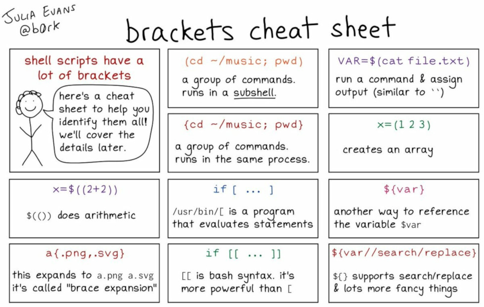
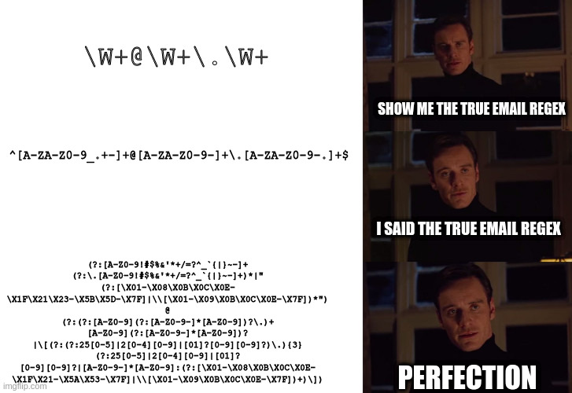

title: Shell Scripting
class: animation-fade
layout: true

---

class: impact

# Bash Scripting

---

.center[

]

---

# Rappels

- Les commandes ont un code de retour
- `cmd1 && cmd2` pour enchainer une commande si cmd1 a "marché"
- `cmd1 || cmd2` pour enchainer une commande si cmd2 a "échoué"
- `cmd > file` pour rediriger la sortie standard dans un fichier
- `cmd 2> file` pour rediriger la sortie d'erreur dans un fichier
- `cmd1 | cmd2` pour utiliser la sortie d'une commande comme entrée d'une autre

---

# Plan

- 0 écrire et executer des scripts
- 1 les variables
- 2 interactivité
- 3 les conditions 
- 4 les fonctions
- 5 les boucles

---

class: impact

#  Bash scripts

### 0 Écrire et executer des scripts

---

# 0 Écrire / executer

## Des scripts

- `bash` <small>(`/bin/bash`)</small> est un interpreteur
    - en mode interactif, un interpréteur de commande est souvent appelé un shell
- Plutôt que de faire de l'interactif, on peut écrire une suite d'instruction qu'il doit executer (un script)
- Un script peut être considéré comme un type de programme <small>(caractérisé par le fait qu'il reste de taille modeste)</small>

---

# 0 Écrire / executer

## Utilité des scripts bash

Ce que ça ne fait généralement **pas** :
- du calcul scientifique
- des interfaces graphiques / web
- des manipulations 'fines' d'information

Ce que ça fait plutôt bien :
- prototypage rapide
- automatisation de tâches d'administration (fichiers, commandes, ..)
- rendre des tâches parametrables ou interactives

---

# 0 Écrire / executer

## Ecrire un script (1/2)

```bash
#!/bin/bash

# Un commentaire
cmd1
cmd2
cmd3
...

exit 0    # (Optionnel, 0 par defaut)
```

---

# 0 Écrire / executer

## Ecrire un script (2/2)

```bash
#!/bin/bash

echo "Hello, world !"
echo "How are you today ?"
```

---

# 0 Écrire / executer

## `exit`

- `exit` permet d'interrompre le script immédiatement
- `exit 0` quitte et signale que tout s'est bien passé
- `exit 1` (ou une valeur différente de 0) quitte et signale un problème

---

# 0 Écrire / executer

## Executer un script (1/3)

Première façon : avec l'interpreteur `bash`

- `bash script.sh` execute `script.sh` dans un processus à part
- on annonce explicitement qu'il s'agit d'un script bash
    - dans l'absolu, pas besoin d'avoir mis `#!/bin/bash`

---

# 0 Écrire / executer

## Executer un script (2/3)

Deuxième façon : avec `source`

- `source script.sh` execute le script **dans** le terminal en cours
- 95% du temps, ce n'est pas `source` qu'il faut utiliser pour votre cas d'usage !
- Cas d'usage typique de `source` : recharger le `.bashrc`
- (Autre cas : `source venv/bin/activate` pour les virtualenv python)

---

# 0 Écrire / executer

## Executer un script (3/3)

Troisième façon : en donnant les permissions d'execution à votre script

```
chmod +x script.sh   # À faire la première fois seulement
./script.sh
```

- l'interpreteur utilisé sera implicitement celui défini après le `#!` à la première ligne
- (dans notre cas : `#!/bin/bash`)

---

# 0 Écrire / executer

## Parenthèse sur la variable `PATH` (1/2)

La variable d'environnement `PATH` défini où aller chercher les programmes

```bash
$ echo $PATH
/usr/local/bin:/usr/bin:/bin:/usr/local/sbin

$ which ls
/usr/bin/ls

$ which script.sh
which: no script.sh in (/usr/local/bin:/usr/bin:/bin:/usr/local/sbin
```

---

# 0 Écrire / executer

## Parenthèse sur la variable `PATH` (2/2)

```bash
$ ./script.sh  # Fonctionnera (si +x activé)
$ script.sh    # Ne fonctionnera a priori pas
```

Néanmoins il est possible d'ajouter des dossiers à `PATH` :

```bash
PATH="$PATH:/home/padawan/my_programs/"
```

Ensuite, vous pourrez utiliser depuis n'importe où les programmes dans `~/my_programs` !

---

# 0 Écrire / executer

## Résumé

- `bash script.sh` est la manière "explicite" de lancer un script bash
- `./script.sh` lance un executable (+x) via un chemin absolu ou relatif
- `source script.sh` execute le code *dans le shell en cours* !
- `script.sh` peut être utilisé seulement si le script est dans un des dossier de `PATH`

---

class: impact

#  Bash scripts

### 1 Les variables

---

# 1 Les variables

De manière générale, une variable est :
- un contenant pour une information
- une façon de donner un nom à cette information

Initialiser une variable en bash (attention à la syntaxe) :

```bash
PI="3.1415"
```

Utiliser une variable :

```bash
echo "Pi vaut (environ) $PI"
```

N.B. : différence contenu/contenant sans trop d'ambiguité


---

# 1 Les variables

On peut modifier une variable existante :

```bash
$ HOME="/home/alex"
$ HOME="/var/log"
```

... sauf si définie comme `readonly` !

```bash
$ readonly PI="2"           # ... oopsie !
$ PI="3.14"
-bash: PI: readonly variable
```

---

# 1 Les variables

Initialiser une variable à partir du résultat d'une autre commande

```bash
NB_DE_LIGNES=$(wc -l < /etc/login.defs)
```

Syntaxe équivalente avec des backquotes <small>(ou backticks)</small> (historique, dépréciée)

```bash
NB_DE_LIGNES=`wc -l < /etc/login.defs`
```

---

# 1 Les variables

On peut également initialiser une variable en composant avec d'autres variables :

```bash
MY_HOME="/home/$USER"
```

ou encore :

```bash
FICHIER="/etc/login.defs"
NB_DE_LIGNES=$(wc -l < $FICHIER)
MESSAGE="Il y a $NB_DE_LIGNES lignes dans $FICHIER"
echo "$MESSAGE"
```

---

# 1 Les variables

## Notes diverses (1/5)

- En bash, on manipule du texte !

```bash
$ PI="3.14"

$ NOMBRE="$PI+2"

$ echo $NOMBRE
3.14+2           # littéralement !
```

---

# 1 Les variables

## Notes diverses (2/5)

- Lorsqu'on utilise une variable, il faut mieux l'entourer de quotes :

```bash
$ FICHIER="document signé.pdf"

$ ls -l $FICHIER
ls: cannot access 'document': No such file or directory
ls: cannot access 'signé.pdf': No such file or directory

$ ls -l "$FICHIER"
-rw-r--r-- 1 alex alex 106814 Mar  2  2018 'document signé.pdf'
```

---

# 1 Les variables

## Notes diverses (3/5)

- ACHTUNG : une variable inexistante est interprétée comme une chaîne vide... !

```bash
$ NB_DE_LIGNES=42
$ echo "$NB_DE_LINGE"
                        # <<< ligne vide !
```

- (On peut utiliser `set -eu` au début d'un script pour traiter ces cas comme des erreurs et arrêter le déroulement du script)

---

# 1 Les variables

## Notes diverses (4/5)

- Pour utiliser une variable sans ambiguité, il est peut être nécessaire de l'ecrire avec `${VAR}` :

```bash
$ FICHIER=/var/log/stuff

$ cp $FICHIER $FICHIER_old
cp: missing destination file operand after 'stuff'
# (car la variable `FICHIER_old` n'existe pas !)

$ cp $FICHIER ${FICHIER}_old
# fonctionne !
```

---

# 1 Les variables

## Notes diverses (5/5)

- L'utilisation de 'simple quotes' permet d'éviter l'interpretation des variables :
- On peut aussi utiliser \ pour echapper un caractère :

```bash
$ echo "Mon home est $HOME"
Mon home est /home/alex

$ echo 'Mon home est $HOME'
Mon home est $HOME

$ echo "Mon home est \$HOME"
Mon home est $HOME
```

---

class: impact

#  Bash scripts

### 2 Paramétrabilité / interactivité

---

# 2 Paramétrabilité / interactivité

- Le comportement d'un script peut être paramétré via des options ou des données en argument
- On peut également créer de l'interactivité, c'est à dire demander des informations à l'utilisateur pendant que l'execution du programme


---

# 2 Paramétrabilité / interactivité

## Les paramètres

- `$0` contient le nom du script
- `$1` contient le premier argument
- `$2` contient le deuxieme argument
- et ainsi de suite ...
- `$#` contient le nombre d'arguments total 
- `$@` corresponds à "tous les arguments" (en un seul bloc)

---

# 2 Paramétrabilité / interactivité

```bash
#!/bin/bash

echo "Ce script s'apelle $0 et a eu $# arguments"
echo "Le premier argument est : $1"
echo "Le deuxieme argument est : $2"
```

```bash
$ ./monscript.sh coucou "les gens"
Ce script s'apelle monscript.sh et a eu 2 arguments
Le premier argument est : coucou
Le deuxieme argument est : les gens
```

---

# 2 Paramétrabilité / interactivité

```bash
#!/bin/bash

echo "Ce script s'apelle $0 et a eu $# arguments"
echo "Le premier argument est : $1"
echo "Le deuxieme argument est : $2"
```

```bash
$ ./monscript.sh coucou
Ce script s'apelle monscript.sh et a eu 2 arguments
Le premier argument est :
Le deuxieme argument est :
```


---

# 2 Paramétrabilité / interactivité

## Interactivité

Il est possible d'attendre une entrée de l'utilisateur avec `read` :

```bash
echo -n "Comment tu t'appelles ? "
read NAME
echo "OK, bonjour $NAME !"
```

---

class: impact

#  Bash scripts

### 3 Les conditions

---

# 3 Les conditions

## Généralités

Les conditions permettent d'adapter l'execution d'un programme en fonction de cas particuliers...

---

# 3 Les conditions

## Avec les doubles crochets (1/3)

```bash
NB_TERMINAUX_OUVERTS=$(ps -ef | grep bash | wc -l)

if [[ "$NB_TERMINAUX_OUVERTS" -ge "5" ]]
then
   echo "Il y a pleins de terminaux ouverts sur cette machine !"
else
   echo "Il n'y a que $NB_TERMINAUX_OUVERTS sur cette machine "
fi
```

---

# 3 Les conditions

## Avec les doubles crochets (2/3)

```bash
if [[ ! -f "$HOME/.bashrc" ]] 
then
   echo "Tu devrais créer un bashrc !"
fi
```

---

# 3 Les conditions

## Avec les doubles crochets (3/3)

```bash
if [[ expression ]]
then
   cmd1
   cmd2
   ...
else
   cmd3
   cmd4
fi
```

N.B. : Il n'est pas nécessaire d'avoir un `else` ! 

---

# 3 Les conditions

## Tester des valeurs numériques

- `[[ X -eq Y ]]` : X **equals** to Y
- `[[ X -ne Y ]]` : X **not equals** to Y
- `[[ X -ge Y ]]` : X is **greater than or equals** to Y
- `[[ X -le Y ]]` : X is **lesser than or equals** to Y
- `[[ X -gt Y ]]` : X is **greater than** to Y
- `[[ X -lt Y ]]` : X is **lesser than** to Y

Par exemple pour tester qu'une variable `ANSWER` est supérieure à 42 : 

```bash
[[ "$ANSWER" -gt "42" ]]
```

---

# 3 Les conditions

## Tester des chaînes de caractère

- `[[ CHAINE1 == CHAINE2 ]]` : les chaines sont égales
- `[[ CHAINE1 != CHAINE2 ]]` : les chaines sont différentes
- `[[ CHAINE =~ REGEX ]]` : la chaîne matche la regex..
- `[[ -z CHAINE ]]` : la chaîne est vide (zero length)
- `[[ -n CHAINE ]]` : la chaîne n'est pas vide (non-zero length)

Exemples :
```bash
[[ "$USER" == "root" ]]   # Teste si l'on a à faire à l'user root 
[[ -z "$ANSWER" ]]        # Teste que la variable ANSWER n'est pas vide
[[ "$USER" =~ "r2d2\|c3p0" ]]  # Teste si l'on a à faire à r2d2 ou c3p0 
```

---

# 3 Les conditions

## Tester des fichiers

- `[[ -e FILE ]]`   # Teste si FILE existe
- `[[ -f FILE ]]`   # Teste si FILE est un fichier regulier
- `[[ -d FILE ]]`   # Teste si FILE est un dossier

Exemples:
```bash
[[ -d "$HOME/documents" ]] # Teste si le dossier documents existe
[[ -f "$HOME/.bashrc" ]]   # Teste si vous avez un fichier .bashrc
```

---

# 3 Les conditions

## Combiner des expressions

- `[[ ! expression ]]`         # Teste l'opposé de expression
- `[[ expr1 ]] && [[ expr2 ]]` # Teste que expr1 ET expr2 sont vraies
- `[[ expr1 ]] || [[ expr2 ]]` # Teste si expr1 OU </small>(inclusif)</small> expr2 est vrai

Exemples
```bash
[[ ! -e "$HOME/.bashrc" ]]     # Teste que votre .bashrc n'existe pas
[[ "$CPU_USE" > "100" ]] && [[ "$MEM_FREE" < 0 ]]
```

---

# 3 Les conditions

## Syntaxe avec une commande

```bash
if commande
then
   cmd1
   cmd2
   ...
else
   cmd3
   cmd4
fi
```

---

# 3 Les conditions

## Syntaxe avec une commande : exemple

```bash
if grep "r2d2" /etc/passwd
then
   echo "r2d2 est bien enregistré en tant qu'utilisateur"
else
   echo "r2d2 n'est pas enregistré en tant qu'utilisateur !"
fi
```

---

# 3 Les conditions

## Note sur les expressions entre crochet

`[[ expression ]]` peut être utilisé comme une vraie commande ! 

C'est souvent moins lourd à écrire pour des petites choses :

```bash
[[ -f "$HOME/.bashrc" ]] || echo "Tu devrais créer un bashrc !"
```

---


.center[

]


---

class: impact

#  Bash scripts

### 4 Les fonctions

---

# 4 Les fonctions

## Généralités

Les fonctions sont comme des commandes, qui existent dans le contexte d'un script
Comme les commandes, elles ont un `stdin`, `stdout`, `stderr`, des arguments (`$1`, `$2`, ...) et un code de retour

L'objectif d'une fonction est :
- de rassembler des commandes en une tâche bien définie
- de donner un nom **pertinent** à cette tâche
- (de rendre cette tâche paramétrable)
- pouvoir appeler cette tâche plusieurs fois
- de structurer le code d'un script

---

# 4 Les fonctions

## Exemple

Initialiser un utilisateur :
- (il faut un nom)
- créer l'utilisateur (`useradd`)
- créer son home
- créer un `.bashrc`
- mettre les bonnes permissions sur ses dossier/fichiers
- définir un quota
- ...


---

# 4 Les fonctions

## Exemple concret (non testé)

```bash
function create_droid()
{
    local NAME="$1" 

    useradd $NAME
    mkdir /home/$NAME
    echo "alias ls='ls --color=auto'" > /home/$NAME/.bashrc
    chown -R $NAME:$NAME /home/$NAME
    adduser $NAME droid

    return 0
}

create_droid r2d2
create_droid c3p0
create_droid bb8
```

---

# 4 Les fonctions

## Syntaxe

```bash
function ma_fonction()
{
    cmd1
    cmd2
    cmd3

    return 0   # Optionnel
}
```

---

# 4 Les fonctions

## Code de retour

```bash
function create_droid()
{
    local NAME="$1" 
    if grep "^$NAME" /etc/passwd
    then
       echo "Un utilisateur $NAME existe deja !"
       return 1
    fi

    # [...]

    return 0
}
```

---

# 4 Les fonctions

## Variables locales

- Dans une fonction, il est possible de définir des variables locales avec le mot clef `local`
- Ces variables et leur valeurs n'ont de sens que dans le contexte de cette fonction
- Généralement utilisé pour clarifier les paramètres attendus

```bash
function set_quota()
{
   local USER="$1"
   local LIMIT="$2"

   # [...]
}

set_quota r2d2 100M
echo $LIMIT   ## << Ne fonctionnera pas !
```

---

class: impact

# 5 - Boucles `for` / `while`

---

# 5 - Boucles `for` / `while`

## Généralités sur les boucles

Répéter des instructions :
- sur une liste de valeurs / données (boucles `for`)
- ou tant qu'une condition est vraie (boucles `while`)

---

# 5 - Boucles `for` / `while`

## Boucle `for`

```bash
for I in $(seq 1 10)
do
    echo "I vaut $I"
done
```

```bash
I vaut 1
I vaut 2
I vaut 3
...
I vaut 10
```

---

# 5 - Boucles `for` / `while`

## Boucle `for`

```bash
for FILENAME in $(ls)
do
    cp "$FILENAME" "/home/alex/backups/${FILENAME}.bkp"
done
```

---

# 5 - Boucles `for` / `while`

## Boucle `for`

```bash
for USER in $(cat /etc/passwd | awk -F: '{print $1}')
do
   SHELL=$(grep "^$USER:" /etc/passwd | awk -F: '{print $7}')
   echo "L'user $USER a comme login de shell : $SHELL"
done
```

---

# 5 - Boucles `for` / `while`

## Boucle `while`

```bash
I=10
while [[ "$I" -ge 0 ]]
do
   echo "Maintenant I vaut $I"
   I=$(bc <<< "$I-1")
done
```

```
Maintenant I vaut 10
Maintenant I vaut 9
Maintenant I vaut 8
...
Maintenant I vaut 0
```

---

# 5 - Boucles `for` / `while`

## Boucle `while`

Tant qu'une condition est vérifiée ...

```bash
while [[ "$NUMBER" -ge 0 ]]
do
    echo "Donne un nombre négatif !"
    read NUMBER
done
echo "Bien ouej ! $NUMBER est effectivement un nombre négatif !"
```

---

# 5 - Boucles `for` / `while`

## Boucle `while`

```bash
while [[ -z "$(ip a | grep 'inet ' | awk '{print $2}' | grep -v '127.0.0.1')" ]]
do
   echo "Waiting ..."
   sleep 1
done
```

---

class: impact

# 6. Automatiser avec `at` et les cron jobs

---

# 6. Automatiser

## Executer des commandes (ou un script) à distance

```
# Verifier depuis combien de temps la machine tourne
$ echo "uptime" | ssh machine
 19:48:51 up 1 day,  2:05,  1 user,  load average: 0.08, 0.02, 0.01

# Lancer un script à distance
$ cat script.sh | ssh machine
[...]
```

---

# 6. Automatiser

## `at`

- Executer *une fois* une action à un moment précis dans le futur
- Format de date/temps plutôt user-friendly

```bash
# En interactif
$ at 5:00 PM     
warning: commands will be executed using /bin/sh
at> reboot
job 5 at Fri Oct 12 17:00:00 2018
```

```bash
# Avec un script
$ at now + 30 minutes -f mettre_a_jour.sh 
job 6 at Thu Oct 6 20:22:00 2018
```

---

# 6. Automatiser 

## Les jobs cron

- Répéter une tâche à intervalle régulier (heures, jours, mois, ...)
- Chaque utilisateur peut en configurer avec `crontab -e`

```
10 * 1 * * /chemin/vers/un/script
```

---

# 6. Automatiser

## Les jobs cron : syntaxe (1/3)

```
10 * 1 * * /chemin/vers/un/script
```

- `10` : à la minute 10
- `*`  :toutes les heures
- `1` le 1er du mois
- `*` tous les mois
- `*` (tous les jours de la semaine)

---

# 6. Automatiser

## Les jobs cron : syntaxe (2/3)

```
0 8 * * 1-5 /chemin/vers/un/script
```

- `0` : à la minute 0
- `8` : à 8h
- `*` (tous les jours du mois)
- `*` tous les mois
- `1-5` tous les jours de travail (lundi à vendredi)

---

# 6. Automatiser

## Les jobs cron : syntaxe (3/4)

```text
 */10 * * * * /chemin/vers/un/script
```

- `*/10` : toutes les 10 minutes
- `*` toutes les heures
- `*` tous les jours du mois
- `*` tous les mois
- `*`  tous les jours de la semaine

---

# 6. Automatiser

## Les jobs cron : syntaxe (4/4)

- `http://crontab.guru/` to the rescue !

---

# 6. Automatiser

## `/etc/crontab` et `/etc/cron.d/`

- Ce sont des fichiers/dossiers de config cron "globaux"
- Dedans, on specifie aussi l'utilisateur utilisé pour lancer le script :

```
 # M  H  D M W   User    Command --->
 */30 *  * * * feed2toot feed2toot -c /etc/feed2toot/feed2toot.ini
```

---

# 6. Automatiser

## `/etc/cron.hourly`, `daily`, `weekly`, `monthly`

- Ils contiennent directement des scripts qui seront executés automatiquement à certains intervalles
- Attention
   - le nom des fichiers dedans ne doit pas avoir d'extensions ...
   - .. et doit être executable (+x)

---

class: impact
# 7. Les expressions régulières

---

.center[
https://www.commitstrip.com/wp-content/uploads/2014/02/Strips-Le-dernier-des-vrais-codeurs-650-final2.jpg
]

---

.center[

]

---

.center[

]


---

# 7. Les expressions régulières

## Principe

- Un formalisme pour décrire la structure d'une chaîne de caractère
- Utile pour rechercher, valider, modifier des données en masse
- Par exemple : un numéro SIRET
    - 9 chiffres, peut-être séparé par des espaces
    - Version simple: `\d{9}`
    - Version un peu plus évoluée : `[\d ?]{8}\d`
- Utilisable dans pleins de langage de programmation, et outils des outils comme `grep`, `sed`, éditeurs de textes, ...
- Tests en ligne : `regex101.com`
- Attention, utilisation dans grep : `grep -E` ou `-P` (?)
- Plusieurs normes de regex : PCRE, lua, ...


---

# 7. Les expressions régulières

## Les ancres

- `^` : désigne le début de la chaîne de caractère
- `$` : désigne la fin de la chaîne de caractère

Exemple : matcher le dieze d'une ligne de commentaire : `^#`

---

# 7. Les expressions régulières

## Les classes de caractères

- `[abc]` : match le caractère `a`, `b` ou `c`
- `[a-z]` : match n'importe quel caractère entre `a` et `z`
- `[a-zA-Z0-9]` : match n'importe quel lettre ou chiffre
- `[A-Z0-9_\.+-#]` : match n'importe quel lettre ou chiffre ou `_`, `.`, `+`, `-`, `#`
- `[^a-z]` : match n'importe quel caractère qui n'est PAS dans `a-z`
- `[^a-z0-9]` : match n'importe quel caractère qui n'est PAS dans `a-z0-9` 

---

# 7. Les expressions régulières

## Les classes de caractères

- Exemple : `[hH]ello [wW]orld`
    - match `hello world`
    - match `Hello world`
    - match `hello World`
    - match `Hello World`

---

# 7. Les expressions régulières

## Les classes de caractères

- `\d` : chiffre décimal, équivalent à `[0-9]`
- `\w` : "word character", ~équivalent à `[a-zA-Z0-9_]`
- `\s` : caractère d'espacement (espace, tabulation, ...)
- `.` : wildcard, n'importe quel caractère
    - pour matcher littéralement un `.`, on utilisera `\.`

---

# 7. Les expressions régulières

## Les classes de caractères

- Exemple : `\d\d\d\d\d`
    - match un code postal (cinq chiffres)
    - `75000`
    - `67234`
    - `00000`
    - `99999`
    - ...

---

# 7. Les expressions régulières

## Les quantifieurs

- `a?` match le caractère `a` 0 ou 1 fois
- `a+` match le caractère `a` 1 fois ou plus
- `a*` match le caractère `a` 0 fois ou plus
- `a{3}` match le caractère `a` 3 fois exactement
- `a{3,10}` match le caractère `a` entre 3 et 10 fois
- `a{3,}` match le caractère `a` 3 fois ou plus
- `\w{3,}` match un mot d'au moins 3 caractères


---

# 7. Les expressions régulières

## Les classes de caractères

- Exemple : `\d{5}`
    - match un code postal (cinq chiffres)
    - `75000`
    - `67234`
    - `00000`
    - `99999`
    - ...


---

# 7. Les expressions régulières

## Les classes de caractères

- Exemple: `\d{2} ?\d{3}` (ou bien : `\d{2}\s?\d{3}`)
    - match un code postal (cinq chiffres) avec peut-être un espace après les deux premiers chiffres
    - `75000`
    - `67234`
    - `67 234`
    - `00000`
    - `99999`
    - ...

---

# 7. Les expressions régulières

## Les groupes

- `(hello){3}` matche `hellohellohello`
- `(hello)*` matche (chaine vide), `hello`, `hellohello`, ...
- `([hH]ello )?world` matche `world`, `hello world` et `Hello world`
- `(hello|world|pikachu)` matche `hello` OU `world`

---

# 7. Les expressions régulières

## Exemple évolué

- Matcher un numéro de téléphone français (européen ?)
    - 10 chiffres, premier chiffre = 0
    - peut-être des espaces ou des `.` entre les chiffres
    - peut-être que le 0 est remplacé par un indicateur comme `+33`

---

# 7. Les expressions régulières

## Exemple évolué

- Matcher un numéro de téléphone français (européen ?)
    - 10 chiffres, premier chiffre = 0
        - `0\d{9}`

---

# 7. Les expressions régulières

## Exemple évolué

- Matcher un numéro de téléphone français (européen ?)
    - 10 chiffres, premier chiffre = 0
        - `0\d{9}`
    - peut-être des espaces ou des `.` entre les chiffres
        - `0(\d[\.\s]?){8}\d`

---

# 7. Les expressions régulières

## Tester des regex en ligne :  Exemple évolué

- Matcher un numéro de téléphone français (européen ?)
    - 10 chiffres, premier chiffre = 0
        - `0\d{9}`
    - peut-être des espaces ou des `.` entre les chiffres
        - `0(\d[\.\s]?){8}\d`
    - peut-être que le 0 est remplacé par un indicateur comme `+33`
        - `(\+\d{2,3}[\.\s]?|0)(\d[\.\s]?){8}\d`


---

.center[

]


