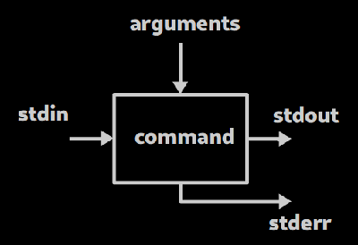
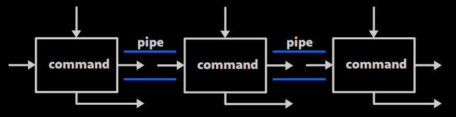

title: Shell Scripting
class: animation-fade
layout: true

---

class: impact

# Bash Scripting

### et commandes "avancées"

---

# Plan

## 9. Commandes avancées

   - 9.1 redirections et assemblages de commande
   - 9.2 pipes, et boîte à outils

## 10. Bash scripting
   - 10.0 écrire et executer des scripts
   - 10.1 les variables
   - 10.2 interactivité
   - 10.3 les fonctions
   - 10.4 les conditions 
   - 10.5 les boucles

---

class: impact

# 9. Commandes avancées

## 9.1 - Redirections, assemblages

---

# 9.1 - Redirections, assemblages

## Schema fonctionnel d'une commande

- Une commande est une boîte avec des entrées / sorties
- et un code de retour (`$?`)
   - 0 : tout s'est bien passé
   - 1 (ou toute valeur différente de 0) : problème !

.center[

]

---

# 9.1 - Redirections, assemblages

## Entrées / sorties

.center[

]

- **arguments** : donnés lors du lancement de la commande (ex: `/usr/` dans `ls /usr/`)
- **stdin** : flux d'entrée (typ. viens du clavier)
- **stdout** : flux de sortie (typ. vers le terminal)
- **stderr** : flux d'erreur (typ. vers le terminal aussi !)

---

# 9.1 - Redirections, assemblages

## Code de retour

```bash
$ ls /toto
ls: cannot access '/toto': No such file or directory
$ echo $?
2
```

---

# 9.1 - Redirections, assemblages

## Rediriger les entrées/sorties (1/3)

- `cmd > fichier` : renvoie stdout vers un fichier (le fichier sera d'abord écrasé !)
- `cmd >> fichier ` : ajoute stdout à la suite du fichier
- `cmd < fichier` : utiliser 'fichier' comme stdin pour la commande
- `cmd <<< "chaine"` : utiliser 'chaine" comme stdin pour la commande

Exemples

```bash
ls -la ~/ > tous_mes_fichiers.txt  # Sauvegarde la liste de tous les fichiers dans le home
echo "manger" >> todo.txt          # Ajoute "manger" a la liste des choses à faire
wc < "une grande phrase"           # Compte le nomde de mot d'une chaine
```

---

# 9.1 - Redirections, assemblages

## Rediriger les entrées/sorties (2/3)

- `commande 2> fichier` : renvoie stderr vers un fichier (le fichier sera d'abord écrasé !)
- `commande 2>&1` : renvoie stderr vers stdout !

Exemples :

```bash
ls /* 2> errors # Sauvegarde les erreurs dans 'errors'
ls /* 2>&1 > log # Redirige les erreurs vers stdout (la console) et stdout vers 'log'
ls /* > log 2>&1 # Redirige tout vers 'log' !
```

---

# 9.1 - Redirections, assemblages

## Rediriger les entrées/sorties (3/3)

Fichiers speciaux :
- `/dev/null` : puit sans fond (trou noir)
- `/dev/urandom` : generateur aleatoire (trou blanc)

.center[

]

---

# 9.1 - Redirections, assemblages

## Rediriger les entrées/sorties (3/3)

Fichiers speciaux :
- `/dev/null` : puit sans fond (trou noir)
- `/dev/urandom` : generateur aleatoire (trou blanc)

```bash
ls /* 2> /dev/null           # Ignore stderr
mv ./todo.txt /dev/null      # Façon originale de supprimer un fichier ! 
head -c 5 < /dev/urandom     # Affiche 5 caractères de /dev/urandom
cat /dev/urandom > /dev/null # Injecte de l'aleatoire dans le puit sans fond
```

---

# 9.1 - Redirections, assemblages

## Assembler des commandes

Executer plusieurs commandes à la suite : 

- `cmd1; cmd2` : execute `cmd1` puis `cmd2`
- `cmd1 && cmd2` : execute `cmd1` puis `cmd2` mais seulement si `cmd1` reussie !
- `cmd1 || cmd2` : execute `cmd1` puis `cmd2` mais seulement si `cmd1` a échoué
- `cmd1 && (cmd2; cmd3)` : "groupe" `cmd2` et `cmd3` ensemble

Exercice en live :

que fait `cmd1 && cmd2 || cmd3`

---

class: impact

# 9. Commandes avancées

## 9.2 - Pipes et boîte à outils

---

# 9.2 Pipes et boîte à outils

## Pipes ! (1/3)

- `cmd1 | cmd2` permet d'assembler des commandes de sorte à ce que le `stdout` de `cmd1` devienne le `stdin` de `cmd2` !

Exemple : `cat /etc/login.defs | head -n 3`

.center[

]

- (Attention, par défaut `stderr` n'est pas affecté par les pipes !)

---

# 9.2 Pipes et boîte à outils

## Pipes ! (2/3)

Lorsqu'on utilise des pipes, c'est generalement pour enchaîner des opérations comme :
- générer ou récupérer des données
- filtrer ces données
- modifier ces données à la volée

---

# 9.2 Pipes et boîte à outils

## Pipes ! (3/3)

Precisions techniques
- La transmission d'une commande à l'autre se fait "en temps réel". La première commande n'a pas besoin d'être terminée pour que la deuxieme commence à travailler.
- Si la deuxieme commande a terminée, la première *peut* être terminée prématurément (SIGPIPE).
    - C'est le cas par exemple pour `cat tres_gros_fichier | head -n 3`

---

# 9.2 Pipes et boîte à outils

## Boîte à outils : tee

`tee` permet de rediriger `stdout` vers un fichier tout en l'affichant quand meme dans la console

```bash
tree ~/documents | tee arbo_docs.txt  # Affiche et enregistre l'arborescence de ~/documents
openssl speed | tee -a tests.log      # Affiche et ajoute la sortie de openssl à la suite de tests.log
```

---

# 9.2 Pipes et boîte à outils

## Boîte à outils : grep (1/3)

`grep` permet de trouver des lignes qui contiennent un mot clef (ou plus generalement, une expression)

```bash
$ ls -l | grep r2d2
-rw-r--r--  1 alex alex        0 Oct  2 20:31 r2d2.conf
-rw-r--r--  1 r2d2 alex     1219 Jan  6  2018 zblorf.scd
```

```bash
$ cat /etc/login.defs | grep TIMEOUT
LOGIN_TIMEOUT		60
```

(on aurait aussi pu simplement faire : `grep TIMEOUT /etc/login.defs`)

---

# 9.2 Pipes et boîte à outils

## Boîte à outils : grep (2/3)

Une option utile (parmis d'autres) : `-v` permet d'inverser le filtre

```bash
$ ls -l | grep -v "alex alex"
total 158376
d---rwxr-x  2 alex droid    4096 Oct  2 15:48 droidplace
-rw-r--r--  1 r2d2 alex     1219 Jan  6  2018 zblorf.scd
```

On peut créer un "ou" avec : `r2d2\|c3p0`

```bash
$ ps -ef | grep "alex\|r2d2"
# Affiche seulement les lignes contenant alex ou r2d2
```

---

# 9.2 Pipes et boîte à outils

## Boîte à outils : grep (3/3)

On peut faire référence à des débuts ou fin de ligne avec `^` et `$` :

```bash
$ cat /etc/os-release | grep "^ID"
ID=manjaro

$ ps -ef | grep "bash$"
alex      5411   956  0 Oct02 pts/13   00:00:00 -bash
alex      5794   956  0 Oct02 pts/14   00:00:00 -bash
alex      6164   956  0 Oct02 pts/15   00:00:00 -bash
root      6222  6218  0 Oct02 pts/15   00:00:00 bash
```

---

# 9.2 Pipes et boîte à outils

## Boîte à outils : tr

`tr` ('translate') traduit des caractères d'un ensemble par des caractère d'un autre ensemble ...

```bash
$ cat /etc/os-release \
   | grep "^ID" \
   | tr '=' ' '
ID manjaro

$ echo "coucou" | tr 'a-q' 'A-Q'
COuCOu
```

---

# 9.2 Pipes et boîte à outils

## Boîte à outils : awk

`awk` est un processeur de texte assez puissant ...
- En pratique, il est souvent utilisé pour "récupérer seulement une ou plusieurs colonnes"
- Attention à la syntaxe un peu compliquée !

```bash
$ cat /etc/os-release  \
    | grep "^ID"       \
    | tr '=' ' '       \
    | awk '{print $2}' \
manjaro

$ who | awk '{print $1 " " $4}'
alex 22:10
r2d2 11:27
```

---

# 9.2 Pipes et boîte à outils

## Boîte à outils : sort

`sort` est un outil de tri :
- `-k` permet de spécifier quel colonne utiliser pour trier (par défaut : la 1ère)
- `-n` permet de trier par ordre numérique (par défaut : ordre alphabetique)

```bash
ps -ef | sort         # Trie les processus par proprietaire (1ere col)
ps -ef | sort -k2 -n  # Trie les processus par PID (2eme col., chiffres)
```

---

# 9.2 Pipes et boîte à outils

## Boîte à outils : uniq

`uniq` permet de ne garder que des occurences uniques ... ou de compter un nombre d'occurence (avec `-c`)

`uniq` s'utilise 90% du temps sur des données **déjà triées** par sort

```bash
who | awk '{print $1}' | sort | uniq                   # Affiche la liste des users loggués
who | awk '{print $1}' | sort | uniq -c                # Compte le nombre de shell par user loggué
```

---

# 9.2 Pipes et boîte à outils

## Boîte à outils : sed

`sed` est un outil de manipulation de texte très puissant ... mais sa syntaxe est complexe.

Comme premier contact : utilisation pour chercher et remplacer : `s/motif/remplacement/g`

Exemple :
```bash
ls -l | sed 's/alex/padawan/g' # Remplace toutes les occurences de alex par padawan
```

---

class: impact

# 10. Bash scripts

---

class: impact

# 10. Bash scripts

### 10.0 Écrire et executer des scripts

---

# 10.0 Écrire / executer

## Des scripts

- `bash` <small>(`/bin/bash`)</small> est un interpreteur
- Plutôt que de faire de l'interactif, on peut écrire une suite d'instruction qu'il doit executer (un script)
- Un script peut être considéré comme un type de programme, caractérisé par le fait qu'il reste de taille modeste

---

# 10.0 Écrire / executer

## Utilité des scripts bash

Ce que ça ne fait généralement **pas** :
- du calcul scientifique
- des interfaces graphiques / web
- des manipulations 'fines' d'information

Ce que ça fait plutôt bien :
- prototypage rapide
- automatisation de tâches d'administration (fichiers, commandes, ..)
- rendre des tâches parametrables ou interactives

---

# 10.0 Écrire / executer

## Ecrire un script (1/2)

```bash
#!/bin/bash

# Un commentaire
cmd1
cmd2
cmd3
...

exit 0    # (Optionnel, 0 par defaut)
```

---

# 10.0 Écrire / executer

## Ecrire un script (2/2)

```bash
#!/bin/bash

echo "Hello, world !"
echo "How are you today ?"
```

---

# 10.0 Écrire / executer

## `exit`

- `exit` permet d'interrompre le script immédiatement
- `exit 0` quitte et signale que tout s'est bien passé
- `exit 1` (ou une valeur différente de 0) quitte et signale un problème

---

# 10.0 Écrire / executer

## Executer un script (1/3)

Première façon : avec l'interpreteur `bash`

- `bash script.sh` execute `script.sh` dans un processus à part
- on annonce explicitement qu'il s'agit d'un script bash
    - dans l'absolu, pas besoin d'avoir mis `#!/bin/bash`

---

# 10.0 Écrire / executer

## Executer un script (2/3)

Deuxième façon : avec `source`

- `source script.sh` execute le script **dans** le terminal en cours
- 95% du temps, ce n'est pas `source` qu'il faut utiliser pour votre cas d'usage !
- Cas d'usage typique de `source` : recharger le `.bashrc`
- (Autre cas : `source venv/bin/activate` pour les virtualenv python)

---

# 10.0 Écrire / executer

## Executer un script (3/3)

Troisième façon : en donnant les permissions d'execution à votre script

```
chmod +x script.sh   # À faire la première fois seulement
./script.sh
```

- l'interpreteur utilisé sera implicitement celui défini après le `#!` à la première ligne
- (dans notre cas : `#!/bin/bash`)

---

# 10.0 Écrire / executer

## Parenthèse sur la variable `PATH` (1/2)

La variable d'environnement `PATH` défini où aller chercher les programmes

```bash
$ echo $PATH
/usr/local/bin:/usr/bin:/bin:/usr/local/sbin

$ which ls
/usr/bin/ls

$ which script.sh
which: no script.sh in (/usr/local/bin:/usr/bin:/bin:/usr/local/sbin
```

---

# 10.0 Écrire / executer

## Parenthèse sur la variable `PATH` (2/2)

```bash
$ ./script.sh  # Fonctionnera (si +x activé)
$ script.sh    # Ne fonctionnera a priori pas
```

Néanmoins il est possible d'ajouter des dossiers à `PATH` :

```bash
PATH="$PATH:/home/padawan/my_programs/"
```

Ensuite, vous pourrez utiliser depuis n'importe où les programmes dans `~/my_programs` !

---

# 10.0 Écrire / executer

## Résumé

- `bash script.sh` est la manière "explicite" de lancer un script bash
- `./script.sh` lance un executable (+x) via un chemin absolu ou relatif
- `source script.sh` execute le code *dans le shell en cours* !
- `script.sh` peut être utilisé seulement si le script est dans un des dossier de `PATH`

---

class: impact

# 10. Bash scripts

### 10.1 Les variables

---

# 10.1 Les variables

De manière générale, une variable est :
- un contenant pour une information
- une façon de donner un nom à cette information

Initialiser une variable en bash (attention à la syntaxe) :

```bash
PI="3.1415"
```

Utiliser une variable :

```bash
echo "Pi vaut (environ) $PI"
```

N.B. : différence contenu/contenant sans trop d'ambiguité


---

# 10.1 Les variables

On peut modifier une variable existante :

```bash
$ HOME="/home/alex"
$ HOME="/var/log"
```

... sauf si définie comme `readonly` !

```bash
$ readonly PI="2"           # ... oopsie !
$ PI="3.14"
-bash: PI: readonly variable
```

---

# 10.1 Les variables

Initialiser une variable à partir du résultat d'une autre commande

```bash
NB_DE_LIGNES=$(wc -l < /etc/login.defs)
```

Syntaxe équivalente avec des backquotes <small>(ou backticks)</small> (historique, dépréciée)

```bash
NB_DE_LIGNES=`wc -l < /etc/login.defs`
```

---

# 10.1 Les variables

On peut également initialiser une variable en composant avec d'autres variables :

```bash
MY_HOME="/home/$USER"
```

ou encore :

```bash
FICHIER="/etc/login.defs"
NB_DE_LIGNES=$(wc -l < $FICHIER)
MESSAGE="Il y a $NB_DE_LIGNES lignes dans $FICHIER"
echo "$MESSAGE"
```

---

# 10.1 Les variables

## Notes diverses (1/5)

- En bash, on manipule du texte !

```bash
$ PI="3.14"

$ NOMBRE="$PI+2"

$ echo $NOMBRE
3.14+2           # littéralement !
```

---

# 10.1 Les variables

## Notes diverses (2/5)

- Lorsqu'on utilise une variable, il faut mieux l'entourer de quotes :

```bash
$ FICHIER="document signé.pdf"

$ ls -l $FICHIER
ls: cannot access 'document': No such file or directory
ls: cannot access 'signé.pdf': No such file or directory

$ ls -l "$FICHIER"
-rw-r--r-- 1 alex alex 106814 Mar  2  2018 'document signé.pdf'
```

---

# 10.1 Les variables

## Notes diverses (3/5)

- ACHTUNG : une variable inexistante est interprétée comme une chaîne vide... !

```bash
$ NB_DE_LIGNES=42
$ echo "$NB_DE_LINGE"
                        # <<< ligne vide !
```

---

# 10.1 Les variables

## Notes diverses (3/5)

- Pour utiliser une variable sans ambiguité, il est peut être nécessaire de l'ecrire avec `${VAR}` :

```bash
$ FICHIER=/var/log/

$ cp $FICHIER $FICHIER_old
cp: missing destination file operand after 'stuff'
# (car la variable `FICHIER_old` n'existe pas !)

$ cp $FICHIER ${FICHIER}_old
# fonctionne !
```

---

# 10.1 Les variables

## Notes diverses (4/5)

- L'utilisation de 'simple quotes' permet d'éviter l'interpretation des variables :
- On peut aussi utiliser \ pour echapper un caractère :

```bash
$ echo "Mon home est $HOME"
Mon home est /home/alex

$ echo 'Mon home est $HOME'
Mon home est $HOME

$ echo "Mon home est \$HOME"
Mon home est $HOME
```

---

class: impact

# 10. Bash scripts

### 10.2 Paramétrabilité / interactivité

---

# 10.2 Paramétrabilité / interactivité

- Le comportement d'un script peut être paramétré via des options ou des données en argument
- On peut également créer de l'interactivité, c'est à dire demander des informations à l'utilisateur pendant que l'execution du programme


---

# 10.2 Paramétrabilité / interactivité

## Les paramètres

- `$0` contient le nom du script
- `$1` contient le premier argument
- `$2` contient le deuxieme argument
- et ainsi de suite ...
- `$#` contient le nombre d'arguments total 
- `$@` corresponds à "tous les arguments" (en un seul bloc)

---

# 10.2 Paramétrabilité / interactivité

```bash
#!/bin/bash

echo "Ce script s'apelle $0 et a eu $# arguments"
echo "Le premier argument est : $1"
echo "Le deuxieme argument est : $2"
```

```bash
$ ./monscript.sh coucou "les gens"
Ce script s'apelle monscript.sh et a eu 2 arguments
Le premier argument est : coucou
Le deuxieme argument est : les gens
```

---

# 10.2 Paramétrabilité / interactivité

## Interactivité

Il est possible d'attendre une entrée de l'utilisateur avec `read` :

```bash
echo -n "Comment tu t'appelles ? "
read NAME
echo "OK, bonjour $NAME !"
```

---

class: impact

# 10. Bash scripts

### 10.3 Les fonctions

---

class: impact

# 10. Bash scripts

### 10.4 Les conditions

---

class: impact

# 10. Bash scripts

### 10.5 Les boucles

---

