title: Linux administration
class: animation-fade
layout: true

---

class: impact

# Administration Linux

---

.center[

]

---

# Previously on Games of Codes

- Découverte de Linux
- La ligne de commande
- Des fichiers
- Des utilisateurs et des permissions
- Des processus
- Assembler des commandes
- Écriture de script

---

# Rappels

.center[
### Utilisez [Tab], ↑ ↓, et Ctrl+A/E !

### Soyez attentif à ce que vous tapez et à ce que la machine vous renvoie
]

---

# Cette semaine

- installer et gérer une distribution
- acquérir des bases de réseau et de sécurité
- administrer un serveur à distance
- configurer et gérer des services
- déployer un serveur web / des apps web

---

# Plan

1. Installer une distribution, gérer les partitions
2. Le gestionnaire de paquet (et les archives)
3. Notions de réseau
4. Notions de cryptographie
5. Se connecter et gérer un serveur avec SSH
6. Services et sécurité basique d'un serveur
7. Déployer un site "basique" avec nginx
8. Déployer une "vrai" app : Nextcloud ?

---

class: impact

# 1. Installer une distribution

### et gérer les partitions

---

# 1. Installer une distribution

Installons un système Linux nous-même ... et au passage, choisissons un environnement graphique (ou bien si vous ne voulez pas choisir : gardez Cinnamon)

---

# 1. Installer une distribution

## Fonctionnement de l'environnement graphique : Xorg

C'est le serveur graphique (qui commence a être remplacée par Wayland ?)

Il fonctionne en client/serveur

## Et un autre morceau : le window manager

Qui s'occupe de toute la gestion des fenêtres (bordures, décoration, redimensionnement, minimisation, vignette, ...)

---

.center[
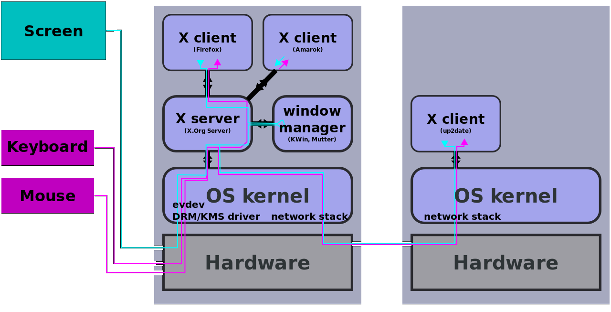
]

---

# 1. Installer une distribution

## Procédure d'installation générale

<small>(Prerequis : avoir accès au BIOS du système (et avoir de la place))</small>

- Télécharger et flasher une "Live CD/USB"
- Dire au BIOS de booter sur la "Live CD/USB"
- Lancer l'installation
    - (définir un plan de partitionnement)
- Prendre un café
- Rebooter et vérifier que ça a fonctionné

---

# 1. Installer une distribution

## Telecharger l'ISO

.center[
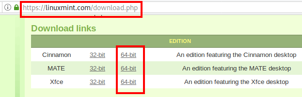
]

---

# 1. Installer une distribution

## Vérifier l'intégrité / authenticité

.center[
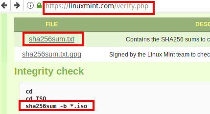
]

---

# 1. Installer une distribution

## Le BIOS

- Programme lancé par la machine à son démarrage
- Change entre les modèles de PC ...
- Gère différent aspects "bas-niveau" (e.g. horloge intégrée)
- Gère le lancement du "vrai" système d'exploitation
    - analyse typiquement le lecteur CD
    - ... puis le HDD
    - ... puis le network (PXE)
    - ...
- De nos jours, l'UEFI et Secure boot complique beaucoup les choses ...

---

# 1. Installer une distribution

## Le BIOS

.center[
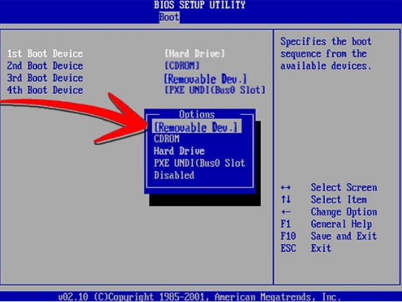
]

---

# 1. Installer une distribution

## Live CD/USB

- Un système généralement "éphémère" (données perdues)
- Typiquement sur un CD rom ou une clef USB
- Système entièrement chargé dans la RAM (performances moindres)
- Destiné à tester / faire une démo du système et à l'installer
- Permet aussi d'avoir accès à certains outils
- Généralement sous forme d'un fichier `.iso`

---

.center[

]

---

# 1. Installer une distribution

## Lancer l'installation

.center[

]

---

# 1. Installer une distribution

## Lancer l'installation

.center[
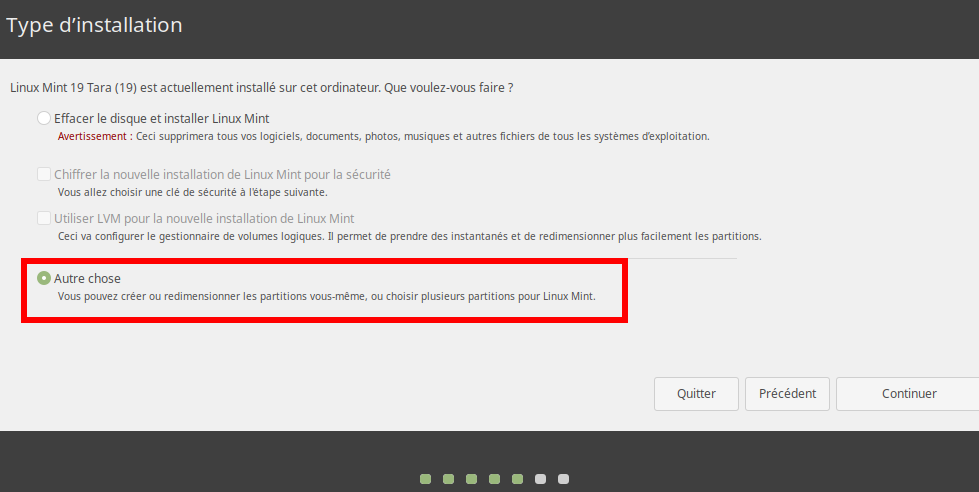
]

---

# 1. Installer une distribution

## Plan de partitionnement

Exemple :
- 300 Mo pour `/boot/` en ext4
- 12 Go pour `/` en ext4
- 3 Go pour `/home/` en ext4
- Le reste en swap
    - le swap, c'est une extension "lente" de la RAM

.center[
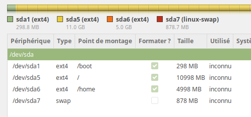
]

---

# 1. Installer une distribution

## Lancer l'installation "pour de vrai"

- Répondre aux questions pour créer l'utilisateur, etc...
- ... le système s'installe ...

---

# 1. Installer une distribution

## Finir l'installation

- Redémarrer
- (Enlever le média d'installation)
- (Dire au BIOS de booter de nouveau sur le HDD)

---

# 1. Installer une distribution

## GRUB

.center[
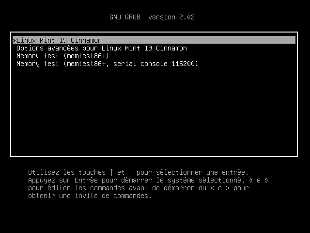
]

---

# 1. Installer une distribution

## GRUB

.center[
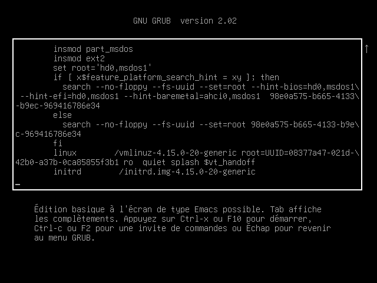
]


---

# 1. Installer une distribution

## Résumé du boot complet (du Bios à l'interface de login)

.center[

]

---

# 1. Installer une distribution

## Log du boot

- Les logs du boot du kernel (contient aussi par ex. le log de la détection de dispositif USB branchés après le boot, etc...)
peuvent être trouvés dans `/var/log/dmesg`

---

# 1. Installer une distribution

## Init levels (SysVinit)

- 0 = Shutdown
- 1 = Single-user mode : Mode for administrative tasks
- 2 = Multi-user mode, without network interfaces
- 3 = Multi-user mode with networking
- 4 = ... not used ...
- 5 = Multi-user with networking and graphical environment
- 6 = Reboot

## Mais aujourd'hui : c'est différent avec systemd...

---

# 1. Installer une distribution

## Login

.center[
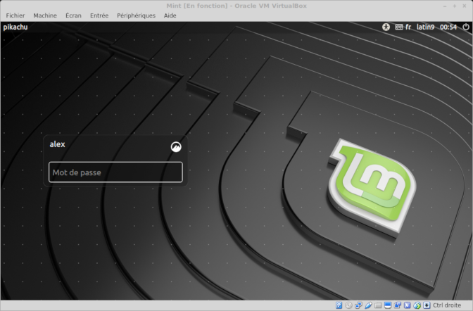
]

---

# 1. Installer une distribution

## Le bureau

.center[
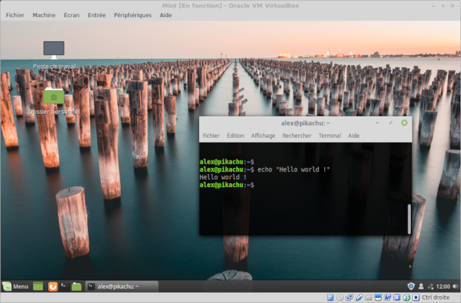
]

---

# 1. Installer une distribution

## Notation des patitions

.center[
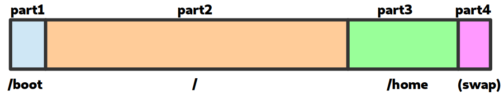
]

---

# 1. Installer une distribution

## Notation des patitions

Les disques partitions sous Linux sont généralement dénommées :

- `/dev/sda` (premier disque)
   - `/dev/sda1` (première partition de /dev/sda)
   - `/dev/sda2` (deuxieme partition de /dev/sda)
- `/dev/sdb` (deuxieme disque)
   - `/dev/sdb1` (première partition de /dev/sdb)
   - `/dev/sdb2` (deuxieme partition de /dev/sdb)
   - `/dev/sdb3` (troisieme partition de /dev/sdb)

---

# 1. Installer une distribution

## Outil pour lister les disques, gérer les partions

```bash
$ fdisk -l
Disk /dev/sda: 29.8 GiB, 32017047552 bytes, 62533296 sectors
[...]
Device       Start      End  Sectors  Size Type
/dev/sda1     2048  2099199  2097152    1G Linux filesystem
/dev/sda2  2099200 62524946 60425747 28.8G Linux filesystem
```

---

# 1. Installer une distribution

## Les points de montage

Une partition ou n'importe quel "bidule de stockage" peut être "monté" dans le système de fichier
- partition
- clef usb
- image iso
- stockage distant
- ...

---

# 1. Installer une distribution

## Les points de montage

.center[

]


---

# 1. Installer une distribution

## Les points de montage

Les points de montages sont gérés avec `mount`

```bash
$ mkdir /media/usbkey
$ mount /dev/sdb1 /media/usbkey
$ ls /media/usbkey
# [le contenu de la clef usb s'affiche]
```

---

# 1. Installer une distribution

## Les points de montage

On peut "démonter" un element monté avec `umount`

```bash
$ umount /media/usbkey
```

---

# 1. Installer une distribution

## Les points de montage : `/etc/fstab`

`/etc/fstab` décrit les systèmes de fichier montés automatiquement au boot

```text
# <file system>     <mountpoint> <type>  <options>       <dump>  <pass>
UUID=[id tres long] /            ext4    default         0       1
UUID=[id tres long] /home/       ext4    defaults        0       2
```

<small>(historiquement, la premiere colomne contenait `/dev/sdxY`, mais les UUID sont plus robustes)</small>

---

# 1. Installer une distribution

## Les points de montage : outils

Juste `mount` permet aussi de lister les différents points de montage

```bash
$ mount
[...]
/dev/sda1 on /boot type ext4 (rw,noatime,discard,data=ordered)
/dev/sda2 on / type ext4 (rw,noatime,discard,data=ordered)
```

---

# 1. Installer une distribution

## Les points de montage : outils

Il existe aussi `df` :

```bash
$ df -h
Filesystem      Size  Used Avail Use% Mounted on
dev             2.8G     0  2.8G   0% /dev
run             2.8G  1.1M  2.8G   1% /run
/dev/dm-0        29G   22G  5.0G  82% /
tmpfs           2.8G   22M  2.8G   1% /dev/shm
tmpfs           2.8G     0  2.8G   0% /sys/fs/cgroup
tmpfs           2.8G  1.9M  2.8G   1% /tmp
/dev/sda1       976M  105M  804M  12% /boot
tmpfs           567M   16K  567M   1% /run/user/1000
```

---

# 1. Installer une distribution

## Les points de montage : outils

Et aussi `lsblk` :

```bash
$ lsblk
NAME          MAJ:MIN RM  SIZE RO TYPE  MOUNTPOINT
sda             8:0    0 29.8G  0 disk
├─sda1          8:1    0    1G  0 part  /boot
└─sda2          8:2    0 28.8G  0 part  /
```

---

class: impact

# 2. Le gestionnaire de paquet

### (et les archives)

---

# 2. Le gestionnaire de paquet

## Motivation

Historiquement, c'est très compliqué d'installer un programme :
- le télécharger et le compiler
- la compilation (ou le programme lui-même) requiert des dependances
- il faut télécharger et compiler les dépendances
- qui requiert elles-mêmes des dépendances ...

### Paquet =~ programmes ou librairies

---

# 2. Le gestionnaire de paquet

## Le travail d'une distribution <small>(entre autre)</small>

- créer et maintenir un ensemble de paquet cohérents
- ... et le gestionnaire de paquet qui va avec
- les (pre)compiler pour fournir des binaires

---

# 2. Le gestionnaire de paquet

## Le gestionnaire de paquet c'est :

- La "clef de voute" d'une distribution ?
- un **système unifié pour installer** des paquets ...
- ... **et les mettre à jour !**
- le tout en gérant les dépendances et les conflits
- et via une commaunauté qui s'assure que les logiciels ne font pas n'importe quoi.

---

# 2. Le gestionnaire de paquet

## Comparaison avec Windows

Sous Windows
- téléchargement d'un .exe par l'utilisateur ...
- ... depuis une source obscure ! (**critical security risk !**)
- procédure d'installation spécifique
- ... qui tente de vous refiler des toolbar bloated, et/ou des CGU obscures
- système de mise à jour spécifique
- nécessité d'installer manuellement des dépendances

---

# 2. Le gestionnaire de paquet

.center[
*One package to rule them all*

*One package to find them*

*One package to download them all*

*and on the system bind them*

*In the land of GNU/Debian where the penguin lie*
]

---

# 2. Le gestionnaire de paquet

## Sous Debian

`apt` : couche "haut niveau"
- dépot,
- authentification,
- ...

`dpkg` : couche "bas niveau"
- gestion des dépendances,
- installation du paquet (`.deb`),
- ...

---

# 2. Le gestionnaire de paquet

## Parenthèse sur `apt-get`

- Historiquement, `apt-get` (et `apt-cache`, `apt-mark`, ..) étaientt utilisés
- Syntaxe inutilement complexe ?
- `apt` fourni une meilleur interface (UI et UX)

---

# 2. Le gestionnaire de paquet

## Utilisation de `apt`

- `apt install <package>`
    - télécharge et installe le paquet et tout son arbre de dépendances
- `apt remove <package>`
    - désinstaller le paquet (et les paquet dont il dépends !)
- `apt autoremove`
    - supprime les paquets qui ne sont plus nécessaires

---

# 2. Le gestionnaire de paquet

## Mais qu'est-ce que c'est, un paquet ?

Un programme, et des fichiers (dossier `debian/`) qui décrivent le paquet :
- `control` : décrit le paquet et ses dépendances
- `install` : liste des fichiers et leur destination
- `changelog` : un historique de l'evolution du paquet
- `rules` : des trucs techniques pour compiler le paquet
- `postinst`, `prerm`, ... : des scripts lancés quand le paquet est installé, désinstallé, ...

---

# 2. Le gestionnaire de paquet

## Mettre à jour les paquets

- `apt update`
   - récupère la liste des paquets depuis les dépots
- `apt full-upgrade`
   - calcule et lance la mise à jour de tous les paquets
   - (anciennement appelé : `apt dist-upgrade`)
- Moins utilisé : `apt upgrade`
   - mise à jour "safe", sans installer/supprimer de nouveaux paquets
   - en général, `full-upgrade` est okay

---

# 2. Le gestionnaire de paquet

N.B. : pour les moldus dans la vraie vie, il y a des interfaces graphiques pour gérer tout ça sans ligne de commande, mais ici on présente les détails techniques

---

# 2. Le gestionnaire de paquet

## Les dépots

Les dépots de paquets sont configurés via `/etc/apt/sources.list` et les fichiers du dossier `/etc/apt/sources.list.d/`.

Exemple :
```
deb http://ftp.debian.fr/debian/ stretch main contrib
```

- `stretch` est le nom de la distribution
- `main` et `contrib` sont des composantes à utiliser
- le protocole est `http` ... l'authenticité des paquets est géré par un autre mécanisme (GPG)

---

# 2. Le gestionnaire de paquet

## Les versions de Debian

Debian vise un système libre et très stable

- `stable` : paquets éprouvés et très stable (bien que souvent un peu vieux)
- `testing` : paquets en cours de test, comportant encore quelques bugs
- `unstable` (sid) : pour les gens qui aiment vivre dangereusement

Les versions tournent tous les ~2 ans environ
- l'ancienne `testing` devient la nouvelle `stable`
- le passage de version peut être un peu douloureux ...

---

# 2. Le gestionnaire de paquet

## Les versions de Debian

Basé sur les personnages de Toy Story

- 7, `wheezy` (oldoldoldstable)
- 8, `jessie` (oldoldstable)
- 9, `stretch` (oldstable, depuis juillet 2019)
- 10, `buster` (stable, depuis juillet 2019)
- 11, `bullseye` (testing, deviendra stable vers juin 2021)
- 12, `bookworm`

---

# 2. Le gestionnaire de paquet

.center[
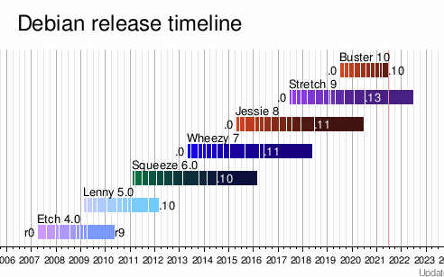
]

---

# 2. Le gestionnaire de paquet

## Naviguez dans les paquets debian en ligne

`https://packages.debian.org/search`

.center[
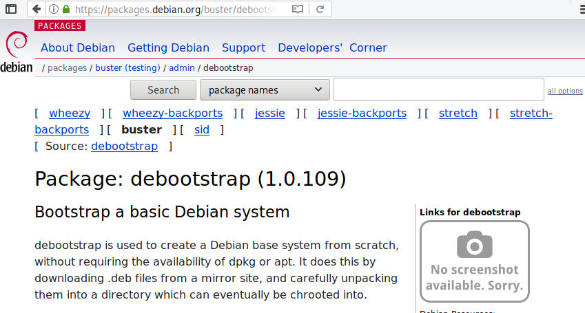
]

---

# 2. Le gestionnaire de paquet

## Les backports

- Un intermédiaire entre stabilité et nouveauté
- Fournissent des paquets venant de `testing` en `stable`
- À utiliser avec prudence

---

# 2. Le gestionnaire de paquet

## Gérer des archives

`tar` (tape archive) permet de créer des archives (non compressées) qui rassemblent des fichiers.

```bash
# Créer une archive monarchive.tar
tar -cvf monarchive.tar file1 file2 folder2/ folder2/

# Désassembler une archive
tar -xvf monarchive.tar
```

---

# 2. Le gestionnaire de paquet

## Gérer des archives

`gzip` (gunzip) permet de compresser des fichiers (similaire aux .zip, .rar, ...)

```bash
# Compresser zblorf.scd
gzip zblorf.scd

# [...] le fichier a été compressé et renommé zblorf.scd.gz

# Decompresser le fichier :
gzip -d zblorf.scd.gz
```

---

# 2. Le gestionnaire de paquet

## Gérer des archives

`tar` peut en fait être invoqué avec `-z` pour générer une archive compressée

```bash
# Créer une archive compressée
tar -cvzf monarchive.tar.gz file1 file2 folder2/ folder2/

# Désassembler une archive
tar -xvzf monarchive.tar.gz
```

---

# 2. Le gestionnaire de paquet

## Gérer des archives

.center[

]


---

class: impact

# 3. Notions de réseau

---

# 3. Notions de réseau

## "Réseau"

Tout ce qui permet la communication entre les machines (et les programmes)

---

# 3. Notions de réseau

## Objectifs

- Comprendre et savoir se représenter les différentes couches
- Savoir faire quelques des tests "de base"
- ... et les commandes associées

---

# 3. Notions de réseau

- DNS : domaine, résolution, ...
- Protocoles, HTTP, modèle client/serveur
- TCP : ports, NAT
- IP : adresses, routage, DHCP
- Physique : interfaces réseau

---

.center[
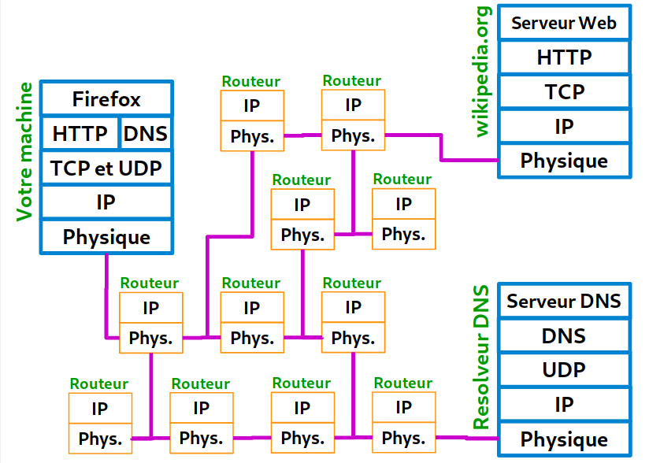
]

---

# 3. Notions de réseau

## Couche physique (1/2)

- Ethernet, wifi, 4G, ...
- Votre ordinateur dispose d'**interface réseau**
- Elles permettent de communiquer sur un support (cable, onde)
- Chaque interface réseau possède une **adresse MAC**
- Il existe typiquement une interface `lo` (loopback, la boucle locale - 127.0.0.1)

---

# 3. Notions de réseau

## Couche physique (2/2)

- `ip a` permet d'obtenir des informations sur les interfaces
- Historiquement, les noms étaient "simple" : eth0, wlan0, ...
- Aujourd'hui les noms sont un peu plus complexes / arbitraires

```bash
$ ip a
1: lo: <LOOPBACK,UP,LOWER_UP>
    link/loopback 00:00:00:00:00:00 brd 00:00:00:00:00:00
2: enp0s25: <NO-CARRIER,BROADCAST,MULTICAST,UP>
    link/ether 33:0e:d8:3f:65:7e
3: wlp3s0: <BROADCAST,MULTICAST,UP,LOWER_UP>
    link/ether 68:a6:2d:9f:ad:07
```

---

# 3. Notions de réseau

## IP : Internet Protocol (1/2)

- IP fait parler **des machines** !
- Protocole de routage des paquets
- "Best-effort", non fiable !
- Les routeurs discutent entre eux pour optimiser l'acheminement
- Les adresses sont comme des numéros de telephone, ou des positions GPS
   - IPv4, par exemple 92.93.127.10   (4.3 milliards d'adresse)
   - IPv6, par exemple 2a04:7260:9088:6c00::1 (10^38 addresses)

---

# 3. Notions de réseau

## IP : Internet Protocol (2/2)

```bash
$ ip a
enp3s0: <BROADCAST,MULTICAST,UP,LOWER_UP>
 link/ether 40:8d:5c:f3:3e:35
 inet 91.225.41.29/32 scope global enp3s0
 inet6 2a04:7202:8008:60c0::1/56 scope global
```

Voir aussi : `ifconfig` (deprecated) et `ipconfig` (sous windows!)

---

# 3. Notions de réseau

## IP : `ping` teste la connexion entre deux machines

```bash
$ ping 91.198.174.192
PING 91.198.174.192 (91.198.174.192) 56(84) bytes of data.
64 bytes from 91.198.174.192: icmp_seq=1 ttl=58 time=51.5 ms
64 bytes from 91.198.174.192: icmp_seq=2 ttl=58 time=65.3 ms
^C
--- 91.198.174.192 ping statistics ---
2 packets transmitted, 2 received, 0% packet loss, time 3ms
rtt min/avg/max/mdev = 51.475/58.394/65.313/6.919 ms
```

---

# 3. Notions de réseau

## IP : `whois` pour obtenir des infos sur le(s) proprio(s) d'une ip

```
$ whois 91.198.174.192
[...]
organisation:   ORG-WFI2-RIPE
org-name:       Wikimedia Foundation, Inc
[...]
mnt-by:         RIPE-NCC-HM-MNT
mnt-by:         WIKIMEDIA-MNT
```

---

# 3. Notions de réseau

## IP : `traceroute` permet d'étudier la route prise par les paquets

```bash
$ traceroute 91.198.174.192
 1  _gateway (192.168.0.1)  4.212 ms  6.449 ms  6.482 ms
 2  * 10.13.25.1 (10.13.25.1)  248.615 ms *
 3  211-282-253-24.rev.numericable.fr (211.282.253.24)  251.263 ms  251.332 ms  251.408 ms
 4  172.19.132.146 (172.19.132.146)  251.493 ms ip-65.net-80-236-3.static.numericable.fr (80.236.3.65)  251.569 ms  251.619 ms
 5  prs-b7-link.telia.net (62.115.55.45)  251.692 ms  251.769 ms  251.979 ms
 6  prs-bb4-link.telia.net (62.115.120.30)  252.026 ms prs-bb3-link.telia.net (62.115.121.96)  17.989 ms prs-bb4-link.telia.net (213.155.134.228)  1069.536 ms
 7  adm-bb4-link.telia.net (213.155.136.167)  1070.116 ms  1242.772 ms adm-bb3-link.telia.net (213.155.136.20)  1242.839 ms
 8  adm-b3-link.telia.net (62.115.122.179)  1243.006 ms adm-b3-link.telia.net (62.115.122.191)  1242.879 ms  1243.082 ms
[...]
```

---

# 3. Notions de réseau

## TCP : Transmission Control Protocol (1/2)

- TCP fait communiquer **des programmes**
- Découpage des messages en petits paquets pour IP
- Fiabilité avec des accusés de réception / renvois

---

# 3. Notions de réseau

## TCP : Transmission Control Protocol (2/2)

- TCP fourni un "tuyau de communication" entre deux programmes
- Notion de 'port'
- Analogie avec les différents "departement" à l'intérieur d'une entreprise
- Par exemple : votre navigateur web (port 56723) qui discute qui discute avec le serveur web (port 80)
    - côté A : 183.92.18.6:56723 (un navigateur web)
    - côté B : 91.198.174.192:80 (un serveur web)

---

# 3. Notions de réseau

## TCP : `lsof -i` pour lister les connexions active

```bash
$ lsof -i
ssh        3231 alex IPv4 shadow.local:34658->142.114.82.73.rev.sfr.net:ssh (ESTABLISHED)
thunderbi  3475 alex IPv4 shadow.local:59424->tic.mailoo.org:imap (ESTABLISHED)
thunderbi  3475 alex IPv4 shadow.local:57312->tic.mailoo.org:imap (ESTABLISHED)
waterfox  12193 alex IPv4 shadow.local:54606->cybre.space:https (ESTABLISHED)
waterfox  12193 alex IPv4 shadow.local:32580->cybre.space:https (ESTABLISHED)
```

---

# 3. Notions de réseau

## TCP : `nc -zv` pour tester si un port est ouvert

ACHTUNG : ne pas abuser de cela..

```bash
$ nc -zv 44.112.42.13 22
Connection to 44.112.42.13 22 port [tcp/ssh] succeeded!
```

nc -zv ynh-forge.netlib.re 53
---

# 3. Notions de réseau

## TCP : `tcpdump` pour regarder l'activité sur le réseau

---

# 3. Notions de réseau

## TCP : et aussi : `wireshark`

---

# 3. Notions de réseau

## Modèle client/serveur

Un serveur (au sens logiciel) est un programme. Comme un serveur dans un bar (!) :
- il **écoute** et attends qu'on lui demande un service
- par exemple : fournir la page d'acceuil d'un site
- le serveur écoute sur *un port*  : par exemple : 80

Le client est celui qui demande le service
- il toque à la porte
- transmet sa demande
- le serveur lui réponds (on espère)

---

# 3. Notions de réseau

## Modèle client/serveur : `netstat`

`netstat -tulpn` permet de lister les programmes qui écoutent et attendent

```bash
 > netstat -tulpn | grep LISTEN | grep "80\|25"
tcp     0.0.0.0:80  LISTEN      28634/nginx: master
tcp     0.0.0.0:25  LISTEN      1331/master
tcp6    :::80       LISTEN      28634/nginx: master
tcp6    :::25       LISTEN      1331/master
```

---

# 3. Notions de réseau

## Protocoles (1/2)

- Un protocole = une façon de discuter entre programmes
- Conçus pour une finalité particulière
- Ont généralement un port "par défaut" / conventionnel
   - 80/http : le web (des "vitrines" pour montrer et naviguer dans du contenu)
   - 443/https : le web (mais en chiffré)
   - 25/smtp : le mail (pour relayer les courriers électroniques)
   - 993/imap : le mail (synchroniser des boites de receptions)
   - 587/smtps : le mail (soumettre un courrier à envoyer)
   - 22/ssh : lancer des commandes à distance
   - 53/dns : transformer des noms en ip
   - 5222/xmpp : messagerie instantannée
   - 6667/irc : salons de chat

---

# 3. Notions de réseau

## Protocoles (2/2)

Par exemple, HTTP :
- On envoie `GET /` et on reçoit 200 + la page d'acceuil
- On envoie `GET /chaton.jpg` et on reçoit 200 + une image (si elle existe)
- On envoie `GET /meaningoflife.txt` et on reçoit 404 (si la page n'existe pas)
- On peut ajouter des Headers aux requetes (c.f. debugger firefox)
- Il existe d'autres requetes : POST, PUT, DELETE, ...

---

# 3. Notions de réseau

## DNS : Domain name server (1/5)

- Retenir cinquante numéros de telephone (ou coordonées GPS) par coeur, c'est pas facile
- On invente l'annuaire et les adresses postales
- `wikipedia.org -> 91.198.174.192`
- On peut acheter des noms chez des *registrars* (OVH, Gandi, ...)
- Composant critique d'Internet (en terme fonctionnel)

---

# 3. Notions de réseau

## DNS : Domain name server (2/5)

- Il existe des résolveurs DNS à qui on peut demander de résoudre un nom via le protocole DNS (port 53)
- Par exemple :
    - 8.8.8.8, le resolveur de Google
    - 9.9.9.9, un nouveau service qui "respecte la vie privée"
    - 89.234.141.66, le resolveur de ARN
    - 208.67.222.222, OpenDNS

- **Choix critique pour la vie privée !!**
- Generalement, vous utilisez (malgré vous) le resolveur de votre FAI, ou bien celui de Google

---

# 3. Notions de réseau

## DNS : Domain name server (3/5)

- Sous Linux, le resolveur DNS se configure via un fichier `/etc/resolv.conf`

```bash
$ cat /etc/resolv.conf
nameserver 89.234.141.66
```

---

# 3. Notions de réseau

## DNS : Domain name server (4/5)

`ping` fonctionne aussi avec noms de domaine

`host` permet sinon de connaître l'ip associée

```bash
$ host wikipedia.org
wikipedia.org has address 91.198.174.192
wikipedia.org has IPv6 address 2620:0:862:ed1a::1
wikipedia.org mail is handled by 50 mx2001.wikimedia.org.
wikipedia.org mail is handled by 10 mx1001.wikimedia.org.
```

---

# 3. Notions de réseau

## DNS : Domain name server (5/5)

- On peut outrepasser / forcer la résolution DNS de certains domaine avec le fichier `/etc/hosts`

```bash
 > cat /etc/hosts
127.0.0.1	localhost
127.0.1.1	shadow
::1	localhost ip6-localhost ip6-loopback
ff02::1 ip6-allnodes
ff02::2 ip6-allrouters

127.0.0.1 google.com
127.0.0.1 google.fr
127.0.0.1 www.google.com
127.0.0.1 www.google.fr
127.0.0.1 facebook.com
127.0.0.1 facebook.fr
```

---

.center[

]

---

.center[
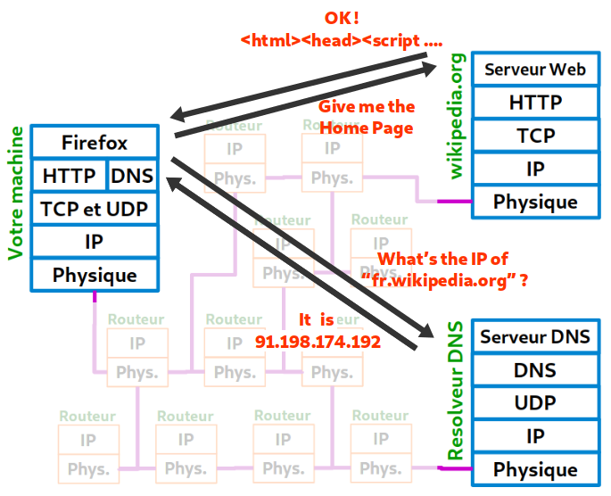
]

---

.center[

]

---

# 3. Notions de réseau

## Réseau local et NAT (1/6)

- En pratique, on est peu souvent "directement" connecté à internet
    - MachinBox
    - Routeur de l'entreprise
- Pas assez d'IPv4 pour tout le monde
    - nécessité de sous-réseaux "domestique" / des réseau "local"
    - basé sur les NAT
    - typiquement avec des IP en 192.168.x.y ou 10.0.x.y

---

.center[
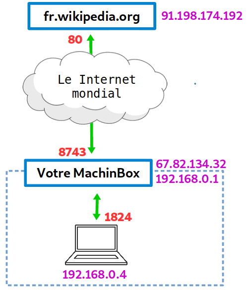
]

---

.center[
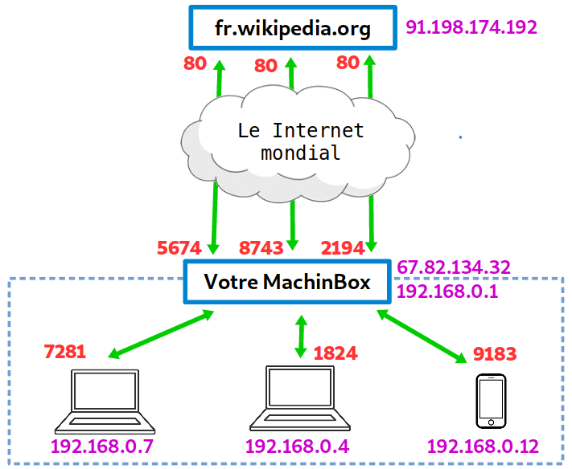
]

---

# 3. Notions de réseau

## Réseau local et NAT (4/6)

- C'est le routeur qui m'attribue une IP via le DHCP
- Le routeur agit comme "gateway" (la "passerelle" vers les internets)
    - (c.f. `ip route`, et la route par défaut)
- Depuis l'extérieur du réseau local, il n'est pas possible de parler "simplement" à une machine
- Example : Je ne peux apriori pas parler à la machine 192.168.0.12 de mon réseau local chez moi depuis le centre de formation...
- Egalement : Difficulté de connaître sa vraie IP "globale" ! Il faut forcément demander à une autre machine ... c.f whatsmyip.com

---

# 3. Notions de réseau

## Réseau local et NAT (5/6)

La situation se complexifie avec Virtualbox :
- Typiquement Virtualbox créé un NAT à l'intérieur de votre machine
- Les différentes VM ont alors des adresses en 10.0.x.y

---

.center[
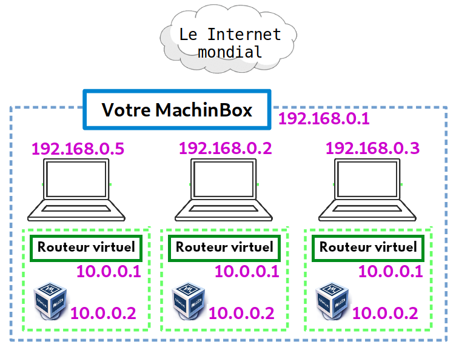
]

---

class: impact

# 4. Notions de cryptographie

---

# 4. Notions de cryptographie

## Principe, vocabulaire

Protéger des messages (confidentialité, authenticité, intégrité) en s’aidant souvent de secrets ou clés.

- Confidentialité : seul l'expéditeur et le destinaire ont accès au message
- Authenticité : le message reçu par le destinaire provient bien de l'expéditeur
- Intégrité : le message reçu est complet et n'a pas été déformé

---

# 4. Notions de cryptographie

## Exemple de chiffrement symétrique

Historique : le nombre de César
- un algoritme : décalage des lettres dans l'alphabet
- un secret / une clef (par exemple : 3)
- pour déchiffrer : opération inverse triviale

```text
Linux c'est sympatoche
Olqxa f'hvw vbpsdwrfkh
```

---

# 4. Notions de cryptographie

## Chiffrement asymétrique

Pas d'équivalent classique ...
- imaginer un sorte de nombre de César où l'on chiffre en décalant de 3 ...
- ... mais pour déchiffrer, il faut faire -12 !

---

# 4. Notions de cryptographie

## Chiffrement asymétrique

Les mathématiques permettent de générer un couple de clef (A, B) :
- `chiffrer(message, A)` peut être déchiffré uniquement avec `B`
- `chiffrer(message, B)` peut être déchiffŕe uniquement avec `A`

---

# 4. Notions de cryptographie

## Chiffrement asymétrique

- On nomme une clef la clef **privée** : on la garde secrètement rien que pour nous
- On nomme l'autre la clef **publique** : on la donne à tout le monde
- Si quelqu'un cherche à vous envoyer un message, ils chiffrent en utilisant votre clef publique
- Vous seul avez la clef privée et pouvez déchiffrer.

---

.center[
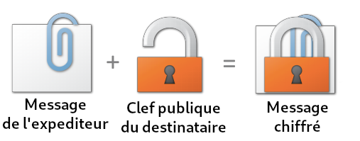
]

---

.center[
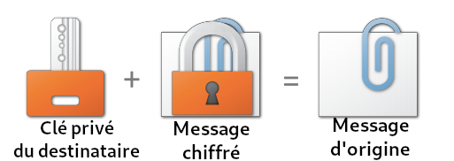
]

---

# 4. Notions de cryptographie

## Chiffrement asymétrique

- Le chiffrement asymétrique assure la confidentialité et l'integrité
- Mais pas l'authenticité !
- Besoin d'un mécanisme de "signature"

---

.center[
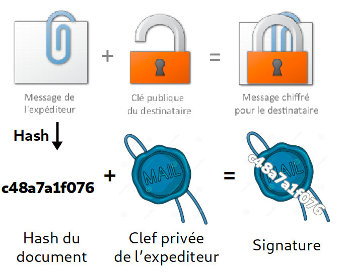
]

---

.center[
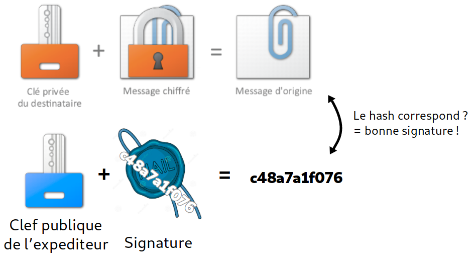
]

---

# 4. Notions de cryptographie

## Echange de clef

- Vous recevez un mail de Edward Snowden avec sa clef publique en copie
- Comment s'assurer que c'est la vraie bonne clef ?
- (Spoiler alert : vous ne pouvez apriori pas...)

Problème général de sécurité : il est difficile de s'assurer de l'authenticité initiale de la clef publique

---

# 4. Notions de cryptographie

## Solution 1 : la vraie vie

Voir Edward Snowden en chair et en os, et récupérer la clef avec lui

---

# 4. Notions de cryptographie

## Solution 2 : web of trust

La clef de Edward Snowden a été signé par pleins de journalistes et activitstes indépendant à travers le monde, ce qui diminue le risque d'une falsification

---

# 4. Notions de cryptographie

## Solution 3 : autorités de certification

Vous faites confiance à Microsoft et Google (!?), qui certifient avoir vérifié que E. Snowden possède cette clef.

- C'est le principe des autorités de certification utilisé par HTTPS
- Votre navigateur fait confiance à des clefs prédéfinies correspondant à des tiers de "confiance" (e.g. Google, ...)
- Le certificat HTTPS contient une signature qui a été produite avec l'une des clefs de ces tiers de confiance
- Vous pouvez ainsi faire confiance "par délégation"

---

class: impact

# 5. Se connecter et gérer un serveur avec SSH

---

# 5. SSH et les serveurs

## À propos des serveurs

Serveur (au sens matériel)
- machine destinée à fournir des services (e.g. un site web)
- allumée et connectée 24/7
- typiquement sans interface graphique
- ... et donc administrée à distance

---

# 5. SSH et les serveurs

## À propos des serveurs

Serveur (au sens logiciel)
- aussi appelé "daemon", ou service
- programme qui écoute en permanence et attends qu'un autre programme le contacte
    - par ex. : un serveur web attends des clients
- écoute typiquement sur un ou plusieurs port
    - par ex. : 80 pour HTTP

---

# 5. SSH et les serveurs

## Serveurs : quel support matériel ?

.center[

]

---

# 5. SSH et les serveurs

## Serveurs : quel support matériel ?

.center[

]


---

# 5. SSH et les serveurs

.center[

]

---

## ... Plot twist !

.center[

]

---

# 5. SSH et les serveurs

## "Virtual" Private Server (VPS)

VPS = une VM dans un datacenter

.center[

]

---

# 5. SSH et les serveurs

## "Virtual" Private Server (VPS)

... qui tourne quelque part sur une vraie machine

.center[

]

---

# 5. SSH et les serveurs

.center[

]

---

# 5. SSH et les serveurs

.center[
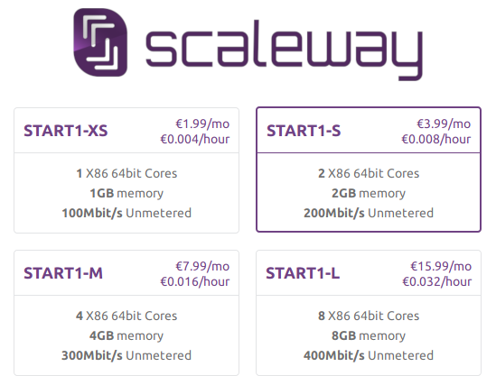
]

---

# 5. SSH et les serveurs

## SSH : Secure Shell

- Un protocole **client-serveur**, par défaut sur le port 22
- Prendre le contrôle d'une machine à distance via un shell
- Sécurisé grâce à du chiffrement asymétrique
    - le serveur a un jeu de clef publique/privé
    - le client peut aussi en avoir un (sinon : mot de passe)
- Outil "de base" pour administrer des serveurs

---

# 5. SSH et les serveurs

## Syntaxe : `ssh utilisateur@machine`

```bash
$ ssh admin@ynh-forge.netlib.re
The authenticity of host 'ynh-forge.netlib.re (46.101.221.117)' can't be established.
RSA key fingerprint is SHA256:CuPd7AtmqS0UE6DwDDG68hQ+qIT2tQqZqm8pfo2oBE8.
Are you sure you want to continue connecting (yes/no)? █
```

---

# 5. SSH et les serveurs

## Syntaxe : `ssh utilisateur@machine`


```bash
$ ssh admin@ynh-forge.netlib.re
The authenticity of host 'ynh-forge.netlib.re (46.101.221.117)' can't be established.
RSA key fingerprint is SHA256:CuPd7AtmqS0UE6DwDDG68hQ+qIT2tQqZqm8pfo2oBE8.
Are you sure you want to continue connecting (yes/no)? yes
Warning: Permanently added 'ynh-forge.netlib.re' (RSA) to the list of known hosts.
Debian GNU/Linux 9
admin@ynh-forge.netlib.re's password: █
```

---

# 5. SSH et les serveurs

## Syntaxe : `ssh utilisateur@machine`


```bash
$ ssh admin@ynh-forge.netlib.re
The authenticity of host 'ynh-forge.netlib.re (46.101.221.117)' can't be established.
RSA key fingerprint is SHA256:CuPd7AtmqS0UE6DwDDG68hQ+qIT2tQqZqm8pfo2oBE8.
Are you sure you want to continue connecting (yes/no)? yes
Warning: Permanently added 'ynh-forge.netlib.re' (RSA) to the list of known hosts.
Debian GNU/Linux 9
admin@ynh-forge.netlib.re's password:

Last login: Thu Oct  4 08:52:07 2018 from 90.63.229.46
admin@ynh-forge:~$ █
```

---

# 5. SSH et les serveurs

## SSH : se logguer

- ACHTUNG : Soyez attentif à dans quel terminal vous tapez !!!
- En se connectant la première fois, on vérifie la clef publique du serveur
- On a besoin du mot de passe pour se connecter
- ... mais la bonne pratique est d'utiliser nous-aussi une clef

---

# 5. SSH et les serveurs

## SSH : avec une clef

... mais pourquoi ?

- Pas de mot de passe qui se balade sur le réseau
- Pas nécessaire de retaper le mot de passe à chaque fois
- Possibilité d'automatiser des tâches (clef sans mot de passe)
- (Plusieurs personnes peuvent avoir accès à un meme utilisateur sans devoir se mettre d'accord sur un mot de passe commun)

---

# 5. SSH et les serveurs

## SSH : avec une clef

1 - Générer avec `ssh-keygen -t rsa -b 4096 -C "commentaire ou description"`

```bash
$ ssh-keygen -t rsa -b 4096 -C "Clef pour la formation"
```

---

# 5. SSH et les serveurs

## SSH : avec une clef

1 - Générer avec `ssh-keygen -t rsa -b 4096 -C "commentaire ou description"`

```bash
$ ssh-keygen -t rsa -b 4096 -C "Clef pour la formation"
Generating public/private rsa key pair.
Enter file in which to save the key (/home/alex/.ssh/id_rsa):
Enter passphrase (empty for no passphrase):   # Mot de passe
Enter same passphrase again:                  # (again)
Your identification has been saved in /home/alex/.ssh/id_rsa.
Your public key has been saved in /home/alex/.ssh/id_rsa.pub.
The key fingerprint is:
SHA256:ZcAKHVtTXUPz3ipqia4i+soRHZQ4tYsDGfc5ieEGWcY "Clef pour la formation"
```

---

# 5. SSH et les serveurs

## SSH : avec une clef

2 - Configurer la clef sur le serveur

- soit *depuis le client* avec

```
ssh-copy-id -i chemin/vers/la/clef user@machine
```

- soit *depuis le serveur* en rajoutant la clef dans `~/.ssh/authorized_keys`
    - (generalement, l'admin vous demande votre clef)

---

# 5. SSH et les serveurs

## SSH : avec une clef

3 - Utiliser la clef pour se connecter

```bash
$ ssh -i ~/.ssh/ma_clef alex@jaimelecafe.com
Enter passphrase for key '/home/alex/.ssh/ma_clef': █
```

---

# 5. SSH et les serveurs

## SSH : avec une clef

3 - Utiliser la clef pour se connecter

```bash
$ ssh -i ~/.ssh/ma_clef alex@jaimelecafe.com
Enter passphrase for key '/home/alex/.ssh/ma_clef':

Last login: Mon Oct  8 19:46:32 2018 from 11.22.33.44
user@jaimelecafe.com:~$ █
```

- Le système peut potentiellement se souvenir du mot de passe pour les prochaines minutes, comme avec sudo
- Il peut ne pas y avoir de mot de passe (utilisation dans des scripts)

---

# 5. SSH et les serveurs

## SSH : configuration côté client

- Le fichier `~/.ssh/config` peut être édité pour définir des machines et les options associées

```bash
Host jaimelecafe
    User alex
    Hostname jaimelecafe.com
    IdentityFile ~/.ssh/ma_clef
```

- On peut ensuite écrire simplement : `ssh jaimelecafe`

---

# 5. SSH et les serveurs

.center[

]

---

# 5. SSH et les serveurs

## SCP : copier des fichiers

`scp <source> <destination>` permet de copier des fichiers entre le client et le serveur
- Le chemin d'un fichier distant s'écrit `machine:/chemin/vers/fichier`
- ou (avec un user) : `utilisateur@une.machine.com:/chemin/vers/ficier`

Exemples :
```bash
$ scp slides.html bob@dismorphia.info:/home/alex/
$ scp bob@dismorphia.info:/home/alex/.bashrc ./
```

---

# 5. SSH et les serveurs

## Divers

- Client SSH sous Windows : MobaXterm
- `sshfs` pour monter des dossiers distants
- `ssh -D` pour créer des tunnels chiffrés (similaires à des VPNs)

---

class: impact

# 6 - Services et sécurité basique d'un serveur

---

# 6 - Services et sécurité

## Objectifs

- Parler de la gestion des services
- Tout en appliquant ça à certaines pratiques "de base" de sécurité d'un serveur

---

# 6 - Services et sécurité

## `sshd`

- Un service ou "daemon" qui écoute sur le port 22
- Il gère les connexions SSH ...
- comme d'autres services : il passe sa vie toujours éveillé et prêt à répondre
- Comme beaucoup d'autre programmes : sa configuration est dans `/etc/` et ses logs dans `/var/log/`

En particulier :
- `/etc/ssh/sshd_config` : configuration du daemon
- `/var/log/daemon.log` : un fichier de log utilisé par plusieurs daemons
- `/var/log/auth.log` : logs d'authentification

---

# 6 - Services et sécurité

## `/etc/ssh/sshd_config`

```text
Port 22
HostKey /etc/ssh/ssh_host_ecdsa_key
PermitRootLogin yes
AllowGroups root ssh
```

---

# 6 - Services et sécurité

## Bonnes pratiques en terme de ssh

- (plus ou moins subjectif !..)
- Changer le port 22 en quelque chose d'autre (2222, 2323, 2200, ...)
- Desactiver le login root en ssh
- Utiliser exclusivement des clefs

---

# 6 - Services et sécurité

## Gérer un service avec `systemd`

```bash
$ systemctl status  <nom_du_service> # Obtenir des informations sur le status du service
```

```bash
$ systemctl start   <nom_du_service> # Démarrer le service
$ systemctl reload  <nom_du_service> # Recharger la configuration
$ systemctl restart <nom_du_service> # Redémarrer le service
$ systemctl stop    <nom_du_service> # Stopper le service
```

```bash
$ systemctl enable  <nom_du_service> # Lancer le service au démarrage de la machine
$ systemctl disable <nom_du_service> # Ne pas lancer le service au démarrage
```

---

```bash
systemctl status ssh
● ssh.service - OpenBSD Secure Shell server
   Loaded: loaded (/lib/systemd/system/ssh.service; enabled; vendor preset: enabled)
   Active: active (running) since Wed 2018-10-10 17:43:11 UTC; 3h 17min ago
 Main PID: 788 (sshd)
   CGroup: /system.slice/ssh.service
           └─788 /usr/sbin/sshd -D

Oct 10 20:39:34 scw-5e2fca sshd[5063]: input_userauth_request: invalid user user [preauth]
Oct 10 20:39:34 scw-5e2fca sshd[5063]: pam_unix(sshd:auth): check pass; user unknown
Oct 10 20:39:34 scw-5e2fca sshd[5063]: pam_unix(sshd:auth): authentication failure; logname= uid=0 euid=0 tty=ssh ruser= r
Oct 10 20:39:37 scw-5e2fca sshd[5063]: Failed password for invalid user user from 5.101.40.101 port 33879 ssh2
Oct 10 20:39:37 scw-5e2fca sshd[5063]: Connection closed by 5.101.40.101 port 33879 [preauth]
```

---

# 6 - Services et sécurité

## Investiguer des logs

- Fouiller `/var/log` ... par exemple : `/var/log/auth.log`

```text
Oct 10 20:50:35 scw-5e2fca sshd[5157]: Invalid user user from 5.101.40.101 port 34418
Oct 10 20:50:35 scw-5e2fca sshd[5157]: input_userauth_request: invalid user user [preauth]
Oct 10 20:50:35 scw-5e2fca sshd[5157]: pam_unix(sshd:auth): check pass; user unknown
Oct 10 20:50:35 scw-5e2fca sshd[5157]: pam_unix(sshd:auth): authentication failure; logname= uid=0 euid=0 tty=ssh ruser= rhost=5.101.40.101
Oct 10 20:50:38 scw-5e2fca sshd[5157]: Failed password for invalid user user from 5.101.40.101 port 34418 ssh2
Oct 10 20:50:38 scw-5e2fca sshd[5157]: Connection closed by 5.101.40.101 port 34418 [preauth]
Oct 10 21:01:37 scw-5e2fca sshd[5174]: Invalid user user from 5.101.40.101 port 35162
Oct 10 21:01:37 scw-5e2fca sshd[5174]: input_userauth_request: invalid user user [preauth]
Oct 10 21:01:37 scw-5e2fca sshd[5174]: pam_unix(sshd:auth): check pass; user unknown
Oct 10 21:01:37 scw-5e2fca sshd[5174]: pam_unix(sshd:auth): authentication failure; logname= uid=0 euid=0 tty=ssh ruser= rhost=5.101.40.101
Oct 10 21:01:39 scw-5e2fca sshd[5174]: Failed password for invalid user user from 5.101.40.101 port 35162 ssh2
Oct 10 21:01:39 scw-5e2fca sshd[5174]: Connection closed by 5.101.40.101 port 35162 [preauth]
```

---

# 6 - Services et sécurité

## Investiguer des logs

The systemd way : `journalctl -u <nom_du_service>`

Par exemple : `journalctl -u ssh`

---

# 6 - Services et sécurité

## Protéger contre le brute-force : `fail2ban`

- Fail2ban analyse automatiquement les logs
- Cherche / détecte des activités suspectes connues
    - Par exemple : une IP qui essaye des mots de passe
- Déclenche une action ... comme bannir l'IP pour un certain temps
    - (Basé sur `iptables` qui permet de définir des règles réseau)
- Les "jails" sont configurées via `/etc/fail2ban/jail.conf`
- Fail2ban loggue ses actions dans `/var/log/fail2ban.log`

---

# 6 - Services et sécurité

## `fail2ban` : exemple de la jail SSH

- Analyse `/var/log/auth.log`
- Cherche des lignes comme `Failed password for user from W.X.Y.Z`

```text
# Global settings
bantime  = 600
findtime = 600
maxretry = 5

[sshd]
port    = ssh
logpath = /var/log/auth.log
```

---

# 6 - Services et sécurité

## `fail2ban` : le log de fail2ban

```text
2018-10-10 20:50:35 INFO    [sshd] Found 5.101.40.101
2018-10-10 20:50:35 INFO    [sshd] Found 5.101.40.101
2018-10-10 20:50:38 INFO    [sshd] Found 5.101.40.101
2018-10-10 20:50:39 NOTICE  [sshd] Ban 5.101.40.101
2018-10-10 21:00:40 NOTICE  [sshd] Unban 5.101.40.101
2018-10-10 21:01:37 INFO    [sshd] Found 5.101.40.101
2018-10-10 21:01:37 INFO    [sshd] Found 5.101.40.101
2018-10-10 21:01:39 INFO    [sshd] Found 5.101.40.101
2018-10-10 21:01:40 NOTICE  [sshd] Ban 5.101.40.101
2018-10-10 21:11:41 NOTICE  [sshd] Unban 5.101.40.101
```

---

# 6 - Services et sécurité

## `fail2ban` : exemple de la jail recidive

- Analyse `/var/log/fail2ban.log` (!!)
- Cherche des lignes comme `Ban W.X.Y.Z`

```text
# Global settings
bantime  = 600
findtime = 600
maxretry = 5

[recidive]
logpath  = /var/log/fail2ban.log
banaction = %(banaction_allports)s
bantime  = 604800  ; 1 week
findtime = 86400   ; 1 day
```

---

# 6 - Services et sécurité

## Sécurité : modèle de menace

- De qui cherche-t-on à se protéger ?
   - Des acteurs gouvernementaux ? (NSA, Russie, Chine, ...)
   - Des attaques ciblées ? (DDOS, ransomware, espionnage economique)
   - Des attaques automatiques ? (bots)
   - De pannes systèmes ? (c.f. backups, résilience)
   - Des utilisateurs d'un site ? (injections, abus, ...)
   - Des collègues ?
   - ...

---

# 6 - Services et sécurité

## Sécurité : modèle de menace

- Que cherche-t-on à protéger ?
   - Le front-end ?
   - L'accès aux serveurs ?
   - Des informations sur la vie de l'entreprise ?
   - Les infos personelles des utilisateurs ?
   - L'intégrité et la résilience d'un système ?
   - Sa vie privée ? (historique de navigation, geolocalisation)
   - ...

---

# 6 - Services et sécurité

## Sécurité basique d'une machine (bureau, serveur)

1. Maintenir son système à jour
2. Minimiser la surface d'attaque
  - logiciels / apps installées
  - ports ouverts
  - permissions des utilisateurs et fichiers
  - accès physique
  - ...
3. Utiliser des mots de passe robustes (ou idéalement des clefs)
4. Utiliser des protocoles sécurisés
5. Faire des sauvegardes (3-2-1)
6. Faire auditer les systèmes + veille sur les CVE

---

# 6 - Services et sécurité

.center[

]

---

# 6 - Services et sécurité

.center[

]


---

# 6 - Services et sécurité

## Exemple de risque de sécurité subtil

Si on lance cette commande :

```bash
commande_complexe --argument --password "super_secret"
```

Le mot de passe `super_secret` sera visible par d'autres utilisateurs dans `ps -ef` ...!

---

class: impact

# 7. Déployer un site "basique" avec nginx

---

# 7. Nginx

## Généralités

- Un serveur web/HTTP "léger"
- Écoute sur le port 80 (et generalement 443 aussi si configuré pour HTTPS)
- Sert des pages web

Intérêt dans cette formation :
- manipuler un autre service
- rendre + utile/concret le fait d'avoir un serveur

---

# 7. Nginx

## Configuration, logs

- `/etc/nginx/nginx.conf` : conf principale
- `/etc/nginx/sites-enabled/default` : conf du site par défaut
- `/var/log/nginx/access.log` : le log d'accès aux pages
- `/var/log/nginx/error.log` : les erreurs (s'il y'en a)

---

# 7. Nginx

## `/etc/nginx/sites-enabled/default`

```text
server {
	listen 80 default_server;
	listen [::]:80 default_server;

    # [...]
}
```

---

# 7. Nginx

## Location blocks

```text
   location / {
       alias /var/www/html/;
   }

   location /blog {
       alias /var/www/blog/;
   }
```

En allant sur `monsite.web/blog`, on accédera aux fichiers dans `/var/www/blog/` (par défaut, index.html généralement)

---

# 7. Nginx

## Location blocks

```text
   location / {
       alias /var/www/html/;
   }

   location /blog {
       alias /var/www/blog/;
   }

   location /app {
       proxy_pass http://127.0.0.1:1234/;
   }
```

En allant sur `monsite.web/app`, nginx deleguera la requête à un autre programme sur la machine qui écoute sur le port 1234.

---

# 7. Nginx

## `nginx -t` : verifier que la conf semble correcte

```
$ nginx -t
nginx: the configuration file /etc/nginx/nginx.conf syntax is ok
nginx: configuration file /etc/nginx/nginx.conf test is successfu
```

(on peut ensuite faire `systemctl reload nginx` en toute sérénité)

---

# 7. Nginx

## Fichier de log (`access.log`)

```text
88.66.22.66 - - [10/Oct/2018:20:13:23 +0000] "GET / HTTP/1.1" 403 140 "-" "Mozilla/5.0 (X11; Linux x86_64; rv:56.0) Gecko/20100101 Firefox/56.0 Waterfox/56.0"
88.66.22.66 - - [10/Oct/2018:20:15:11 +0000] "GET / HTTP/1.1" 200 57 "-" "Mozilla/5.0 (X11; Linux x86_64; rv:56.0) Gecko/20100101 Firefox/56.0 Waterfox/56.0"
88.66.22.66 - - [10/Oct/2018:20:15:14 +0000] "GET /test HTTP/1.1" 301 185 "-" "Mozilla/5.0 (X11; Linux x86_64; rv:56.0) Gecko/20100101 Firefox/56.0 Waterfox/56.0"
88.66.22.66 - - [10/Oct/2018:20:15:15 +0000] "GET /test/ HTTP/1.1" 200 57 "-" "Mozilla/5.0 (X11; Linux x86_64; rv:56.0) Gecko/20100101 Firefox/56.0 Waterfox/56.0"
```

---

# 7. Nginx

## Fichier d'erreurs (`error.log`)

(Exemple)

```text
2018/10/10 09:06:44 [error] 28638#28638: *851331 open() "/usr/share/nginx/html/.well-known/assetlinks.json" failed (2: No such file or directory), client: 66.22.66.33, server: dismorphia.info, request: "GET /.well-known/assetlinks.json HTTP/1.1", host: "dismorphia.info"
```

(ACHTUNG : quand on débugge, toujours comparer l'heure actuelle du serveur à l'heure des erreurs pour vérifier quand elles ont eu lieu !)

---

class: impact

# 8. Automatiser avec `at` et les cron jobs

---

# 8. Automatiser

## Executer des commandes (ou un script) à distance

```
# Verifier depuis combien de temps la machine tourne
$ echo "uptime" | ssh machine
 19:48:51 up 1 day,  2:05,  1 user,  load average: 0.08, 0.02, 0.01

# Lancer un script à distance
$ cat script.sh | ssh machine
[...]
```

---

# 8. Automatiser

## `at`

- Executer *une fois* une action à un moment précis dans le futur
- Format de date/temps plutôt user-friendly

```bash
# En interactif
$ at 5:00 PM
warning: commands will be executed using /bin/sh
at> reboot
job 5 at Fri Oct 12 17:00:00 2018
```

```bash
# Avec un script
$ at now + 30 minutes -f mettre_a_jour.sh
job 6 at Thu Oct 11 20:22:00 2018
```

---

# 8. Automatiser

## Les jobs cron

- Répéter une tâche à intervalle régulier (heures, jours, mois, ...)
- Chaque utilisateur peut en configurer avec `crontab -e`

```
10 * 1 * * /chemin/vers/un/script
```

---

# 8. Automatiser

## Les jobs cron : syntaxe (1/3)

```
10 * 1 * * /chemin/vers/un/script
```

- `10` : à la minute 10
- `*`  :toutes les heures
- `1` le 1er du mois
- `*` tous les mois
- `*` (tous les jours de la semaine)

---

# 8. Automatiser

## Les jobs cron : syntaxe (2/3)

```
0 8 * * 1-5 /chemin/vers/un/script
```

- `0` : à la minute 0
- `8` : à 8h
- `*` (tous les jours du mois)
- `*` tous les mois
- `1-5` tous les jours de travail (lundi à vendredi)

---

# 8. Automatiser

## Les jobs cron : syntaxe (3/4)

```text
 */10 * * * * /chemin/vers/un/script
```

- `*/10` : toutes les 10 minutes
- `*` toutes les heures
- `*` tous les jours du mois
- `*` tous les mois
- `*`  tous les jours de la semaine

---

# 8. Automatiser

## Les jobs cron : syntaxe (4/4)

- `http://crontab.guru/` to the rescue !

---

# 8. Automatiser

## `/etc/crontab` et `/etc/cron.d/`

- Ce sont des fichiers/dossiers de config cron "globaux"
- Dedans, on specifie aussi l'utilisateur utilisé pour lancer le script :

```
 # M  H  D M W   User    Command --->
 */30 *  * * * feed2toot feed2toot -c /etc/feed2toot/feed2toot.ini
```

---

# 8. Automatiser

## `/etc/cron.hourly`, `daily`, `weekly`, `monthly`

- Ils contiennent directement des scripts qui seront executés automatiquement à certains intervalles
- Attention
   - le nom des fichiers dedans ne doit pas avoir d'extensions ...
   - .. et doit être executable (+x)

