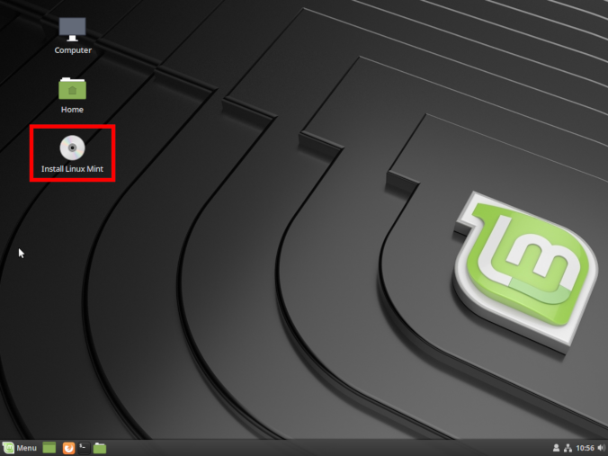
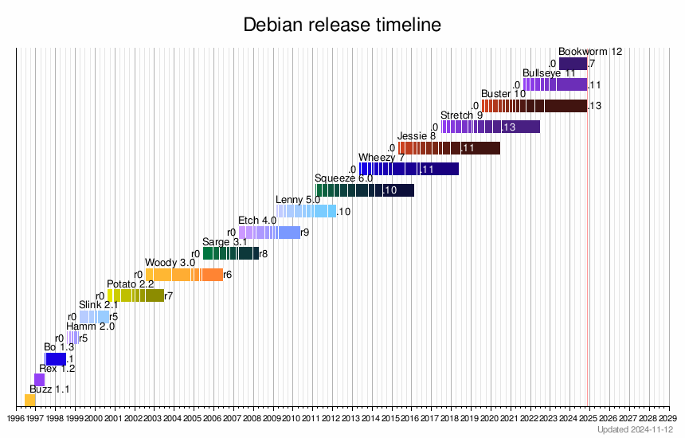

title: Shell Scripting
class: animation-fade
layout: true

---

class: impact

# Administration Linux

---

# L'ecosystème Linux

- Système d'exploitation
- Interagir avec le système en ligne de commande
- Un système de fichiers
- Des utilisateurs, des permissions
- Des Processus
- Assemblage de commande
- Écriture de script

---

# Rappels

- Utilisez [Tab] !
- Soyez attentif à ce que vous tapez et à ce que la machine vous renvoie


---

# Objectifs

- installer et gérer une distribution
- acquérir des notions de réseau et de sécurité
- administrer un serveur à distance
- configurer et gérer des services
- déployer un serveur web

---

# Plan

1. Installer une distribution, gérer les partitions
2. Le gestionnaire de paquet (et les archives)
3. Notions de réseau
4. Notions de cryptographie
5. Se connecter et gérer un serveur avec SSH
6. Les services, et principes de base de sécurité
7. Installer nginx et déployer un site "statique"
8. Automatiser des tâches avec cron
9. Déployer une app sur une stack PHP/Mysql

---

# Plan (partie avancée)

10. Ajouter, gérer des services systemd
11. Casser, réparer et monitorer son serveur
12. Installer un serveur sous YunoHost
13. Gérer des containers LXC 
14. Gérer sauvegardes avec Borgbackup
15. Moar bash scripting ?

---

.center[

]

---

.center[

]

---

.center[

]

---

.center[

]

---

.center[

]

---

class: impact

# 1. Installer une distribution

### et gérer les partitions

---

# 1. Installer une distribution

.center[
... jusqu'ici : pas d'interface graphique !
]

---

# 1. Installer une distribution

## Introducing : Xorg

Xorg (qui commence a être remplacée par Wayland ?) est le serveur graphique

.center[
[](img/xorg.png)
]

---

# 1. Installer une distribution

## Distributions

- Un noyau (Linux)
- Des programmes (GNU, ...)
- Des pré-configurations
- Un gestionnaire de paquet
- Un (ou des) environnements graphiques (Gnome, KDE, Cinnamon, Mate, ...)
- Une suite de logiciel intégrée avec l'environnement graphique
- Des objectifs / une philosophie

---

# 1. Installer une distribution

## Linux Mint

- (Choix arbitraire du formateur)
- Distribution simple, sobre, pas spécialement controversée (?)
- Profite de la stabilité de Debian et popularité d'Ubuntu 

---

# 1. Installer une distribution

## Environnement

- Recommandé : Cinnamon (ou Mate)
- (mais vous pouvez prendre XFCE, KDE, ... ou partir sur une Ubuntu Gnome Shell ...)

---

# 1. Installer une distribution

## Procédure d'installation générale

<small>(Prerequis : avoir accès au BIOS du système (et avoir de la place))</small>

- Télécharger et flasher une "Live CD/USB"
- Dire au BIOS de booter sur la "Live CD/USB"
- Lancer l'installation
    - (définir un plan de partitionnement)
- Prendre un café
- Rebooter et vérifier que ça a fonctionné

---

# 1. Installer une distribution

## Telecharger l'ISO

.center[

]

---

# 1. Installer une distribution

## Vérifier l'intégrité / authenticité

.center[

]

---

# 1. Installer une distribution

## Le BIOS

- Programme lancé par la machine à son démarrage
- Change entre les modèles de PC ...
- Gère différent aspects "bas-niveau" (e.g. horloge intégrée)
- Gère le lancement du "vrai" système d'exploitation
    - analyse typiquement le lecteur CD
    - ... puis le HDD
    - ... puis le network (PXE)
    - ...
- De nos jours, l'UEFI et Secure boot complique beaucoup les choses ...

---

# 1. Installer une distribution

## Le BIOS

.center[

]

---

# 1. Installer une distribution

## Live CD/USB

- Un système généralement "éphémère" (données perdues)
- Typiquement sur un CD rom ou une clef USB
- Système entièrement chargé dans la RAM (performances moindres)
- Destiné à tester / faire une démo du système et à l'installer
- Permet aussi d'avoir accès à certains outils

---

.center[

]

---

# 1. Installer une distribution

## Lancer l'installation

.center[

]

---

# 1. Installer une distribution

## Lancer l'installation

.center[

]

---

# 1. Installer une distribution

## Plan de partitionnement

Exemple :
- 300 Mo pour `/boot/` en ext4
- 12 Go pour `/` en ext4
- 3 Go pour `/home/` en ext4
- Le reste en swap
    - le swap, c'est une extension "lente" de la RAM

.center[

]

---

# 1. Installer une distribution

## Lancer l'installation "pour de vrai"

- Répondre aux questions pour créer l'utilisateur, etc...
- ... le système s'installe ...

---

# 1. Installer une distribution

## Finir l'installation

- Redémarrer
- (Enlever le média d'installation)
- (Dire au BIOS de booter de nouveau sur le HDD)

---

# 1. Installer une distribution

## GRUB

.center[

]

---

# 1. Installer une distribution

## GRUB

.center[

]

---

# 1. Installer une distribution

## Login

.center[

]

---

# 1. Installer une distribution

## Le bureau

.center[

]

---

# 1. Installer une distribution

## Les points de montage

.center[

]

---

# 1. Installer une distribution

## Notation des patitions

Les disques partitions sous Linux sont généralement dénommées :

- `/dev/sda` (premier disque)
   - `/dev/sda1` (première partition de /dev/sda)
   - `/dev/sda2` (deuxieme partition de /dev/sda)
- `/dev/sdb` (deuxieme disque)
   - `/dev/sdb1` (première partition de /dev/sdb)
   - `/dev/sdb2` (deuxieme partition de /dev/sdb)
   - `/dev/sdb3` (troisieme partition de /dev/sdb)

---

# 1. Installer une distribution

## Outil pour lister les disques, gérer les partions

```bash
$ fdisk -l
Disk /dev/sda: 29.8 GiB, 32017047552 bytes, 62533296 sectors
[...]
Device       Start      End  Sectors  Size Type
/dev/sda1     2048  2099199  2097152    1G Linux filesystem
/dev/sda2  2099200 62524946 60425747 28.8G Linux filesystem
```

---

# 1. Installer une distribution

## Les points de montage

Une partition ou n'importe quel "bidule de stockage" peut être "monté" dans le système de fichier
- parittion
- clef usb
- image iso
- stockage distant
- ...

---

# 1. Installer une distribution

## Les points de montage

Les points de montages sont gérés avec `mount`

```bash
$ mkdir /media/usbkey
$ mount /dev/sdb1 /media/usbkey
$ ls /media/usbkey
# [le contenu de la clef usb s'affiche]
```

---

# 1. Installer une distribution

## Les points de montage

On peut "démonter" un element monté avec `umount`

```bash
$ umunt /media/usbkey
```

---

# 1. Installer une distribution

## Les points de montage : `/etc/fstab`

`/etc/fstab` décrit les systèmes de fichier montés automatiquement au boot

```text
# <file system>     <mountpoint> <type>  <options>       <dump>  <pass>
UUID=[id tres long] /            ext4    default         0       1
UUID=[id tres long] /home/       ext4    defaults        0       2
```

<small>(historiquement, la premiere colomne contenait `/dev/sdxY`, mais les UUID sont plus robustes)</small>

---

# 1. Installer une distribution

## Les points de montage : outils

Juste `mount` permet aussi de lister les différents points de montage

```bash
$ mount
[...]
/dev/sda1 on /boot type ext4 (rw,noatime,discard,data=ordered)
/dev/sda2 on / type ext4 (rw,noatime,discard,data=ordered)
```

---

# 1. Installer une distribution

## Les points de montage : outils

Il existe aussi `df` :

```bash
$ df -h
Filesystem      Size  Used Avail Use% Mounted on
dev             2.8G     0  2.8G   0% /dev
run             2.8G  1.1M  2.8G   1% /run
/dev/dm-0        29G   22G  5.0G  82% /
tmpfs           2.8G   22M  2.8G   1% /dev/shm
tmpfs           2.8G     0  2.8G   0% /sys/fs/cgroup
tmpfs           2.8G  1.9M  2.8G   1% /tmp
/dev/sda1       976M  105M  804M  12% /boot
tmpfs           567M   16K  567M   1% /run/user/1000
```

---

# 1. Installer une distribution

## Les points de montage : outils

Et aussi `lsblk` : 

```bash
$ lsblk
NAME          MAJ:MIN RM  SIZE RO TYPE  MOUNTPOINT
sda             8:0    0 29.8G  0 disk
├─sda1          8:1    0    1G  0 part  /boot
└─sda2          8:2    0 28.8G  0 part  /
```

---

class: impact

# 2. Le gestionnaire de paquet 

### (et les archives)

---

# 2. Le gestionnaire de paquet

## Motivation

Historiquement, c'est très compliqué d'installer un programme :
- le télécharger et le compiler
- la compilation (ou le programme lui-même) requiert des dependances
- il faut télécharger et compiler les dépendances
- qui requiert elles-mêmes des dépendances ...

---

# 2. Le gestionnaire de paquet

## Le travail d'une distribution <small>(entre autre)</small>

- créer et maintenir un ensemble de paquet cohérents
- ... et le gestionnaire de paquet qui va avec
- les (pre)compiler pour fournir des binaires

---

# 2. Le gestionnaire de paquet

Paquet ~ programmes ou librairies

Le gestionnaire de paquet c'est :
- La "clef de voute" d'une distribution ?
- un **système unifié pour installer** des paquets ...  ;
- ... **et les mettre à jour !** ;
- le tout en gérant les dépendances et les conflits ;
- et via une commaunauté qui s'assure que les logiciels ne font pas n'importe quoi.

---

# 2. Le gestionnaire de paquet

## Comparaison avec Windows

Sous Windows
- téléchargement d'un .exe par l'utilisateur ...
- ... depuis une source obscure ! (**critical security risk !**)
- procédure d'installation spécifique
- ... qui tente de vous refiler des toolbar bloated, et/ou des CGU obscures
- système de mise à jour spécifique
- nécessité d'installer manuellement des dépendances

---

# 2. Le gestionnaire de paquet

*One package to rule them all*

*One package to find them*

*One package to download them all*

*and on the system bind them*

*In the land of GNU/Debian where the penguin lie*

---

# 2. Le gestionnaire de paquet

## Sous Debian

Format `.deb`

`apt` : couche "haut niveau"
- dépot, 
- authentification, 
- ... 

`dpkg` : couche "bas niveau"
- gestion des dépendances,
- installation du paquet,
- ...

---

# 2. Le gestionnaire de paquet

## Parenthèse sur `apt-get`

- Historiquement, `apt-get` (et `apt-cache`, `apt-mark`, ..) étaientt utilisés
- Syntaxe inutilement complexe ?
- `apt` fourni une meilleur interface (UI et UX)

---

# 2. Le gestionnaire de paquet

## Utilisation de `apt`

- `apt install <package>` : télécharge et installe le paquet et tout son arbre de dépendances
- `apt remove <package>` : désinstaller le paquet (et les paquet dont il dépends !)
- `apt autoremove` : supprime les paquets qui ne sont plus nécessaires

---

# 2. Le gestionnaire de paquet

## Mais qu'est-ce que c'est, un paquet ?

Un programme, et des fichiers (dossier `debian/`) qui décrivent le paquet :
- `control` : décrit le paquet et ses dépendances
- `install` : liste des fichiers et leur destination
- `changelog` : un historique de l'evolution du paquet
- `rules` : des trucs techniques pour compiler le paquet
- `postinst`, `prerm`, ... : des scripts à lancer quand le paquet est installé, désinstallé, ...

---

# 2. Le gestionnaire de paquet

## Mettre à jour les paquets

- `apt update` : récupère la liste des paquets depuis les dépots
- `apt dist-upgrade` : calcule et lance la mise à jour de tous les paquets
- (`apt upgrade` : mise à jour "safe", sans installer/supprimer de nouveaux paquets)

---

# 2. Le gestionnaire de paquet

## Les dépots

Les dépots de paquets sont configurés via `/etc/apt/sources.list` et les fichiers du dossier `/etc/apt/sources.list.d/`.

Exemple :
```
deb http://ftp.debian.fr/debian/ stretch main contrib
```

- `stretch` est le nom de la distribution
- `main` et `contrib` sont des composantes à utiliser

---

# 2. Le gestionnaire de paquet

## Les versions de Debian

Debian vise un système libre et très stable

- `stable` : paquets éprouvés et très stable (bien que souvent un peu vieux)
- `testing` : paquets en cours de test, comportant encore quelques bugs
- `unstable` (sid) : pour les gens qui aiment vivre dangereusement

Les versions tournent tous les ~2 ans environ
- l'ancienne `testing` devient la nouvelle `stable`
- le passage de version peut être un peu douloureux ...

---

# 2. Le gestionnaire de paquet

## Les versions de Debian

Basé sur les personnages de Toy Story

- 7, `wheezy` (oldoldstable)
- 8, `jessie` (oldstable)
- 9, `stretch` (stable, depuis juin 2017)
- 10, `buster` (testing, deviendra stable vers juin 2019)
- 11, `bullseye`
- 12, `bookworm`

---

# 2. Le gestionnaire de paquet

.center[

]

---

# 2. Le gestionnaire de paquet

## Naviguez dans les paquets debian en ligne

https://packages.debian.org/search

.center[

]

---

# 2. Le gestionnaire de paquet

## Les backports

- Un intermédiaire entre stabilité et nouveauté
- Fournissent des paquets venant de `testing` en `stable`
- À utiliser avec prudence

---

# 2. Le gestionnaire de paquet

## Gérer des archives

`tar` (tape archive) permet de créer des archives (non compressées) qui rassemblent des fichiers.

```bash
# Créer une archive monarchive.tar
tar -cvf monarchive.tar file1 file2 folder2/ folder2/

# Désassembler une archive
tar -xvf monarchive.tar
```

---

# 2. Le gestionnaire de paquet

## Gérer des archives

`gzip` (gunzip) permet de compresser des fichiers (similaire aux .zip, .rar, ...)

```bash
# Compresser zblorf.scd
gzip zblorf.scd

# [...] le fichier a été compressé et renommé zblorf.scd.gz

# Decompresser le fichier :
gzip -d zblorf.scd.gz
```

---

# 2. Le gestionnaire de paquet

## Gérer des archives

`tar` peut en fait être invoqué avec `-z` pour générer une archive compressée

```bash
# Créer une archive compressée
tar -cvzf monarchive.tar.gz file1 file2 folder2/ folder2/

# Désassembler une archive
tar -xvzf monarchive.tar.gz
```

---

# 2. Le gestionnaire de paquet

## Gérer des archives

.center[

]


---

class: impact

# 3. Notions de réseau

---

# 3. Notions de réseau

## "Réseau"

Tout ce qui permet la communication entre les machines (et les programmes)

---

# 3. Notions de réseau

## Objectifs

- Comprendre et savoir se représenter les différentes couches
- Savoir faire quelques des tests "de base"
- ... et les commandes associées

---

# 3. Notions de réseau

- DNS : domaine, résolution, ...
- Protocoles, HTTP, modèle client/serveur
- TCP : ports, NAT
- IP : adresses, routage, DHCP
- Physique : interfaces réseau

---

.center[

]

---

# 3. Notions de réseau

## Couche physique (1/2)

- Ethernet, wifi, 4G, ...
- Votre ordinateur dispose d'**interface réseau**
- Elles permettent de communiquer sur un support (cable, onde)
- Chaque interface réseau possède une **adresse MAC**
- Il existe typiquement une interface `lo` (loopback, la boucle locale - 127.0.0.1)

---

# 3. Notions de réseau

## Couche physique (2/2)

- `ip a` permet d'obtenir des informations sur les interfaces
- Historiquement, les noms étaient "simple" : eth0, wlan0, ...
- Aujourd'hui les noms sont un peu plus complexes / arbitraires

```bash
$ ip a
1: lo: <LOOPBACK,UP,LOWER_UP> 
    link/loopback 00:00:00:00:00:00 brd 00:00:00:00:00:00
2: enp0s25: <NO-CARRIER,BROADCAST,MULTICAST,UP>
    link/ether 33:0e:d8:3f:65:7e
3: wlp3s0: <BROADCAST,MULTICAST,UP,LOWER_UP>
    link/ether 68:a6:2d:9f:ad:07
```

---

# 3. Notions de réseau

## IP : Internet Protocol (1/2)

- IP fait parler **des machines** !
- Protocole de routage des paquets
- "Best-effort", non fiable !
- Les routeurs discutent entre eux pour optimiser l'acheminement
- Les adresses sont comme des numéros de telephone, ou des positions GPS
   - IPv4, par exemple 92.93.127.10   (4.3 milliards d'adresse)
   - IPv6, par exemple 2a04:7260:9088:6c00::1 (10^38 addresses)

---

# 3. Notions de réseau

## IP : Internet Protocol (2/2)

```bash
$ ip a
enp3s0: <BROADCAST,MULTICAST,UP,LOWER_UP>
 link/ether 40:8d:5c:f3:3e:35
 inet 91.225.41.29/32 scope global enp3s0
 inet6 2a04:7202:8008:60c0::1/56 scope global 
```

Voir aussi : `ifconfig` (deprecated) et `ipconfig` (sous windows!)

---

# 3. Notions de réseau

## IP : `ping` teste la connexion entre deux machines

```bash
$ ping 91.198.174.192
PING 91.198.174.192 (91.198.174.192) 56(84) bytes of data.
64 bytes from 91.198.174.192: icmp_seq=1 ttl=58 time=51.5 ms
64 bytes from 91.198.174.192: icmp_seq=2 ttl=58 time=65.3 ms
^C
--- 91.198.174.192 ping statistics ---
2 packets transmitted, 2 received, 0% packet loss, time 3ms
rtt min/avg/max/mdev = 51.475/58.394/65.313/6.919 ms
```

---

# 3. Notions de réseau

## IP : `whois` pour obtenir des infos sur le(s) proprio(s) d'une ip

```
$ whois 91.198.174.192
[...]
organisation:   ORG-WFI2-RIPE
org-name:       Wikimedia Foundation, Inc
[...]
mnt-by:         RIPE-NCC-HM-MNT
mnt-by:         WIKIMEDIA-MNT
```

---

# 3. Notions de réseau

## IP : `traceroute` permet d'étudier la route prise par les paquets

```bash
$ traceroute 91.198.174.192
 1  _gateway (192.168.0.1)  4.212 ms  6.449 ms  6.482 ms
 2  * 10.13.25.1 (10.13.25.1)  248.615 ms *
 3  211-282-253-24.rev.numericable.fr (211.282.253.24)  251.263 ms  251.332 ms  251.408 ms
 4  172.19.132.146 (172.19.132.146)  251.493 ms ip-65.net-80-236-3.static.numericable.fr (80.236.3.65)  251.569 ms  251.619 ms
 5  prs-b7-link.telia.net (62.115.55.45)  251.692 ms  251.769 ms  251.979 ms
 6  prs-bb4-link.telia.net (62.115.120.30)  252.026 ms prs-bb3-link.telia.net (62.115.121.96)  17.989 ms prs-bb4-link.telia.net (213.155.134.228)  1069.536 ms
 7  adm-bb4-link.telia.net (213.155.136.167)  1070.116 ms  1242.772 ms adm-bb3-link.telia.net (213.155.136.20)  1242.839 ms
 8  adm-b3-link.telia.net (62.115.122.179)  1243.006 ms adm-b3-link.telia.net (62.115.122.191)  1242.879 ms  1243.082 ms
[...]
```

---

# 3. Notions de réseau

## TCP : Transmission Control Protocol (1/2)

- TCP fait communiquer **des programmes**
- Découpage des messages en petits paquets pour IP
- Fiabilité avec des accusés de réception / renvois

---

# 3. Notions de réseau

## TCP : Transmission Control Protocol (2/2)

- TCP fourni un "tuyau de communication" entre deux programmes
- Notion de 'port'
- Analogie avec les différents "departement" à l'intérieur d'une entreprise
- Par exemple : votre navigateur web (port 56723) qui discute qui discute avec le serveur web (port 80)
    - côté A : 183.92.18.6:56723 (un navigateur web)
    - côté B : 91.198.174.192:80 (un serveur web)

---

# 3. Notions de réseau

## TCP : `lsof -i` pour lister les connexions active

```bash
$ lsof -i
ssh        3231 alex IPv4 shadow.local:34658->142.114.82.73.rev.sfr.net:ssh (ESTABLISHED)
thunderbi  3475 alex IPv4 shadow.local:59424->tic.mailoo.org:imap (ESTABLISHED)
thunderbi  3475 alex IPv4 shadow.local:57312->tic.mailoo.org:imap (ESTABLISHED)
waterfox  12193 alex IPv4 shadow.local:54606->cybre.space:https (ESTABLISHED)
waterfox  12193 alex IPv4 shadow.local:32580->cybre.space:https (ESTABLISHED)
```

---

# 3. Notions de réseau

## TCP : `nc -zv` pour tester si un port est ouvert

ACHTUNG : ne pas abuser de cela..

```bash
$ nc -zv 44.112.42.13 22
Connection to 44.112.42.13 22 port [tcp/ssh] succeeded!
```

nc -zv ynh-forge.netlib.re 53
---

# 3. Notions de réseau

## TCP : `tcpdump` pour regarder l'activité sur le réseau

---

# 3. Notions de réseau

## TCP : et aussi : `wireshark`

---

# 3. Notions de réseau

## Modèle client/serveur

Un serveur (au sens logiciel) est un programme. Comme un serveur dans un bar (!) :
- il **écoute** et attends qu'on lui demande un service
- par exemple : fournir la page d'acceuil d'un site
- le serveur écoute sur *un port*  : par exemple : 80

Le client est celui qui demande le service
- il toque à la porte
- transmet sa demande
- le serveur lui réponds (on espère)

---

# 3. Notions de réseau

## Modèle client/serveur : `netstat`

`netstat -tulpn` permet de lister les programmes qui écoutent et attendent 

```bash
 > netstat -tulpn | grep LISTEN | grep "80\|25"
tcp     0.0.0.0:80  LISTEN      28634/nginx: master 
tcp     0.0.0.0:25  LISTEN      1331/master         
tcp6    :::80       LISTEN      28634/nginx: master 
tcp6    :::25       LISTEN      1331/master
```

---

# 3. Notions de réseau

## Protocoles (1/2)

- Un protocole = une façon de discuter entre programmes
- Conçus pour une finalité particulière
- Ont généralement un port "par défaut" / conventionnel
   - 80/http : le web (des "vitrines" pour montrer et naviguer dans du contenu)
   - 443/https : le web (mais en chiffré)
   - 25/smtp : le mail (pour relayer les courriers électroniques)
   - 993/imap : le mail (synchroniser des boites de receptions)
   - 587/smtps : le mail (soumettre un courrier à envoyer)
   - 22/ssh : lancer des commandes à distance
   - 53/dns : transformer des noms en ip
   - 5222/xmpp : messagerie instantannée
   - 6667/irc : salons de chat

---

# 3. Notions de réseau

## Protocoles (2/2)

Par exemple, HTTP : 
- On envoie `GET /` et on reçoit 200 + la page d'acceuil
- On envoie `GET /chaton.jpg` et on reçoit 200 + une image (si elle existe)
- On envoie `GET /meaningoflife.txt` et on reçoit 404 (si la page n'existe pas)
- On peut ajouter des Headers aux requetes (c.f. debugger firefox)
- Il existe d'autres requetes : POST, PUT, DELETE, ...

---

# 3. Notions de réseau

## DNS : Domain name server (1/5)

- Retenir des numéros de telephone ou des coordonnées GPS
- On invente l'annuaire et les adresses postales
- `wikipedia.org -> 91.198.174.192`
- On peut acheter des noms chez des *registrars* (OVH, Gandi, ...)
- Composant critique d'Internet (en terme fonctionnel(

---

# 3. Notions de réseau

## DNS : Domain name server (2/5)

- Il existe des résolveurs DNS à qui on peut demander de résoudre un nom via le protocole DNS (port 53)
- Par exemple :
    - 8.8.8.8, le resolveur de Google
    - 9.9.9.9, un nouveau service qui "respecte la vie privée"
    - 89.234.141.66, le resolveur de ARN
    - 208.67.222.222, OpenDNS

- **Choix critique pour la vie privée !!**
- Generalement, vous utilisez (malgré vous) le resolveur de votre FAI, ou bien celui de Google

---

# 3. Notions de réseau

## DNS : Domain name server (3/5)

- Sous Linux, le resolveur DNS se configure via un fichier `/etc/resolv.conf`

```bash
$ cat /etc/resolv.conf
nameserver 89.234.141.66
```

---

# 3. Notions de réseau

## DNS : Domain name server (4/5)

`ping` fonctionne aussi avec noms de domaine

`host` permet sinon de connaître l'ip associée

```bash
$ host wikipedia.org
wikipedia.org has address 91.198.174.192
wikipedia.org has IPv6 address 2620:0:862:ed1a::1
wikipedia.org mail is handled by 50 mx2001.wikimedia.org.
wikipedia.org mail is handled by 10 mx1001.wikimedia.org.
```

---

# 3. Notions de réseau

## DNS : Domain name server (5/5)

- On peut outrepasser / forcer la résolution DNS de certains domaine avec le fichier `/etc/hosts`

```bash
 > cat /etc/hosts
127.0.0.1	localhost
127.0.1.1	shadow
::1	localhost ip6-localhost ip6-loopback
ff02::1 ip6-allnodes
ff02::2 ip6-allrouters

127.0.0.1 google.com
127.0.0.1 google.fr
127.0.0.1 www.google.com
127.0.0.1 www.google.fr
127.0.0.1 facebook.com
127.0.0.1 facebook.fr
```

---

.center[

]

---

.center[

]

---

.center[

]

---

# 3. Notions de réseau

## Réseau local et NAT (1/6)

- En pratique, on est peu souvent "directement" connecté à internet
    - MachinBox
    - Routeur de l'entreprise
- Pas assez d'IPv4 pour tout le monde
    - nécessité de sous-réseaux "domestique" / des réseau "local"
    - basé sur les NAT
    - typiquement avec des IP en 192.168.x.y ou 10.0.x.y

---

.center[

]

---

.center[

]

---

# 3. Notions de réseau

## Réseau local et NAT (4/6)

- C'est le routeur qui m'attribue une IP via le DHCP
- Le routeur agit comme "gateway" (la "passerelle" vers les internets)
    - (c.f. `ip route`, et la route par défaut)
- Depuis l'extérieur du réseau local, il n'est pas possible de parler "simplement" à une machine
- Example : Je ne peux apriori pas parler à la machine 192.168.0.12 de mon réseau local chez moi depuis le centre de formation...
- Egalement : Difficulté de connaître sa vraie IP "globale" ! Il faut forcément demander à une autre machine ... c.f whatsmyip.com

---

# 3. Notions de réseau

## Réseau local et NAT (5/6)

-La situation se complexifie avec Virtualbox :
- Typiquement Virtualbox créé un NAT à l'intérieur de votre machine 
- Les différentes VM ont alors des adresses en 10.0.x.y

---

.center[

]


---

class: impact

# 4. Notions de cryptographie

---

class: impact

# 5. Se connecter et gérer un serveur avec SSH

---

class: impact

# 6. Les services, et principes de base de sécurité d'un serveur

---

class: impact

# 7. Installer nginx et déployer un site "statique"

---

class: impact

# 8. Automatiser des tâches avec cron

---

class: impact

# 9. Déployer une application PHP/Mysql

---

