title: Administration Linux
class: animation-fade
layout: true

---

class: impact

<h1 style="font-size:4em;">
Administration Linux<br/>
</h1>

<h2 style="font-size:2em;">Installation et mise en oeuvre</h2>

.center[

]

---

# À propos de moi

.col-12[
.col-4[
.center[

]
]

.col-8[.center[
<br>
<br>
`https://github.com/alexAubin`
<br>
<br>
`alex.aubin@mailoo.org`
<br>
<br>
]]
]

.col-4[.center[
Ingénieur/Physicien


</br>

]]

.col-4[.center[
Dev / adminsys / ...


]]

.col-4[.center[
Formateur


]]

---

# À propos de vous

---

# Organisation

## Horaires

- 9h00 -> 12h30 <small>(pause de 10 min autour de 10h30)</small>
- Repas
- 13h30 -> 17h00 <small>(pause de 10 min autour de 15h30)</small>

.center[
(soit 7h00 de formation / jour !)
]

## Émargement : toutes les demi-journées

## Évaluation de la formation : le dernier jour

---

# Plan de la formation

- **Jour 1**
  - 0 - Rappels (?)
  - 1 - Le(s) shell(s)
  - 2 - Écrire et exécuter des scripts
  - 3 - Enchainement de commandes et redirections
  - 4 - Pipes (`|`), filtres, boîte à outils
- **Jour 2**
  - 5 - Installer une distribution, gérer les partitions
  - 6 - Le gestionnaire de paquet (+ discussion sur les archives)
- **Jour 3**
  - 7 - Notions de réseau
  - 8 - Notions de cryptographie
  - 9 - Se connecter et gérer un serveur avec SSH

---

# Plan de la formation

- **Jour 4**
  - 10 - `systemd`, services et sécurité basique d'un serveur
  - 11 - Déployer un site "basique" avec nginx
  - 12 - Tâches automatiques (cron)
- **Jour 5**
  - 13 - Déployer une "vrai" app : Nextcloud ?
  - 14 - Conteneurs Docker, LXC, approche DevOps ?

---

# Méthode de travail

- Alternance théorie / pratique
- Publication du contenu au fur et à mesure
    - sur <a href="https://aleks.internetlib.re/docs/formationLinux" style="color: gold;">aleks.internetlib.re/docs/formationLinux</a>
- Travail dans une machine virtuelle Guacamole
    - sur <a href="https://formationlinux.internetlib.re/" style="color: gold;">formationlinux.internetlib.re</a> (en HTTP sans s !)
    - login: votre prenom en minuscule
    - password: `ilovelinux`
- N'hésitez pas à poser des questions - je suis payé pour ça !


---

class: impact

# 0 - Rappels (?)

.center[

]

---

# 0 - Rappels (?)

## (1/5) La ligne de commande

- `cd` pour changer de dossier courant
- `ls` / `ls -l` / `ll` pour lister les fichiers
    - les fichiers commençant par `.` ne sont pas affichés par défaut
- Les commandes ont des options courtes (par ex. `-f`) ou longues (par ex. `--fullscreen`)
- Obtenir de l'aide : `cmd --help` (ou `-h`), ou `man cmd`

---

# 0 - Rappels (?)

## (2/5) Raccourcis clavier

- Auto-complétion avec `Tab`ulation
- Flèches haut/bas pour retrouver les commandes précédentes
- `Ctrl+R` pour chercher dans les commandes précédentes, `history` pour afficher tout l'historique
- `Ctrl+C` pour annuler la commande en cours
- `Ctrl+A`/`E` pour aller au début / à la fin, `Ctrl+U` pour effacer tout ce qui est à gauche
- Copier-coller avec sélection et clic-du-milieu, ou bien `Ctrl+Insert` et `Shift+Insert`

.center[
### Utilisez [Tab] et ↑ ↓

### Et soyez attentif à ce que vous tapez

### et à ce que la machine vous renvoie !
]


---

# 0 - Rappels (?)

## (3/5) Manipuler des fichiers

- chemin relatif vs chemin absolu
    - en particulier, pas besoin de systématiquement se déplacer avec `cd` pour manipuler un fichier
- **Créer** / **éditer** des fichiers textes : `nano` (ou `vim`)
- **Créer un dossier**: `mkdir <dossier>`
- **Afficher** un fichier dans le terminal : `cat <fichier>`
    - ou `tail -n 20 <fichier>` pour les 20 dernières lignes
- **Déplacer/renommer**: `mv <source> <destination>` (move)
- **Copier** : `cp <source> <destination>` (ou `cp -r` pour un dossier)
- **Supprimer** : `rm <cible>` (ou `rm -r` pour un dossier)
- Récupérer des fichiers depuis internet (via une URL) `wget <url>` ou `curl <url>`

---

# 0 - Rappels (?)

## (4/5) Utilisateurs et permissions

- Chaque user a un répertoire personnel, classiquement `/home/<username>/`
- `root` est dieu sur la machine
- `sudo` permet d'exécuter ponctuellement une commande en tant que `root` (si on est *sudoers*)
    - `sudo su` ou `sudo -i` pour ouvrir un shell interactif
- `groups` pour lister les groupes dans lesquelles nous sommes
- Les users sont référencés dans dans `/etc/passwd`
- Les permissions et propriétaires des fichiers sont montrés dans le retour de `ls -l` 
- `chmod` : changer les permissions
- `chown` : changer le propriétaire / groupe
- `namei -l /chemin/du/fichier` <small>pour inspecter les permissions de tout un chemin</small>

---

# 0 - Rappels (?)

## (5/5) Les processus

- Différence entre programme et processus
- Notion de PID, PPID, de propriétaire et permission
- `ps -ef --forest` pour voir l'arborescence des process en cours
- `top`, `htop` pour voir "dynamiquement" les process en cours (notamment conso de CPU/RAM)
- `cmd &` pour lancer une commande en arrière-plan <small>(ou aussi : `Ctrl+Z` puis `bg` si on a oublié de mettre le `&`)</small>
- `screen` / `tmux` pour lancer des commandes sans être lié à un terminal particulier 
- `kill` / `kill -9` pour tuer un process via son PID

---

class: impact

# 1 - Le(s) shell(s)

---

# 1 - Le(s) shell(s)

### Origine historique : le tty (teletype)

.center[


]

---

# 1 - Le(s) shell(s)

### Le terminal

Dans le temps, il s'agissait d'une machine sans interface graphique, similaire à un minitel qui permettait d'interagir avec le "vrai" ordinateur (mainframe) à distance.

De nos jours, par abus de language un terminal est en fait un **émulateur** de terminal, c'est-à-dire un programme qui émule la même fonctionnalité. (La distinction terminal/mainframe a disparu)

### Le shell

Il s'agit du programme qui gère l'invite de commande et l'execution des commandes tapées. Classiquement, il s'agit de `bash`. Il existe d'autres shell comme `sh`, `zsh`, `fish`, ...

Lorsque l'on programme dans certains languages de scripting, on parle aussi de shell `python`, `perl`, `ruby`, `javascript`, ...

Un shell que vous utilisez peut potentiellement être situé sur une autre machine que celle devant laquelle vous êtes !

---

# 1 - Le(s) shell(s)

### Les différents shells

- `bash` ("Bourne-Again" shell) : c'est le plus classique, souvent utilisé aussi pour créer des scripts
- `sh` (aussi appellé `dash`) : c'est l'ancêtre de `bash`, plus rudimentaire (pas d'historique, pas d'autocomplétion)
- `zsh` : un shell plus puissant que `bash` (meilleur autocomplétion, partage d'historique entre les shells ouverts, correction des typos, ..)
- `fish` : un shell encore plus moderne et convivial
- et d'autres moins courants / historiques : `ash`, `csh`, `ksh`, ...

.center[
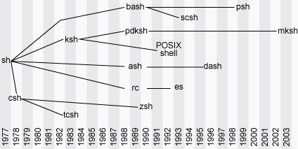
]

---

# 1 - Le(s) shell(s)

- Le shell qu'on utilise par défaut est configuré dans `/etc/passwd`
- On peut le changer avec `chsh`
- On peut aussi simplement lancer manuelle un shell en lançant la commande : `bash`, `zsh`, `python`, ...

----

- Dans certains contextes on utilise un shell qui n'est pas la machine devant laquelle on est:
    - Lancer une session `ssh`
    - Ouvrir un shell dans un docker ou un LXC

---

# 1 - Le(s) shell(s)

## Variables d'envionnement

Lorsque vous êtes dans un shell, il existe des *variables d'environnement* qui définissent certains comportements.

Par exemple, la variable 'HOME' contient `/home/padawan` et corresponds à l'endroit où `cd` retourne par défaut (si pas de dossier donné en argument)

Autre exemples :

```
SHELL : /bin/bash (généralement)
LANG, LC_ALL, ... : langue utilisée par les messages
USER, USERNAME : nom d'utilisateur
```

---

# 1 - Le(s) shell(s)

## Changer une variable d'envionnement

Exemple :

```
HOME=/usr/cache/
```

## Afficher une variable

```
$ echo $HOME
/usr/cache/
```

---

# 1 - Le(s) shell(s)

## Lister les variables d'envionnement

`env` permet de lister les variables d'environnement

```
$ env
LC_ALL=en_US.UTF-8
HOME=/home/alex
LC_MONETARY=fr_FR.UTF-8
TERM=rxvt-unicode-256color
[...]
```

---

# 1 - Le(s) shell(s)

## Personnaliser l'invite de commande

- La variable `PS1` décrit l'apparence de l'invite de commande !
- Généralement, `PS1` vaut : `\u@\h:\w$`
- `\u` corresponds au nom d'utilisateur
- `\h` corresponds au nom de la machine (host)
- `\w` corresponds au repertoire de travail (working directory)
- `\n` corresponds ... à un retour à la ligne !

`PS2` corresponds à l'invite de commande de deuxième niveau !

---

# 1 - Le(s) shell(s)

## Ecrire du texte en couleur

Syntaxe absolument abominable 😭 !

```
echo -e "\033[31mCeci est en rouge\033[0m"
echo -e "\033[32mCeci est en vert\033[0m"
echo -e "\033[33mCeci est en jaune\033[0m"
echo -e "\033[7mCeci est surligné\033[0m"
echo -e "\033[31;1;7;6mCeci est surligné rouge gras surligné clignotant\033[0m"
```

Couleurs : 30 à 38

Effets : 0 à 7

---

# 1 - Le(s) shell(s)

## PS1 en couleur ...

```
PS1="\[\033[31;1;7;6m\]\u\[\033[0m\]@\h:\w$ "
```

🙀

N.B. : pour les couleurs dans le PS1, ne pas oublier d'ajouter des `\[` et `\]` autour des codes couleurs ... sinon le terminal buggera à moitié...

---

# 1 - Le(s) shell(s)

## Définir des aliases

Un alias est un nom "custom" pour une commande et des options

```
alias ll='ls -l'
alias rm='rm -i'
alias ls='ls --color=auto'
```

On peut connaître les alias existants avec juste `alias`

(Mauvaise blague : définir `alias cd='rm -r'` !)

---

# 1 - Le(s) shell(s)

## Les fichiers de profil

- Le fichier `~/.bashrc` est lu à chaque lancement de shell
- Il permet de définir des commandes à lancer à ce moment
- Par exemple, des alias à définir ou des variables à changer...
- Pour appliquer les modifications, il faut faire `source ~/.bashrc`

Autres fichiers de profils : `~/.profile` et `/etc/bash_profile`

---

# 1 - Le(s) shell(s)

## Quotes, caractères spéciaux, expansion (1/6)

Les simple quotes empêche l'interprétation des caractères spéciaux

```bash
echo $HOME    # -> affiche le contenu de la variable
echo "$HOME"  # -> affiche aussi le contenu de la variable
echo '$HOME'  # -> affiche littéralement $HOME
```

---

# 1 - Le(s) shell(s)

## Quotes, caractères spéciaux, expansion (2/6)

Et aussi :

```bash
ls mon super fichier.pdf   # Donne sans doute des erreurs disans qu'il n'y a pas de 
                           # fichier "mon", ni fichier "super", ni fichier "fichier.pdf"

ls "mon super fichier.pdf" # -> fonctionne
ls 'mon super fichier.pdf" # -> fonctionne

ls $NOM_DE_FICHIER         # -> fonctionne si le fichier existe et ne contient pas d'espace
ls "$NOM_DE_FICHIER"       # -> fonctionne même si le nom contient des espaces
ls '$NOM_DE_FICHIER'       # -> affiche littéralement $NOM_DE_FICHIER
```

---

# 1 - Le(s) shell(s)

## Quotes, caractères spéciaux, expansion (3/6)

Wildcard / joker

```bash
echo *.py     # -> affiche le nom des fichiers qui se terminent 
              # par .py dans le dossier courant
              # (ou bien littéralement *.py si aucune match)

echo "*.py"   # -> affiche *.py littéralement
echo '*.py'   # -> affiche *.py littéralement
```

---

# 1 - Le(s) shell(s)

## Quotes, caractères spéciaux, expansion (4/6)

Tilde `~` désigne le répertoire personnel, par exemple : 

```bash
echo ~/toto

# équivaut à écrire

echo $HOME/toto

# équivaut à écrire

echo /home/<votre_user/toto
```


---

# 1 - Le(s) shell(s)

## Quotes, caractères spéciaux, expansion (5/6)

On peut "empêcher", ou "échapper" un caractère spécial avec `\`

```bash
echo \*.py    # Affiche littéralement: *.py
echo \$HOME   # Affiche littéralement: $HOME
```

---

# 1 - Le(s) shell(s)

## Quotes, caractères spéciaux, expansion (6/6)

Un peu moins connu : l'utilisation des accolades `{}` : 

```bash
mv toto{,.bkp}

# équivaut à écrire :

mv toto toto.bkp
```

---

class: impact

# 2 - Écrire et executer des scripts

---

# 2 - Écrire / executer des scripts

## Des scripts

- `bash` <small>(`/bin/bash`)</small> est un interpreteur
    - en mode interactif, un interpréteur de commande est souvent appelé un shell
- Plutôt que de faire de l'interactif, on peut écrire une suite d'instruction qu'il doit executer (un script)
- Un script peut être considéré comme un type de programme <small>(caractérisé par le fait qu'il reste de taille modeste)</small>

---

# 2 - Écrire / executer des scripts

## Utilité des scripts bash

Ce que ça ne fait généralement **pas** :
- du calcul scientifique
- des interfaces graphiques / web
- des manipulations 'fines' d'information

Ce que ça fait plutôt bien :
- prototypage rapide
- automatisation de tâches d'administration (fichiers, commandes, ..)
- de la "glue" entre différents programmes
- simplifier des procédures complexes mais en gardant une dose de paramétrabilité / interactivité

---

# 2 - Écrire / executer des scripts

## Ecrire un script (1/2)

```bash
#!/bin/bash

# Un commentaire
cmd1
cmd2
cmd3
...

exit 0    # (Optionnel, 0 par defaut)
```

---

# 2 - Écrire / executer des scripts

## Ecrire un script (2/2)

```bash
#!/bin/bash

echo "Hello, world !"
echo "How are you today ?"
```

---

# 2 - Écrire / executer des scripts

## `exit`

- `exit` permet d'interrompre le script immédiatement
- `exit 0` quitte et signale que tout s'est bien passé
- `exit 1` (ou une valeur différente de 0) quitte et signale un problème

---

# 2 - Écrire / executer des scripts

## Executer un script (1/3)

Première façon : avec l'interpreteur `bash`

- `bash script.sh` execute `script.sh` dans un processus à part
- on annonce explicitement qu'il s'agit d'un script bash
    - dans l'absolu, pas besoin d'avoir mis `#!/bin/bash`

---

# 2 - Écrire / executer des scripts

## Executer un script (2/3)

Deuxième façon : avec `source`

- `source script.sh` execute le script **dans** le terminal en cours
- 95% du temps, ce n'est pas `source` qu'il faut utiliser pour votre cas d'usage !
- Cas d'usage typique de `source` : recharger le `.bashrc`
- (Autre cas : `source venv/bin/activate` pour les virtualenv python)

---

# 2 - Écrire / executer des scripts

## Executer un script (3/3)

Troisième façon : en donnant les permissions d'execution à votre script

```
chmod +x script.sh   # À faire la première fois seulement
./script.sh
```

- l'interpreteur utilisé sera implicitement celui défini après le `#!` à la première ligne
- (dans notre cas : `#!/bin/bash`)

---

# 2 - Écrire / executer des scripts

## Parenthèse sur la variable `PATH` (1/2)

La variable d'environnement `PATH` défini où aller chercher les programmes

```bash
$ echo $PATH
/usr/local/bin:/usr/bin:/bin:/usr/local/sbin

$ which ls
/usr/bin/ls

$ which script.sh
which: no script.sh in (/usr/local/bin:/usr/bin:/bin:/usr/local/sbin
```

---

# 2 - Écrire / executer des scripts

## Parenthèse sur la variable `PATH` (2/2)

```bash
$ ./script.sh  # Fonctionnera (si +x activé)
$ script.sh    # Ne fonctionnera a priori pas
```

Néanmoins il est possible d'ajouter des dossiers à `PATH` :

```bash
PATH="$PATH:/home/padawan/my_programs/"
```

Ensuite, vous pourrez utiliser depuis n'importe où les programmes dans `~/my_programs` !

---

# 2 - Écrire / executer des scripts

## Résumé

- `bash script.sh` est la manière "explicite" de lancer un script bash
- `./script.sh` lance un executable (+x) via un chemin absolu ou relatif
- `source script.sh` execute le code *dans le shell en cours* !
- `script.sh` peut être utilisé seulement si le script est dans un des dossier de `PATH`


---

class: impact

# 3 - Redirections, assemblages

---

# 3 - Redirections, assemblages

## Schema fonctionnel d'une commande

- Une commande est une boîte avec des entrées / sorties
- et un code de retour (`$?`)
   - 0 : tout s'est bien passé
   - 1 (ou toute valeur différente de 0) : problème !

.center[

]

---

# 3 - Redirections, assemblages

## Entrées / sorties

.center[

]

- **arguments** : donnés lors du lancement de la commande (ex: `/usr/` dans `ls /usr/`)
- **stdin** : flux d'entrée (typ. viens du clavier)
- **stdout** : flux de sortie (typ. vers le terminal)
- **stderr** : flux d'erreur (typ. vers le terminal aussi !)

---

# 3 - Redirections, assemblages

## Code de retour

```bash
$ ls /toto
ls: cannot access '/toto': No such file or directory
$ echo $?
2
```

---

# 3 - Redirections, assemblages

## Rediriger les entrées/sorties (1/3)

- `cmd > fichier` : renvoie stdout vers un fichier (le fichier sera d'abord écrasé !)
- `cmd >> fichier ` : ajoute stdout à la suite du fichier
- `cmd < fichier` : utiliser 'fichier' comme stdin pour la commande
- `cmd <<< "chaine"` : utiliser 'chaine" comme stdin pour la commande

Exemples

```bash
ls -la ~/ > tous_mes_fichiers.txt  # Sauvegarde la liste de tous les fichiers dans le home
echo "manger" >> todo.txt          # Ajoute "manger" a la liste des choses à faire
wc <<< "une grande phrase"           # Compte le nomde de mot d'une chaine
```

---

# 3 - Redirections, assemblages

## Rediriger les entrées/sorties (2/3)

- `commande 2> fichier` : renvoie stderr vers un fichier (le fichier sera d'abord écrasé !)
- `commande 2>&1` : renvoie stderr vers stdout !
- `commande &> fichier` : renvoie stderr *et* stdout vers un fichier (le fichier sera d'abord écrasé !)

Exemples :

```bash
ls /* 2> errors  # Sauvegarde les erreurs dans 'errors'
ls /* 2>&1 > log # Redirige les erreurs vers stdout (la console) et stdout vers 'log'
ls /* > log 2>&1 # Redirige tout vers 'log' !
ls /* &> log     # Redirige tout vers 'log' !
```

---

# 3 - Redirections, assemblages

## Rediriger les entrées/sorties (3/3)

Fichiers speciaux :
- `/dev/null` : puit sans fond (trou noir)
- `/dev/urandom` : generateur aleatoire (trou blanc)

.center[

]

---

# 3 - Redirections, assemblages

## Rediriger les entrées/sorties (3/3)

Fichiers speciaux :
- `/dev/null` : puit sans fond (trou noir)
- `/dev/urandom` : generateur aleatoire (trou blanc)

```bash
ls /* 2> /dev/null           # Ignore stderr
mv ./todo.txt /dev/null      # Façon originale de supprimer un fichier !
head -c 5 < /dev/urandom     # Affiche 5 caractères de /dev/urandom
cat /dev/urandom > /dev/null # Injecte de l'aleatoire dans le puit sans fond
```

---

# 3 - Redirections, assemblages

## Assembler des commandes

Executer plusieurs commandes à la suite :

- `cmd1; cmd2` : execute `cmd1` puis `cmd2`
- `cmd1 && cmd2` : execute `cmd1` puis `cmd2` mais seulement si `cmd1` reussie !
- `cmd1 || cmd2` : execute `cmd1` puis `cmd2` mais seulement si `cmd1` a échoué
- `cmd1 && { cmd2; cmd3; }` : "groupe" `cmd2` et `cmd3` ensemble (attention à la syntaxe !!)

Que fait `cmd1 && cmd2 || cmd3` ?

---

class: impact

# 4 - Pipes et boîte à outils

---

# 4 - Pipes et boîte à outils

## Pipes ! (1/3)

- `cmd1 | cmd2` permet d'assembler des commandes de sorte à ce que le `stdout` de `cmd1` devienne le `stdin` de `cmd2` !

Exemple : `cat /etc/login.defs | head -n 3`

.center[

]

- (Attention, par défaut `stderr` n'est pas affecté par les pipes !)

---

# 4 - Pipes et boîte à outils

## Pipes ! (2/3)

Lorsqu'on utilise des pipes, c'est generalement pour enchaîner des opérations comme :
- générer ou récupérer des données
- filtrer ces données
- modifier ces données à la volée

Sous Linux : tout est fichier / tout est flux de texte

---

# 4 - Pipes et boîte à outils

## Pipes ! (3/3)

Precisions techniques
- La transmission d'une commande à l'autre se fait "en temps réel". La première commande n'a pas besoin d'être terminée pour que la deuxieme commence à travailler.
- Si la deuxieme commande a terminée, la première *peut* être terminée prématurément (SIGPIPE).
    - C'est le cas par exemple pour `cat tres_gros_fichier | head -n 3`

---

# 4 - Pipes et boîte à outils

## Boîte à outils : `tee`

`tee` permet de rediriger `stdout` vers un fichier tout en l'affichant quand meme dans la console

```bash
tree ~/documents | tee arbo_docs.txt  # Affiche et enregistre l'arborescence de ~/documents
openssl speed | tee -a tests.log      # Affiche et ajoute la sortie de openssl à la suite de tests.log
```

(Note à propos de `commande | sudo tee fichier`)

---

# 4 - Pipes et boîte à outils

## Boîte à outils : `grep` (1/3)

`grep` permet de trouver des lignes qui contiennent un mot clef (ou plus generalement, une expression)

```bash
$ ls -l | grep r2d2
-rw-r--r--  1 alex alex        0 Oct  2 20:31 r2d2.conf
-rw-r--r--  1 r2d2 alex     1219 Jan  6  2018 zblorf.scd
```

```bash
$ cat /etc/login.defs | grep TIMEOUT
LOGIN_TIMEOUT		60
```

(on aurait aussi pu simplement faire : `grep TIMEOUT /etc/login.defs`)

---

# 4 - Pipes et boîte à outils

## Boîte à outils : `grep` (2/3)

Une option utile (parmis d'autres) : `-v` permet d'inverser le filtre

```bash
$ ls -l | grep -v "alex alex"
total 158376
d---rwxr-x  2 alex droid    4096 Oct  2 15:48 droidplace
-rw-r--r--  1 r2d2 alex     1219 Jan  6  2018 zblorf.scd
```

On peut créer un "ou" avec : `r2d2\|c3p0`

```bash
$ ps -ef | grep "alex\|r2d2"
# Affiche seulement les lignes contenant alex ou r2d2
```

---

# 4 - Pipes et boîte à outils

## Boîte à outils : `grep` (3/3)

On peut faire référence à des débuts ou fin de ligne avec `^` et `$` :

```bash
$ cat /etc/os-release | grep "^ID"
ID=manjaro

$ ps -ef | grep "bash$"
alex      5411   956  0 Oct02 pts/13   00:00:00 -bash
alex      5794   956  0 Oct02 pts/14   00:00:00 -bash
alex      6164   956  0 Oct02 pts/15   00:00:00 -bash
root      6222  6218  0 Oct02 pts/15   00:00:00 bash
```

---

# 4 - Pipes et boîte à outils

## Boîte à outils : `tr`

`tr` ('translate') traduit des caractères d'un ensemble par des caractère d'un autre ensemble ...

```bash
$ cat /etc/os-release \
   | grep "^ID" \
   | tr '=' ' '
ID manjaro

$ echo "coucou" | tr 'a-q' 'A-Q'
COuCOu
```

---

# 4 - Pipes et boîte à outils

## Boîte à outils : `awk`

`awk` est un processeur de texte assez puissant ...
- En pratique, il est souvent utilisé pour "récupérer seulement une ou plusieurs colonnes"
- Attention à la syntaxe un peu compliquée !

```bash
$ cat /etc/os-release  \
    | grep "^ID"       \
    | tr '=' ' '       \
    | awk '{print $2}' \
manjaro

$ who | awk '{print $1 " " $4}'
alex 22:10
r2d2 11:27
```

---

# 4 - Pipes et boîte à outils

## Boîte à outils : `awk`

- L'option `-F` permet de specifier un autre délimiteur

```bash
cat /etc/passwd | awk -F: '{print $3}'  # Affiche les UID des utilisateurs
```

(Equivalent à `cat /etc/passwd | cut -d: -f 3`)

---

# 4 - Pipes et boîte à outils

## Boîte à outils : `sort`

`sort` est un outil de tri :
- `-k` permet de spécifier quel colonne utiliser pour trier (par défaut : la 1ère)
- `-n` permet de trier par ordre numérique (par défaut : ordre alphabetique)

```bash
ps -ef | sort         # Trie les processus par proprietaire (1ere col)
ps -ef | sort -k2 -n  # Trie les processus par PID (2eme col., chiffres)
```

---

# 4 - Pipes et boîte à outils

## Boîte à outils : `uniq`

`uniq` permet de ne garder que des occurences uniques ... ou de compter un nombre d'occurence (avec `-c`)

`uniq` s'utilise 90% du temps sur des données **déjà triées** par sort

```bash
who | awk '{print $1}' | sort | uniq                   # Affiche la liste des users loggués
who | awk '{print $1}' | sort | uniq -c                # Compte le nombre de shell par user loggué
```

---

# 4 - Pipes et boîte à outils

## Boîte à outils : `sed`

`sed` est un outil de manipulation de texte très puissant ... mais sa syntaxe est complexe.

Comme premier contact : utilisation pour chercher et remplacer : `s/motif/remplacement/g`

Exemple :
```bash
ls -l | sed 's/alex/padawan/g' # Remplace toutes les occurences de alex par padawan
```

---

# 4 - Pipes et boîte à outils

## Boîte à outils : `find`

`find` permet de trouver (recursivement) des fichiers répondant à des critères sur le nom, la date de modif, la taille, ...

Exemples:
```bash
# Lister tous les fichiers en .service dans /etc
find /etc -name "*.service"

# Lister tous les fichiers dans /var/log modifiés il y a moins de 5 minutes
find /var/log -mmin 5
```

---

# 4 - Pipes et boîte à outils

## Recap (QUELQUES outils)

(en tout cas leur utilisation la plus commune)

- `tee` : montrer la sortie dans le terminal tout en la copiant dans un fichier
- `tr` : supprimer / remplacer certains caractères
- `grep` : garder seulement les lignes qui matchent (ou pas) une expression
- `awk` : garder seulement une colonne de donnée
- `cut` : garder seulement une colonne de donnée (similaire à `awk` mais différent)
- `sort` : trier des données
- `uniq` : garder seulement des lignes uniques (ou compter combien d'occurences)
- `sed` : chercher et remplacer une expression par une autre
- `find` : chercher des fichiers qui correspondent à certains critères (nom, date de modif, ...)


---

class: impact

# 5 - Installer une distribution

### et gérer les partitions


---

# 5 - Installer une distribution

## Les distributions

Un ensemble de programmes "packagés", préconfigurés, intégré pour un usage ~précis ou suivant une philosophie particulière

- Un noyau (Linux)
- Des programmes (GNU, ...)
- Des pré-configurations
- Un gestionnaire de paquet
- Un (ou des) environnements graphiques (Gnome, KDE, Cinnamon, Mate, ...)
- Une suite de logiciel intégrée avec l'environnement graphique
- Des objectifs / une philosophie


---

# 5 - Installer une distribution

## Les distributions


- **Debian** : réputé très stable, typiquement utilisé pour les serveurs
- **Ubuntu, Mint** : grand public
- **CentOS**, RedHat : pour les besoins des entreprises
- **Archlinux** : un peu plus technicienne, très à jour avec les dernières version des logiciels
- **Kali Linux** : orientée sécurité et pentesting
- **Android** : pour l'embarqué (téléphone, tablette)
- **YunoHost** : auto-hébergement "grand public"
- **Kubernetes** / k8s : devops, déploiement et orchestration de flotte de conteneur

---

# 5 - Installer une distribution

## Les distributions

Et bien d'autres : Gentoo, LinuxFromScratch, Fedora, OpenSuse, Slackware, Alpine, Devuan, elementaryOS, ...


---

# 5 - Installer une distribution

## Linux, les environnement

- Gnome
- Cinnamon, Mate
- KDE
- XFCE, LXDE
- Tiling managers (awesome, i3w, ...)

---

# 5 - Installer une distribution

## Linux, les environnements (Gnome)

.center[

]

---

# 5 - Installer une distribution

## Linux, les environnements (KDE)

.center[

]

---

# 5 - Installer une distribution

## Linux, les environnements (Cinnamon)

.center[

]

---

# 5 - Installer une distribution

## Linux, les environnements (XFCE)

.center[

]

---

# 5 - Installer une distribution

## Linux, les environnements (XFCE)

.center[

]

---

# 5 - Installer une distribution

## Linux, les environnements (Awesome)

.center[

]

---

# 5 - Installer une distribution

## Fonctionnement de l'environnement graphique : Xorg

C'est le serveur graphique (qui commence a être remplacée par Wayland ?)

Il fonctionne en client/serveur

## Et un autre morceau : le window manager

Qui s'occupe de toute la gestion des fenêtres (bordures, décoration, redimensionnement, minimisation, vignette, ...)

## On a également : le "DM" (display manager)

Souvent uniquement utilisé comme interface de login pour ensuiter lancer le vrai environnement graphique (voir [ici](https://www.baeldung.com/linux/display-managers-install-uninstall))

---

.center[
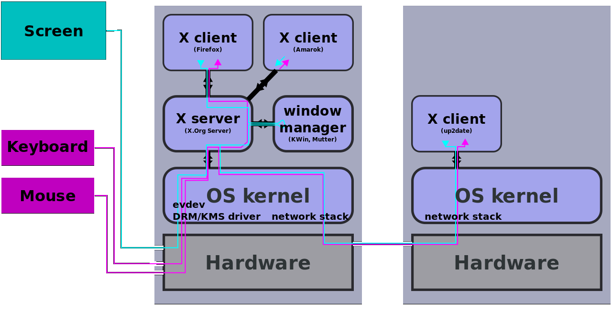
]

---

# 5 - Installer une distribution

**Pour le TP : on installera Linux Mint**

- (Choix arbitraire du formateur)
- Distribution simple, sobre, pas spécialement controversée (?)
- Profite de la stabilité de Debian et de l'accessibilité d'Ubuntu

---

# 5 - Installer une distribution

## Procédure d'installation générale

<small>(Prerequis : avoir accès au BIOS du système (et avoir de la place))</small>

- Télécharger et flasher une "Live CD/USB"
- Dire au BIOS de booter sur la "Live CD/USB"
- Lancer l'installation
    - (définir un plan de partitionnement)
- Prendre un café
- Rebooter et vérifier que ça a fonctionné

---

# 5 - Installer une distribution

## Telecharger l'ISO

.center[

]

---

# 5 - Installer une distribution

## Vérifier l'intégrité / authenticité

.center[

]

#### Sous Linux: `sha256sum <fichier>` directement disponible

#### Sous Windows: ... il faut trouver un `sha256sum.exe`


---

# 5 - Installer une distribution

## Le BIOS

- Programme lancé par la machine à son démarrage
- Change entre les modèles de PC ...
- Gère différent aspects "bas-niveau" (e.g. horloge intégrée)
- Gère le lancement du "vrai" système d'exploitation
    - analyse typiquement le lecteur CD
    - ... puis le HDD
    - ... puis le network (PXE)
    - ...
- De nos jours, l'UEFI et Secure boot complique beaucoup les choses ...

---

# 5 - Installer une distribution

## Le BIOS

.center[

]

---

# 5 - Installer une distribution

## Live CD/USB

- Un système généralement "éphémère" (données perdues)
- Typiquement sur un CD rom ou une clef USB
- Système entièrement chargé dans la RAM (performances moindres)
- Destiné à tester / faire une démo du système et à l'installer
- Permet aussi d'avoir accès à certains outils
- Généralement sous forme d'un fichier `.iso`

---

.center[

]

---

# 5 - Installer une distribution

## Lancer l'installation

.center[

]

---

# 5 - Installer une distribution

## Lancer l'installation

.center[
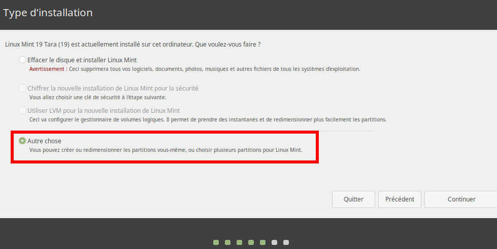
]

---

# 5 - Installer une distribution

## Plan de partitionnement (exemple!)

- 300 Mo pour `/boot/` en ext4
- 12 Go pour `/` en ext4
- 3 Go pour `/home/` en ext4
- Le reste en swap (une extension "lente" de la RAM)

.center[

]

---

# 5 - Installer une distribution

## Lancer l'installation "pour de vrai"

- Répondre aux questions pour créer l'utilisateur, etc...
- ... le système s'installe ...

---

# 5 - Installer une distribution

## Finir l'installation

- Redémarrer
- (Enlever le média d'installation)
- (Dire au BIOS de booter de nouveau sur le HDD)

---

# 5 - Installer une distribution

## GRUB

.center[

]

---

# 5 - Installer une distribution

## GRUB

.center[

]


---

# 5 - Installer une distribution

## Résumé du boot complet (du Bios à l'interface de login)

.center[

]

---

# 5 - Installer une distribution

## Log du boot

- Les logs du boot du kernel (contient aussi par ex. le log de la détection de dispositif USB branchés après le boot, etc...)
peuvent être trouvés dans `/var/log/dmesg`

---

# 5 - Installer une distribution

## Init levels / Run levels

- 0 = Shutdown
- 1 = Single-user mode : Mode for administrative tasks
- 2 = Multi-user mode, without network interfaces
- 3 = Multi-user mode with networking
- 4 = ... not used ...
- 5 = Multi-user with networking and graphical environment
- 6 = Reboot

### Sous SysVinit, choses à lancées décrites dans /etc/rc.d/rcX.d/... mais aujourd'hui : c'est différent avec systemd...

---

# 5 - Installer une distribution

## Login

.center[
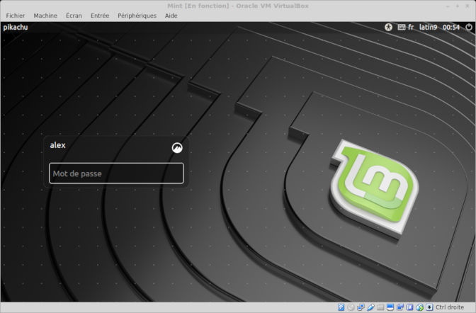
]

---

# 5 - Installer une distribution

## Le bureau

.center[

]

---

# 5 - Installer une distribution

## Notation des patitions

.center[
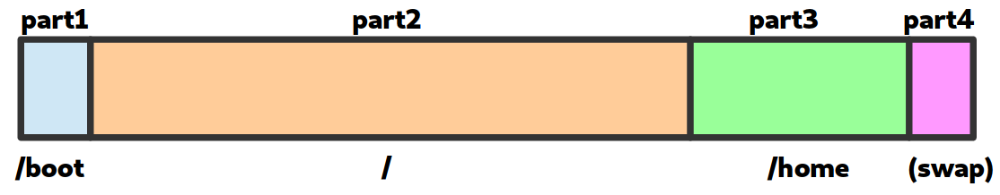
]

---

# 5 - Installer une distribution

## Notation des patitions

Les disques partitions sous Linux sont généralement dénommées :

- `/dev/sda` (premier disque)
   - `/dev/sda1` (première partition de /dev/sda)
   - `/dev/sda2` (deuxieme partition de /dev/sda)
- `/dev/sdb` (deuxieme disque)
   - `/dev/sdb1` (première partition de /dev/sdb)
   - `/dev/sdb2` (deuxieme partition de /dev/sdb)
   - `/dev/sdb3` (troisieme partition de /dev/sdb)

---

# 5 - Installer une distribution

## Outil pour lister les disques, gérer les partions

```bash
$ fdisk -l
Disk /dev/sda: 29.8 GiB, 32017047552 bytes, 62533296 sectors
[...]
Device       Start      End  Sectors  Size Type
/dev/sda1     2048  2099199  2097152    1G Linux filesystem
/dev/sda2  2099200 62524946 60425747 28.8G Linux filesystem
```

---

# 5 - Installer une distribution

## Les points de montage

Une partition ou n'importe quel "bidule de stockage" peut être "monté" dans le système de fichier
- partition
- clef usb
- image iso
- stockage distant
- ...

---

# 5 - Installer une distribution

## Les points de montage

.center[

]


---

# 5 - Installer une distribution

## Les points de montage

Les points de montages sont gérés avec `mount`

```bash
$ mkdir /media/usbkey
$ mount /dev/sdb1 /media/usbkey
$ ls /media/usbkey
# [le contenu de la clef usb s'affiche]
```

---

# 5 - Installer une distribution

## Les points de montage

On peut "démonter" un element monté avec `umount`

```bash
$ umount /media/usbkey
```

---

# 5 - Installer une distribution

## Les points de montage : `/etc/fstab`

`/etc/fstab` décrit les systèmes de fichier montés automatiquement au boot

```text
# <file system>     <mountpoint> <type>  <options>       <dump>  <pass>
UUID=[id tres long] /            ext4    default         0       1
UUID=[id tres long] /home/       ext4    defaults        0       2
```

<small>(historiquement, la premiere colomne contenait `/dev/sdxY`, mais les UUID sont plus robustes)</small>

---

# 5 - Installer une distribution

## Les points de montage : outils

Juste `mount` permet aussi de lister les différents points de montage

```bash
$ mount
[...]
/dev/sda1 on /boot type ext4 (rw,noatime,discard,data=ordered)
/dev/sda2 on / type ext4 (rw,noatime,discard,data=ordered)
```

---

# 5 - Installer une distribution

## Les points de montage : outils

Il existe aussi `df` :

```bash
$ df -h
Filesystem      Size  Used Avail Use% Mounted on
dev             2.8G     0  2.8G   0% /dev
run             2.8G  1.1M  2.8G   1% /run
/dev/dm-0        29G   22G  5.0G  82% /
tmpfs           2.8G   22M  2.8G   1% /dev/shm
tmpfs           2.8G     0  2.8G   0% /sys/fs/cgroup
tmpfs           2.8G  1.9M  2.8G   1% /tmp
/dev/sda1       976M  105M  804M  12% /boot
tmpfs           567M   16K  567M   1% /run/user/1000
```

---

# 5 - Installer une distribution

## Les points de montage : outils

Et aussi `lsblk` :

```bash
$ lsblk
NAME          MAJ:MIN RM  SIZE RO TYPE  MOUNTPOINT
sda             8:0    0 29.8G  0 disk
├─sda1          8:1    0    1G  0 part  /boot
└─sda2          8:2    0 28.8G  0 part  /
```

---

# 5 - Installer une distribution

## Obtenir des infos sur le matériel

- `lsblk` : lister les stockages
- `lsusb` : lister les périphériques USB
- `lspci` : lister les périphériques PCI
- `lscpu` : lister les CPU (ou bien : `cat /proc/cpuinfo`)
- `lsmem` : lister les barettes de RAM (ou bien : `free -h`)
- `ip a`: lister les interfaces réseau

Ou encore des outils plus généraux (à installer, pas présent sur le système de base) : `lshw`, `hwinfo`, `dmidecode`, `inxi`

---

# 5 - Installer une distribution

## Autres configurations du système (avec `systemd`)

- `hostnamectl` 
- `timedatectl`
- `localectl`

---

class: impact

# 6 - Le gestionnaire de paquet

### (et les archives)

---

# 6 - Le gestionnaire de paquet

## Motivation

Historiquement, c'est très compliqué d'installer un programme :
- le télécharger et le compiler
- la compilation (ou le programme lui-même) requiert des dependances
- il faut télécharger et compiler les dépendances
- qui requiert elles-mêmes des dépendances ...

### Paquet =~ programmes ou librairies

---

# 6 - Le gestionnaire de paquet

## Le travail d'une distribution <small>(entre autre)</small>

- créer et maintenir un ensemble de paquet cohérents
- ... et le gestionnaire de paquet qui va avec
- les (pre)compiler pour fournir des binaires

---

# 6 - Le gestionnaire de paquet

## Le gestionnaire de paquet c'est :

- La "clef de voute" d'une distribution ?
- un **système unifié pour installer** des paquets ...
- ... **et les mettre à jour !**
- le tout en gérant les dépendances et les conflits
- et via une commaunauté qui s'assure que les logiciels ne font pas n'importe quoi.

---

# 6 - Le gestionnaire de paquet

## Comparaison avec Windows

Sous Windows
- téléchargement d'un .exe par l'utilisateur ...
- ... depuis une source obscure ! (**critical security risk !**)
- procédure d'installation spécifique
- ... qui tente de vous refiler des toolbar bloated, et/ou des CGU obscures
- système de mise à jour spécifique
- nécessité d'installer manuellement des dépendances

---

# 6 - Le gestionnaire de paquet

.center[
*One package to rule them all*

*One package to find them*

*One package to download them all*

*and on the system bind them*
]

---

# 6 - Le gestionnaire de paquet

## Sous Debian

`apt` : couche "haut niveau"
- dépot,
- authentification,
- ...

`dpkg` : couche "bas niveau"
- gestion des dépendances,
- installation du paquet (`.deb`),
- ...

---

# 6 - Le gestionnaire de paquet

## Parenthèse sur `apt-get`

- Historiquement, `apt-get` (et `apt-cache`, `apt-mark`, ..) étaient utilisés
- Syntaxe inutilement complexe ?
- `apt` fourni une meilleur interface (UI et UX)

---

# 6 - Le gestionnaire de paquet

## Utilisation de `apt`

- `apt install <package>`
    - télécharge et installe le paquet et tout son arbre de dépendances
- `apt remove <package>`
    - désinstaller le paquet (et les paquet dont il dépends !)
- `apt autoremove`
    - supprime les paquets qui ne sont plus nécessaires

---

# 6 - Le gestionnaire de paquet

.center[
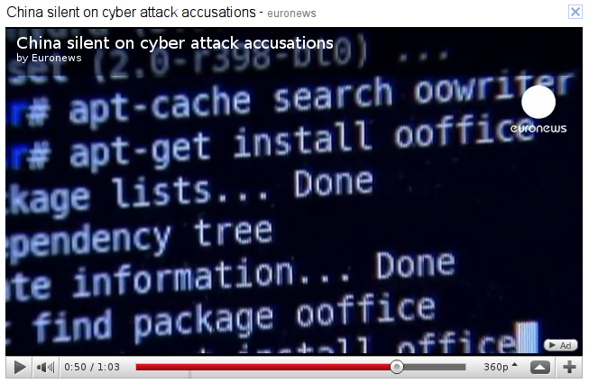
]


---

# 6 - Le gestionnaire de paquet

## Mais qu'est-ce que c'est, un paquet ?

Un programme, et des fichiers (dossier `debian/`) qui décrivent le paquet :
- `control` : décrit le paquet et ses dépendances
- `install` : liste des fichiers et leur destination
- `changelog` : un historique de l'evolution du paquet
- `rules` : des trucs techniques pour compiler le paquet
- `postinst`, `prerm`, ... : des scripts lancés quand le paquet est installé, désinstallé, ...

---

# 6 - Le gestionnaire de paquet

## Mettre à jour les paquets

- `apt update`
   - récupère la liste des paquets depuis les dépots
- `apt full-upgrade`
   - calcule et lance la mise à jour de tous les paquets
   - (anciennement appelé : `apt dist-upgrade`)
- Moins utilisé : `apt upgrade`
   - mise à jour "safe", sans installer/supprimer de nouveaux paquets
   - en général, `full-upgrade` est okay

---

# 6 - Le gestionnaire de paquet

N.B. : pour les moldus dans la vraie vie, il y a des interfaces graphiques pour gérer tout ça sans ligne de commande, mais ici on présente les détails techniques

---

# 6 - Le gestionnaire de paquet

## Les dépots

Les dépots de paquets sont configurés via `/etc/apt/sources.list` et les fichiers du dossier `/etc/apt/sources.list.d/`.

Exemple :
```
deb http://ftp.debian.fr/debian/ bookworm main contrib
```

- `bookworm` est le nom de la version majeure actuel de la distribution
- `main` et `contrib` sont des composantes à utiliser
- le protocole est `http` ... l'authenticité des paquets est géré par un autre mécanisme (GPG)

---

# 6 - Le gestionnaire de paquet

## Les versions de Debian

Debian vise un système libre et très stable

- `stable` : paquets éprouvés et très stable (bien que souvent un peu vieux)
- `testing` : paquets en cours de test, comportant encore quelques bugs
- `unstable` (sid) : pour les gens qui aiment vivre dangereusement

Les versions tournent tous les ~2 ans environ
- l'ancienne `testing` devient la nouvelle `stable`
- le passage de version peut être un peu douloureux ... (quoiqu'en vrai c'est de + en + smooth)

---

# 6 - Le gestionnaire de paquet

## Les versions de Debian

Basé sur les personnages de Toy Story

- 9, `stretch` (oldoldoldstable, été 2017)
- 10, `buster` (oldoldstable, été 2019)
- 11, `bullseye` (oldstable, été 2021)
- ➡️ **12, `bookworm` (stable, depuis juin 2023)**
- 13, `trixie` (testing, devindra stable en été 2025 ?)
- 14, `forky` (été 2027 ?)

---

# 6 - Le gestionnaire de paquet

.center[

]

---

# 6 - Le gestionnaire de paquet

.center[

]


---

# 6 - Le gestionnaire de paquet

## Naviguez dans les paquets debian en ligne

`https://packages.debian.org/search`

.center[

]

---

# 6 - Le gestionnaire de paquet

## Les backports

- Un intermédiaire entre stabilité et nouveauté
- Fournissent des paquets venant de `testing` en `stable`
- À utiliser avec prudence

## En pratique ...

- Si on a besoin de dépendances récentes, on les installe généralement avec le gestionnaire de paquet correspondant au language de notre app : `pip`, `npm`, `composer`, `carton`, `gem`, ... 

---

# 6 - Le gestionnaire de paquet

## Et les autres distributions ?

- RedHat/Centos : `yum install <pkg>`, `yum search <keyword>`, `yum makecache`, `yum update`, ...
   - plus moderne (meilleure perf et UX) : `dnf` !

- Archlinux : `pacman -S <pkg>`, `-Ss <keyword>`, `-Syu`, ...

---

# 6 - Le gestionnaire de paquet

## Quid de RedHat / CentOS ?

Red Hat : l'une des (la?) plus grosse entreprise dédiée à l'open source 

Historiquement : 
- **RHEL** (Red Hat Enterprise Linux) : une version de Linux éditée par Red Hat, basée sur Fedora, mais avec avec des garanties de qualité, sécurité et support long terme (payant)
- **CentOS** (Community Enterprise OS) : une version "gratuite" (mais sans support) de RHEL (utilisée par de nombreuse entreprise qui n'ont pas les moyens d'avoir une license RHEL)

Une histoire compliquée, des changements de politique en 2021 et 2023 ...
- Red Hat semble avoir une volontée de mettre le grapin sur les entreprises qui utilisent CentOS 
- [CentOS Stream : ce qui va changer et comment se préparer](https://goodtech.info/centos-stream-ce-qui-va-changer-et-comment-se-preparer/)
- [Red Hat and the Clone Wars (4 articles)](https://dissociatedpress.net/2023/06/24/red-hat-and-the-clone-wars/)

---

# 6 - Le gestionnaire de paquet

## Quid de RedHat / CentOS ?

De nos jours : 

- **Fedora** : innovation/integration (10000 projets upstream). Cadence "rapide" : nouvelle version majeure tous les 6 mois, maintenues ~un an
- **CentOS "stream"** : basé sur une version spécifique de Fedora, corresponds à une "rolling release" de Red Hat pour les versions RHEL
- **RHEL** : idem qu'historiquement ... nouvelles versions majeures tous les ~3 ans, support jusqu'à 10~14 ans (!!). Nouvelle version mineure tous les ~6 mois
- **AlmaLinux** et **RockyLinux** : des tentatives pour recréer un "RHEL gratuit" comme CentOS l'était avant. Visent une compatibilité extrêmement proche ("bug-for-bug") de RHEL.

---

.center[
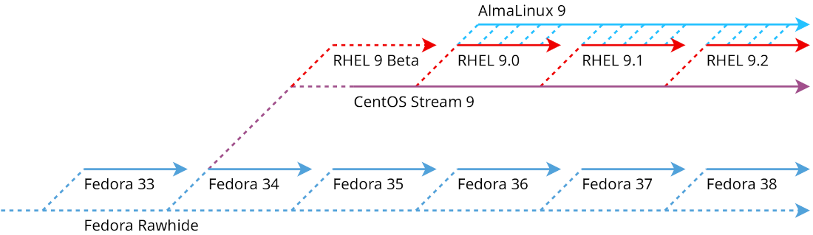
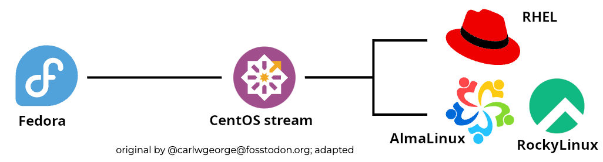
]

---

.center[
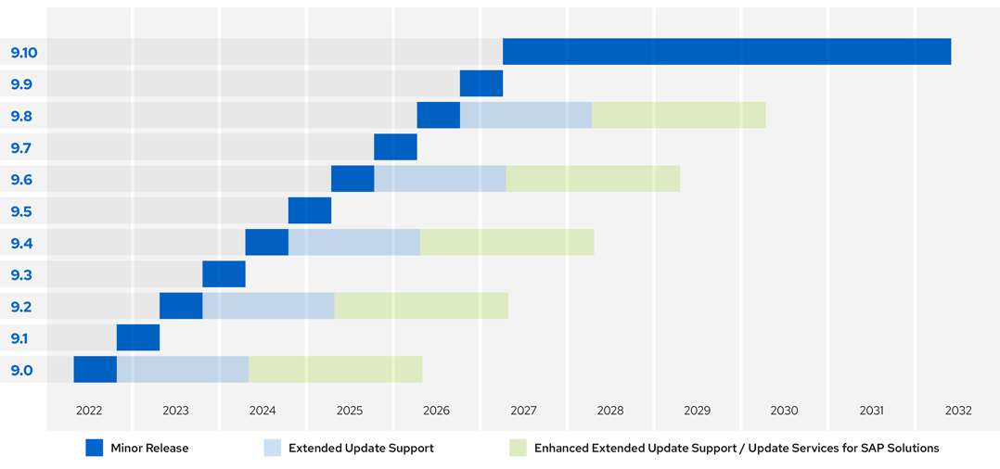
]


---

<https://www.openlogic.com/blog/top-open-source-operating-systems-2022>

.center[
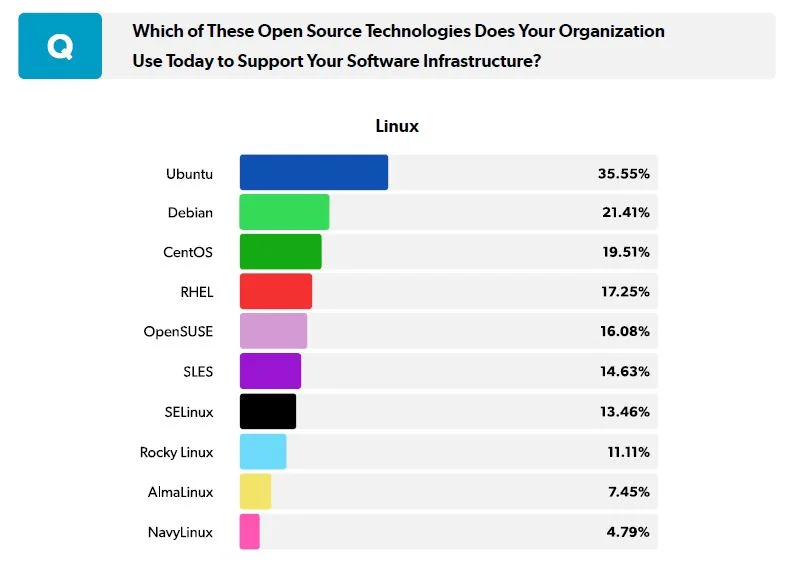
]

---

# 6 - Le gestionnaire de paquet

## Debian versus RHEL

- (Une comparaison plus pertinente serait Ubuntu Server versus RHEL)
- Debian utilise des `.deb` (`dpkg` + `apt`)
- RHEL utilise des `.rpm` (`rpm` + `yum`/`dnf`)
- RHEL intègre de base SELinux (Security-Enhanced Linux) -> <https://www.youtube.com/watch?v=_WOKRaM-HI4>
- RHEL encourage l'utilisation de `XFS` tandis que Debian utilise traditionelle du `ext4`
- Red Hat dispose d'outils spécifiques pour de la gestion de parc (Red Hat Satellite) ou cloud (OpenShift)

---

# 6 - Le gestionnaire de paquet

## Gérer des archives

`tar` (tape archive) permet de créer des archives (non compressées) qui rassemblent des fichiers.

```bash
# Créer une archive monarchive.tar
tar -cvf monarchive.tar file1 file2 folder2/ folder2/

# Désassembler une archive
tar -xvf monarchive.tar
```

---

# 6 - Le gestionnaire de paquet

## Gérer des archives

`gzip` (gunzip) permet de compresser des fichiers (similaire aux .zip, .rar, ...)

```bash
# Compresser zblorf.scd
gzip zblorf.scd

# [...] le fichier a été compressé et renommé zblorf.scd.gz

# Decompresser le fichier :
gzip -d zblorf.scd.gz
```

---

# 6 - Le gestionnaire de paquet

## Gérer des archives

`tar` peut en fait être invoqué avec `-z` pour générer une archive compressée

```bash
# Créer une archive compressée
tar -cvzf monarchive.tar.gz file1 file2 folder2/ folder2/

# Désassembler une archive
tar -xvzf monarchive.tar.gz
```

---

# 6 - Le gestionnaire de paquet

## Gérer des archives

.center[

]


---

class: impact

# 7 - Notions de réseau

## en 60 slides !

---

# 7 - Notions de réseau

## Objectifs

- Comprendre et savoir se représenter les différentes couches
- Savoir faire quelques des tests "de base"
- ... et les commandes associées

.center[

]

---

# 7 - Notions de réseau

## Notions essentielles à acquérir

- Comprendre ce qu'est une IP
- Comprendre ce qu'est un port
- Comprendre ce qu'est un client et un serveur (au sens logiciel) 
- Comprendre ce qu'est un nom de domaine
- Comprendre ce qu'il se passe sous le capot lorsque vous visitez une page web

---

# 7 - Notions de réseau

## Teh interntez

.center[

]

---

# 7 - Notions de réseau

## Modele OSI

- Un empilement de couches
- Est là pour structurer la complexité du réseau
- Similaire au système : créer des abstractions
    - pour ne pas avoir à se soucier de ce qui se passe dans les couches "basses"
    - pour l'interopérabilité
- Chaque parti sur Internet implémente ces couches

---

.center[
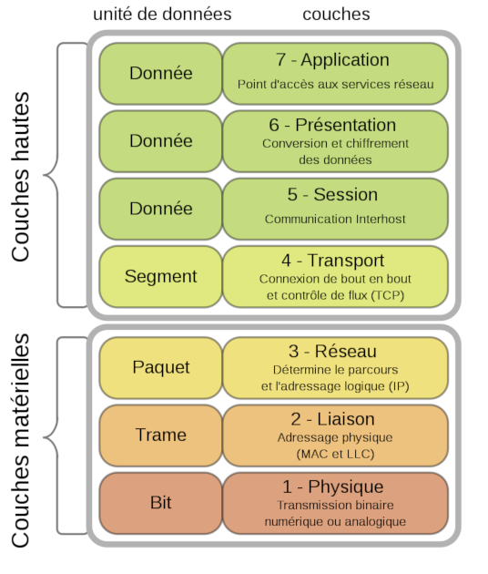
]

---

.center[

]

---

# 7 - Notions de réseau

## Modele OSI "simplifié": le modèle TCP/IP

- Application
- Transport (TCP)
- Internet (IP)
- Accès réseau (Ethernet, cables, ondes, ...)

---

# 7 - Notions de réseau

## Encapsulation des données

.center[
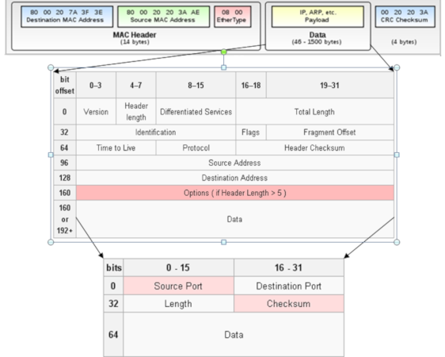
]

---

.center[

]

---

# 7 - Notions de réseau

## Exemple de réseau

.center[
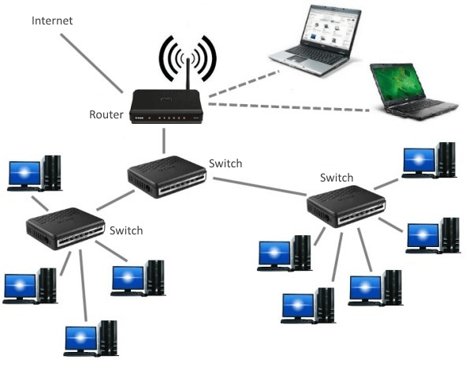
]


---

# 7 - Notions de réseau

## Couche 1 : cable RJ45 / paires torsadées

.center[

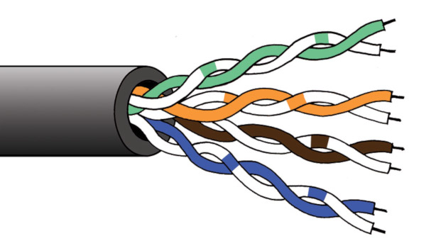
]

- Différentes catégories de cable : CAT 5, 6, 7, (8)


---

# 7 - Notions de réseau

## Couche 1 : WiFi

.center[

]

- 2.4 GHz vs. 5 GHz
    - 2.4 GHz : meilleure portée, mais moins rapide, peu de canaux
    - 5 GHz : moins bonne portée, mais plus rapide, plus de canaux 

---

# 7 - Notions de réseau

## Couche 1 : 4G/5G

.center[

]

---

# 7 - Notions de réseau

## Couche 1 : fibre optique

.center[

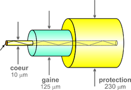
]

---

# 7 - Notions de réseau

## Couche 1 : liaisons intercontinentales

.center[
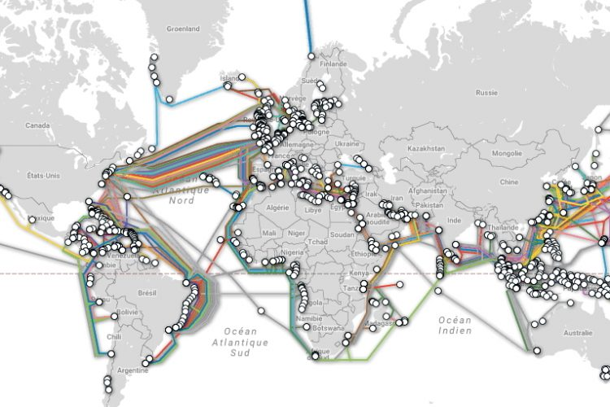
]


---

# 7 - Notions de réseau

## Couche 2 : Ethernet

- Protocole pour transmettre l'information sur le médium physique
- Adresse MAC, par ex. `4c:96:0b:7d:d3:1a`
- Les ordinateurs disposent de cartes d'interface ethernet (filaire, wifi)
- (Ethernet s'applique **aussi** au WiFi)

.center[

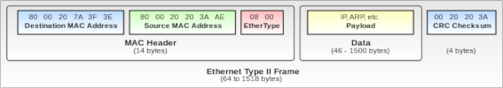
]

---

# 7 - Notions de réseau

## Couche 2 : Ethernet

- Les `switch` permettent de connecter plusieurs machines pour créer segment
- Un `switch` est "conscient" de la notion d'adresse ethernet

.center[
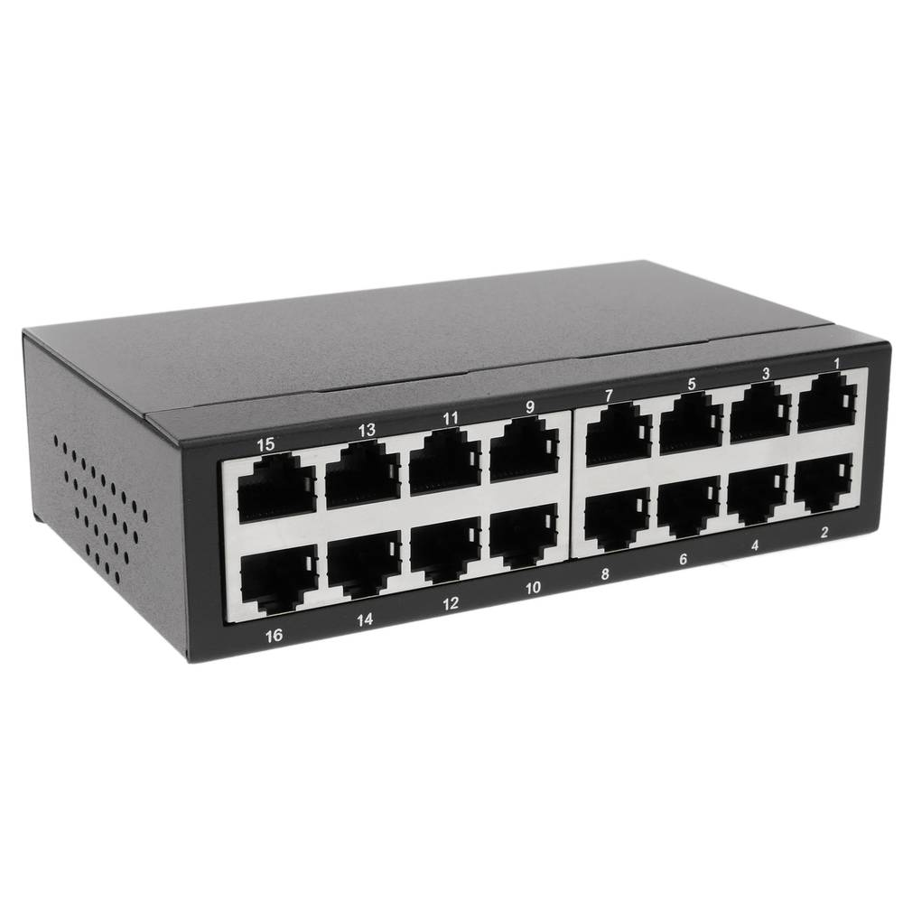
]

---

# 7 - Notions de réseau

## Couche 2 : Ethernet

- Un `bridge` permet de "fusionner" plusieurs LAN ensemble

.center[
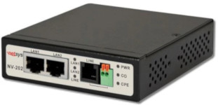
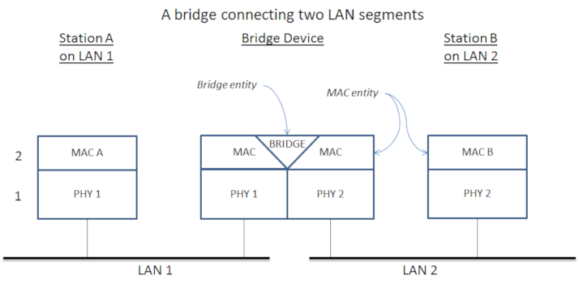
]


---

# 7 - Notions de réseau

## Couche 2 : Ethernet

Qu'est-ce qu'un VLAN ?


---

# 7 - Notions de réseau

## Couche 2 : les interfaces dans Linux

- Les interfaces sont configurées grâce aux fichiers `/etc/network/interfaces` et `/etc/network/interfaces.d/*`
- `ip a` permet d'obtenir des informations sur les interfaces
    - Historiquement, les noms étaient "simple" : `eth0`, `eth1`, `wlan0`, ...
    - Aujourd'hui les noms sont un peu plus complexes / arbitraires
    - Il existe toujours une interface `lo` (loopback, la boucle locale - 127.0.0.1)
    - Il peut y'avoir d'autres interfaces ou bridges "virtuelles" (contexte de conteneur, etc..)
- version courte, moins technique avec `ip -br a`

---

# 7 - Notions de réseau

## Couche 2 : les interfaces dans Linux

```bash
$ ip a
1: lo: <LOOPBACK,UP,LOWER_UP>
    link/loopback 00:00:00:00:00:00 brd 00:00:00:00:00:00
    [...]
2: enp0s25: <NO-CARRIER,BROADCAST,MULTICAST,UP>
    link/ether 33:0e:d8:3f:65:7e
    [...]
3: wlp3s0: <BROADCAST,MULTICAST,UP,LOWER_UP>
    link/ether 68:a6:2d:9f:ad:07
    [...]


$ ip -br a
lo               UNKNOWN        127.0.0.1/8 ::1/128
enp0s25          DOWN           169.254.8.190/16
wlp3s0           UP             192.168.1.172/24 2a01:e0a:b28:ab40:xxxx:xxxx:xxxx:xxxx/64 fe80::51d3:7ab2:9548:5353/64
```

---

# 7 - Notions de réseau

## Couche 2 : le fichier `/etc/network/interfaces`

NB : de nos jours, la très grande majorité du temps, la config de base DHCP fonctionne très bien

```
allow-hotplug eth0
iface eth0 inet dhcp
```

Mais on peut aussi faire une config manuelle, par ex. :

```
auto ens33
iface ens33 inet static
    address 10.0.0.43
    netmask 255.255.255.0
    gateway 10.0.0.138
    dns-search exemple.com
    dns-nameservers 8.8.8.8 4.4.4.4
```

---

# 7 - Notions de réseau

## Couche 3 : IP

- IP pour *Internet Protocol*
- IP fait parler **des machines** !
    - .. et permet de relier plusieurs réseaux, qui potentiellement ont des fonctionnements différents
- Protocole de routage des paquets
    - "Best-effort", non fiable !
- Les routeurs, les facteurs d'internet
    - par ex. votre box internet
    - Routeur != Switch, un routeur "comprends" les adresses et protocole IP
    - Capable de discuter entre eux pour optimiser l'acheminement (BGP)

---

# 7 - Notions de réseau

## Couche 3 : IP

- Internet, c'est avant-tout une INTERconnexion d'opérateurs réseaux (NET)
- Ex: le réseau de l'opérateur Proxad

.center[
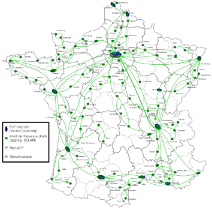
]

---

## Couche 3 : IP

- Les opérateurs (AS) s'interconnectent (peering) dans des IXP
- Croissance "organique" du réseau

.center[
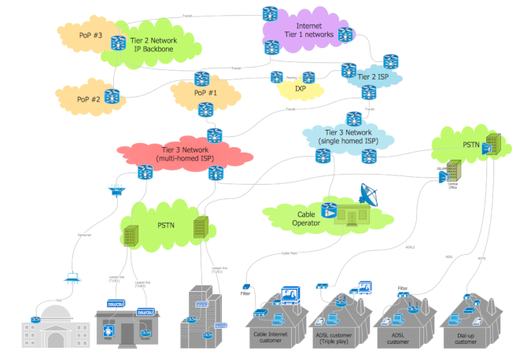
]


---

# 7 - Notions de réseau

## Couche 3 : IP : système d'adressage (IPv4) 

- addresses codées sur 32 bits (4 nombres entre 0 et 255)
- par exemple `92.93.127.10`
- "seulement" 4.3 milliards d'adresses ! (pénurie)

---

# 7 - Notions de réseau

## Couche 3 : IP : IPv4 frame / paquet

.center[

]

---

# 7 - Notions de réseau

## Couche 3 : IP

- Distribution des addresses IP gérées par des ONG (IANA, RIR, LIR, ISP, ...)

.center[
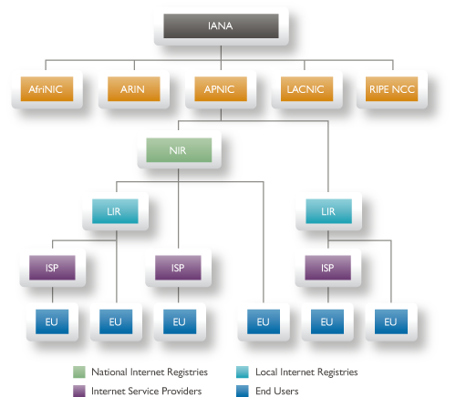
]

---

# 7 - Notions de réseau

## Couche 3 : IP

- Distribution des addresses IP gérées par des ONG (IANA, RIR, LIR, ISP, ...)

.center[
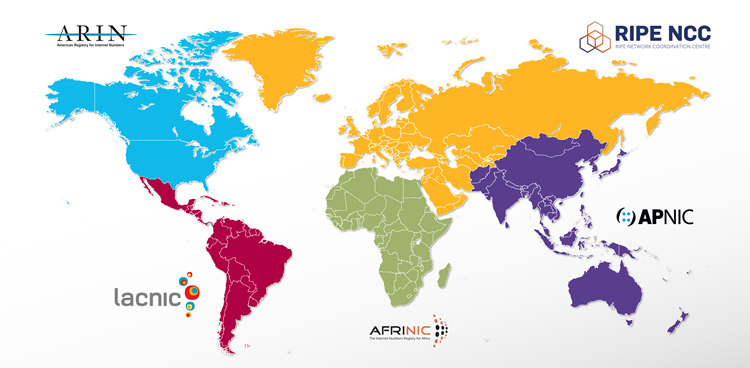
]


---

# 7 - Notions de réseau

## Couche 3 : IP

- Notion de plage d'IP, réseau, masques de sous-réseau, notation CIDR
    - une adresse IP est composée d'une partie "réseau" (préfixe) et d'une partie "hote"
    - par exemple `192.65.196.0/23` est un bloc de 512 IP attribué au CERN
    - `/23` signifie que les 23 premiers bits constituent la partie réseau
    - Il reste donc 32-23=9 bits pour la partie hote, soit 2^9 = 512 IP
    - Les masques "typiques" sont `/8`, `/16`, `/24` et `/32`

---

# 7 - Notions de réseau

## Couche 3 : IP

- Certains blocs d'IP sont réservés à certains usages
    - Loopback (interne à la machine)
        - `127.0.0.0/8` (c.f. typiquement `127.0.0.1`)
    - Réseau locaux (private network)
        - `192.168.0.0/16`
        - `10.0.0.0/8`
        - `172.16.0.0/12` 
    - Autres : c.f. https://en.wikipedia.org/wiki/Reserved_IP_addresses

---

# 7 - Notions de réseau

## Couche 3 : Et l'IPv6 ?

- Addresses codées sur 128 bits (soit 2^94 fois plus d'adresses que IPv4 -> 10^38 addresses)
   - Par exemple, `2a04:7260:9088:6c00:0044:0000:0000:0001`
   - En IPv6, on peut simplifier les `0` et juste écrire: `2a04:7260:9088:6c00:44::1`
   - L'équivalent de `127.0.0.1` est `::1`
   - L'équivalent de `192.168.0.0/16` est `fc00::/10`
   - Les masques vont jusqu'à `/128`
- Beaucoup plus commun d'avoir directement un IP "globale" pour chaque machine, "directement" exposée sur le "vrai" internet
    - ... voir même un préfixe, comme par exemple un `/56`
   

---

# 7 - Notions de réseau

## Couche 3 : Et l'IPv6 ?

- Certains commandes ont un équivalent "v6" (par ex. `ping6`) et/ou une option `-6` (par ex. `ping -6`)
    - pour les URLs, le `:` conflicte avec la notation des ports, il faut alors écrire l'IP entre crochet
    - par ex: `https://[2001:db8:85a3:8d3:1319:8a2e:370:7348]:443/`

---

# 7 - Notions de réseau

## Couche 3 : Et l'IPv6 ?

- Existe depuis 1998 (sigh)
- Incompatible avec IPv4
    - période de transition "dual-stack"
    - problème d'oeuf et la poule / pas d'offre = pas de demande, etc

---

# 7 - Notions de réseau

## Couche 3 : commandes essentielles

`ip a` affiche les interfaces (et IPv4 et v6 associées)

```bash
$ ip a
enp3s0: <BROADCAST,MULTICAST,UP,LOWER_UP>
 link/ether 40:8d:5c:f3:3e:35
 inet 91.225.41.29/32 scope global enp3s0
 inet6 2a04:7202:8008:60c0::1/56 scope global
```

Voir aussi : `ifconfig` (deprecated) et `ipconfig` (sous windows!)

---

# 7 - Notions de réseau

## Couche 3 : commandes essentielles

`ping` teste la connexion entre deux machines

```bash
$ ping 91.198.174.192
PING 91.198.174.192 (91.198.174.192) 56(84) bytes of data.
64 bytes from 91.198.174.192: icmp_seq=1 ttl=58 time=51.5 ms
64 bytes from 91.198.174.192: icmp_seq=2 ttl=58 time=65.3 ms
^C
--- 91.198.174.192 ping statistics ---
2 packets transmitted, 2 received, 0% packet loss, time 3ms
rtt min/avg/max/mdev = 51.475/58.394/65.313/6.919 ms
```

Note: `ping` utilise le protocole `ICMP` qui a lieu au niveau de la couche 3 (ou 4 ?)

---

# 7 - Notions de réseau

## Couche 3 : commandes essentielles

`whois` pour obtenir des infos sur le(s) proprio(s) d'une ip

```
$ whois 91.198.174.192
[...]
organisation:   ORG-WFI2-RIPE
org-name:       Wikimedia Foundation, Inc
[...]
mnt-by:         RIPE-NCC-HM-MNT
mnt-by:         WIKIMEDIA-MNT
```

---

# 7 - Notions de réseau

## Couche 3 : commandes essentielles

`traceroute` permet d'étudier la route prise par les paquets

```bash
$ traceroute 91.198.174.192
 1  _gateway (192.168.0.1)  4.212 ms  6.449 ms  6.482 ms
 2  * 10.13.25.1 (10.13.25.1)  248.615 ms *
 3  211-282-253-24.rev.numericable.fr (211.282.253.24)  251.263 ms  251.332 ms  251.408 ms
 4  172.19.132.146 (172.19.132.146)  251.493 ms ip-65.net-80-236-3.static.numericable.fr (80.236.3.65)  251.569 ms  251.619 ms
 5  prs-b7-link.telia.net (62.115.55.45)  251.692 ms  251.769 ms  251.979 ms
 6  prs-bb4-link.telia.net (62.115.120.30)  252.026 ms prs-bb3-link.telia.net (62.115.121.96)  17.989 ms prs-bb4-link.telia.net (213.155.134.228)  1069.536 ms
 7  adm-bb4-link.telia.net (213.155.136.167)  1070.116 ms  1242.772 ms adm-bb3-link.telia.net (213.155.136.20)  1242.839 ms
 8  adm-b3-link.telia.net (62.115.122.179)  1243.006 ms adm-b3-link.telia.net (62.115.122.191)  1242.879 ms  1243.082 ms
[...]
```

---

# 7 - Notions de réseau

## Couche 4 : TCP

- TCP pour Transmission Control Protocol (1/2)
- TCP est un protocole parmis d'autres qui ont lieu sur la couche 4
    - typiquement, il y a aussi UDP ...
- TCP fait communiquer **des programmes**
    - il y a une mise en place explicite d'un tuyau de communication
- Découpage des messages en petits paquets pour IP
- Fiabilité avec des accusés de réception / renvois

---

# 7 - Notions de réseau

## Couche 4 : Notion de port

- TCP fourni un "tuyau de communication" entre deux programmes
- Notion de 'port' : un nombre entre 1 et 65536 (2^16)
    - Analogie avec les différents "departement" à l'intérieur d'une entreprise
    - plusieurs programmes sur une même machine peuvent vouloir communiquer avec un même programme sur une machine distante, donc l'addresse IP ne suffit pas pour spécifier l'expéditeur / destinataire
- Une connexion entre deux programme est caractérisé par **deux** couples (IP:port) 
- Par exemple : votre navigateur web (port 56723) qui discute qui discute avec le serveur web (port 80)
    - côté A : 183.92.18.6:56723 (un navigateur web)
    - côté B : 91.198.174.192:80 (un serveur web)

---

# 7 - Notions de réseau

## Couche 4 : commandes essentielles

`lsof -i` pour lister les connexions active

```bash
$ lsof -i
ssh        3231 alex IPv4 shadow.local:34658->142.114.82.73.rev.sfr.net:ssh (ESTABLISHED)
thunderbi  3475 alex IPv4 shadow.local:59424->tic.mailoo.org:imap (ESTABLISHED)
thunderbi  3475 alex IPv4 shadow.local:57312->tic.mailoo.org:imap (ESTABLISHED)
waterfox  12193 alex IPv4 shadow.local:54606->cybre.space:https (ESTABLISHED)
waterfox  12193 alex IPv4 shadow.local:32580->cybre.space:https (ESTABLISHED)
```

---

# 7 - Notions de réseau

## Couche 4 : commandes essentielles

ACHTUNG : ne pas abuser de cela..

```bash
$ nc -zv 44.112.42.13 22
Connection to 44.112.42.13 22 port [tcp/ssh] succeeded!
```

---

# 7 - Notions de réseau

## Couche 4 : commandes avancées

Étudier l'activité sur le réseau
- `tcpdump` pour regarder l'activité sur le réseau
- `wireshark`, similaire à tcpdump, mais beaucoup plus puissant, et en interface graphique

Configurer des règles (typiquement pare-feu, redirection de port)
- `iptables` ... ou `nftables` (plus moderne ... mais moins de doc dispo sur Internet?)
- `ufw` (pare-feu construit sur `iptables`, voir TP plus tard)


---

# 7 - Notions de réseau

## Couche 5+ : Modèle client/serveur

Un **serveur** (au sens logiciel) est un programme. Comme un serveur dans un bar (!) :
- il **écoute** et attends qu'on lui demande un **service** en suivant **un protocole**
- par exemple : fournir la page d'acceuil d'un site
- le serveur écoute sur *un port*  : par exemple : 80

Le **client** est celui qui demande le service selon **le protocole**
- il toque à la bonne porte
- explique sa demande
- le serveur lui réponds (on espère)

---

# 7 - Notions de réseau

## Couche 5+ : `netstat`

`netstat -tulpn` permet de lister les programmes qui écoutent et attendent

```bash
 > netstat -tulpn | grep LISTEN | grep "80\|25"
tcp     0.0.0.0:80  LISTEN   28634/nginx: master
tcp     0.0.0.0:25  LISTEN   1331/master # <- postfix, un serveur mail
tcp6    :::80       LISTEN   28634/nginx: master
tcp6    :::25       LISTEN   1331/master # <- postfix, un serveur mail
```

---

# 7 - Notions de réseau

## Couche 5+ : notion de protocole

- Un protocole = une façon de discuter entre programmes
- Conçus pour une finalité particulière
- Ont généralement un port "par défaut" / conventionnel (c.f. `/etc/services`)
   - 80/http : le web (des "vitrines" pour montrer et naviguer dans du contenu)
   - 443/https : le web (mais en chiffré)
   - 25/smtp : le mail (pour relayer les courriers électroniques)
   - 993/imap : le mail (synchroniser des boites de receptions)
   - 587/smtps : le mail (soumettre un courrier à envoyer)
   - 22/ssh : lancer des commandes à distance
   - 53/dns : transformer des noms en ip
   - 5222/xmpp : messagerie instantannée
   - 6667/irc : salons de chat

---

# 7 - Notions de réseau

## Couche 5+ : HTTP

- On ouvre un socket TCP avec le serveur distant
- On envoie `GET /` et on reçoit 200 + la page d'acceuil
- On envoie `GET /chaton.jpg` et on reçoit 200 + une image (si elle existe)
- On envoie `GET /meaningoflife.txt` et on reçoit 404 (si la page n'existe pas)
- On peut ajouter des Headers aux requetes et réponses (c.f. debugger firefox)
- Il existe d'autres requetes : POST, PUT, DELETE, ...

---

# 7 - Notions de réseau

## Couche 5+ : Le web

- Le web, ce n'est par Internet
- Le web est construit grace au language HTML, généralement transporté par HTTP
- "Web" désigne la "toile" créée par les liens hypertextes, une fonctionnalité introduite par HTML 


---

# 7 - Notions de réseau

## Le web

- Dans le modèle OSI:
    - 7 Application: votre onglet dans le navigateur, une application web
    - 6 Présentation: HTML, CSS, JS, PNG, ...
    - 5 Session: HTTP / HTTPs
    - 4 TCP
    - 3 IP
    - 2 (liaison)
    - 1 (physique)

---

# 7 - Notions de réseau

## DNS : Domain name server (1/5)

- Retenir cinquante numéros de telephone (ou coordonées GPS) par coeur, c'est pas facile
- On invente l'annuaire et les adresses postales
- `wikipedia.org -> 91.198.174.192`
- On peut acheter des noms chez des *registrars* (OVH, Gandi, ...)
- Composant critique d'Internet (en terme fonctionnel)
- Fonctionne en UDP et (et pas en TCP)

---

# 7 - Notions de réseau

## DNS : Domain name server (2/5)

- Il existe des résolveurs DNS à qui on peut demander de résoudre un nom via le protocole DNS (port 53)
- Par exemple :
    - 8.8.8.8, le resolveur de Google
    - 9.9.9.9, un nouveau service qui "respecte la vie privée"
    - 89.234.141.66, le resolveur de ARN
    - 208.67.222.222, OpenDNS
- **Choix critique pour la vie privée !!**
- Generalement, vous utilisez (malgré vous) le resolveur de votre FAI, ou bien celui de Google

---

# 7 - Notions de réseau

## DNS : Domain name server (3/5)

- Sous Linux, le resolveur DNS se configure via un fichier `/etc/resolv.conf`

```bash
$ cat /etc/resolv.conf
nameserver 89.234.141.66
```

---

# 7 - Notions de réseau

## DNS : Domain name server (4/5)

`ping` fonctionne aussi avec noms de domaine

`host` permet sinon de connaître l'ip associée

```bash
$ host wikipedia.org
wikipedia.org has address 91.198.174.192
wikipedia.org has IPv6 address 2620:0:862:ed1a::1
wikipedia.org mail is handled by 50 mx2001.wikimedia.org.
wikipedia.org mail is handled by 10 mx1001.wikimedia.org.
```

---

# 7 - Notions de réseau

## DNS : Domain name server (5/5)

- On peut outrepasser / forcer la résolution DNS de certains domaine avec le fichier `/etc/hosts`

```bash
 > cat /etc/hosts
127.0.0.1	localhost
127.0.1.1	shadow
::1	localhost ip6-localhost ip6-loopback
ff02::1 ip6-allnodes
ff02::2 ip6-allrouters

127.0.0.1 google.com
127.0.0.1 google.fr
127.0.0.1 www.google.com
127.0.0.1 www.google.fr
127.0.0.1 facebook.com
127.0.0.1 facebook.fr
```

---

.center[

]

---

.center[

]

---

.center[

]

---

# 7 - Notions de réseau

## Réseau local, DHCP, NAT (1/6)

- En pratique, on est peu souvent "directement" connecté à internet
    - MachinBox
    - Routeur de l'entreprise
- Pas assez d'IPv4 pour tout le monde
    - nécessité de sous-réseaux "domestique" / des réseau "local"
    - basé sur les NAT (network address translation)
- Quand je me connecte au réseau:
    - mon appareil demande au routeur une IP, suivant le protocole DHCP <small>(dynamic host configuration protocol)</small>
    - le routeur a un range d'IP qu'il peut attribuer, typiquement quelque chose comme `192.168.0.0/24`
    - DHCP permet aussi de configurer certains paramètres, comme le résolveur DNS à utiliser

---

.center[

]

---

.center[

]

---

# 7 - Notions de réseau

## Réseau local, DHCP, NAT (4/6)

- Le routeur agit comme "gateway" (la "passerelle" vers les internets)
    - (c.f. `ip route`, et la route par défaut)
- Depuis l'extérieur du réseau local, il n'est pas possible de parler "simplement" à une machine
- Example : Je ne peux apriori pas parler à la machine 192.168.0.12 de mon réseau local chez moi depuis le centre de formation...
- Egalement : Difficulté de connaître sa vraie IP "globale" ! Il faut forcément demander à une autre machine ... c.f whatsmyip.com

---

# 7 - Notions de réseau

## Réseau local, DHCP, NAT (5/6)

La situation se complexifie avec Virtualbox :
- Typiquement Virtualbox créé un NAT à l'intérieur de votre machine
- Les différentes VM ont alors des adresses en 10.0.x.y

---

.center[

]

---

# 7 - Notions de réseau

## Et les VPNs, késaco ?

.center[
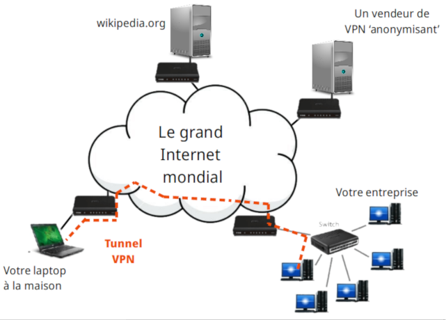
]

---

# 7 - Notions de réseau

## Et les VPNs, késaco ?

- Virtual Private Network
- Il s'agit de faire "comme si" on était connecté depuis un autre endroit

Plusieurs utilités possibles:
- accéder à des services accessibles seulement au sein d'un réseau privé (par ex. entreprise)
- forcer une communication à être chiffrée
- "anonymiser" ses requêtes (partager une IP commune avec pleins de gens)
- contourner des géo-restrictions
- ...

---

# 7 - Notions de réseau

## Autres notions : proxys, firewall

---

class: impact

# 8 - Notions de cryptographie

---

# 8 - Notions de cryptographie

## Principe, vocabulaire

Protéger des messages (confidentialité, authenticité, intégrité) en s’aidant souvent de secrets ou clés.

- Confidentialité : seul l'expéditeur et le destinaire ont accès au message
- Authenticité : le message reçu par le destinaire provient bien de l'expéditeur
- Intégrité : le message reçu est complet et n'a pas été déformé

---

# 8 - Notions de cryptographie

## Exemple de chiffrement symétrique

Historique : le nombre de César
- un algoritme : décalage des lettres dans l'alphabet
- un secret / une clef (par exemple : 3)
- pour déchiffrer : opération inverse triviale

```text
Linux c'est sympatoche
Olqxa f'hvw vbpsdwrfkh
```

---

# 8 - Notions de cryptographie

## Chiffrement asymétrique

Pas d'équivalent classique ...
- imaginer un sorte de nombre de César où l'on chiffre en décalant de 3 ...
- ... mais pour déchiffrer, il faut faire -12 !

---

# 8 - Notions de cryptographie

## Chiffrement asymétrique

Les mathématiques permettent de générer un couple de clef (A, B) :
- `chiffrer(message, A)` peut être déchiffré uniquement avec `B`
- `chiffrer(message, B)` peut être déchiffŕe uniquement avec `A`

---

# 8 - Notions de cryptographie

## Chiffrement asymétrique

- On nomme une clef la clef **privée** : on la garde secrètement rien que pour nous
- On nomme l'autre la clef **publique** : on la donne à tout le monde
- Si quelqu'un cherche à vous envoyer un message, ils chiffrent en utilisant votre clef publique
- Vous seul avez la clef privée et pouvez déchiffrer.

---

.center[

]

---

.center[
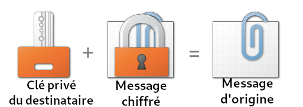
]

---

# 8 - Notions de cryptographie

## Chiffrement asymétrique

- Le chiffrement asymétrique assure la confidentialité et l'integrité
- Mais pas l'authenticité !
- Besoin d'un mécanisme de "signature"

---

.center[
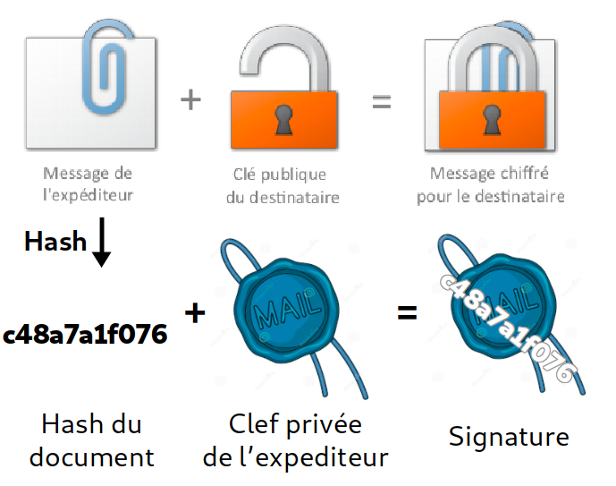
]

---

.center[

]

---

# 8 - Notions de cryptographie

## Echange de clef

- Vous recevez un mail de Edward Snowden avec sa clef publique en copie
- Comment s'assurer que c'est la vraie bonne clef ?
- (Spoiler alert : vous ne pouvez apriori pas...)

Problème général de sécurité : il est difficile de s'assurer de l'authenticité initiale de la clef publique

---

# 8 - Notions de cryptographie

## Solution 1 : la vraie vie

Voir Edward Snowden en chair et en os, et récupérer la clef avec lui

---

# 8 - Notions de cryptographie

## Solution 2 : web of trust

La clef de Edward Snowden a été signé par pleins de journalistes et activitstes indépendant à travers le monde, ce qui diminue le risque d'une falsification

---

# 8 - Notions de cryptographie

## Solution 3 : autorités de certification

Vous faites confiance à Microsoft et Google (!?), qui certifient avoir vérifié que E. Snowden possède cette clef.

- C'est le principe des autorités de certification utilisé par HTTPS
- Votre navigateur fait confiance à des clefs prédéfinies correspondant à des tiers de "confiance" (e.g. Google, ...)
- Le certificat HTTPS contient une signature qui a été produite avec l'une des clefs de ces tiers de confiance
- Vous pouvez ainsi faire confiance "par délégation"

---

# 8 - Notions de cryptographie

## Applications

- HTTPS (SSL/TLS, x509)
- SSH
- Emails chiffrés
- Signature des paquets dans APT
- ...

---

class: impact

# 9 - Se connecter et gérer un serveur avec SSH

---

# 9 - SSH et les serveurs

## À propos des serveurs

Serveur (au sens matériel)
- machine destinée à fournir des services (e.g. un site web)
- allumée et connectée 24/7
- typiquement sans interface graphique
- ... et donc administrée à distance

---

# 9 - SSH et les serveurs

## À propos des serveurs

Serveur (au sens logiciel)
- aussi appelé "daemon", ou service
- programme qui écoute en permanence et attends qu'un autre programme le contacte
    - par ex. : un serveur web attends des clients
- écoute typiquement sur un ou plusieurs port
    - par ex. : 80 pour HTTP

---

# 9 - SSH et les serveurs

## Serveurs : quel support matériel ?

.center[

]

---

# 9 - SSH et les serveurs

## Serveurs : quel support matériel ?

.center[

]


---

# 9 - SSH et les serveurs

.center[

]

---

## ... Plot twist !

.center[

]

---

# 9 - SSH et les serveurs

## "Virtual" Private Server (VPS)

VPS = une VM dans un datacenter

.center[

]

---

# 9 - SSH et les serveurs

## "Virtual" Private Server (VPS)

... qui tourne quelque part sur une vraie machine

.center[
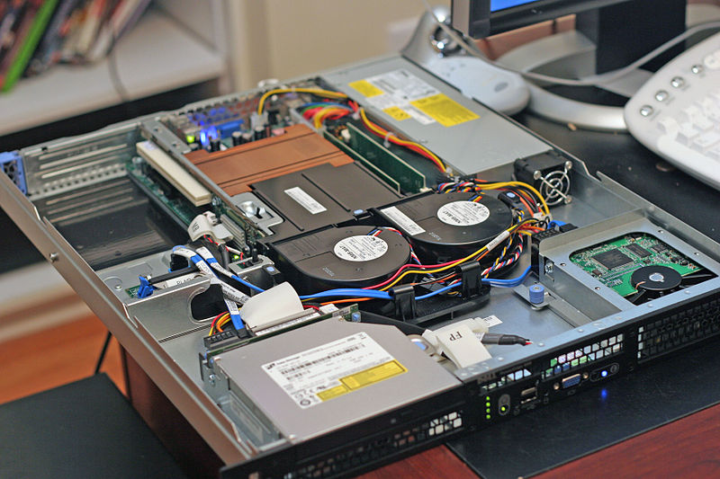
]

---

# 9 - SSH et les serveurs

.center[

]

---

# 9 - SSH et les serveurs

.center[

]

---

# 9 - SSH et les serveurs

## SSH : Secure Shell

- Un protocole **client-serveur**, par défaut sur le port 22
- Prendre le contrôle d'une machine à distance via un shell
- Sécurisé grâce à du chiffrement asymétrique
    - le serveur a un jeu de clef publique/privé
    - le client peut aussi en avoir un (sinon : mot de passe)
- Outil "de base" pour administrer des serveurs

---

# 9 - SSH et les serveurs

## Syntaxe : `ssh utilisateur@machine`

(par "machine" on peut utiliser soit un nom de domaine, une IP, ou un nom d'hôte (cf plus tard))

```bash
$ ssh admin@ynh-forge.netlib.re
The authenticity of host 'ynh-forge.netlib.re (46.101.221.117)' can't be established.
RSA key fingerprint is SHA256:CuPd7AtmqS0UE6DwDDG68hQ+qIT2tQqZqm8pfo2oBE8.
Are you sure you want to continue connecting (yes/no)? █
```

---

# 9 - SSH et les serveurs

## Syntaxe : `ssh utilisateur@machine`


```bash
$ ssh admin@ynh-forge.netlib.re
The authenticity of host 'ynh-forge.netlib.re (46.101.221.117)' can't be established.
RSA key fingerprint is SHA256:CuPd7AtmqS0UE6DwDDG68hQ+qIT2tQqZqm8pfo2oBE8.
Are you sure you want to continue connecting (yes/no)? yes
Warning: Permanently added 'ynh-forge.netlib.re' (RSA) to the list of known hosts.
Debian GNU/Linux 9
admin@ynh-forge.netlib.re's password: █
```

---

# 9 - SSH et les serveurs

## Syntaxe : `ssh utilisateur@machine`


```bash
$ ssh admin@ynh-forge.netlib.re
The authenticity of host 'ynh-forge.netlib.re (46.101.221.117)' can't be established.
RSA key fingerprint is SHA256:CuPd7AtmqS0UE6DwDDG68hQ+qIT2tQqZqm8pfo2oBE8.
Are you sure you want to continue connecting (yes/no)? yes
Warning: Permanently added 'ynh-forge.netlib.re' (RSA) to the list of known hosts.
Debian GNU/Linux 9
admin@ynh-forge.netlib.re's password:

Last login: Thu Oct  4 08:52:07 2018 from 90.63.229.46
admin@ynh-forge:~$ █
```

---

# 9 - SSH et les serveurs

## SSH : se logguer

- ACHTUNG : Soyez attentif à dans quel terminal vous tapez !!!
- En se connectant la première fois, on vérifie la clef publique du serveur
- On a besoin du mot de passe pour se connecter
- ... mais la bonne pratique est d'utiliser nous-aussi une clef

---

# 9 - SSH et les serveurs

## SSH : avec une clef

... mais pourquoi ?

- Pas de mot de passe qui se balade sur le réseau
- Pas nécessaire de retaper le mot de passe à chaque fois
- Possibilité d'automatiser des tâches (clef sans mot de passe)
- (Plusieurs personnes peuvent avoir accès à un meme utilisateur sans devoir se mettre d'accord sur un mot de passe commun)

---

# 9 - SSH et les serveurs

## SSH : avec une clef

1 - Générer avec `ssh-keygen -t rsa -b 4096 -C "commentaire ou description"`

```bash
$ ssh-keygen -t rsa -b 4096 -C "Clef pour la formation"
```

---

# 9 - SSH et les serveurs

## SSH : avec une clef

1 - Générer avec `ssh-keygen -t rsa -b 4096 -C "commentaire ou description"`

```bash
$ ssh-keygen -t rsa -b 4096 -C "Clef pour la formation"
Generating public/private rsa key pair.
Enter file in which to save the key (/home/alex/.ssh/id_rsa):
Enter passphrase (empty for no passphrase):   # Mot de passe
Enter same passphrase again:                  # (again)
Your identification has been saved in /home/alex/.ssh/id_rsa.
Your public key has been saved in /home/alex/.ssh/id_rsa.pub.
The key fingerprint is:
SHA256:ZcAKHVtTXUPz3ipqia4i+soRHZQ4tYsDGfc5ieEGWcY "Clef pour la formation"
```

---

# 9 - SSH et les serveurs

## SSH : avec une clef

2 - Configurer la clef sur le serveur

- soit *depuis le client* avec

```
ssh-copy-id -i chemin/vers/la/clef user@machine
```

- soit *depuis le serveur* en rajoutant la clef dans `~/.ssh/authorized_keys`
    - (generalement, l'admin vous demande votre clef)

---

# 9 - SSH et les serveurs

## SSH : avec une clef

3 - Utiliser la clef pour se connecter

```bash
$ ssh -i ~/.ssh/ma_clef alex@jaimelecafe.com
Enter passphrase for key '/home/alex/.ssh/ma_clef': █
```

---

# 9 - SSH et les serveurs

## SSH : avec une clef

3 - Utiliser la clef pour se connecter

```bash
$ ssh -i ~/.ssh/ma_clef alex@jaimelecafe.com
Enter passphrase for key '/home/alex/.ssh/ma_clef':

Last login: Mon Oct  8 19:46:32 2018 from 11.22.33.44
user@jaimelecafe.com:~$ █
```

- Le système peut potentiellement se souvenir du mot de passe pour les prochaines minutes, comme avec sudo
- Il peut ne pas y avoir de mot de passe (utilisation dans des scripts)

---

# 9 - SSH et les serveurs

## SSH : configuration côté client

- Le fichier `~/.ssh/config` peut être édité pour définir des machines et les options associées

```bash
Host jaimelecafe
    User alex
    Hostname jaimelecafe.com
    IdentityFile ~/.ssh/ma_clef
```

- On peut ensuite écrire simplement : `ssh jaimelecafe`

---

# 9 - SSH et les serveurs

.center[

]

---

# 9 - SSH et les serveurs

## SCP : copier des fichiers

`scp <source> <destination>` permet de copier des fichiers entre le client et le serveur
- Le chemin d'un fichier distant s'écrit `machine:/chemin/vers/fichier`
- ou (avec un user) : `utilisateur@une.machine.com:/chemin/vers/ficier`

Exemples :
```bash
$ scp slides.html bob@dismorphia.info:/home/alex/
$ scp bob@dismorphia.info:/home/alex/.bashrc ./
```

---

# 9 - SSH et les serveurs

## Divers

- Client SSH sous Windows : MobaXterm
- `sshfs` pour monter des dossiers distants
- `ssh -D` pour créer des tunnels chiffrés (similaires à des VPNs)

---

class: impact

# 10 - Services et sécurité basique d'un serveur

---

# 10 - Services et sécurité

## Objectifs

- Parler de la gestion des services
- Tout en appliquant ça à certaines pratiques "de base" de sécurité d'un serveur

---

# 10 - Services et sécurité

## `sshd`

- Un service ou "daemon" qui écoute sur le port 22
- Il gère les connexions SSH ...
- comme d'autres services : il passe sa vie toujours éveillé et prêt à répondre
- Comme beaucoup d'autre programmes : sa configuration est dans `/etc/` et ses logs dans `/var/log/`

En particulier :
- `/etc/ssh/sshd_config` : configuration du daemon
- `/var/log/daemon.log` : un fichier de log utilisé par plusieurs daemons
- `/var/log/auth.log` : logs d'authentification

---

# 10 - Services et sécurité

## `/etc/ssh/sshd_config`

```text
Port 22
HostKey /etc/ssh/ssh_host_ecdsa_key
PermitRootLogin yes
AllowGroups root ssh
```

---

# 10 - Services et sécurité

## Bonnes pratiques en terme de ssh

- (plus ou moins subjectif !..)
- Changer le port 22 en quelque chose d'autre (2222, 2323, 2200, ...)
- Desactiver le login root en ssh
- Utiliser exclusivement des clefs

---

# 10 - Services et sécurité

## Gérer un service avec `systemd`

```bash
$ systemctl status  <nom_du_service> # Obtenir des informations sur le status du service
```

```bash
$ systemctl start   <nom_du_service> # Démarrer le service
$ systemctl reload  <nom_du_service> # Recharger la configuration
$ systemctl restart <nom_du_service> # Redémarrer le service
$ systemctl stop    <nom_du_service> # Stopper le service
```

```bash
$ systemctl enable  <nom_du_service> # Lancer le service au démarrage de la machine
$ systemctl disable <nom_du_service> # Ne pas lancer le service au démarrage
```

---

```bash
systemctl status ssh
● ssh.service - OpenBSD Secure Shell server
   Loaded: loaded (/lib/systemd/system/ssh.service; enabled; vendor preset: enabled)
   Active: active (running) since Wed 2018-10-10 17:43:11 UTC; 3h 17min ago
 Main PID: 788 (sshd)
   CGroup: /system.slice/ssh.service
           └─788 /usr/sbin/sshd -D

Oct 10 20:39:34 scw-5e2fca sshd[5063]: input_userauth_request: invalid user user [preauth]
Oct 10 20:39:34 scw-5e2fca sshd[5063]: pam_unix(sshd:auth): check pass; user unknown
Oct 10 20:39:34 scw-5e2fca sshd[5063]: pam_unix(sshd:auth): authentication failure; logname= uid=0 euid=0 tty=ssh ruser= r
Oct 10 20:39:37 scw-5e2fca sshd[5063]: Failed password for invalid user user from 5.101.40.101 port 33879 ssh2
Oct 10 20:39:37 scw-5e2fca sshd[5063]: Connection closed by 5.101.40.101 port 33879 [preauth]
```

---

# 10 - Services et sécurité

## Investiguer des logs

- Fouiller `/var/log` ... par exemple : `/var/log/auth.log`

```text
Oct 10 20:50:35 scw-5e2fca sshd[5157]: Invalid user user from 5.101.40.101 port 34418
Oct 10 20:50:35 scw-5e2fca sshd[5157]: input_userauth_request: invalid user user [preauth]
Oct 10 20:50:35 scw-5e2fca sshd[5157]: pam_unix(sshd:auth): check pass; user unknown
Oct 10 20:50:35 scw-5e2fca sshd[5157]: pam_unix(sshd:auth): authentication failure; logname= uid=0 euid=0 tty=ssh ruser= rhost=5.101.40.101
Oct 10 20:50:38 scw-5e2fca sshd[5157]: Failed password for invalid user user from 5.101.40.101 port 34418 ssh2
Oct 10 20:50:38 scw-5e2fca sshd[5157]: Connection closed by 5.101.40.101 port 34418 [preauth]
Oct 10 21:01:37 scw-5e2fca sshd[5174]: Invalid user user from 5.101.40.101 port 35162
Oct 10 21:01:37 scw-5e2fca sshd[5174]: input_userauth_request: invalid user user [preauth]
Oct 10 21:01:37 scw-5e2fca sshd[5174]: pam_unix(sshd:auth): check pass; user unknown
Oct 10 21:01:37 scw-5e2fca sshd[5174]: pam_unix(sshd:auth): authentication failure; logname= uid=0 euid=0 tty=ssh ruser= rhost=5.101.40.101
Oct 10 21:01:39 scw-5e2fca sshd[5174]: Failed password for invalid user user from 5.101.40.101 port 35162 ssh2
Oct 10 21:01:39 scw-5e2fca sshd[5174]: Connection closed by 5.101.40.101 port 35162 [preauth]
```
---

# 10 - Services et sécurité

### Qu'est-ce que c'est un service systemd?

Config:

```
/etc/systemd/system/sshd.service
```

(Ou bien aussi: `systemctl cat sshd`)

`systemctl` est un outil pour lancer le service / daemon, en tant que fils de `init`


---

# 10 - Services et sécurité

### Qu'est-ce que c'est systemd (1/2)

- Le **système d'init (PID 1)** pour gérer le démarrage des services (et les autres "runlevel": rescue, shutdown, ...)
- ... mais aussi : **un ensemble d'outils "uniformes"** pour gérer de nombreux aspects du système
    - date, locale, montages, journaux, quotas, tâches planifiées, login, ...
- Systemd a été créé en **2010** par des ingénieurs de **RedHat**, puis intégré dans Fedora en 2011
- Article originel : **["Rethinking PID 1"](https://0pointer.de/blog/projects/systemd.html)**

---

# 10 - Services et sécurité

### Qu'est-ce que c'est systemd (2/2)

- **systemd** succède à l'ancien système d'init qui était le plus répandu : **SysVinit**
    - SysVinit était relativement *laborieux à maintenir, les scripts de chaque service étantverbeux, non-standardisés, et la définition des dépendances (ordre) dans lequel lancer les services était complexe et manuelle*.
        - Exemple : <https://www.cyberciti.biz/tips/linux-write-sys-v-init-script-to-start-stop-service.html>
        - [Explications d'un mainteneur de Archlinux sur l'adoption de systemd en alternative à SysVinit](https://old.reddit.com/r/archlinux/comments/4lzxs3/why_did_archlinux_embrace_systemd/d3rhxlc/)
    - SysVinit était également relativement lent, tandis que systemd parallélise "agressivement" le lancement des services
    - NB: Ceci dit **l'adoption de systemd a été possible aussi car il est backward-compatible** avec ces "anciens" services SysVinit !
- Systemd utilise aussi beaucoup les **"cgroups"** (control groups) pour mettre des quotas/limites sur les ressources (ou au contraire, les prioriser), via les units `.slice`. (Voir aussi : `systemd-cgls` et `systemd-cgtop`)


---

# 10 - Services et sécurité

Les différents aspects du système sont gérés dans des "unités"<small>, en particulier dans `/etc/systemd/system/`</small>

Type principaux :
- `.service` : un programme, "daemon" qui écoute et réponds à des requêtes ou effectue une action
- `.target` : une "cible", un ensemble de service à lancer
- `.timer` : un déclenchement planifié pour un `.service` (alternative moderne aux jobs crons)
- `.path` : un déclenchement pour un `.service` lorsqu'un fichier ou dossier est modifié
- `.mount` / `.automount` : un montage d'un support de stockage sur un point de montage

Et aussi : 
- `.slice` : un ensemble de services (ou de sous-slices) permettant de poser des contraintes sur les ressources utilisables via les `cgroups`
- `.scope` : un groupe de processus, potentiellement lancé par autre chose que systemd
- `.socket` : permet certaines forme de communication réseau ou inter-process (IPC)
- `.device` : périphériques matériels, etc...

---

# 10 - Services et sécurité

### Systemd: les journaux avec `journalctl`

C'est un mécanisme centralisé / unifié pour agrégger et étudier les informations rapportées par les "unit". Il remplace/complète le mécanisme traditionel de logs dans `/var/log` avec `syslog` / `rsyslog`.

<br/>


.center[
Par exemple : `journalctl -u ssh`
]


---

# 10 - Services et sécurité

### Systemd: autres commandes importantes

- `localectl` : gestion de la langue système, clavier, localisation...
- `datetimectl` : gestion de la date, heure, fuseau horaire, ...
- `hostnamectl` : gestion de l'identité de la machine
- `resolvectl` / `systemd-resolve` : configuration du résolveur DNS 
- `systemd-run`, `systemd-nspawn` : lancer des commandes via systemd (dans un scope ou un namespace)
- `systemd-detect-virt` : détecter le type de virtualisation/conteneur

Commandes relatives aux unités :
- `systemctl list-timers` : lister les timers et leur date de prochaine exécution
- `systemctl cat <unit>` : afficher la configuration systemd de cette unité 
- `systemctl daemon-reload` : recharger la conf.  de systemd après qu'on ait modifié une unité
- `systemd-cgls` et `systemd-cgtop` : similaire à `top` mais pour les "cgroups"

---

# 10 - Services et sécurité

### Systemd: controverses

- ["Feature-creep"](https://en.wikipedia.org/wiki/Feature_creep) / ["Scope creep"](https://en.wikipedia.org/wiki/Scope_creep)  vs ["La philosophie Unix"](https://en.wikipedia.org/wiki/Unix_philosophy)
- Relativement monolithique (morceaux inter-dépendants)
- Mauvaise réputation de l'auteur principal (Lennart Poettering)
- Stockage des journaux en format binaire (journalctl) qui romp avec l'idée que "tout est fichier, tout est flux de texte"

<https://en.wikipedia.org/wiki/Systemd#Reception>

---

# 10 - Services et sécurité

## Protéger contre le brute-force : `fail2ban`

- Fail2ban analyse automatiquement les logs
- Cherche / détecte des activités suspectes connues
    - Par exemple : une IP qui essaye des mots de passe
- Déclenche une action ... comme bannir l'IP pour un certain temps
    - (Basé sur `iptables` qui permet de définir des règles réseau)
- Les "jails" sont configurées via `/etc/fail2ban/jail.conf`
- Fail2ban loggue ses actions dans `/var/log/fail2ban.log`

---

# 10 - Services et sécurité

## `fail2ban` : exemple de la jail SSH

- Analyse `/var/log/auth.log`
- Cherche des lignes comme `Failed password for user from W.X.Y.Z`

```text
# Global settings
bantime  = 600
findtime = 600
maxretry = 5

[sshd]
port    = ssh
logpath = /var/log/auth.log
```

---

# 10 - Services et sécurité

## `fail2ban` : le log de fail2ban

```text
2018-10-10 20:50:35 INFO    [sshd] Found 5.101.40.101
2018-10-10 20:50:35 INFO    [sshd] Found 5.101.40.101
2018-10-10 20:50:38 INFO    [sshd] Found 5.101.40.101
2018-10-10 20:50:39 NOTICE  [sshd] Ban 5.101.40.101
2018-10-10 21:00:40 NOTICE  [sshd] Unban 5.101.40.101
2018-10-10 21:01:37 INFO    [sshd] Found 5.101.40.101
2018-10-10 21:01:37 INFO    [sshd] Found 5.101.40.101
2018-10-10 21:01:39 INFO    [sshd] Found 5.101.40.101
2018-10-10 21:01:40 NOTICE  [sshd] Ban 5.101.40.101
2018-10-10 21:11:41 NOTICE  [sshd] Unban 5.101.40.101
```

---

# 10 - Services et sécurité

## `fail2ban` : exemple de la jail recidive

- Analyse `/var/log/fail2ban.log` (!!)
- Cherche des lignes comme `Ban W.X.Y.Z`

```text
# Global settings
bantime  = 600
findtime = 600
maxretry = 5

[recidive]
logpath  = /var/log/fail2ban.log
banaction = %(banaction_allports)s
bantime  = 604800  ; 1 week
findtime = 86400   ; 1 day
```

---

# 10 - Services et sécurité

## Sécurité : modèle de menace

- De qui cherche-t-on à se protéger ?
   - Des acteurs gouvernementaux ? (NSA, Russie, Chine, ...)
   - Des attaques ciblées ? (DDOS, ransomware, espionnage economique)
   - Des attaques automatiques ? (bots)
   - De pannes systèmes ? (c.f. backups, résilience)
   - Des utilisateurs d'un site ? (injections, abus, ...)
   - Des collègues ?
   - ...

---

# 10 - Services et sécurité

## Sécurité : modèle de menace

- Que cherche-t-on à protéger ?
   - Le front-end ?
   - L'accès aux serveurs ?
   - Des informations sur la vie de l'entreprise ?
   - Les infos personelles des utilisateurs ?
   - L'intégrité et la résilience d'un système ?
   - Sa vie privée ? (historique de navigation, geolocalisation)
   - ...

---

# 10 - Services et sécurité

## Sécurité basique d'une machine (bureau, serveur)

1. Maintenir son système à jour
2. Minimiser la surface d'attaque
  - logiciels / apps installées
  - ports ouverts
  - permissions des utilisateurs et fichiers
  - accès physique
  - ...
3. Utiliser des mots de passe robustes (ou idéalement des clefs)
4. Utiliser des protocoles sécurisés
5. Faire des sauvegardes (3-2-1)
6. Faire auditer les systèmes + veille sur les CVE

---

# 10 - Services et sécurité

.center[

]

---

# 10 - Services et sécurité

.center[

]


---

# 10 - Services et sécurité

## Exemple de risque de sécurité subtil

Si on lance cette commande :

```bash
commande_complexe --argument --password "super_secret"
```

Le mot de passe `super_secret` sera visible par d'autres utilisateurs dans `ps -ef` ...!

---

class: impact

# 11 - Déployer un site "basique" avec nginx

---

# 11 - Nginx

## Généralités

- Un serveur web/HTTP "léger"
- Écoute sur le port 80 (et generalement 443 aussi si configuré pour HTTPS)
- Sert des pages web

Intérêt dans cette formation :
- manipuler un autre service
- rendre + utile/concret le fait d'avoir un serveur

---

# 11 - Nginx

## Configuration, logs

- `/etc/nginx/nginx.conf` : conf principale
- `/etc/nginx/sites-enabled/default` : conf du site par défaut
- `/var/log/nginx/access.log` : le log d'accès aux pages
- `/var/log/nginx/error.log` : les erreurs (s'il y'en a)

---

# 11 - Nginx

## `/etc/nginx/sites-enabled/default`

```text
server {
	listen 80 default_server;
	listen [::]:80 default_server;

    # [...]
}
```

---

# 11 - Nginx

## Location blocks

```text
   location / {
       alias /var/www/html/;
   }

   location /blog {
       alias /var/www/blog/;
   }
```

En allant sur `monsite.web/blog`, on accédera aux fichiers dans `/var/www/blog/` (par défaut, index.html généralement)

---

# 11 - Nginx

## Location blocks

```text
   location / {
       alias /var/www/html/;
   }

   location /blog {
       alias /var/www/blog/;
   }

   location /app {
       proxy_pass http://127.0.0.1:1234/;
   }
```

En allant sur `monsite.web/app`, nginx deleguera la requête à un autre programme sur la machine qui écoute sur le port 1234.

---

# 11 - Nginx

## `nginx -t` : verifier que la conf semble correcte

```
$ nginx -t
nginx: the configuration file /etc/nginx/nginx.conf syntax is ok
nginx: configuration file /etc/nginx/nginx.conf test is successfu
```

(on peut ensuite faire `systemctl reload nginx` en toute sérénité)

---

# 11 - Nginx

## Fichier de log (`access.log`)

```text
88.66.22.66 - - [10/Oct/2018:20:13:23 +0000] "GET / HTTP/1.1" 403 140 "-" "Mozilla/5.0 (X11; Linux x86_64; rv:56.0) Gecko/20100101 Firefox/56.0 Waterfox/56.0"
88.66.22.66 - - [10/Oct/2018:20:15:11 +0000] "GET / HTTP/1.1" 200 57 "-" "Mozilla/5.0 (X11; Linux x86_64; rv:56.0) Gecko/20100101 Firefox/56.0 Waterfox/56.0"
88.66.22.66 - - [10/Oct/2018:20:15:14 +0000] "GET /test HTTP/1.1" 301 185 "-" "Mozilla/5.0 (X11; Linux x86_64; rv:56.0) Gecko/20100101 Firefox/56.0 Waterfox/56.0"
88.66.22.66 - - [10/Oct/2018:20:15:15 +0000] "GET /test/ HTTP/1.1" 200 57 "-" "Mozilla/5.0 (X11; Linux x86_64; rv:56.0) Gecko/20100101 Firefox/56.0 Waterfox/56.0"
```

---

# 11 - Nginx

## Fichier d'erreurs (`error.log`)

(Exemple)

```text
2018/10/10 09:06:44 [error] 28638#28638: *851331 open() "/usr/share/nginx/html/.well-known/assetlinks.json" failed (2: No such file or directory), client: 66.22.66.33, server: dismorphia.info, request: "GET /.well-known/assetlinks.json HTTP/1.1", host: "dismorphia.info"
```

(ACHTUNG : quand on débugge, toujours comparer l'heure actuelle du serveur à l'heure des erreurs pour vérifier quand elles ont eu lieu !)

