title: Shell Scripting
class: animation-fade
layout: true

---

class: impact

# Administration Linux

---

# Objectifs

- installer et gérer une distribution
- acquérir des notions de réseau et de sécurité
- administrer un serveur à distance
- configurer et gérer des services
- déployer un serveur web

---

# Plan

1. Installer une distribution, gérer les partitions
2. Le gestionnaire de paquet (et les archives)
3. Notions de base de réseau
4. Introduction à la cryptographie
5. Se connecter et gérer un serveur avec SSH
6. Les services, et principes de base de sécurité
7. Installer nginx et déployer un site "statique"
8. Automatiser des tâches avec cron
9. Déployer une app sur une stack PHP/Mysql

---

# Plan (partie avancée)

10. Ajouter, gérer des services systemd
11. Casser, réparer et monitorer son serveur
12. Installer un serveur sous YunoHost
13. Gérer des containers LXC 
14. Gérer sauvegardes avec Borgbackup
15. Moar bash scripting ?

---

.center[

]

---

.center[

]

---

.center[

]

---

.center[

]

---

.center[

]

---

# L'ecosystème Linux

- Système d'exploitation
- Interagir avec le système en ligne de commande
- Un système de fichiers
- Des utilisateurs, des permissions
- Des Processus
- Assemblage de commande
- Écriture de script

---

# Rappels

- Utilisez [Tab] !
- Soyez attentif à ce que vous tapez et à ce que la machine vous renvoie

---

class: impact

# 1. Installer une distribution

### et gérer les partitions

---

# 1. Installer une distribution

.center[
... jusqu'ici : pas d'interface graphique !
]

---

# 1. Installer une distribution

## Introducing : Xorg

Xorg (qui commence a être remplacée par Wayland ?) est le serveur graphique

.center[
[](img/xorg.png)
]

---

# 1. Installer une distribution

## Distributions

- Un noyau (Linux)
- Des programmes (GNU, ...)
- Des pré-configurations
- Un gestionnaire de paquet
- Un (ou des) environnements graphiques (Gnome, KDE, Cinnamon, Mate, ...)
- Une suite de logiciel intégrée avec l'environnement graphique
- Des objectifs / une philosophie

---

# 1. Installer une distribution

## Linux Mint

- (Choix arbitraire du formateur)
- Distribution simple, sobre, pas spécialement controversée (?)
- Profite de la stabilité de Debian et popularité d'Ubuntu 

---

# 1. Installer une distribution

## Environnement

- Recommandé : Cinnamon (ou Mate)
- (mais vous pouvez prendre XFCE, KDE, ... ou partir sur une Ubuntu Gnome Shell ...)

---

# 1. Installer une distribution

## Procédure d'installation générale

<small>(Prerequis : avoir accès au BIOS du système (et avoir de la place))</small>

- Télécharger et flasher une "Live CD/USB"
- Dire au BIOS de booter sur la "Live CD/USB"
- Lancer l'installation
    - (définir un plan de partitionnement)
- Prendre un café
- Rebooter et vérifier que ça a fonctionné

---

# 1. Installer une distribution

## Telecharger l'ISO

.center[
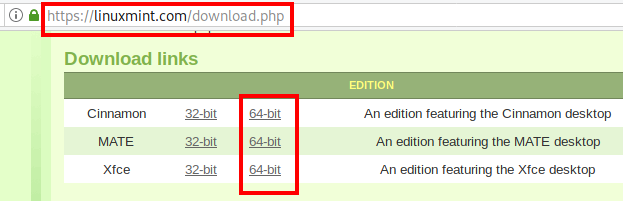
]

---

# 1. Installer une distribution

## Vérifier l'intégrité / authenticité

.center[
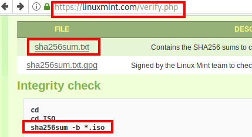
]

---

# 1. Installer une distribution

## Le BIOS

- Programme lancé par la machine à son démarrage
- Change entre les modèles de PC ...
- Gère différent aspects "bas-niveau" (e.g. horloge intégrée)
- Gère le lancement du "vrai" système d'exploitation
    - analyse typiquement le lecteur CD
    - ... puis le HDD
    - ... puis le network (PXE)
    - ...
- De nos jours, l'UEFI et Secure boot complique beaucoup les choses ...

---

# 1. Installer une distribution

## Le BIOS

.center[
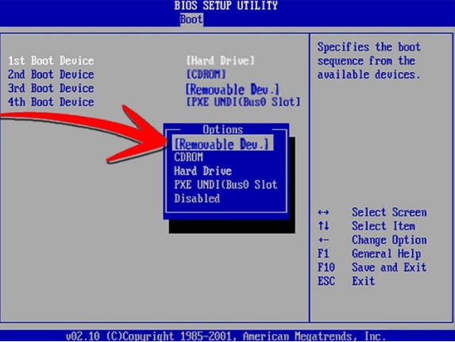
]

---

# 1. Installer une distribution

## Live CD/USB

- Un système généralement "éphémère" (données perdues)
- Typiquement sur un CD rom ou une clef USB
- Système entièrement chargé dans la RAM (performances moindres)
- Destiné à tester / faire une démo du système et à l'installer
- Permet aussi d'avoir accès à certains outils

---

.center[
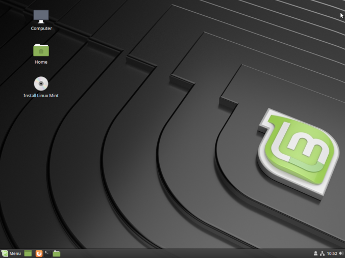
]

---

# 1. Installer une distribution

## Lancer l'installation

.center[
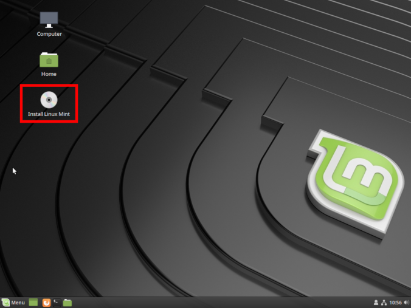
]

---

# 1. Installer une distribution

## Lancer l'installation

.center[
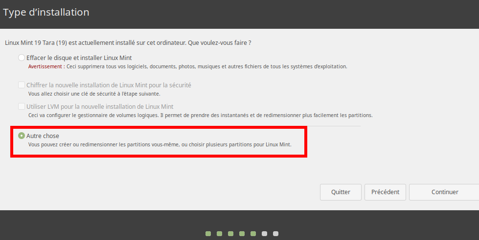
]

---

# 1. Installer une distribution

## Plan de partitionnement

Exemple :
- 300 Mo pour `/boot/` en ext4
- 12 Go pour `/` en ext4
- 3 Go pour `/home/` en ext4
- Le reste en swap
    - le swap, c'est une extension "lente" de la RAM

.center[

]

---

# 1. Installer une distribution

## Lancer l'installation "pour de vrai"

- Répondre aux questions pour créer l'utilisateur, etc...
- ... le système s'installe ...

---

# 1. Installer une distribution

## Finir l'installation

- Redémarrer
- (Enlever le média d'installation)
- (Dire au BIOS de booter de nouveau sur le HDD)

---

# 1. Installer une distribution

## GRUB

.center[
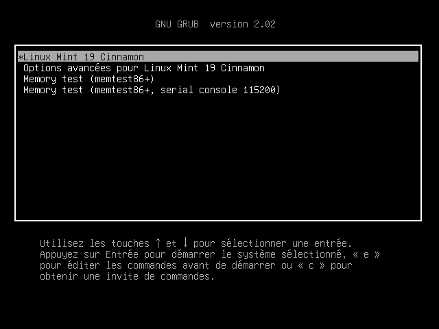
]

---

# 1. Installer une distribution

## GRUB

.center[
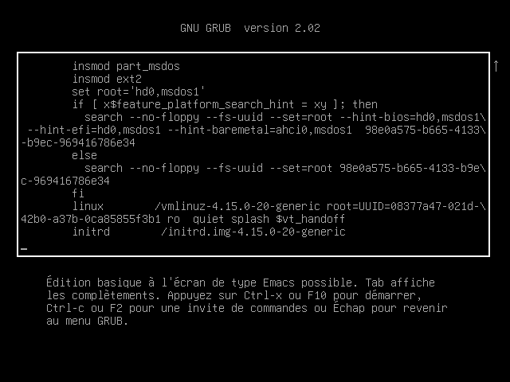
]

---

# 1. Installer une distribution

## Login

.center[

]

---

# 1. Installer une distribution

## Le bureau

.center[
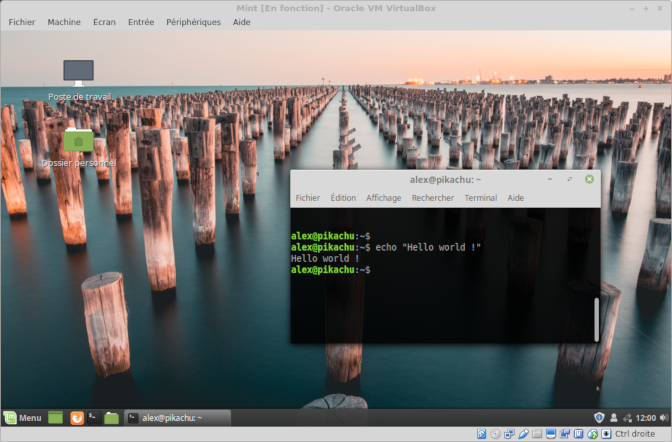
]

---

# 1. Installer une distribution

## Les points de montage

.center[
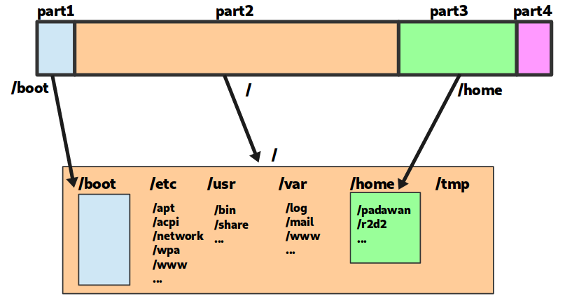
]

---

# 1. Installer une distribution

## Notation des patitions

Les disques partitions sous Linux sont généralement dénommées :

- `/dev/sda` (premier disque)
   - `/dev/sda1` (première partition de /dev/sda)
   - `/dev/sda2` (deuxieme partition de /dev/sda)
- `/dev/sdb` (deuxieme disque)
   - `/dev/sdb1` (première partition de /dev/sdb)
   - `/dev/sdb2` (deuxieme partition de /dev/sdb)
   - `/dev/sdb3` (troisieme partition de /dev/sdb)

---

# 1. Installer une distribution

## Outil pour lister les disques, gérer les partions

```bash
$ fdisk -l
Disk /dev/sda: 29.8 GiB, 32017047552 bytes, 62533296 sectors
[...]
Device       Start      End  Sectors  Size Type
/dev/sda1     2048  2099199  2097152    1G Linux filesystem
/dev/sda2  2099200 62524946 60425747 28.8G Linux filesystem
```

---

# 1. Installer une distribution

## Les points de montage

Une partition ou n'importe quel "bidule de stockage" peut être "monté" dans le système de fichier
- parittion
- clef usb
- image iso
- stockage distant
- ...

---

# 1. Installer une distribution

## Les points de montage

Les points de montages sont gérés avec `mount`

```bash
$ mkdir /media/usbkey
$ mount /dev/sdb1 /media/usbkey
$ ls /media/usbkey
# [le contenu de la clef usb s'affiche]
```

---

# 1. Installer une distribution

## Les points de montage

On peut "démonter" un element monté avec `umount`

```bash
$ umunt /media/usbkey
```

---

# 1. Installer une distribution

## Les points de montage : `/etc/fstab`

`/etc/fstab` décrit les systèmes de fichier montés automatiquement au boot

```text
# <file system>     <mountpoint> <type>  <options>       <dump>  <pass>
UUID=[id tres long] /            ext4    default         0       1
UUID=[id tres long] /home/       ext4    defaults        0       2
```

<small>(historiquement, la premiere colomne contenait `/dev/sdxY`, mais les UUID sont plus robustes)</small>

---

# 1. Installer une distribution

## Les points de montage : outils

Juste `mount` permet aussi de lister les différents points de montage

```bash
$ mount
[...]
/dev/sda1 on /boot type ext4 (rw,noatime,discard,data=ordered)
/dev/sda2 on / type ext4 (rw,noatime,discard,data=ordered)
```

---

# 1. Installer une distribution

## Les points de montage : outils

Il existe aussi `df` :

```bash
$ df -h
Filesystem      Size  Used Avail Use% Mounted on
dev             2.8G     0  2.8G   0% /dev
run             2.8G  1.1M  2.8G   1% /run
/dev/dm-0        29G   22G  5.0G  82% /
tmpfs           2.8G   22M  2.8G   1% /dev/shm
tmpfs           2.8G     0  2.8G   0% /sys/fs/cgroup
tmpfs           2.8G  1.9M  2.8G   1% /tmp
/dev/sda1       976M  105M  804M  12% /boot
tmpfs           567M   16K  567M   1% /run/user/1000
```

---

# 1. Installer une distribution

## Les points de montage : outils

Et aussi `lsblk` : 

```bash
$ lsblk
NAME          MAJ:MIN RM  SIZE RO TYPE  MOUNTPOINT
sda             8:0    0 29.8G  0 disk
├─sda1          8:1    0    1G  0 part  /boot
└─sda2          8:2    0 28.8G  0 part  /
```

---

class: impact

# 2. Le gestionnaire de paquet 

### (et les archives)

---

# 2. Le gestionnaire de paquet

## Motivation

Historiquement, c'est très compliqué d'installer un programme :
- le télécharger et le compiler
- la compilation (ou le programme lui-même) requiert des dependances
- il faut télécharger et compiler les dépendances
- qui requiert elles-mêmes des dépendances ...

---

# 2. Le gestionnaire de paquet

## Le travail d'une distribution <small>(entre autre)</small>

- créer et maintenir un ensemble de paquet cohérents
- ... et le gestionnaire de paquet qui va avec
- les (pre)compiler pour fournir des binaires

---

# 2. Le gestionnaire de paquet

Paquet ~ programmes ou librairies

Le gestionnaire de paquet c'est :
- La "clef de voute" d'une distribution ?
- un **système unifié pour installer** des paquets ...  ;
- ... **et les mettre à jour !** ;
- le tout en gérant les dépendances et les conflits ;
- et via une commaunauté qui s'assure que les logiciels ne font pas n'importe quoi.

---

# 2. Le gestionnaire de paquet

## Comparaison avec Windows

Sous Windows
- téléchargement d'un .exe par l'utilisateur ...
- ... depuis une source obscure ! (**critical security risk !**)
- procédure d'installation spécifique
- ... qui tente de vous refiler des toolbar bloated, et/ou des CGU obscures
- système de mise à jour spécifique
- nécessité d'installer manuellement des dépendances

---

# 2. Le gestionnaire de paquet

*One package to rule them all*

*One package to find them*

*One package to download them all*

*and on the system bind them*

*In the land of GNU/Debian where the penguin lie*

---

# 2. Le gestionnaire de paquet

## Sous Debian

Format `.deb`

`apt` : couche "haut niveau"
- dépot, 
- authentification, 
- ... 

`dpkg` : couche "bas niveau"
- gestion des dépendances,
- installation du paquet,
- ...

---

# 2. Le gestionnaire de paquet

## Parenthèse sur `apt-get`

- Historiquement, `apt-get` (et `apt-cache`, `apt-mark`, ..) étaientt utilisés
- Syntaxe inutilement complexe ?
- `apt` fourni une meilleur interface (UI et UX)

---

# 2. Le gestionnaire de paquet

## Utilisation de `apt`

- `apt install <package>` : télécharge et installe le paquet et tout son arbre de dépendances
- `apt remove <package>` : désinstaller le paquet (et les paquet dont il dépends !)
- `apt autoremove` : supprime les paquets qui ne sont plus nécessaires

---

# 2. Le gestionnaire de paquet

## Mais qu'est-ce que c'est, un paquet ?

Un programme, et des fichiers (dossier `debian/`) qui décrivent le paquet :
- `control` : décrit le paquet et ses dépendances
- `install` : liste des fichiers et leur destination
- `changelog` : un historique de l'evolution du paquet
- `rules` : des trucs techniques pour compiler le paquet
- `postinst`, `prerm`, ... : des scripts à lancer quand le paquet est installé, désinstallé, ...

---

# 2. Le gestionnaire de paquet

## Mettre à jour les paquets

- `apt update` : récupère la liste des paquets depuis les dépots
- `apt dist-upgrade` : calcule et lance la mise à jour de tous les paquets
- (`apt upgrade` : mise à jour "safe", sans installer/supprimer de nouveaux paquets)

---

# 2. Le gestionnaire de paquet

## Les dépots

Les dépots de paquets sont configurés via `/etc/apt/sources.list` et les fichiers du dossier `/etc/apt/sources.list.d/`.

Exemple :
```
deb http://ftp.debian.fr/debian/ stretch main contrib
```

- `stretch` est le nom de la distribution
- `main` et `contrib` sont des composantes à utiliser

---

# 2. Le gestionnaire de paquet

## Les versions de Debian

Debian vise un système libre et très stable

- `stable` : paquets éprouvés et très stable (bien que souvent un peu vieux)
- `testing` : paquets en cours de test, comportant encore quelques bugs
- `unstable` (sid) : pour les gens qui aiment vivre dangereusement

Les versions tournent tous les ~2 ans environ
- l'ancienne `testing` devient la nouvelle `stable`
- le passage de version peut être un peu douloureux ...

---

# 2. Le gestionnaire de paquet

## Les versions de Debian

Basé sur les personnages de Toy Story

- 7, `wheezy` (oldoldstable)
- 8, `jessie` (oldstable)
- 9, `stretch` (stable, depuis juin 2017)
- 10, `buster` (testing, deviendra stable vers juin 2019)
- 11, `bullseye`
- 12, `bookworm`

---

# 2. Le gestionnaire de paquet

.center[
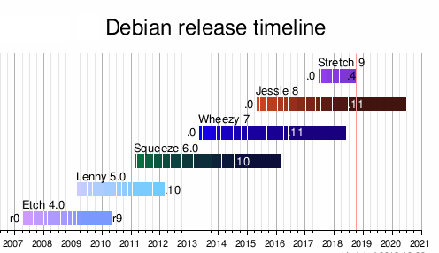
]

---

# 2. Le gestionnaire de paquet

## Naviguez dans les paquets debian en ligne

https://packages.debian.org/search

.center[
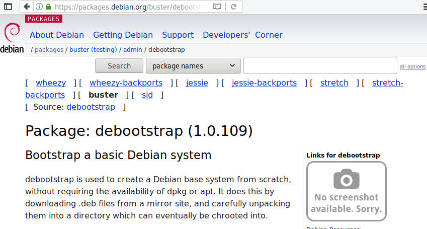
]

---

# 2. Le gestionnaire de paquet

## Les backports

- Un intermédiaire entre stabilité et nouveauté
- Fournissent des paquets venant de `testing` en `stable`
- À utiliser avec prudence

---

# 2. Le gestionnaire de paquet

## Gérer des archives

`tar` (tape archive) permet de créer des archives (non compressées) qui rassemblent des fichiers.

```bash
# Créer une archive monarchive.tar
tar -cvf monarchive.tar file1 file2 folder2/ folder2/

# Désassembler une archive
tar -xvf monarchive.tar
```

---

# 2. Le gestionnaire de paquet

## Gérer des archives

`gzip` (gunzip) permet de compresser des fichiers (similaire aux .zip, .rar, ...)

```bash
# Compresser zblorf.scd
gzip zblorf.scd

# [...] le fichier a été compressé et renommé zblorf.scd

# Decompresser le fichier :
gzip -d zblorf.scd
```

---

# 2. Le gestionnaire de paquet

## Gérer des archives

`tar` peut en fait être invoqué avec `-x` pour générer une archive compressée

```bash
# Créer une archive compressée
tar -cvzf monarchive.tar.gz file1 file2 folder2/ folder2/

# Désassembler une archive
tar -xvzf monarchive.tar.gz
```

---

# 2. Le gestionnaire de paquet

## Gérer des archives

.center[

]


---

class: impact

# 3. Notions de base de réseau

---

class: impact

# 4. Introduction à la cryptographie

---

class: impact

# 5. Se connecter et gérer un serveur avec SSH

---

class: impact

# 6. Les services, et principes de base de sécurité d'un serveur

---

class: impact

# 7. Installer nginx et déployer un site "statique"

---

class: impact

# 8. Automatiser des tâches avec cron

---

class: impact

# 9. Déployer une application PHP/Mysql

---

