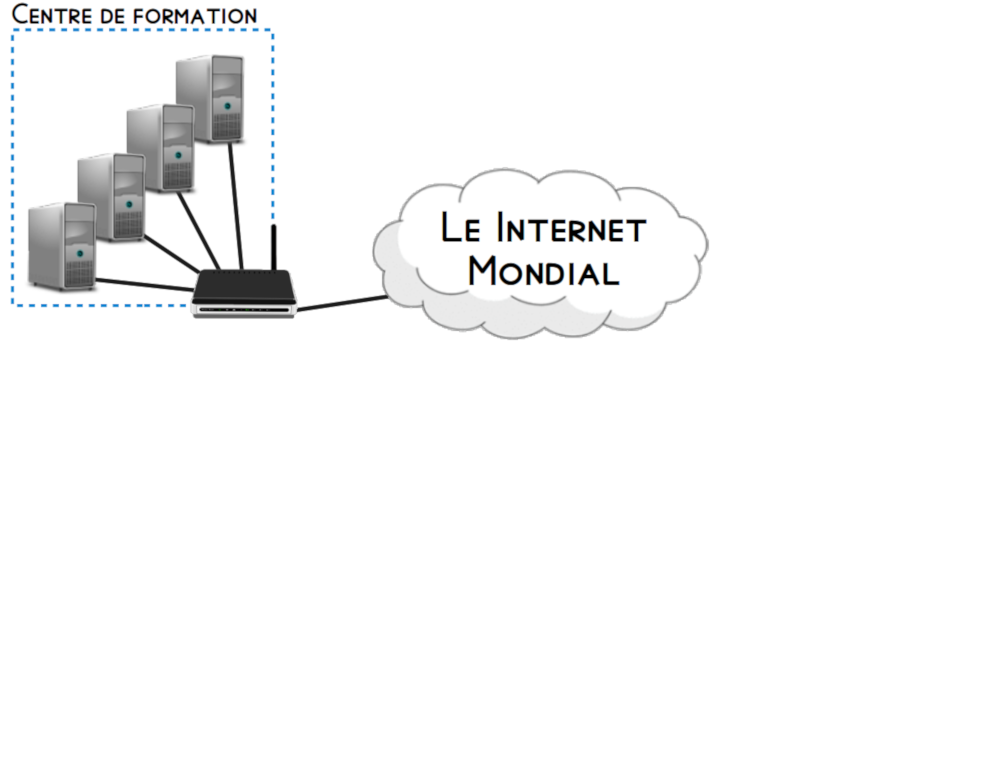
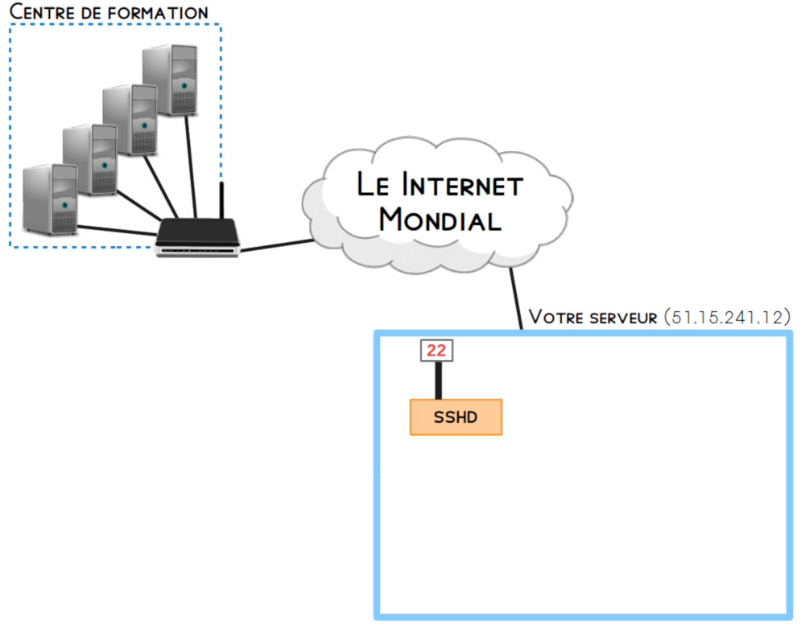
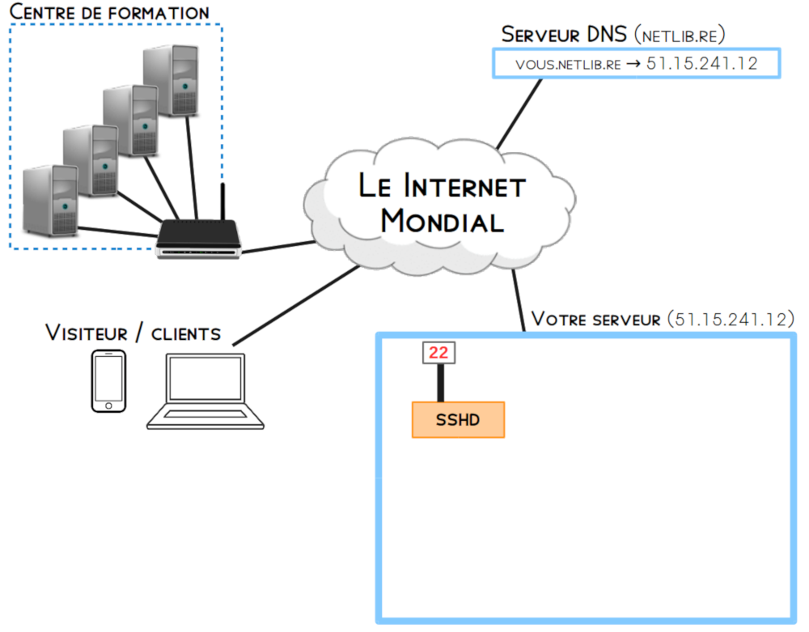
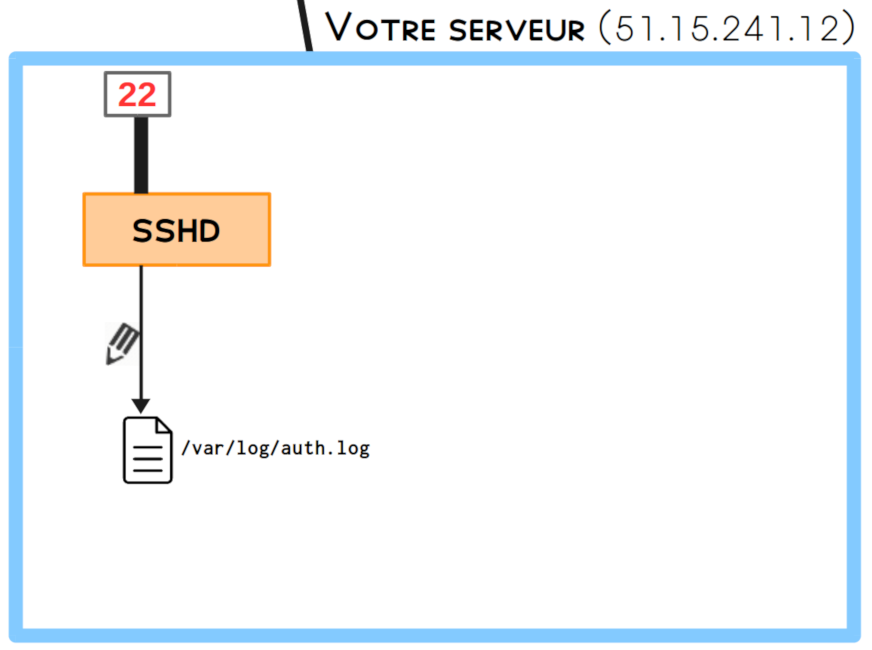
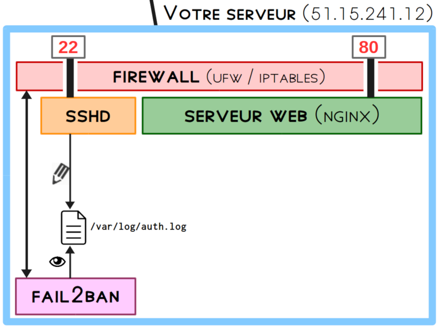
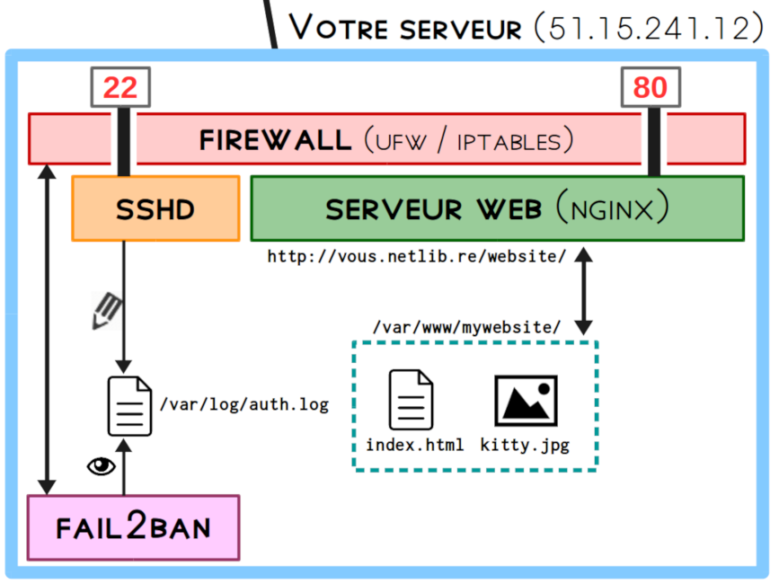
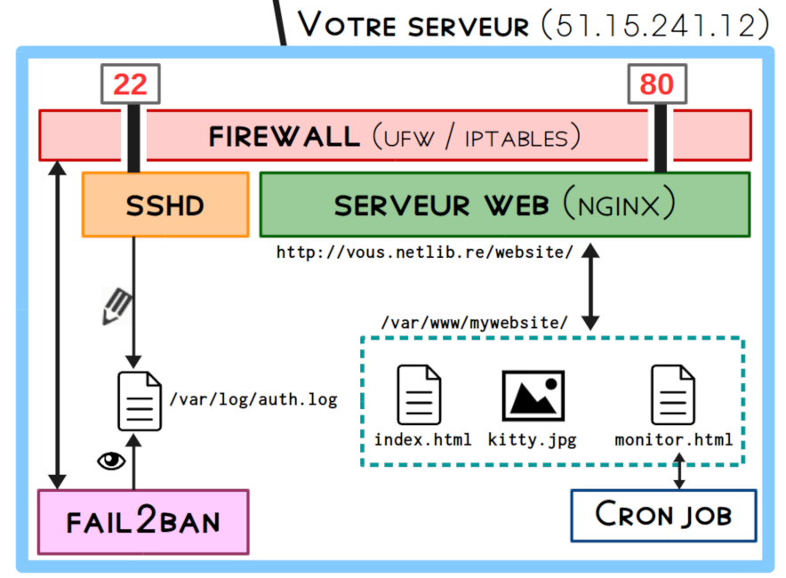
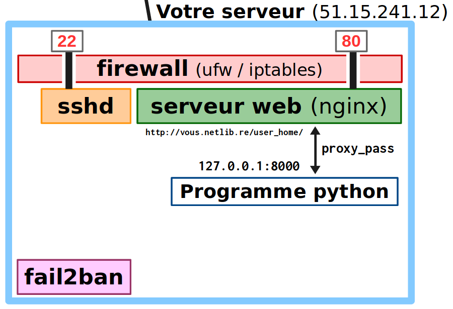
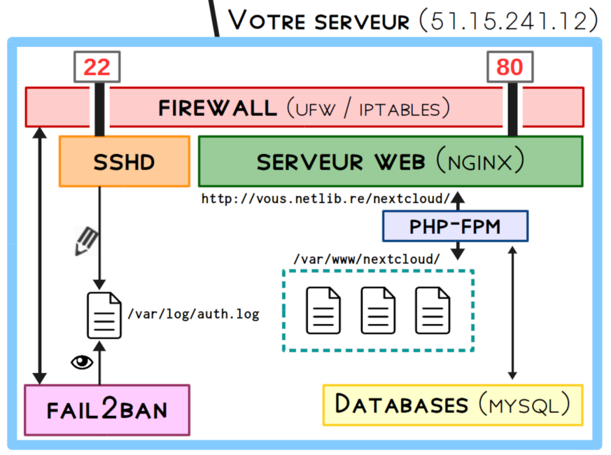

title: Administration avancée
class: animation-fade
layout: true

---

class: impact

# Administration Linux avancée

---

# Recap'

- Installer une distribution
- Le gestionnaire de paquet
- Notions de réseau
- Notion de chiffrement
- Administrer à distance avec SSH
- Gérer des services
- Notions de sécurité
- Installer un serveur web
- Automatiser des tâches avec des jobs Cron

---

class: impact

# Recap'

### (tentative de représentation)

---

.center[

]

---

.center[

]

---

.center[

]

---

.center[

]

---

.center[

]

---

.center[

]

---

.center[

]

---

.center[

]

---

# Objectifs de ces trois derniers jours

- Consolider la manipulation de la CLI, de SSH
- ... et la compréhension du réseau, des services
- Vous montrer d'autres possibilités dans l'écosystème d'un serveur
    - PHP / Mysql
    - LXC
    - Ecosystème "complet" avec YunoHost
- Amorcer l'aspect 'DevOps' (transition avec toutes les autres technos de la formation !)

---

# Plan

- 0 - (Finir monitoring.html ?)
- 1 - Déployer une application PHP/Mysql
- 1.5 - Investiguer des problèmes
- 2 - Introduction aux LXC
- 3 - Introduction à YunoHost : apps, mail, ...
- 4 - (Moar Shell Scripting !? Boucles FOR/WHILE)

---

# Je ne parlerais pas

- Créer des services systemd
- HTTPS / Certificats SSL...
- Gérer des sauvegardes
- Vim
- ...?

---

class: impact

# 1. Déployer une app PHP/Mysql

---

# 1. Déployer une app PHP/Mysql

- Jusqu'ici : des pages statiques !

.center[

]

---

# 1. Déployer une app PHP/Mysql

Comment créer des pages "dynamiques", par exemple :
- espaces utilisateurs <small>(mur facebook, compte amazon)</small>
- compte genéré via des données variables <small>(cours de bourse, ...)</small>
- ... ou stockées dans des bases de donnée <small>(liste d'élèves d'une université...)</small> 
- ...

"Bricolage" : cron job qui rafraìchit la page toutes les minutes

---

# 1. Déployer une app PHP/Mysql

## Methode générale / versatile / "moderne"

- Reverse-proxy (c.f. `proxy_pass`)

.center[

]

---

# 1. Déployer une app PHP/Mysql

## Historiquement / classiquement : PHP

- Le serveur web transmet la requête à un programme / daemon PHP
- PHP interprête le code et genere la réponse
- .. et renvoie la réponse à nginx qui la renvoie au client
- PHP est la "Gateway" dans le contexte de Nginx
    - c.f. 502 Bad Gateway, et 504 Gateway Timeout

---

# 1. Déployer une app PHP/Mysql

## et aussi : MySQL

- MySQL est classiquement utilisé pour gérer des bases de données
- Les données sont structurées de façon cohérente pour être accédées de manière efficace
- Interface avec PHP qui peut venir piocher dyaniquement des données
- PHP / L'app met ensuite en forme ces données pour générer la page

 

- N.B. : MariaDB est un fork du MySQL originel
- Alternatives à MySQL/MariaDB : PostgreSQL

---

.center[

]

---

# 1. Déployer une app PHP/Mysql

## Nextcloud

TODO : LOGO

- Un logiciel libre, auto-hébergeable
- Stockage et synchronisation de fichiers sur un serveur
   - (similaire à Google Drive, Dropbox, )
- Basé sur PHP / MySQL

 

- Et aussi : calendrier, contacts, et pleins de modules variés

---

# 1. Déployer une app PHP/Mysql

## Nextcloud

TODO : screenshot

---

class: impact

# 1.5. Investiguer et réparer des problèmes

---

# 1.5. Investiguer et réparer des problèmes

## Méthode générale

- Comprendre que le deboggage fait partie du job !
- Être attentif, méthodique
- Chercher et consulter les logs...
   - ... et lire les messages attentivement !
- Comparer les messages à ce que l'on vient de faire, identifier à quel niveau se situe le problème ...
- Chercher des infos sur Internet ...
  - avec des mots clefs approprié

---

# 1.5. Investiguer et réparer des problèmes

## Méthode générale

Malheureusement ...

- Logs pas forcément trouvable (ou alors messages abscons)
- Demande un peu d'expérience pour savoir quoi / où chercher ...

---

# 1.5. Investiguer et réparer des problèmes

## Sources d'information

Stack Overflow et ses dérivés :
- Stack Overflow (développement / programmation)
- Super User (administration système géneraliste ?)
- Server Fault (administration de serveur ?)

