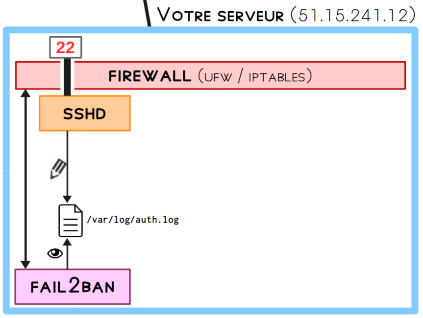
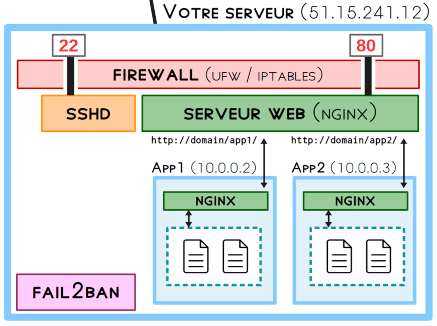
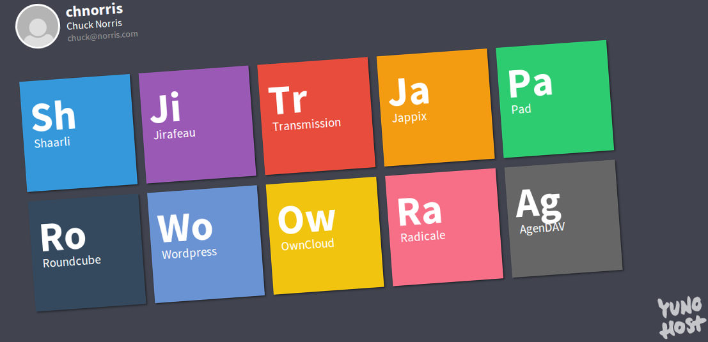
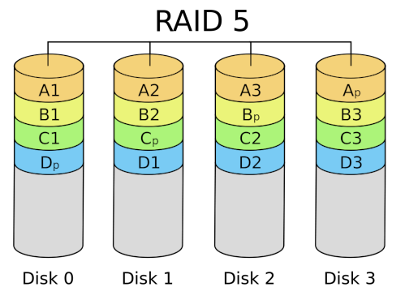

title: Administration avancée
class: animation-fade
layout: true

---

class: impact

# Administration Linux avancée

---

.center[

]

---

.center[

]


---

# Recap'

- Installer une distribution
- Le gestionnaire de paquet
- Notions de réseau
- Notion de chiffrement
- Administrer à distance avec SSH
- Gérer des services
- Notions de sécurité
- Installer un serveur web

---

class: impact

# Recap'

### (tentative de représentation)

---

.center[

]

---

.center[

]

---

.center[

]

---

.center[

]

---

.center[

]

---

.center[

]

---

.center[

]


---

class: impact

# 8. Déployer une app PHP/Mysql

---

# 8. Déployer une app PHP/Mysql

- Jusqu'ici : des pages statiques !

.center[

]

---

# 8. Déployer une app PHP/Mysql

Comment créer des pages "dynamiques", par exemple :
- espaces utilisateurs <small>(mur facebook, compte amazon)</small>
- compte genéré via des données variables <small>(cours de bourse, ...)</small>
- ... ou stockées dans des bases de donnée <small>(liste d'élèves d'une université...)</small> 
- ...

---

# 8. Déployer une app PHP/Mysql

## Historiquement : methode 'CGI' avec par ex. PHP

- CGI: Common Gateway Interface
- Le serveur web déclenche un "script CGI" pour traiter la requête et générer la réponse
- Pas très performant (lancement d'un script à chaque requête, en Perl, PHP, Python, ...)
- ... mais depuis optimisé dans la variante FastCGI
    - c.f. "PHP-FPM" pour "PHP FastCGI Process Manager"

---

.center[

]

---

# 8. Déployer une app PHP/Mysql

## Methode générale / versatile / "moderne"

- Reverse-proxy (c.f. instruction `proxy_pass` dans nginx)
- Le serveur web transmet la requête à un autre programme / daemon qui écoute généralement sur `127.0.0.1:<port>`
- Dans le cas d'un reverse proxy, il y a une séparation claire entre le serveur web et l'applicatif (a la différence du CGI où il se peut que ce soit un script lancé à chaque requête)

---

.center[

]

---

# 8. Déployer une app PHP/Mysql

## 502 Bad Gateway / 504 Gateway Timeout

- Erreurs courantes lorsqu'on debug une installation avec du CGI / Reverse proxy
- La "gateway" désigne le process avec lequel Nginx communique
    - bad gateway = nginx n'arrive pas du tout à communiquer avec le process
    - gateway timeout = le process a mis trop longtemps à traiter la requête

---


# 8. Déployer une app PHP/Mysql

## Bases de données / MySQL

- MySQL est classiquement utilisé pour gérer des bases de données
- Les données sont structurées de façon cohérente pour être accédées de manière efficace
- Interface avec PHP qui peut venir piocher dyaniquement des données
- PHP / L'app met ensuite en forme ces données pour générer la page

<br>

- N.B. : MariaDB est un fork du MySQL originel
- Un autre moteur SQL très connu est PosgreSQL


---

# 8. Déployer une app PHP/Mysql

## LAMP

Une pile logicielle historique et classique pour construire et déployer une app web dynamique

- Linux
- Apache (... plutot que Nginx dans notre cas)
- Mysql
- PHP

---

# 8. Déployer une app PHP/Mysql

## Nextcloud

.center[

]

---

# 8. Déployer une app PHP/Mysql

## Nextcloud

- Un logiciel libre, auto-hébergeable
- Stockage et synchronisation de fichiers sur un serveur
   - (similaire à Google Drive, Dropbox, )
- Basé sur PHP / MySQL

<br>

- Et aussi : calendrier, contacts, et pleins de modules variés


---

# 8. Déployer une app PHP/Mysql

## Nextcloud

.center[

]

---

# 8. Déployer une app PHP/Mysql

## Nextcloud : procédure d'installation

- Télécharger (et décompresser) les sources
- (Configurer PHP)
- Créer une base de donnée MySQL
- Configurer Nginx
- Configurer l'application
- Tester et valider

---

class: impact

# 8.5. Investiguer et réparer des problèmes

---

# 8.5. Investiguer et réparer des problèmes

## Méthode générale

- Comprendre que le deboggage fait partie du job !
- Être attentif, méthodique
- Chercher et consulter les logs...
   - ... et lire les messages attentivement !
- Comparer les messages à ce que l'on vient de faire, identifier à quel niveau se situe le problème ...
- Chercher des infos sur Internet ...
  - avec des mots clefs approprié

---

# 8.5. Investiguer et réparer des problèmes

## Méthode générale

Malheureusement ...

- Logs pas forcément trouvable (ou alors messages abscons)
- Demande un peu d'expérience pour savoir quoi / où chercher ...

---

# 8.5. Investiguer et réparer des problèmes

## Sources d'information

Savoir lire des posts sur Stack Overflow et ses dérivés :
- Stack Overflow (développement / programmation)
- Super User (administration système géneraliste / amateur)
- Server Fault (contexte pro., e.g. maintenance de serveur)

---

class: impact

# 9. Automatiser avec `at` et les cron jobs

---

# 9. Automatiser

## Executer des commandes (ou un script) à distance

```
# Verifier depuis combien de temps la machine tourne
$ echo "uptime" | ssh machine
 19:48:51 up 1 day,  2:05,  1 user,  load average: 0.08, 0.02, 0.01

# Lancer un script à distance
$ cat script.sh | ssh machine
[...]
```

---

# 9. Automatiser

## `at`

- Executer *une fois* une action à un moment précis dans le futur
- Format de date/temps plutôt user-friendly

```bash
# En interactif
$ at 5:00 PM     
warning: commands will be executed using /bin/sh
at> reboot
job 5 at Fri Oct 12 17:00:00 2018
```

```bash
# Avec un script
$ at now + 30 minutes -f mettre_a_jour.sh 
job 6 at Thu Oct 6 20:22:00 2018
```

---

# 9. Automatiser 

## Les jobs cron

- Répéter une tâche à intervalle régulier (heures, jours, mois, ...)
- Chaque utilisateur peut en configurer avec `crontab -e`

```
10 * 1 * * /chemin/vers/un/script
```

---

# 9. Automatiser

## Les jobs cron : syntaxe (1/3)

```
10 * 1 * * /chemin/vers/un/script
```

- `10` : à la minute 10
- `*`  :toutes les heures
- `1` le 1er du mois
- `*` tous les mois
- `*` (tous les jours de la semaine)

---

# 9. Automatiser

## Les jobs cron : syntaxe (2/3)

```
0 8 * * 1-5 /chemin/vers/un/script
```

- `0` : à la minute 0
- `8` : à 8h
- `*` (tous les jours du mois)
- `*` tous les mois
- `1-5` tous les jours de travail (lundi à vendredi)

---

# 9. Automatiser

## Les jobs cron : syntaxe (3/4)

```text
 */10 * * * * /chemin/vers/un/script
```

- `*/10` : toutes les 10 minutes
- `*` toutes les heures
- `*` tous les jours du mois
- `*` tous les mois
- `*`  tous les jours de la semaine

---

# 9. Automatiser

## Les jobs cron : syntaxe (4/4)

- `http://crontab.guru/` to the rescue !

---

# 9. Automatiser

## `/etc/crontab` et `/etc/cron.d/`

- Ce sont des fichiers/dossiers de config cron "globaux"
- Dedans, on specifie aussi l'utilisateur utilisé pour lancer le script :

```
 # M  H  D M W   User    Command --->
 */30 *  * * * feed2toot feed2toot -c /etc/feed2toot/feed2toot.ini
```

---

# 9. Automatiser

## `/etc/cron.hourly`, `daily`, `weekly`, `monthly`

- Ils contiennent directement des scripts qui seront executés automatiquement à certains intervalles
- Attention
   - le nom des fichiers dedans ne doit pas avoir d'extensions ...
   - .. et doit être executable (+x)

---

class: impact

# 2 - Introduction aux LXC

---

# 2 - Introduction aux LXC

## Jusqu'ici : machines virtuelle

- Une machine entière simulée dans une autre machine
- Bonne isolation
- Ressources "garanties", allouées explicitement à la VM
- "Lourd" en terme de taille (plusieurs Go) et performances

---

.center[

]

---

# 2 - Introduction aux LXC

## Généralités sur la conteneurisation

La conteneurisation permet :
- de créer des systèmes isolés, similaire à des VM
- mais qui partagent un kernel commun ... !
- <small>(et potentiellement des fichiers commun)</small>
- ⇒ système léger (taille et perf), déployable rapidement, "jetable"
- (mais : ressources partagées, non garanties)

---

.center[

]

---

# 2 - Introduction aux LXC

## Généralités sur les LXC

- Technologie de conteneurisation de Linux
    - <small>(c.f. fonctionnalité du kernel, les cgroups)</small>
- Relativement récent !
    - V1.0 date de début 2014 ! 
    - V3.0 cette année
- À l'intérieur : un mini-système complet

---

.center[

]

---

# 2 - Introduction aux LXC

## "Vanilla" LXC

`apt install lxc` puis utilisation des commandes `lxc-<stuff>`

## LXD !

- "Hyperviseur" pour gérer des LXC
- UX bien meilleure (commande `lxc <stuff>` (et non `lxd` !))
- Développé par Canonical (c.f. Ubuntu)

---

```
Usage:
  lxc [command]

Available Commands:
  config      Manage container and server configuration options
  delete      Delete containers and snapshots
  exec        Execute commands in containers
  file        Manage files in containers
  image       Manage images
  info        Show container or server information
  launch      Create and start containers from images
  list        List containers
  snapshot    Create container snapshots
  start       Start containers
  stop        Stop containers
```

---

# 2 - Introduction aux LXC

## Creer un LXC (1/2)

- De nombreuse images de systeme disponible

```bash
$ lxc image list images:
+--------------+----------+
|       ALIAS  |   SIZE   |
+--------------+----------+
| alpine/3.8   | 2.34MB   |
| archlinux    | 137.20MB |
| centos/7     | 83.47MB  |
| debian/10    | 122.36MB |
| fedora/28    | 60.40MB  |
| gentoo       | 242.96MB |
| ubuntu/18.10 | 124.88MB |
+--------------+----------+
```

---

# 2 - Introduction aux LXC

## Creer un LXC (2/2)

```bash
$ lxc launch images:debian/stretch test1
Creating test1
Starting test1
```

---

# 2 - Introduction aux LXC

## Interagir avec un LXC (1/2)

```bash
$ lxc exec test1 -- ps -ef --forest
UID      PID  CMD
root     103  ps -ef --forest
root       1  /sbin/init
root      32  /lib/systemd/systemd-journald
systemd+  39  /lib/systemd/systemd-networkd
root      53  /lib/systemd/systemd-logind
message+  55  /usr/bin/dbus-daemon --system
root      80  /sbin/dhclient -4 -v -pf /run/
systemd+  94  /lib/systemd/systemd-resolved
root      95  /sbin/agetty --noclear --keep-
```

---

# 2 - Introduction aux LXC

## Interagir avec un LXC (2/2)

```bash
root@scw-32c380:~$ lxc exec stretch1 -- /bin/bash
root@stretch1:~$       # <<< Dans le LXC !
```

```bash
root@scw-32c380:~$ lxc console stretch1
To detach from the console, press: <ctrl>+a q
                                             
Debian GNU/Linux 9 stretch1 console

stretch1 login:
```

---

# 2 - Introduction aux LXC

## I can haz internetz ?

- Les LXC sont sur un réseau local, via `lxcbr0`

```
$ lxc list
+----------------+---------+------------------+
|      NAME      |  STATE  |     IPV4         |
+----------------+---------+------------------+
| saperlipopette | RUNNING | 10.0.0.51 (eth0) |
| veganaise      | RUNNING | 10.0.0.32 (eth0) |
| vinaigrette    | STOPPED |                  |
+----------------+---------+------------------+
```

---

# 2 - Introduction aux LXC

## Push / pull files

```bash
# Envoyer un fichier sur un LXC
$ lxc file push -- <fichier> <machine>/<destination>
# Recuperer un fichier dans un LXC
$ lxc file pull -- <machine>/<fichier> <destination>
```

Exemples :
```bash
$ lxc file push -- template.html test1/var/www
$ lxc file pull -- test1/var/log/auth.log test1.auth.log
```

---

# 2 - Introduction aux LXC

## Snapshots

- Il est possible de sauvegarder l'état d'un LXC pour le restaurer plus tard
- (ACHTUNG : Le LXC doit être *à l'arrêt !*)

```bash
$ lxc snapshot <container> <nom_du_snapshot>
```

---

.center[

]

---

class: impact

# 3 - Introduction à YunoHost

---

# 3 - Introduction à YunoHost

Un outil pour **démocratiser l'auto-hébergement**
- héberger ses propres services
- réduire la barrière technique (et le coût en temps)

**Contextes** : domestique, associatif, PME

**Supports** : Carte ARM, vieux laptop, VPS, ...

**Déploiement d'outils "classiques"** : 
- synchronisation de fichier, de contacts, de calendrier
- blog, lecteur RSS, mail, messagerie instantannée
- tableau de tâche, ERP, ...
- ...?

---

# 3 - Introduction à YunoHost

D'un point de vue pratique
- gain de temps et d'énergie (déploiement et maintenance)
- principes de base de sécurité déjà implémenté
- garder le contrôle de ses données

D'un point de vue pédagogique
- écosystème "complet" : apps, mail, LDAP, IM, ..
- perspectives d'automatisation

---

# 3 - Introduction à YunoHost

## Aspect historique

- *kload* découvre l'adminsys et se rends compte que c'est galère
- Volonté de simplifier / automatiser
- Script qui font ce qu'un adminsys aurait fait "à la main"

.center[

]

---

# 3 - Introduction à YunoHost

.center[

]

-  Basé sur Debian
-  Administration en CLI ou via une gentille interface web
-  Installation d'applications en quelques clics
-    Multi-domaines et intégration HTTPS (Let's Encrypt)
-   Multi-utilisateurs avec portail "Single Sign On"
-   Stack mail complète + messagerie instantannée XMPP
-   Sécurité (fail2ban, firewall)
-  Système de sauvegardes

---

# 3 - Introduction à YunoHost

## Multi-domaines

- Votre serveur peut héberger plusieurs domaines
   - par ex. `jean-dupont.com`
   - ... et `curling.alsace`

- Il est ensuite possible d'avoir des mails et des apps sur ces domaines
- En HTTPS ! (Certificats Let's Encrypt en quelques clics)

---

# 3 - Introduction à YunoHost

## Applications

.center[

]

---

# 3 - Introduction à YunoHost

.center[


ou bien : `yunohost app install zerobin`
]

---

# 3 - Introduction à YunoHost

## Applications

- L'installation fait "ce que vous auriez fait à la main"
- Une application peut être privée (réservée à certains utilisateurs)
- Intègre aussi la mise à jour et les backups
- ~20 apps officielles, ~100+ communautaires

---

# 3 - Introduction à YunoHost

## Utilisateurs 

- Multi-utilisateurs, "les vrais gens de la vraie vie"
- Portail utilisateur avec "Single Sign On" <small>(`votre.domaine.tld/yunohost/sso`)</small>
- Ils ont automatiquement une adresse mail (et un compte XMPP)

.center[

]

---

# 3 - Introduction à YunoHost

## Administration <small>(`votre.domaine.tld/yunohost/admin`)</small>

.center[

]

---

.center[

]

---

.center[

]

---

.center[

]


---

class: impact

# Ingénierie d'infrastructure

---

# Ingénierie d'infrastructure

## Problématiques qui émergent lorsque l'infrastructure ou le nombre d'user grandi

- Haute disponibilité
- Redondance, sauvegarde
- Quel bottleneck (goulot d'étranglement)
    - Storage I/O ? (interactions avec le stockage)
    - Requests I/O ? (gestion des demandes)
    - Computing power ? (gestion des calculs)

---

# Ingénierie d'infrastructure

## Storage engineering

- Lorsque le besoin grandit : nécessité de séparer la partie OS/application de la partie stockage
- Exemples de technique:
    - NAS
    - SAN
    - RAID
    - Tiering
    - ...

---

# Ingénierie d'infrastructure

## Storage engineering : NAS

- NAS (network attached storage)
- Un (unique?) périphérique branché au réseau dont la fonction est de s'occuper de la partie stockage des données
- Le NAS s'occupe de la partie système de fichier
- Plusieurs OSs peuvent se connecter sur ce stockage et interagir avec
- Ex. : un espace de partage de documents dans une entreprise

---

# Ingénierie d'infrastructure

## Storage engineering : NAS

.center[

]

---

# Ingénierie d'infrastructure

## Storage engineering : SAN

- SAN (storage area network)
- Un réseau de périphériques de stockage
- ... connectés sur les machines pour faire "comme si" les disques étaient branchés directement sur la machine
- Accès au niveau "block" : c'est à la machine de gérer l'aspect système de fichier
- Performance + redondance

---

# Ingénierie d'infrastructure

## Storage engineering : SAN

.center[

]

---

# Ingénierie d'infrastructure

## Storage engineering : SAN

.center[

]


---

# Ingénierie d'infrastructure

## Storage engineering : RAID

- RAID (Redudant Array of Inexpensive Disks)
- Un ensemble d'architecture de stockage pour gérer la redondance, disponibilité, performance, ou capacité
- Géré au niveau software ou hardware
- On parle de "grappe" de disque

.center[

]

---

# Ingénierie d'infrastructure

## Storage engineering : RAID

- RAID 0 (striping) :
    - les morceaux d'un fichier sont répartis entre les disques
    - pas d'augmentation de redondance, mais augmentation de la performance
        - (lecture/écriture sur plusieurs disques en parallèle)

.center[

]

---

# Ingénierie d'infrastructure

## Storage engineering : RAID

- RAID 1 (mirror) : 
    - copie des données sur chaque disques (bottleneck = slowest drive)
    - lecture sur n'importe lequel des disques
    - ajouter un disque augmente la redondance mais pas la capacité

.center[

]

---

# Ingénierie d'infrastructure

## Storage engineering : RAID

- RAID 10 (1+0) : stripping + mirroring
    - nécessite au moins 4 disques
    - performance + redondance
    - jusqu'à 50% de perte de disque (tant qu'un disque + son miroir n'est pas perdu)

.center[

]

---

# Ingénierie d'infrastructure

## Storage engineering : RAID

- RAID 5 :
    - nécessite au moins 3 disques
    - information répartie entre les disques
    - tradeoff capacité/redondance : une seule perte de disque tolérée 

.center[

]

---

# Ingénierie d'infrastructure

## Storage engineering : RAID

- RAID 6 :
    - nécessite au moins 4 disques
    - information répartie entre les disques
    - tradeoff capacité/redondance : jusqu'à deux pertes de disque tolérée 


.center[

]

---

# Ingénierie d'infrastructure

## Storage engineering : tiering

- Optimiser la disponibilité des données et leur coût de stockage, en fonction de la demande

.center[

]

---

.center[

]

---

# Ingénierie d'infrastructure

## Traffic engineering

- Lorsque le nombre d'user grandit : besoin d'optimiser le traitement des requêtes
- Exemple de quelques techniques:
    - caching, zipping
    - load balancing
    - DNS round robin
    - CDN

---

# Ingénierie d'infrastructure

## Traffic engineering : caching, compression

- Caching
    - par ex. côté client: le navigateur garde en mémoire certaine image pour ne pas les re-demander à chaque requête

- Compression (e.g. avec gzip)
    - compression des données statiques textuels (`.html`, `.js`, `.css`, ...)
    - gain en débit
    - (attention, implications de sécu non triviale, c.f. [BREACH](https://en.wikipedia.org/wiki/BREACH))

---

# Ingénierie d'infrastructure

## Traffic engineering : load balancing

- Peut avoir lieu au niveau software, ou bien niveau hardware (équipement dédié)
- Le daemon principal réparti le traitement des requêtes entre des workers
- Beaucoups de serveurs logiciels intègrent cette fonctionnalité (`nginx`, `apache`, ..)

.center[

]

---

# Ingénierie d'infrastructure

## Traffic engineering : DNS round robin

- Il s'agit d'une autre technique de load balancing
- Associer plusieurs IP (`A` record) à un nom de domaine
- Lors de la résolution du nom de domaine, un enregistrement est choisi aléatoirement (round robin)

---

# Ingénierie d'infrastructure

## Traffic engineering : CDN

- CDN (Content Delivery Network)
- Sorte d'opérateur "haut-niveau" (couche 5+) qui proposent comme service une haute dispo pour certains fichiers web (e.g. `.js`) ou contenus multimédias (e.g. video)
- Répartition de serveurs géographiquement dans des "points de présence" (PoP)
- Réponse du DNS en fonction de la proximité géographique
- Interfaçage privilégié avec les opérateurs réseaux directement dans les datacenter / IXP
- Typiquement appliqué au web mais pas seulement (par ex. mirroir des dépots debian)

---

# Ingénierie d'infrastructure

## Traffic engineering : CDN


.center[

]

---

# Ingénierie d'infrastructure

## Anything As A Service

- Un des fondement du cloud : l'abstraction de l'infrastructure, de la plateforme et des applications

---

# Ingénierie d'infrastructure

.center[

]

---

# Ingénierie d'infrastructure

## Anything As A Service

- N.B. : Sur les plateformes d'IaaS, on peut non seulement louer des machines, mais aussi des services comme : stockage additionels, load balancer, firewall, ...

---

.center[

]


